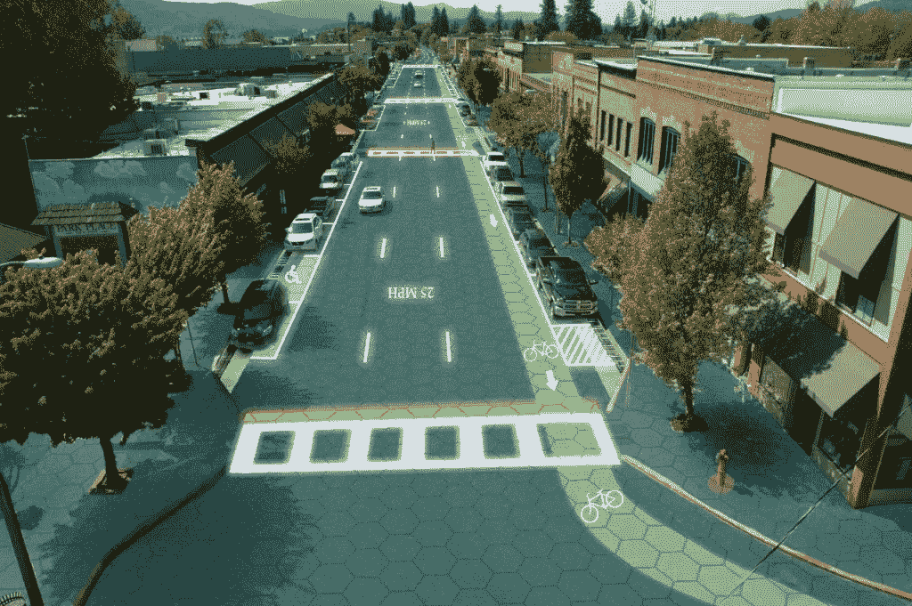

# AVRIS 是美国交通部为自动驾驶汽车升级道路的大胆举措

> 原文：<https://medium.com/hackernoon/avris-the-usdots-bold-initiative-to-upgrade-roads-for-self-driving-cars-7c342cd3a520>

自动驾驶汽车时代正在以惊人的速度向我们走来。就在几年前,“自主”技术的发展水平还仅限于所谓的基于雷达的“主动巡航控制”系统，而今天，特斯拉、奔驰和沃尔沃都提供了半自主水平的车辆，这在三四年前是不可想象的。

事实上，自动驾驶系统和技术已经以惊人的速度发展:车辆用来观察周围世界的硬件，以及通过聚合驾驶员的旅程来帮助系统随着时间的推移进行学习和改进的基于云的软件——或者，在梅赛德斯的 2017 年 E 级车中，对其他 2017 年 E 级车的情况有所了解——都有望在 2020 年左右实现客户手中的第一批完全自动驾驶汽车。

这是一件不可思议的奇妙的事情；这是工程能力和决心的真正壮举，而且它正以惊人的速度改进。

不过，只有一个小问题:无论有多少聪明的计算机图像处理、激光雷达和雷达反馈，也无论有多少无限大的聚合驾驶数据数据库，都无法让自动驾驶汽车“看到”积雪覆盖的道路；没有足够车道标志的道路；或者其他情况下，即使一个人也很难站稳脚跟。

换句话说，关于自动驾驶汽车视觉敏锐度的技术创新将很快陷入僵局，超越这一僵局，进一步的光学保真度将不再受到车载硬件和软件的限制，而是受到道路的平凡可能性的限制，而道路对于所有意图和目的来说都是不可见的:对相机、雷达、任何东西都是不可见的。

幸运的是，一项名为 AVRIS 的新提案——自动驾驶汽车道路改善和标准化——试图通过为 21 世纪的自动驾驶汽车做 20 世纪第一辆汽车铺设道路所做的事情来补救这一迫在眉睫的技术障碍:它希望让自动驾驶汽车更容易通过道路，就像 100 年前沥青是对土路的改善一样。

如果你还没有听说过 AVRIS，那么有一个很好的理由:它不存在。反正还没有。事实上，这只是我想出来的一点小东西；而且，老实说，我并不完全喜欢这个缩写词，但现在它已经够用了。

因此，这个新提议——实际上是我的提议——很简单:美国交通部需要推出新的道路设计标准，包括特别是关于标记——或者更准确地说，技术增强的标记——以确保自动驾驶汽车无论在何种驾驶条件下都能清楚地看到车道和车道标记。

我很容易想到两点:

1.  首先，所有道路都需要更高的维护标准:车道标志不能褪色，而且必须始终清晰可见。对于用混凝土而不是沥青铺设的道路，车道标志必须采用对比色:灰色混凝土上的白色车道标志是不够的。这一更高的标准必须适用于任何和所有类型的道路，从当地街道到多车道林荫大道和大道，再到高速公路。
2.  对于偶尔下雪甚至浓雾的地区，必须采用额外的技术使原本不可见的路面变得可见。

对于第一点，我认为这是一个相对琐碎的，更不用说显而易见的，部分的解决方案:想象一下德国的高速公路，你就知道我在说什么了:无可挑剔的道路维护，清晰明确的车道标志在它们开始褪色时被刷新。这将是昂贵的，但在技术上并不具有挑战性。事实上，它可能会开创一个全新的道路和标志图形设计时代:仍然易于人类阅读，但优先考虑汽车的利益。也许更多的对比色；颜色编码更加多样化；更多的定义和更好的图标，然后。

然而，第二点将被证明是最令人生畏的，它不仅会受到时间、金钱和漂亮的新图形的限制，还会受到巧妙的工程技术的限制。需要有一种方法使道路和车道即使在几厘米厚的雪下也能看得见。一些想法浮现在脑海里。

首先，路肩可以实现某种电子屏障，这与下滑道和定位器在机场跑道上为[仪器着陆](http://www.avionicslist.com/articles/ILS-glideslope.php)工作的方式没有什么不同:可以沿着路肩安装柱子，发射两种无线电频率——比如低频和高频——当汽车“看到”两种频率大致相等时，汽车知道它在路肩。如果汽车看到更多的，比如说，更高的频率，那么它就落入路肩。在 2017 年，可能有比 20 世纪 60 年代的航空射频技术更好的方法来实现这一点，但至少这应该成为讨论的起点，并说明我的观点。

然而，车道标志提出了另一个更具挑战性的问题:显然，我们不能在路中间有障碍物；那就没有发射无线电波的柱子了。

车道标志可以连接起来，产生热量和/或自身的无线电辐射，有效地使它们发光，至少在电磁波谱的某些部分。如果排放的是热量，那么汽车的红外摄像机可以(潜在地)透过冰雪看到热量；或者，如果足够强大，它可以简单地完全融化冰雪。这个想法并非完全没有先例。

(顺便说一句，这可以通过使用太阳能电池板路面得到进一步的帮助，多余的电荷储存在巨大的电容器中，用于加热路面，剩余的多余电荷仍然出售给电网。)

如果辐射确实是某种电磁波，它们必须足以穿透一层冰雪。我研究电学和磁学已经有一段时间了，但我怀疑微波可能会做到这一点:微波将(再次)作为一种加热元素，被冰雪吸收，从而加热它们，并再次使它们在红外摄像机中可见(或者再次简单地将它们完全融化)。我想主要的问题是，热量是否能被充分地限制在狭窄的车道标志图形中，而不是过度地消散成无用的一团热量。也许彻底融化毕竟是最佳解决方案。

也许太赫兹成像，或称为毫米波，是解决方案？毕竟，它非常擅长可视化(通过)高液体含量的事物；这是机场全身扫描仪使用的。

在任何情况下，首要目标必须是使原本不可见的路面完全可见。当然，这只能通过使雪、冰或其他阻碍路面的碎片对汽车使用的任何成像技术有效透明来实现，无论是雷达、激光雷达、红外线还是其他技术。

我意识到我所提议的是一件相当大的事情，一次名副其实的对整个美国道路网的彻底检查。但是很久很久以前，我们根本没有铺好的路；今天，我们没有任何自主友好的，总是可见的道路。如果我们曾经能够将我们的道路从泥路彻底改造成柏油路，我看不出有什么(除了金钱和官僚主义)能够阻止我们从柏油路走向完全数字化。

正如我写的[时间](https://futuretravel.today/this-is-the-end-game-for-autonomous-cars-ee17119a854d#.ww47ary78)和时间[再次](/@MarcHoag/self-driving-cars-will-be-mandatory-not-suck-ee679fcb24bb#.paca97ucd)，我毫不怀疑自动驾驶汽车将在 2020 年开始慢慢进入消费者手中；将在 21 世纪 30 年代强制在某些高速公路上使用；到 2050 年代至 2060 年代占交通流量的大部分；并在 2070-2080 年全面取代非自动驾驶汽车。(不，那个荒谬的“trolly 悖论”根本不是问题[。)](/@MarcHoag/this-is-the-solution-to-the-infamous-self-driving-car-ethics-paradox-b34e7dce4fea#.e9jrskqdr)

然而，我所担心的是——在很大程度上是因为直到现在，据我所知，这篇文章之前，完全没有关于这个问题的讨论——如果我们继续只关注汽车本身，而不是道路，这种进步将最终达到顶峰并受到严重阻碍。

如果不是无线电发射塔发射 90 赫兹和 150 赫兹无线电信号的美丽重叠气泡，飞机的仪表着陆系统将是不可能的——今天，没有任何先进的计算机视觉设备能够在即使透过豌豆汤雾也能有效看到跑道的情况下让飞机着陆——因此，如果没有一些技术来提高道路的能见度，那么期待汽车在完全看不见的道路上行驶也应该被视为同样徒劳的努力。

换句话说，如果盲人试图阅读的书页上沾满了灰尘，给盲人视觉就没什么用了。

**NB。**一个鲜为人知的事实:我*是*一名加州执照律师；有没有律师同事愿意帮我起草一份法案并推动此事？

> [黑客中午](http://bit.ly/Hackernoon)是黑客如何开始他们的下午。我们是阿妹家庭的一员。我们现在[接受投稿](http://bit.ly/hackernoonsubmission)并乐意[讨论广告&赞助](mailto:partners@amipublications.com)机会。
> 
> 如果你喜欢这个故事，我们推荐你阅读我们的[最新科技故事](http://bit.ly/hackernoonlatestt)和[趋势科技故事](https://hackernoon.com/trending)。直到下一次，不要把世界的现实想当然！

