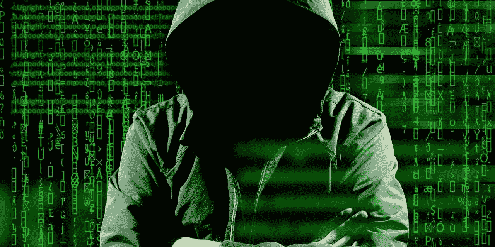

# 带宽是对抗黑客的新工具

> 原文：<https://medium.com/hackernoon/bandwidth-is-the-new-tool-to-fight-hackers-2980b2e32717>

## 我们能利用区块链从经济上抑制黑客吗？

[http://www.bbc.com/future/story/20170802-why-cant-films-and-tv-accurately-portray-hackers](http://www.bbc.com/future/story/20170802-why-cant-films-and-tv-accurately-portray-hackers)

**经常有人问我，**“区块链与其他早已存在的 p2p 网络有什么不同？”

对此，我的回答是，“严格来说，没什么。经济上，一切。”

这些话一离开我的嘴，一个奇怪的表情就出现在他们的脸上。在我开始解释我的意思之前，我喜欢它一分钟。

# **区块链不是新技术**

> “每隔一段时间，一项新技术、一个老问题和一个伟大的想法就会变成一项创新。”迪安·卡门

**在你开始给我发仇恨邮件之前，请允许我解释一下。**

区块链的每一个运动部分都独立存在了很长时间。早在区块链出现之前，我们就有了点对点网络和加密技术。区块链只是这些技术的一种组合。如果你是一名工程师，你不会在《区块链议定书》中发现任何新的技术。

不同的是，这一次，我们找到了一种方法来赋予网络的加密和对等方面以价值。通过加密技术和分布式共识，我们现在可以发送虚拟货币，我们也可以通过附在有价物品上的代币来交换价值。

> 区块链的经济性使得它不同于任何其他的点对点网络。

像区块链这样的分散式协议是由成千上万台计算机组成的，其中每台计算机都通过分布式认证、验证和协商对网络做出贡献。作为回报，这些节点的贡献会得到回报。

作为一项附加的弹性功能，如果一台计算机出现故障，网络将保持运行。如果两台计算机宕机，网络会保持运行。网络保持可用，直到最后一台计算机正常运行。

> 当森林中的一棵树倒下时，森林并没有消失。

区块链在经济上是不可变的，而不是技术上。

# **这和带宽有什么关系？**

> “什么都没发生，什么都没发生，然后一切都发生了。”——费伊·魏尔东

这就引出了我的主要观点。

分布式技术的另一面——它的“坏”面——是恶意黑客长期以来一直使用僵尸计算机或僵尸网络来执行基于流量的攻击，其形式是分布式拒绝服务或 DDoS 攻击。

攻击并非来自一台可以简单拦截的电脑，而是来自遍布全球的数千台设备——通常是被入侵的僵尸电脑。这使得几乎不可能跟踪和阻止所有这些。

2016 年 10 月，Dyn，一家控制着互联网 DNS 基础设施巨大部分的公司，遭到了[世界上有史以来最大的 DDoS 攻击](https://www.theguardian.com/technology/2016/oct/26/ddos-attack-dyn-mirai-botnet)。超过 1.2 Tbps 的恶意连接摧毁了互联网的基石。包括推特、网飞、Reddit 和 CNN 在内的网站都被完全关闭了一整天。那次袭击造成了数十亿美元的损失。

像 [Filecoin](https://filecoin.io/) 和 [Siacoin](http://sia.tech/) 这样的区块链初创公司已经彻底改变了硬盘共享和货币化，创造了 Dropbox 杀手。假人允许用户“捐赠”他们多余的计算能力，以允许其他人访问一台分布式的集体强大的超级计算机。

现在，带宽来了。

> 顺便说一句，我是每周时事通讯 [Unmade](https://unmade.email) 的编辑，每周向你的收件箱发送一个创业想法。

# **资源共享的新商业模式**

> “通过赋予人们分享的权力，我们让世界变得更加透明。”—马克·扎克伯格

**考虑到区块链的分布式模型，**以及交易可能带来的经济价值，区块链也可用于确保互联网的健康和安全是有道理的。

Gladius 采用了这种方法，该公司推出了一种分布式对等网络，全球数千台计算机可以共享其多余的带宽、存储和资源，以反击 DDoS 攻击。

这是通过充当流量的全局代理服务器来实现的。Gladius 的网络位于服务器和访问网站的用户或客户之间。如果它是一个合法的请求，它会被允许通过。如果检测到不良僵尸网络流量，它会被分布式节点网络转移和吸收，从而抵消 DDoS 的影响。

然而，它并不止于此。在没有 DDoS 攻击的“和平时期”，这个网络充当内容交付网络或 CDN，缓存网站内容并加快网页加载速度。

当然，这里明显的好处是网站所有者不需要花费过多的钱来加速他们的网站和 DDoS 保护。额外的好处是每个人都赢了。在所有这些中，区块链提供了一种机制，以加密令牌的形式补偿所有贡献其计算机资源的用户。这些可以用来购买网络服务，甚至可以兑换成现金。

> 链条的好坏取决于它最薄弱的一环，但区块链给了我们数量上的力量。

**实际上**发动 DDoS 攻击越来越便宜了。只要 5 美元，任何人都可以购买僵尸网络的访问权限，并开始吞噬目标服务器的带宽，从而造成混乱。只需 400 美元，你几乎可以关闭任何网站——甚至是受行业标准保护的网站，比如 [Cloudflare](https://www.cloudflare.com/) 。这整个 DDoS 出租网络能够达到 125 Gbps 的流量。这意味着使用 1000 个工作站的僵尸网络进行有组织的 DDoS 攻击的实际成本可达每小时 7 美元。”

Gladius 可以帮助用户反击，同样让它变得便宜和容易访问，以保护网站免受 DDoS 攻击。网站所有者不再需要每月花费数千美元，即使他们没有受到攻击(举个例子，一个受欢迎的服务提供商每月收取 200 美元的固定费用，但这只是最低限度的使用)。有了点对点和现收现付的方案，即使是小企业也能轻松地将其纳入预算。

# **结论:这会抑制 DDoS 吗？**

> 兔子比狐狸跑得快，因为兔子在逃命，而狐狸只是在逃命—r·道金斯

**如果用户可以从 DDoS 保护中获利，**如果攻击者执行僵尸网络攻击的成本变得更高，它最终会阻止 DDoS 吗？当然，目前还没有明确的答案，因为作恶者最终可能会转向其他商业模式或攻击媒介。但这是一个良好的开端，因为我们有效地利用了以前无法获得的额外带宽和资源。

我的意思是，在帮助全球其他人的同时被动赚钱对我来说听起来很不错。

黑客已经将带宽武器化，以攻击合法网站。现在是我们也这样做的时候了——通过使用额外的带宽来抵御这种攻击。

## 感谢阅读！:)如果你喜欢，请鼓掌支持👏🏻还有分享帖子。请随意发表评论💬下面。

—

***关于作者***

[https://twitter.com/mohitmamoria](https://twitter.com/mohitmamoria)

*莫希特·马莫里亚是*[***【godtoken.org】***](https://godtoken.org)*(一家加密基金)的首席执行官，也是一份每周时事通讯*[*un made*](https://unmade.email)*的编辑，它将一个来自未来的创业想法发送到你的收件箱里。*

他定期为世界上最大的出版物撰稿，包括 HackerNoon、TechCrunch、TheNextWeb、CoinTelegraph 等。

*有反馈？让我们成为朋友* [*在推特上*](https://twitter.com/mohitmamoria) *。*🙌🏻