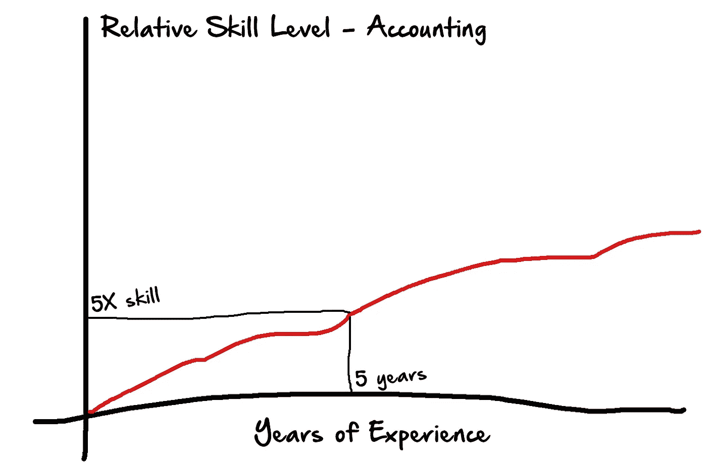

# 在“学习如何编码”时要自信满满

> 原文：<https://medium.com/hackernoon/be-recklessly-confident-when-learning-how-to-code-bd80cb0046da>

我最近向我的一个朋友解释，如果你想在短时间内成为一名熟练的软件开发人员，为什么鲁莽的自信是比小心翼翼的谦虚更好的策略。我意识到我至少有十几次这样的对话，所以把我的想法写下来可能更经济。

高中毕业后进入[编程](https://hackernoon.com/tagged/programming)的每个人都经历着同样的现象:每个人都比他们聪明，因此他们永远不会成为伟人。不同的人经历的程度不同，但是这些自卑的情绪是如此普遍，如此普遍，以至于它取代了随机的机会。一定有更大的阴谋。

这是一种类似于重力的现象。你不能直接观察到它，但是如果你从一座不同质量的建筑物上扔下足够多的物体，发现它们的行为都是一样的，那么你就可以对你生活的世界做出推断。同样，当你看到数百名来自不同背景和职业生涯的学生都遇到相同的情绪时，你可以得出结论，这种现象是普遍的，而不是任何一个人独有的。

在大公司的传统行业中，智力的增长曲线大致是线性的。你投入的时间和精力越多，你就会变得越好。如果你已经做了 5 年的会计师，你会比刚开始做的时候好 5 倍。如果你加倍努力，你就会加倍出色。

编程往往不是这样工作的。增长曲线更加动态。仅仅几个月后，你的收入可能是开始时的 5 倍。技能获得的基本物理原理仍然是一样的，但指数更明显，有点像地球和月球上的重力行为。

因为重力的改变，领先你三个月的人比你好得多。比你早 8 个月的人比你强多了。领先你三年的人可能比你强 20 倍。如果你不习惯，那么这将是令人吃惊的经历。我认为这就是为什么你看到的成功的 19 岁程序员比会计师或律师多，因为技能获取曲线是如此动态，以至于实际上很可能在年轻的时候同时具有重要的技能水平。

但是，如果你通过不同领域的技能获得曲线来看待你的同龄人，那么比你领先 3 年的人比你强 20 倍是根本不可能的。除非… ***喘息*** 如果他们只是比你聪明呢？我见过每个人都在某个时候产生这种心理联系，这种情况发生得太多了，以至于我们有了一个术语——“冒名顶替综合症”。

实际上，对于新开发人员的自卑感，有两种可能的解释:T0、T1、T2 和 T3。要么其他人实际上都比你聪明，而这种差异是你自身固有的**或**重力已经被简单地改变，以比你意识到的更快的速度获得技能。大多数人错过了第二个解释，并认为第一个解释，是他们自身的一些不足解释了他们相对于同龄人的技能水平。事实证明，在这个领域，这是一种极具破坏性的心态，你越早克服它越好。

大多数新开发商的增长曲线大致是一个间断的平衡，在高增长期之后是持续的精炼期。当你完全理解一个新概念的时候，成长就会爆发。理解 AJAX 改变了你构建 ui 的方式。理解 React 使你能够制作高度状态化的 ui，而不会淹没在复杂性中。第一次将数据流抽象到消息队列时，它改变了您对构建系统的思考方式。在微观层面上，它可能是理解如何使用一些库来完成一项任务。即从网络应用上传文件到亚马逊 S3。在宏观层面上，它可能正在学习一种全新的范式，比如函数式编程。学习微观和宏观层面的新概念需要好的解释和好的资源来理解。

四年后现在回想起来，我没有遇到过这样的挑战，一个好的解释不能自然地向任何人解释这个概念。即使是我现在认为很难的事情(分布式共识算法、并发性等)，如果我能找到一个好的解释和对我有意义的东西，我相信也不难理解。

好的资源如此重要，以至于它们实际上压倒了你投入的纯粹的工作时间/数量。学习编码的算法是 O(好资源的数量)，这意味着找到它们的搜索算法非常重要。如果有一种方法可以更快地找到好的资源，那么你就可以更快地获得技能，如果你找不到合适的资源，你基本上就是在浪费时间。

问题是，由于这种天生的自卑情结，大多数初学者不会让自己过滤掉不良资源，这扭曲了他们的内部学习算法。好的资源很容易发现:这对你有意义吗？你明白这个吗？作者有没有努力去预测下一个逻辑思维并回答那个？如果这些问题的答案是否定的，那么你必须能够迅速地放弃这些资源，继续前进。但是如此多的初学者不能拒绝糟糕的资源，因为他们认为另一个可能的解释是他们太愚蠢了，他们自己的不足一定是他们缺乏理解的原因。如果你有这种心态，你会一直感到沮丧，用头撞墙，拼命地试图用自己来解决一些事情，而不是认为你正在阅读的东西解释得不好，然后简单地转向其他东西。

“我不够聪明，无法理解函数式编程，所以我将坚持使用 Ruby”与“我将继续寻找，直到我找到对函数式编程的良好解释，因为我对构建一个没有对象的系统的想法感兴趣”是态度上的二元差异…如果函数式编程是宏观层面的快速增长(确实如此)，猜猜谁会领先，谁会落后？

另一个常见的错误是专注于 Y 轴的绝对距离。即“我做了所有这些工作来学习 HTML、CSS + Javascript，但我怎么能学习后端、数据库和 devOps 呢？这太多了”。客观地说，覆盖的距离是相当大的，如果你认为在其他行业的时间范围内，遍历似乎是不可实现的，但实际上“devOps”这种看似不可能的事情可能只需要几个月的时间就可以让你的头脑清醒过来，觉得自己有能力胜任。你穿越这些距离的速度也很快，但是如果你没有意识到这一点，你会不断地感到沮丧和害怕，并且永远不会真正去尝试。

我认识的几乎所有成为高影响力离群者的人，从我遇见他们的那天起，都不顾一切地自信。你对自己的能力越有信心，你就越有可能在 X 轴上向前移动并穿越距离。这很有趣，因为我不认为这是大多数人会告诉你的。如果你问一个编码学校，他们传授给学生的关键价值观是什么，答案可能是同理心、谨慎、代码质量等等，但实际上这些东西在光谱的另一端更好学习。

如果你认为编码应该是困难和令人沮丧的，那么你永远不会想到你只是在阅读错误的东西，使用错误的工具，或者与错误的人一起工作——这将抑制你的成长。编码是有趣的，令人兴奋的，也是可以理解的。我讨厌和 AngularJS 一起工作，认为自己太蠢了，无法理解它的复杂性。但是一旦切换到 React，我立刻感觉好多了，UI 开发又有意义了。如果我确信编码应该是困难的，我可能永远也不会宣称 Angular 太讨厌而不能使用并抛弃它，但当我这样做时，它是一个宏观层面的增长。

巧合的是，像学习一门外语，或学习演奏一种乐器这样的事情也有类似的学习曲线。一般来说，当技能习得曲线是动态的时，人们倾向于高估事情有多难。学习外语和演奏乐器并不难，只是技能上的差距更加明显。我想这就是为什么你会听到有人说“我不擅长学外语”，但从来不会说“我不擅长会计”，他们通常会选择“会计不适合我”这样的话。

所以，如果你想做好某件事，你真的需要自信，不顾一切地向前冲。如果你感到不知所措，希望意识到这个世界是这样运作的就足够帮到你一点了。

— @AlwaysBCoding

> [黑客中午](http://bit.ly/Hackernoon)是黑客如何开始他们的下午。我们是 [@AMI](http://bit.ly/atAMIatAMI) 家庭的一员。我们现在[接受投稿](http://bit.ly/hackernoonsubmission)并乐意[讨论广告&赞助](mailto:partners@amipublications.com)机会。
> 
> 如果你喜欢这个故事，我们推荐你阅读我们的[最新科技故事](http://bit.ly/hackernoonlatestt)和[趋势科技故事](https://hackernoon.com/trending)。直到下一次，不要把世界的现实想当然！

