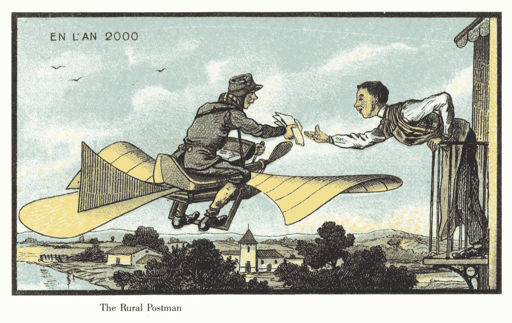
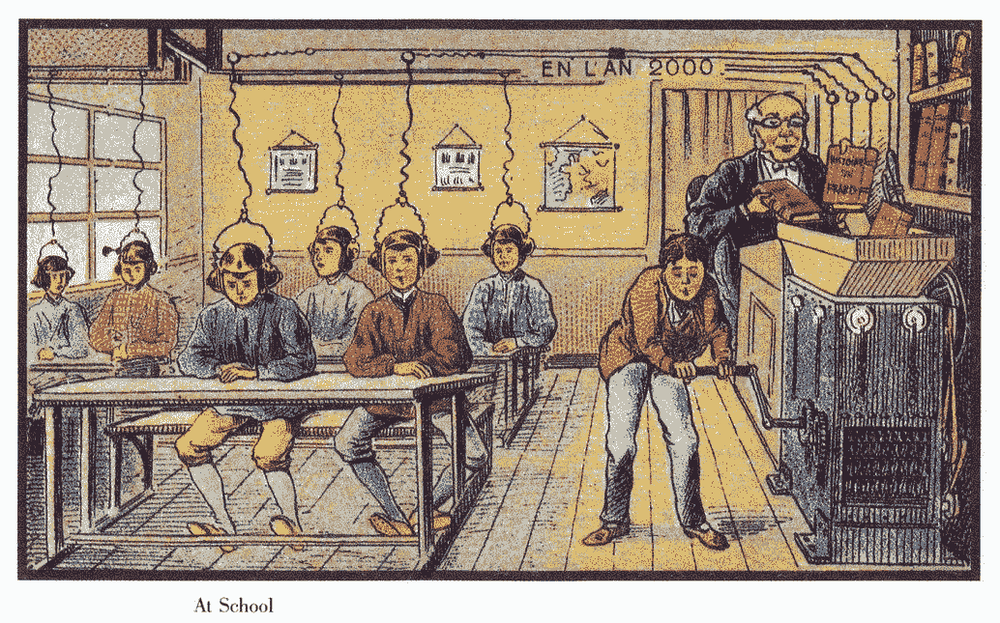
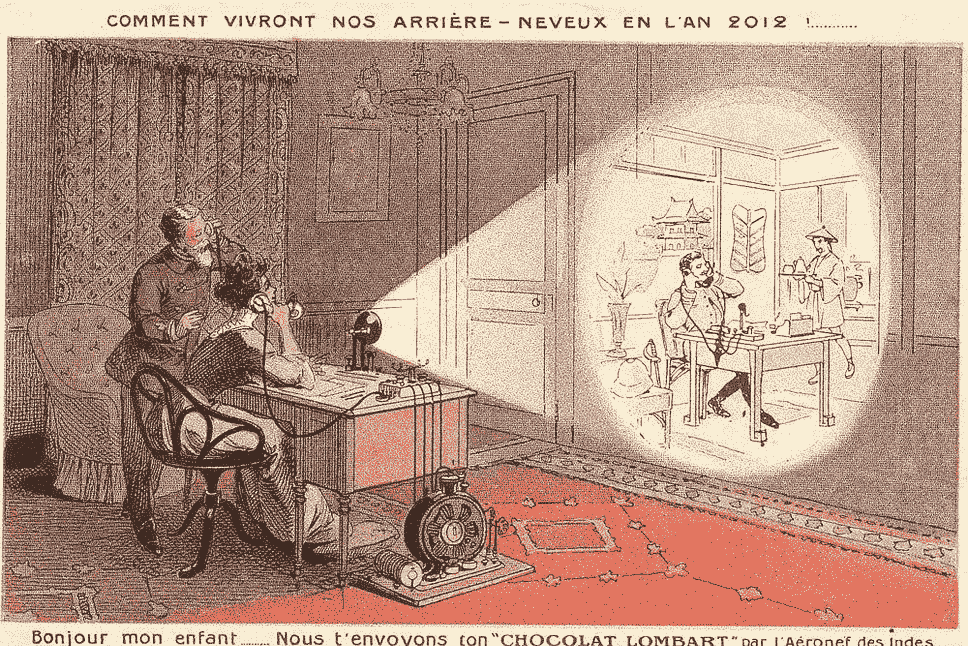

# 自主中的行为共识

> 原文：<https://medium.com/hackernoon/behavioral-consensus-in-autonomy-7b68ddbce750>

几个月前，我写了一个简短的宣言，关于这些 19 世纪的预测，对未来的预测，以及对我们当前的预测:

> 19 世纪的未来是飞行汽车和通信技术在普通镜头社区的浪漫投影。人们很容易嘲笑世界碰撞的怪异之处，也很容易忽视一个处于飞行和社区建设边缘的世界的能量。然而，很难理解的是，今天被浪漫化的边缘可能永远不会成为明天的驱动力，而被忽视的却可以。宣言:为人类的生存条件而建设，而不是用我们认为的东西来取代它。未来将反映已经存在的东西，而不是可能存在的东西。

作为一名设计师和技术专家，我生活中的大部分时间都在思考未来，以及我如何才能构建这样的未来。我的朋友们都在修补宏伟的愿景，希望从根本上改变现状，发明下一件大事。硅谷是建立在“做你不能做的事，不为成功而失败”的信条之上的。然而，我经常看到我的朋友和我的行业偏离了他们真正的目标。他们设计和建造他们希望存在的未来，而不是将要存在的未来。

这幅描绘 19 世纪的惊人画作表现了一种迷人的扭曲；一个既正确又可笑的错误。直升机和飞机渗透到我们的世界，光束从天空向我们传递信息，无人机运送小饰品和零食，推特和社交媒体以我们从未想象过的方式将知识压缩到我们的眼中，令人难以置信的联系变得不可避免。但是，上面画中的预言犯了一个非常错误:它们忽略了我们的人性。所描绘的技术对今天的前沿和明天的普遍存在有着惊人的准确性。然而，技术被塞进了一个不是为他们的互动而构建的世界，一个无视他们的价值的世界。飞机、社交媒体和连通性并不能取代人性:它们改善并促进了人性。

明天将存在的世界是一个为人们——与人们一起——而建造的世界。技术是使能因素，而不是替代品。飞机和连通性让世界变小了，但这只是因为它们生活在世界之外——飞机飞向天空，连通性带来导电性。我们的世界是围绕互动和社区而建立的，而不是对它的逃避。然而，这些描绘继续塑造着我们的世界。自 14 世纪以来，远见卓识者和发明家纷纷涌向达芬奇设想的意识形态先例。在这个世界里，人们像鸟儿一样翱翔天空，这不是一种奢侈，而是一种生活方式。正如现在所知，个人垂直起飞和降落飞机被认为渗透到我们的空气中，给我们的世界带来噪音。这是硅谷正在建设的未来。优步、Alphabet 和苹果都希望飞上天空。首先，他们设想，在垂直起降变得可行之前，下一个飞跃必须在我们的街道上，也许在街道下面。

几个世纪以来，这已经成为我们的困扰，我们的宏伟——我们显而易见的未来。但是，一个概念如何塑造我们的感知呢？虚构的。人类之所以成功，是因为我们对想象力的着迷，是因为我们对存在、不存在和可能存在的理解和预测。艺术家莱昂纳多·达·芬奇设想了一个未来——并且已经开始设计它。他的艺术，和他的视觉描绘，传播和点燃。众所周知，这种力量被称为星际迷航效应。也就是说，20 世纪 60 年代虚构的星际旅行宇宙成为了一种文化现象，结果，它的艺术，它的投影，成为了一张路线图。看过《星际迷航》中的角色通过通讯器无线交谈的年轻人是制造手机的一代。只有预见到未来，未来才有可能，有了预见，才有可能。

如今，感觉无所不在、无所不在的世界是自动驾驶汽车的世界。当然，自动驾驶汽车并不是一个新的预测——它们是一个世纪以来的困扰。虽然通用汽车对我们将面临的问题——从充满安全隐患的交通工具向移动社交工具的转变——的描述惊人地准确，但他们忽略了人的因素。通用汽车公司的愿景是建立在 1950 年的天定命运之上的，这是一个千年围城。约翰·齐默的[第三次交通革命](/@johnzimmer/the-third-transportation-revolution-27860f05fa91)正在进行，我们的城市正在向本应是城市围绕人而不是汽车建设的未来发展。被忽视的未来不会是一条巨大的天际线高速公路，而是汽车所有权的消亡，猖獗的共享和绿色街道。

可以说，弥漫在我们大气中的飞行汽车也是如此。技术会存在，我们的视觉会发明它，但它的目的将永远强调我们的人性，而不是我们想象的反乌托邦。“以人为本”是一种趋势，这种趋势在很大程度上被忽视了，但却是区分成功和失败的因素。我们正在走向这样一个未来:车辆变得自主，不是为了奢侈，而是为了生活方式。这些新的车辆将需要适应我们不断变化和不断人性化的世界，它们需要与我们一起很好地工作。我们正处于机器智能的尖端，它将比我们看得更多、思考得更快、执行得更好——然而，我们在很大程度上避免了它们的行为问题。

截至 2017 年 6 月 15 日，加利福尼亚州机动车辆管理局已向 34 家寻求在加利福尼亚州开发和测试匿名车辆技术的私人实体发放了自动车辆测试许可证。这 34 家公司正在朝着自动驾驶汽车的愿景前进，并用改变世界的技术渗透到这个星球。然而，很少有人公开设计。诉讼和贸易争端是新的常态，共识很少。硅谷正在设计一个自主的未来，车辆和机器像人一样行动，取代对人类的需求，但是，工程师和设计师正在忘记人的因素。如今，驾驶车辆是标准化的:作为人类，我们遵守交通规则。我们阅读数百个标志，在线内驾驶，与周围的人交流，并遵守预防措施。

但是，开车的核心依赖是社交行为，因为我们天生就是社交的。我们做出有利于自己的反应，防止对我们和我们周围的人造成伤害。司机首先保护自己——一种保护本能。自主技术展示了一个绝大多数事故和道路错误永远不会发生的未来——但遗憾的是，一些事故和道路错误仍会发生。这是我们必须设计的最糟糕的行为，并且必须公开接受。今天的自动驾驶汽车是黑匣子，每个都是围绕专有数据、世界理解和行为构建的。明天的人们必须理解新的道路规则，一个标准化的共识，一个为人类设计的规则。

行为共识是我们今天面临的最大问题，这个问题将由大多数人而不是少数人来解决。自主技术代表了一种新的身体，它在感官上比我们自己更优越，但在决策上却很幼稚。决策技能将建立在自主技术之上，而不是内部。正如电气和电子工程师协会、互联网名称与数字地址分配机构和 Unicode 协会塑造了计算机和互联网一样，一个新的联盟和共识必须被带到自主行为中。汽车工程师协会已经标准化了车辆，国家公路交通安全管理局已经标准化了道路——必须组建一个新的跨所有权、跨境联盟，以形成自主行为的共识。

就像道路、法律和服从一样，我们的世界是由协议和可预测性塑造的——选择少之又少。为了让自主技术以我们预想的方式真正渗透到我们的未来，它必须符合人类的需求——它必须与人类合作，并得到人类的一致认可。我们正处于一个新的行为标准化时代的尖端，这个时代看起来与互联网不会有太大的不同。就像谷歌的搜索已经通过重复理解共识，脸书的 M 助手已经通过使用理解有用的感叹词一样，一个新的行为网络将会形成，在这个网络中，用例和共识就是甲骨文。人类和机器正在合作，它们必须为未来的可预测性而设计。

请记住:为人类的状况而建造，而不是用我们所感知的东西来取代它。未来将反映已经存在的东西，而不是可能存在的东西。