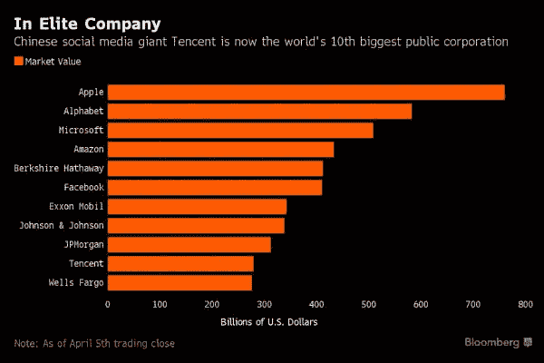
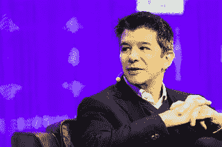
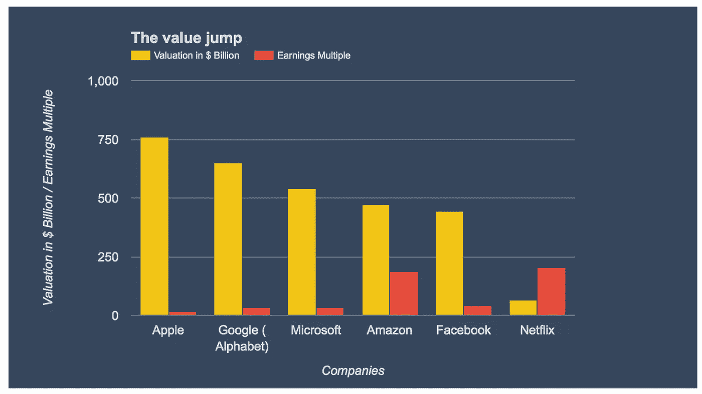

# 全球科技投资海啸的背后

> 原文：<https://medium.com/hackernoon/behind-the-global-tech-investing-tsunami-1b8d37c76030>

[By [steve](https://pixabay.com/en/unicorn-figurine-ornament-unicorns-186735/) under [Creative Commons](https://creativecommons.org/publicdomain/zero/1.0/deed.en)]

> *未来从昨天开始，我们已经迟到了*
> 
> *—约翰·传奇*

从某种意义上说，2016 年是一个不可避免的转折点。它揭示了当今每位首席执行官所知道和害怕的事情。如果你不是一个数据驱动的企业，你的公司走向无足轻重的旅程已经无可挽回地加速了。

五家科技公司——苹果、[、谷歌、](https://hackernoon.com/tagged/google)、[、脸书、](https://hackernoon.com/tagged/facebook)、亚马逊和微软——在石油、银行和零售领域超越了传统巨头。累积起来，它们现在价值近 3 万亿美元。在中国这个最大但最孤立的互联网市场，顶级科技公司的估值超过 2000 亿美元。阿里巴巴和腾讯(微信的所有者)市值 3000 亿美元，在中国以外几乎没有业务。同样在私人市场上，一家处于痛苦挣扎中的公司优步因其今天存在的实质上是一种出租车叫车服务而被估价 700 亿美元。

2015 年，每三天就有一家价值数十亿美元的新公司诞生。其中一些由 25 岁的创始人经营。据估计，过去三年里诞生了 500 多家独角兽公司(估值超过 10 亿美元的公司)。抛开科技公司的老守卫者微软和苹果，新的市场宠儿被亲切地称为方:、亚马逊、和谷歌。它们是增长最快、表现最好的科技股。

企业集团、石油公司、大银行和制造商正被降级为恐龙。媒体庆祝了他们的王朝式增长故事，现在却在争论他们还能生存多久。

人们会问，他们会适应吗？“软件正在吞噬世界”曾经是硅谷投资者的口号，现在已经过时了。“每家公司都是软件公司”是衡量每位 CEO 的新标准。那些无法改变自身业务的公司将付出代价——迅速消亡。企业最近已经成为初创公司的最大投资者。他们正大举收购初创企业，以此作为防线(在某些情况下，这是向公众股东提供的和平礼物，同时他们也在修补自己的命运)。

出于几个原因，研究这场技术海啸非常重要。第一，如果你是现任者，你需要能够在为时已晚之前迅速捕捉到正确的信号，并做出战略性回应。否则，就被他们压制。第二，如果你正考虑投身科技创业，你必须掌握新时代公司可能如何建立的新基本面，以及如何创造价值。

# 我们拥有的护城河，在我们信任的护城河

宝马称 2016 年是其最成功的一年，销售了近 240 万辆汽车。然而，它的价值低于特斯拉，尽管其销量接近埃隆·马斯克创建的标志性公司的 25 倍。特斯拉去年售出了 76000 多一点的汽车。宝马每个季度的利润几乎和特斯拉的收入一样多。特斯拉目前亏损——2016 年亏损 7.73 亿美元；宝马赚了 77 亿美元。然而，市场显然喜欢这家软件至上的公司。

[Tesla co-founder Elon Musk. Photograph by [Dan Taylor / Heisenberg Media](https://www.flickr.com/photos/88975472@N03/10611143395) under [Creative Commons](https://creativecommons.org/licenses/by/2.0/)]

怎么回事？很简单，投资者押注于特斯拉未来的利润流。如果整个汽车行业都转向电动——这可能会在未来十年发生——特斯拉很可能会成为参照品牌。或者如果特斯拉的电池组或太阳能电池板进入每个家庭。埃隆·马斯克表示，到 2025 年，特斯拉的价值可能达到 7000 亿美元。你不会发现宝马做出任何这样的声明。

但是你如何预测未来的利润，如何评估这些利润的价值？所有的估价模型都旨在解决这两个问题。虽然计算一家公司的近期利润是一门科学，但评估利润的可辩护性和可持续性是估值的艺术所在。

经济理论和常识告诉我们，如果一家公司赚了很多利润，它就会吸引其他公司进入它的细分市场，由此产生的竞争会削减它的利润。这就对利润的可持续性(和可预测性)提出了质疑，并让我们审视公司的护城河。

护城河可以有很多种:公司可以拥有知识产权(制药/生物技术/技术公司拥有的专利)，或者拥有自然资源(石油和天然气，钻石)，或者是受监管市场的许可证持有者(如银行)。有时，护城河的可持续性可以从更换企业生产机器的成本(资产置换——例如，一个炼油厂或一个旧水泥厂)或者企业是否已经建立了强大的遗产和品牌，使消费者不断回来购买(可口可乐、百事可乐、苹果)。该公司也可能享有基于其“如何”开展业务的防御护城河，例如独特的分销网络(安利)，或发现和留住人才的能力(麦肯锡)，甚至游说和与世界各国政府签约的能力(国防和全球矿业巨头)。管理团队的工作是用尽可能多、尽可能宽或深的护城河包围他们的公司。

由于一家公司的近期利润是可见的和可预测的，因此估值通常以其收益倍数来表示，即我今天愿意为该公司的当前利润支付多少倍。收益倍数是一种试图捕捉公司收益潜力和收益质量(即增长率和可持续性)的指标。

例如，网飞 2016 年的收入为 88.3 亿美元，市盈率为 202 倍。时代华纳 2016 年收入 293 亿美元，营业收入 75 亿美元。但它的市盈率是 18 倍。两家公司的估值都在 700 亿美元左右，分析师们热切地认为网飞的市值将很快达到 1000 亿美元。没有人对时代华纳做出这样的预测。如今，Airbnb 的价值超过了希尔顿或万豪酒店。就像亚马逊抢在沃尔玛之前一样。

从根本上说，这个问题非常简单。传统公司的估值思维模式是*“什么会出错”*——它们的护城河被认为总是受到威胁。购买这些公司的投资者试图计算护城河的可持续性，以及为了继续维持护城河，需要牺牲多少当前利润。

科技公司完全颠覆了这种估值模式。

这些公司由不同的基本面驱动。他们的生产要素不仅仅是制造、实物资产或分销，还包括通过互联网无摩擦、低成本地接触客户的内在能力。

他们能够立即进入市场，并扩大他们的产品。凭借其在瞬间接触数百万人的能力，一些公司能够在传统公司之上形成一层，并以前所未有的方式聚合供需。

人们研究了各种现象，解释为什么这些公司如此迅速地扩大规模——包括网络效应、分拆能力、创造新的可寻址市场的能力，以及利用低效率。有些只是在用户在其平台上创建的内容(和参与度)的基础上发展起来的。在这篇文章中，我主要提到了消费者互联网业务，但这些原则适用于任何使用技术作为差异化武器的公司。

例如，当网飞在同一天向 100 个国家推出服务时，它就代表了对速度的偏爱。相比之下，时代华纳可能需要几年时间。

赢家利用数据不断迭代，专注于创造一系列更便宜、更易用、更具粘性的产品，因为它们更加个性化和定制化，而且它们创造了成为进入壁垒的网络效应。在某些情况下，它们被抛入网络效应的良性循环，使它们对消费者和供应商都如此具有吸引力，以至于它们的增长轨迹达到了自己的一个维度。

因此，投资者并不痴迷于“可持续性”,而是资助他们修建和扩建护城河。他们通常押注于公司目前没有、但未来可能创造的利润流。

# 处于危险边缘

优步花了五年时间成为全球最有价值的私营公司。它的成功之路是通过打破规则和用资本粉碎竞争来书写的。它仍然严重无利可图:2016 年净亏损 28 亿美元，2017 年前三个月净亏损 7.08 亿美元。上周，它的五个主要投资者迫使其高调的首席执行官特拉维斯·卡兰尼克辞职。优步的文化是围绕着领导风格塑造的。在卡兰尼克退出之前，其领导团队出现了一系列离职，引发了对其未来的严重质疑。

[Uber co-founder Travis Kalanick. Photograph by [Dan Taylor/Heisenberg Media](https://www.flickr.com/photos/heisenbergmedia/11305922663) under [Creative Commons](https://creativecommons.org/licenses/by/2.0/)]

优步的巨大失宠是否标志着科技投资狂潮结束的开始？没有什么比这更偏离事实了。在最坏的情况下，它可能只会造成暂时的停顿。

推动这种投资狂热的风险资本模式通常是对创意和创始人的巨额押注。当投资者看到可扩展性和颠覆性的商业模式时，他们愿意投入数十亿美元来发现公司的潜力。随着这种放大，就产生了泡沫。实际上，每个投资者都试图乘着对一家公司下注越来越高的浪潮，期望下一轮投资者会更加重视它。

虽然一家公司的基本面没有什么变化，但随着投资者就该公司的“假设”潜力相互打扑克，其估值会飙升。

对于投资者和创始团队来说，这种不断创造、扩大和加深护城河的动力可能会成为一场令人兴奋的游戏。喷雾祈祷游戏是过去十年手机热潮的产物。由此产生的泡沫不会很快停止。很大程度上是因为智能手机正在成为一种更加多功能的设备，能够以更高的速度和更多的传感器进行更多的处理，并成为我们周围其他物联网(IoT)设备的接口。

因此，从某种意义上说，整个科技投资风险资本行业的哲学与传统成长型资本相反:他们不会问“公司会出什么问题”，而是问*“什么会好起来”*。这也是错误发生的原因。

优步迅速成为世界上最有价值的私营公司，就是这种风险投资思维的结果。没人想过“还能出什么问题”。突然间，事情变得不存在引力来阻止优步飞离。

导致优步下台的多米诺骨牌式的一系列事件有点像被火焰吸引的飞蛾，无法逆转。它的故事将激发几个关于不要做什么的案例研究，以及给创业者们关于傲慢如何导致毁灭的更大的教训。

优步可能会挺过这一挑战——就客户粘性和习惯而言，它太有价值了，不能就这么倒下——但你可能会看到一家伤痕累累的公司。

即使在我们自己的市场上，这样的例子也比比皆是。环顾四周，如果你看到一个创始人声称统治世界，你可能会发现即将降临的迹象。2015/2016 年的过度创造了一个“后创始人”世界——在那里，我们将看到更多投资者接管创始人带着自己的不可战胜感出错的公司的例子——这种不可战胜感不是源于他们的业务实力，而是建立在仅仅由纸币制成的护城河上。

这是自相矛盾的:风险资本家资助这些公司，正是因为他们看到了这种令人兴奋的文化，这种文化赋予这些公司吸收和花费大量资本的能力，以渴望占据主导地位。但正如我们一次又一次看到的，当侵略和贪婪的结合超越了道德和价值观，它创造了一个突变体，然后需要被剔除。优步、Zenefits、Theranos 就是这种狂热的所谓“突变”产物。

# 如履薄冰

想象一下，你经营着一家价值数十亿美元的企业。一天早上，在你宣布超出预期的收益后，你的股票在一个交易日内下跌了 44%。它抹去了三年来取得的成果。2016 年 2 月 4 日 LinkedIn 就是这样；那天早上，110 亿美元的股东财富蒸发了。该公司的估值从 250 亿美元下滑至 140 亿美元。仅仅四个月后，微软以 260 亿美元收购了该公司。

*以推特为例。一家估值达到 400 亿美元峰值的热门公司(现在的交易价格约为 130 亿美元)，在市场上充斥着突然暴跌并努力证明自己存在理由的热门公司后，它现在正在努力寻找未来(谷歌、脸书、Salesforce 可能是潜在买家)。在最受炒作的首次公开募股(IPO)几个月后，Snap 又回到了 IPO 价值。雅虎、黑莓、诺基亚、Myspace、美国在线——这些科技巨头的墓地填充得更快了。*

[Twitter co-founder and CEO Jack Dorsey. Photograph by [JD Lasica](https://www.flickr.com/photos/jdlasica/7979035175/in/photolist-da5DaZ-RVw8GC-aDD4ju-hkxxvs-ejy2y3-5RzxWK-hkyy8V-gGCz4i-aynpeK-gGDip8-ayq5Xj-7F4x61-gGCxv8-da5D8v-da5DaB-gGCDWf-da5D9X-adUAiC-ayq5U1-71EX1u-gGCDQJ-9b1yc9-7Zo3qP-d9Mi9J-aDJ8mL-gT2vph-ejy2vw-gGDhTP-6a2Mgg-8ke3pD-da5DkW-gGChLh-gGCzGc-gGChrQ-gGCyf4-gGCEiB-71AVtX-2G6QTb-gGDhNP-dqm3C-6aqMHy-gGDgjr-7mD8xS-gGCyWe-24N4xd-hncDak-8TqxPu-gGCC8q-gGCys8-gGCB3Q).under [Creative Commons](https://creativecommons.org/licenses/by-nc/2.0/)]

你可能会认为，银行里的高估值和数十亿美元让这些独角兽日子过得很轻松。

相反，他们是最偏执的企业，他们的未来岌岌可危。他们知道他们没有资产支持他们。大多数实际上并不制造任何东西；它们只是帮助人们接触服务器另一端事物的接口。他们每天都要证明自己的价值。

变化的速度正在加快，甚至科技公司也是它的受害者——一家公司从诞生到死亡的周期越来越短，因为消费者不断受到互联和移动时代诞生的新商业模式的轰炸，它们不断失去相关性。这些新的商业模式重新设定了消费者的预期，转换成本非常低。

关键是:有些护城河很大，但是很浅。有些很深，但正在缩小。市场明白这一点。并相应地旋转。

考虑这些统计数据，并注意收益倍数。

[Note: As of June 28, 2017\. Source: Nasdaq.

Spotify、优步、Square、Snap、Pinterest——这些公司在今天亏损，但仍然拥有数十亿美元的价格。

为什么网飞的收入是 202 倍，苹果是 17 倍？从技术上来说，苹果有更大的订阅基础——苹果估计有 6 亿多用户(11 亿个活跃设备)，网飞有 1 亿——并且更接近其客户。

现在假设，如果苹果的价值像亚马逊一样，它将价值 8 万亿美元。两家公司都是成熟的公司，有着深厚的粘性。它们已经上市几十年了，受到投资界的密切关注。倍数的巨大差异是由什么造成的？这不仅仅是因为亚马逊增长更快。

# 对可选性的追求

*2006 年夏天，雅虎决定向脸书提供 10 亿美元。脸书的投资者和许多高管都想出售。但是脸书即将发布新闻提要，如果进展顺利，马克·扎克伯格认为该公司的价值将超过 10 亿澳元。无论如何，在宣布可怕的 Q2 收益后，雅虎将其出价降低到 8.5 亿美元。根据 businessinsider.com 的一篇文章，脸书董事会花了 10 分钟拒绝了降低的报价。*

*近十年过去了，同样的雅虎，曾经是一个价值 1250 亿美元的庞然大物，其规模与脸书或谷歌现在的规模相当，但最终还是以 50 亿美元的价格卖给了威瑞森。*

[Facebook co-founder Mark Zuckerberg. Photograph by [Jason McELweenie](https://www.flickr.com/photos/99565773@N00/2321206299) under [Creative Commons](https://creativecommons.org/licenses/by/2.0/)]

是什么神秘因素驱使这些公司达到极高的估值，然后又如此之低以至于它们无法从冲击中恢复？

结果是:模拟这些科技公司的增长并不容易。那么投资者使用什么工具呢？毕竟，估值不是由他们目前的业务驱动的，而是由他们的灵活性或适应性以及利用客户群的能力驱动的。当你将这两个因素结合起来——这家公司能以多快的速度适应，以及如何利用它的客户群——你就会得到投资者在业务中寻找的东西:“可选性”。换句话说，它们进入和捕捉邻近区域的能力。

股东看重的不是显而易见和可预测的事情，而是可能发生的事情。当这种评估令人失望时，他们就会抛售股票。所以它是双向的。当投资者意识到领英无法适应并从其用户群中创造可选性，或者 Snapchat(最近跌破了被大肆炒作的 IPO 价格)将难以施展新花招时，领英就崩溃了。

投资者通常看不到期权。但是创始人知道。创始人是有远见的——他们对他们正在建造的东西有更深刻的理解，这就是为什么你会有这些传奇故事。创始人可以看到这些公司会变成什么样。有很多这样的例子。根据脸书效应，作为一家初创公司，脸书拒绝了多达 11 份邀请——来自谷歌、维亚康姆、新闻集团、NBC，当然还有雅虎。显然，扎克伯格不仅对自己扩大用户群的能力充满信心(它有超过 20 亿活跃用户)，而且对如何利用他飙升的估值投资脸书的未来充满信心。脸书对 WhatsApp、Instagram 和 Oculus Rift 的收购正是如此。

杰夫·贝索斯决定在 20 多年内不盈利，然后在他盈利 4100 万美元的那天，亚马逊的股票疯狂上涨了 2000 亿美元，超过了沃尔玛。Snapchat 拒绝被脸书以 30 亿美元收购，最终以 200 亿美元上市。

优步也是如此。ride share 公司 700 亿美元的估值并不取决于你今天乘坐的出租车，而是取决于优步成为自动驾驶竞赛中获胜平台的可能性。这正是投资者所押注的。这种选择性是惊人的，因为它改变了个人和商业运输业务的成本结构。这种选择性可以应用于卡车业务。优步可以与每家汽车公司合作，将汽车直接放到它的平台上。

然而，如果优步在这场自动驾驶比赛中失败，它将破坏其可选性，并恢复为连接出租车和客户的公用事业，并像其他数据驱动的市场一样优化他们的体验。

在更近的地方，投资者对 Paytm、Flipkart 或 Zomato 的估值是基于这些公司能够创造的期权。该值不在它们生成的当前交易中。可选性在于他们可以创造的习惯，以及团队是否有扩展到邻近领域的愿景。Flipkart 将永远是一个有价值的电子商务玩家，但它是否变得值得 500 亿澳元，取决于它如何为客户创造新的服务和选择，并将他们的习惯作为创造更多价值的工具。

这些印度互联网巨头有一个千载难逢的机会，为他们的科技业务抓住最大的机会。毕竟，整个国家都是在基于 Aadhaar、电子 KYC 和其他 Aadhaar 相关服务的公共数字产品的支持下飞跃发展的。如果你从围绕 Aadhaar 的隐私和基本权利问题上退一步，我们可以通过创建公共信任和交易层来降低交易成本的事实在世界上是无与伦比的。这为每一个互联网创业者甚至在职者创造了选择的机会。这个平台的力量是显而易见的，我们可以走进一个移动商店，在几分钟内通过激活的连接走出去，或者在眨眼之间开设一个银行账户。人们可以清楚地看到，更年轻、更新的银行和金融机构抓住了这一点。

下一步:科技巨头之间正在酝酿一场更大的战争。这不是关于他们如何加深他们的护城河，而是他们如何拓宽他们。他们现在在彼此的地盘上玩耍。这场战斗将在未来几年内结束，我们所有人都将密切参与其中——不仅作为观察者，而且作为参与者。我们将在本系列的下一篇也是最后一篇文章中探讨这个问题。

第二部分:点击这里— [交战时代的战斗](/@hchawlah/battles-in-the-age-of-engagement-c05d5cad98d5)

【www.foundingfuel.com】最初发表于**。**

**建议阅读**

* [## 印度的数字经济如何重新找回它的魔力

### 印度可以说是世界上最有前途的互联网市场。它吸引了超过 200 亿美元的全球风险投资…

medium.com](/@hchawlah/how-indias-digital-economy-can-rediscover-its-mojo-9cd120d218a7)  [## 欢迎来到腾讯的 Flipkart，亚马逊的新对手

### “敌人的敌人就是我的朋友”

medium.com](/@hchawlah/welcome-to-tencents-flipkart-amazon-s-new-adversary-afd66e69cdfd) 

> [黑客中午](http://bit.ly/Hackernoon)是黑客如何开始他们的下午。我们是阿妹家庭的一员。我们现在[接受投稿](http://bit.ly/hackernoonsubmission)并乐意[讨论广告&赞助](mailto:partners@amipublications.com)的机会。
> 
> 如果你喜欢这个故事，我们推荐你阅读我们的[最新科技故事](http://bit.ly/hackernoonlatestt)和[趋势科技故事](https://hackernoon.com/trending)。直到下一次，不要把世界的现实想当然！

*