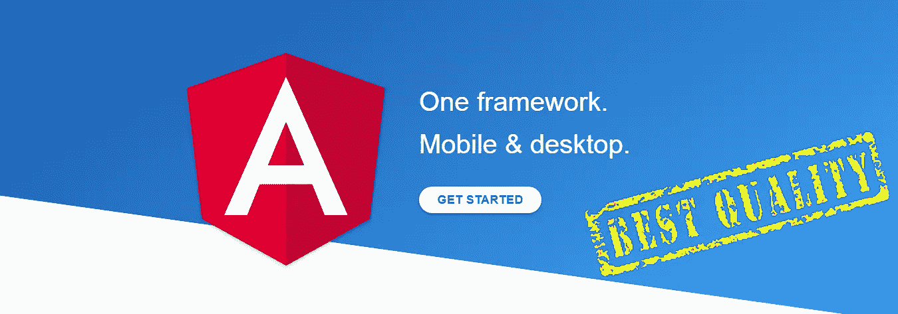

# 交付高质量 Angular4 应用的最佳实践

> 原文：<https://medium.com/hackernoon/best-practices-learnt-from-delivering-a-quality-angular4-application-2cd074ea53b3>

Best Practices for developing with Angular Framework

回到 2016 年 9 月，就在 Angular 团队咬紧牙关[发布 Angular2 Final](http://angularjs.blogspot.in/2016/09/angular2-final.html) 的时候，我成功说服了我的客户将 Angular2 用于它的一个更大的应用。

你们中的一些人可能还记得，Angular2 经历了异常漫长的 Alpha、Beta 和 RC 阶段。自从第一个 Alpha 版本发布以来，整个 Angular2 似乎都被重写了。所以在 2.0 最终发布的时候，整个棱角分明的场景 ***非常*** 混乱。在 2.0.0 .最终版本中几乎没有什么好的教程或资源。

我也没有 AngularJS(1.x)背景。我刚刚使用 Backbone-木偶-铆钉. js 栈交付了一个巨大的 SPA。事后看来，没有 AngularJS 的包袱是件好事！

> 总之，我们迈出了信仰的一大步！我相信有棱角的开发者、社区和我适应新框架的能力，没有降落伞就跳进了山谷！

我和我的核心团队成员——我们有大约 3-4 周的时间来创造第一个穗，我们都跑栅栏；经常跌倒，但学到了很多。当我们在几个月内从 4 人团队扩展到 18 人团队时，我在 JavaScript 开发领域的总体经验也派上了用场。

回顾过去，经过 6-8 个月的应用程序开发和产品交付，我发现一些好的实践扭转了局面。为了大家的利益，这篇文章总结了它们。事不宜迟，这里有一些你可能想要采用的最佳实践来交付一个高质量的角度应用…

# 绝对初学者的最佳实践

## 熟悉 ES2015

**angular 的大部分初始曲线只是为了适应 ES2015。**因此，请确保团队中的所有开发人员都已经阅读并实际尝试了 ES2015 和 ES2016 版本的 JavaScript。这里有很多东西要学，但它只是为面对经常使用这些语法的外部世界教程做好准备。例如，像`() => { }`或`[…a, b,]`这样的语法不应该让你感到困惑。或者使用`import`、`class`、`let`、`const`等应该是你的开发者的第一天性。

## **拥抱 Typescript 和 Visual Studio 代码(VSCode)。**

你可以在网上找到的 Angular 的大部分代码片段都是打字稿..它是 ES2015 的超集。我强烈建议你使用它，这样网上的代码片段才有意义。另外，作为一个伴侣，使用 Visual Studio for Code 作为您的 IDE，使用 TSLint 作为您的 linter，使用 VSCode 中的 TSLint 插件，以确保您获得最佳的静态代码分析体验。另外——通过使用 TS，你不需要巴别塔。**加成**:还在 VSCode 中增加了[角度语言服务](https://marketplace.visualstudio.com/items?itemName=Angular.ng-template)插件。这提供了更好的角度体验，尤其是在角度模板中。

## **掌握 npm 生态系统。**

除了 ES2015，Angular 还致力于适应节点和 NPM 生态系统。任何严肃的例子都会利用 package.json (npm)和 node 来构建和运行它们的例子。几乎每一个角形部件都会给你如何使用 npm 安装它的说明。因此，不要让 Npm 和 VSCode 成为团队的绊脚石。要么你的开发人员正在使用这些工具，要么他们不属于你的团队！说真的！

# Angular 应用程序开发最佳实践

## 吃饭，睡觉，呼吸的成分！

**角度是关于组件的。** **先设计组件，再开始编码**。我所说的设计是指

*   *在视觉设计上画出轮廓，清楚地划分哪个屏幕区域属于哪个组件。将组件做得足够小，以便它们可以在许多地方重用，但又足够大，以至于再小也没有意义。这需要一点时间来适应这种逻辑分组，但你可以在 2-3 次冲刺中自然地做到这一点。我坚持让我的整个团队在每个 sprint 中为每个故事都这样做。*
*   *一旦你了解你的组件，记录“输入”和“输出”。我有一个小的设计清单，我让每个开发人员填写，作为每个故事的简短设计文档。如果你想把它应用到你的项目中，请参见这篇文章底部的* ***设计叙述*** *部分。*

在设计每个组件时都要考虑到可重用性。尝试将常用的 UI 元素创建为单独的组件，并在屏幕中重用它们。

## 使用 seed 项目立即投入运行！

利用一些 kickass starter 种子项目，因为它们会在为你整合许多功能方面做得很好。我竭诚推荐[AngularClass web pack starter](https://github.com/AngularClass/angular2-webpack-starter)或者 [BlackSonic 的 ES6 starter](https://github.com/blacksonic/angular2-babel-esnext-starter) 。这会让你很快为大型项目打下良好的基础。

## 或者…使用 Angular-CLI

另一种选择是使用[角度控制器](https://cli.angular.io/)。对于那些觉得整个 ES2015+TypeScript+Angular 有点让人不知所措的人来说，Angular CLI 确实是一个不错的选择。它从您那里抽象出相当多东西，包括整个 webpack 配置。但是这种抽象也是一个缺点，因为你不能修补那些抽象的部分。幸运的是，Angular-CLI 中有一个`eject`选项，可以弹出大多数抽象的东西。

## RIP SystemJS，Hello Webpack！

从头开始，停止使用 SystemJS，切换到 [Webpack](https://webpack.js.org) 。Webpack 是一个更加强大和通用的工具。有效地优化 [webpack](https://webpack.js.org) 捆绑包，以确保您不会将相同的模块捆绑在多个块中。webpack 中有一些捆绑包分析器可以很好地告诉你这一点。**奖励** : [Webpack 学习幻灯片](http://tiny.cc/webpack101)和[分步代码](http://tiny.cc/learn-webpack-code)

## 用 AoT FTW！

使用 [AoT](https://angular.io/guide/aot-compiler) (提前)编译是运行时性能提升的一大进步。它还将您的包减少了大约 30kb (gzipped ),这是一个很大的改进。Angular 4.0+由于其生成 AoT 代码的方式，在应用包中带来了大约 30%的改进。

## **从 RxJS 了解可观测量。**

很多棱角分明的工作是关于理解什么是 ***可观察*** 。理解可观察物是如何工作的，并且熟悉 RxJS 库是非常重要的，RxJS 库可以帮助你成为可观察忍者。

## 延迟加载非首页路由

惰性加载每一条在第一页点击时不需要的路径。Webpack2 `import()` [功能](https://webpack.js.org/api/module-methods/#import-)会为你派上用场。此外，webpack 的 [ng 路由器加载器](https://www.npmjs.com/package/ng-router-loader)将帮助自动为每个延迟加载的模块创建包..

## 使用小部件和库

考虑使用标准的部件库，如 [PrimeNG](https://www.primefaces.org/primeng/) 或 [ValorSoft](http://valor-software.com/ngx-bootstrap) 。尽量避免 JQuery，因为它[不能被树摇动](https://github.com/rollup/rollup/issues/509#issuecomment-182423609)。

## 排除故障

利用 chrome 控制台中的`ng.probe()`进行[有效调试](https://juristr.com/blog/2016/02/debugging-angular2-console/) /或者利用[占卜 chrome 扩展](https://augury.angular.io/)——为您包装 ng.probe。

## 在 NgZone 的黑暗角落里保持安全

NgZone 和 ZoneJS 是 Angular 的一些黑暗角落。当你连续几天尝试了 100 种不同的方法后，事情还是不顺利时，你可能会遇到这两个对手。我称之为黑暗角落，因为没有错误会告诉你，如果你摆弄 NgZone，这个错误可以被修复。您必须自己将您的错误和潜在的 NgZone 冲突关联起来😧。因此，NgZone 很容易使用，但我甚至不知道它在我的项目中存在了近 5 个月。

## 通过代码结构获得的其他优势

1.  **共享模块** —尽量利用共享模块。创建一个模块，它应该导入所有常用的模块提供者，并将其导入其他模块。
2.  全球与本地 CSS——无论何时写 CSS，试着想象这种元素是否会在很多地方使用，然后在应用程序级别而不是组件级别写样式，这将避免在新组件中再次重写。您可以只覆盖组件级别所需的任何小更改。
3.  **带有 SCSS 的主题文件** —当使用任何 CSS 预处理器时，总是定义一个只包含与颜色、字体大小等相关变量的文件。的应用程序，它会帮助当你需要改变主题。
4.  **Typescript Inheritance for your help**—尽量利用 Typescript 中的继承。如果您有一些视图相关的功能，这些功能可能在许多屏幕中都需要，那么您可以创建一个具有通用功能的基本组件，然后所有其他组件都可以扩展它。
5.  **使用服务** —努力实现视图实现和服务调用之间的完全分离。在 UI 组件中，只保留与视图相关的代码，并委托给服务进行后端调用和任何功能逻辑。

# 一般 Web 开发人员生产力最佳实践

1.  **改进开发工作流程**——通常，开发人员不会考虑寻找捷径来提高他们的开发效率。这包括，在本地绕过登录，缓存你当前工作不需要的后端调用，修改小代码跳过 10 个屏幕/点击到达他们需要更改的屏幕。人们应该花半个小时来调整这些东西，让它们立即出现在当前屏幕上，这样可以节省每次小代码更新的时间。
2.  强制性人工代码审查 —我们已经强制要求所有开发人员必须在 Git 中以 pull_request 的形式提交代码。架构师将在合并之前审查和批准代码。这确保了每一行代码在合并之前都经过了审查。这有助于捕获使用 Linters 无法捕获的错误和质量/性能问题。

# 设计叙述:

我们实现的最好的事情之一是——每个开发人员对他们的故事进行设计阐述的过程。

我坚持让我的开发人员遵循这一叙述。

## 为了传递故事 xyz，

1.  需要“创建”或“修改”哪些组件。
2.  如何访问组件？从导航仪上？路由？其他组件上的一些用户交互？
3.  这些组件属于哪个文件夹？
4.  什么样的@input、@output 将被提供给这些组件/从这些组件发出。
5.  你的后端调用需求是什么，它的顺序是什么
6.  有表单验证吗？
7.  需要任何 spl 技术东西/库吗？例如，时刻、日期选择器、模态等。
8.  “生产力提升”？你如何快速到达你的页面——硬编码？代理？

我发现，一旦我们建立了以上的设计文档过程，开发人员就更加自信了，他们的代码质量也提高了。希望你会发现你的团队质量也有类似的变化。

*本帖改编自我在* [*博客*](https://dharapvj.wordpress.com) *上的原帖。*

就这样了，伙计们。谢谢大家耐心看完！如果你喜欢这个故事，请在 twitter 上关注我，点击故事下方的❤️符号。