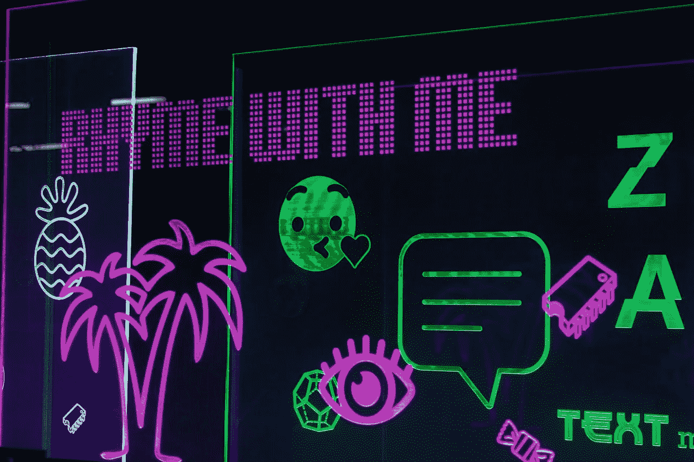

# 超越电视:为什么你应该让你的观众与聊天机器人交谈

> 原文：<https://medium.com/hackernoon/beyond-the-tv-why-you-should-get-your-audience-talking-with-a-chatbot-5c41c280cf8b>

自成立以来的 80 年里，elevision 经历了深刻的变化。尽管在这段时间的大部分时间里，拥有电视的家庭数量稳步增长，但在过去 5 年左右的时间里，越来越多的消费者“掐线”，从传统的有线电视公司转向通过手机或流媒体服务在线观看视频。

当然，最近传统有线电视用户的下降可能是主要网络的一个严重问题。然而，这种技术和社会的变化也可以被看作是一个新世界的开始，这个新世界为极其流行的电视媒体提供了令人兴奋的机会。大多数专家认为，参与是成功的关键，因为电视正在演变成一种互动体验。

聊天机器人是最新的创新产品之一，被用于广播行业以增加参与度，其迅速发挥作用的潜力无疑是耐人寻味的。虽然我们还处于游戏的早期，但一些电视和制作公司已经在测试聊天机器人的可能性，这可能会为未来奠定基础，因此非常值得分析他们在做什么。

MTV 一直被认为是一个冒险使用新兴技术和平台的网络，以努力开发新的粉丝参与概念。2016 年，该网络与 Telescope 合作，允许粉丝在 MTV 视频音乐奖期间使用实时 Facebook Messenger 聊天机器人为他们最喜欢的艺术家投票。粉丝只需点击 MTV 脸书页面上的“信息”并发送“投票”这个词。他们立即收到一个自动回复，显示所有被提名者，并可以通过点击他们最喜欢的艺术家下方的“投票”按钮轻松投票。这只是 MTV 在聊天机器人领域的创新之一。在欧洲音乐颁奖典礼的三天前，该网络引入了第一个实时机器人体验，作为现场颁奖典礼的一部分，机器人不仅提供了最新的新闻和图像，还为粉丝提供了与脸书直播的官方后台表演互动的能力。用户可以参与投票，提交问题供采访考虑，并上传照片和视频，这些都可以在直播中播放。

CNN 是另一个正在探索这种技术可能性的网络，在过去六个月里，它在 Facebook Messenger、Kik 和 LINE 等即时通讯应用上推出了各种聊天机器人，此外还有亚马逊 Echo 等语音激活设备。该公司认为自己目前处于试验阶段，并表示正在不断发展其用途，同时探索智能家居和汽车平台上的其他聊天机器人可能性。

那么，CNN 从它的实验中学到了什么？虽然这项研究还很早，但最有价值的一点是，在发送通知的同时，让观众能够控制每天收到的提醒数量，这是非常重要的。虽然让用户感觉他们正在与 CNN 进行个性化的对话是必不可少的，但该网络发现，过于健谈的聊天机器人会让人们离开。因此，找到高参与性和非侵入性之间的平衡绝对是关键。

虽然 MTV 和 CNN 的聊天机器人实验确实展示了这项技术吸引粉丝的潜力，但它们只是众多投身于使用聊天机器人的网络中的两家。其他公司，如 Hulu、HBO、网飞和 Channel 4，最近也利用聊天机器人作为参与工具，预计我们仍然只是看到这项技术在广播领域潜力的冰山一角。不管聊天机器人的发展方向如何，一种新的互动工具的出现无疑是电视世界令人兴奋的发展。

*由* [*谢尔盖布多夫*](https://www.linkedin.com/in/sbludov/) *媒体与娱乐高级副总裁* [*数据艺术*](https://www.dataart.com/industry/media-and-entertainment?utm_source=medium.com&utm_medium=referral&utm_campaign=m-regular&utm_content=da-hn-sbludov-tvchatbots)