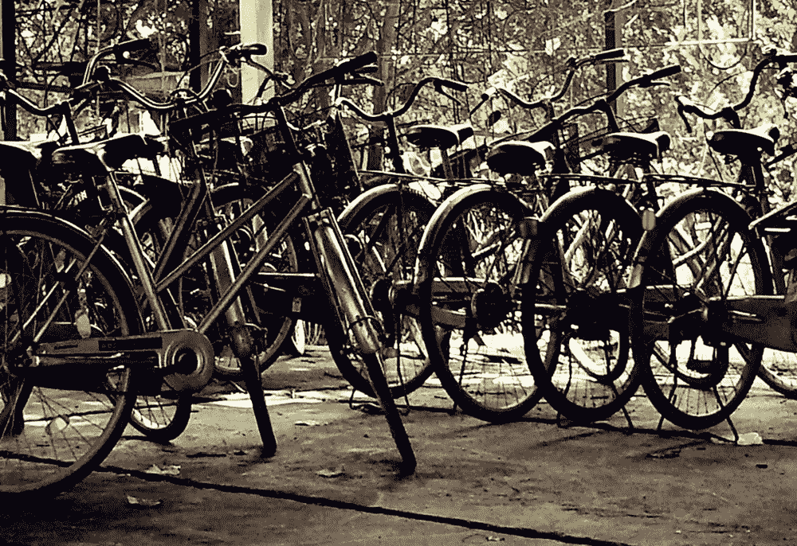

# 从交通运输的其他部分学习一些数据教训，自行车共享会受益吗？

> 原文：<https://medium.com/hackernoon/bike-sharing-will-benefit-from-learning-some-data-lessons-9d777dbf360c>

今天早上，自行车共享公司[摩拜单车](http://mobike.com/global/)在英国推出[的消息引起了我的注意。](https://www.theguardian.com/cities/2017/jun/12/uber-bikes-manchester-mobike-china-global-ofo)

[Bicycles by Vivera Siregar, CC-BY-2.0](https://www.flickr.com/photos/viverasiregar/10532857813/in/photolist-h3KDEM-65VQF8-vKvFz-81xh6Y-c3RrMY-axiQ2z-679HHQ-4oGgE-fziM1q-6Cctny-6C8kVT-gQByr-oz9sx7-7r352v-7vuw6o-8afGXv-7MvQKH-7c6F9K-5r2CVV-5RpTZc-6TNaBU-7xwjRR-7ePfVQ-iCGZH-PYhkL-o95vE-5fygx-fkfGzR-z2sYJV-8ruXh3-3PnSwK-4nBoHY-51CkHM-dtm8mP-89tR5w-89tQSA-6kHydZ-4TN29L-pracgE-2ix4T1-7skA4b-bu7qwq-bH2e1T-nCMHQT-9mcPqe-7vuwP9-7ZuDHt-dDzvwJ-giFUCR-eUnPye)

这个故事充满了令人兴奋的便利，以及骑自行车如何通过减少汽车旅行的次数来帮助人们变得更加活跃和改善空气质量。但这个故事也突出了挑战:人行道上成堆的自行车和城市中拥挤的自行车道，不期望交通流量增加。交通部门似乎被夹在抓住机遇和避免投诉的欲望之间。

但这个故事中缺少的一点是，这些挑战是多么熟悉，以及其他地区的城市已经在如何应对这些挑战。在我工作的[开放数据研究所](https://theodi.org)，我们喜欢谈论利用数据创造影响的政策的[设计模式](https://theodi.org/blog/policy-design-patterns-that-help-you-use-data-to-create-impact)。让自行车共享更好的一些模式已经在其他地方使用了。自行车共享公司和城市可以从汽车、公共汽车和其他自行车应用程序中吸取一些教训，以更快地应对挑战，更快地抓住机遇。

## 什么是自行车共享

摩拜单车是众多提供自行车共享服务的公司之一。服务很简单。你下载一个智能手机应用程序，申请一辆自行车，去应用程序上显示的位置，得到自行车，骑到你想去的地方，把自行车放在一个方便的地方，然后支付费用。

自行车共享运营商将需要处理订单和支付，维护自行车车队并预测需求，以便他们可以将未使用的自行车转移到可能需要它们的地方。

当地交通部门有不同的任务。他们需要维护交通基础设施，以适应不同的交通方式(步行、骑自行车、汽车、公共汽车)，满足不同用户群体(健全人、残疾人、游客、居民、[商务](https://hackernoon.com/tagged/business)旅行者)在一天不同时间的需求。在这个已经很复杂的系统中，城市欢迎另一种选择的试验，这很好。

## 自行车共享的一些挑战可以通过更好地利用数据来解决

自行车共享带来的一些挑战已经得到了数据的帮助。更好地利用数据可以更容易地解决这些问题。

无论是骑自行车的人还是自行车共享公司都不想要拥挤的自行车道。这将使人们很难到达他们想去的地方，并有增加事故的风险。这将减少骑自行车的人数，并减少自行车共享公司可能获得的利润。让交通部门获得关于人们在哪里骑车和哪里发生事故的数据，将有助于他们满足需求，创造更安全的道路。给骑自行车的人关于拥挤的骑行路线的数据将帮助他们更好地决定何时何地骑行。

自行车共享公司不希望人行道上堆积如山的闲置自行车。当自行车被使用时，他们赚钱。自行车共享公司不会有因为其他交通而导致的路面拥堵程度的数据:例如，属于竞争自行车共享公司的自行车，或者因为行人试图去吃午饭。但是拥堵会损害他们的声誉。让自行车共享公司获得这些数据将有助于他们在何时移动自行车方面做出更好的决定。让交通部门获得这些数据将有助于他们了解自行车共享对其他类型交通的影响。

数据不是灵丹妙药。你可以向骑自行车的人、自行车共享公司和交通部门提供更好的信息，但不能保证他们会使用这些信息，甚至不能保证他们能很快使用这些信息。但它会有所帮助。我们已经看过了。[运输部门仍有许多工作要做，以改善数据](https://theodi.org/blog/uk-government-must-support-data-sharing-and-open-data-in-transport-or-risk-being-left-behind)，但这是一个走在大多数人前面的部门。

## 吸取教训

许多交通部门已经发布了关于拥堵、事故和道路封闭的[公开数据](https://theodi.org/what-is-open-data)。谷歌、优步和 Strava 开始通过[移动](https://europe.googleblog.com/2015/11/tackling-urban-mobility-with-technology.html)、[运动](https://movement.uber.com/cities)和[地铁](http://metro.strava.com)项目发布[关于汽车和自行车运输平台使用情况的汇总公开数据](https://theodi.org/what-is-open-data)。通过公开这些数据，每个人都可以改善为汽车司机、出租车乘客和骑自行车的人提供的服务。开放是至关重要的。这意味着骑自行车的人和出租车司机可以使用一整套服务来决定路线，而交通部门可以轻松地结合数据来给出建议或决定在哪里建设新的容量。

行人可以使用 MySociety 的 [FixMyStreet](https://www.mysociety.org/better-cities/fixmystreet/) 等服务报告拥挤的人行道。这些报告是公开发布的，因此可以被自行车共享公司和交通部门使用。如果自行车共享公司都发布关于他们的自行车被放在哪里的汇总数据，那么决策就可以进一步改善。

## 不良数据商业模式的挑战

啊，我听到一些读者说，但肯定有问题？如果自行车共享公司公开发布关于他们的自行车在哪里以及人们走的路线的数据，那么这不意味着其他公司将使用这些数据来与他们竞争吗？

是的，很明显。但是好的竞争者已经知道了。让几个人，或者一台[相机](http://imactivate.com/littlecarcounter/)或者[另一种形式的传感器](https://hackernoon.com/automated-cars-and-data-786dfb1e3eb4)，在主要目的地附近徘徊，拍摄能够被机器计数的自行车的[照片是相当便宜的。](https://scholar.google.co.uk/scholar?hl=en&q=machine+learning+count+objects+in+pictures&btnG=&as_sdt=1%2C5&as_sdtp=)

啊，我听到其他读者说，但毫无疑问[自行车共享公司将计划出售数据，作为如今每个人都在推荐的数据货币化战略的一部分](https://techcrunch.com/2017/05/09/china-mobike-holiday-weekend-report/)？

是的，他们可能认为他们可以卖掉它。但对这些公司来说，数据货币化并不是一个非常聪明的策略。这不仅是因为他们的用户可能更喜欢使用[数据来造福他们的社区](https://digitalblog.coop.co.uk/2017/05/15/speaking-to-our-members-about-how-their-personal-data-is-used/)，还因为他们的用户携带着他们用来获得自行车的智能手机。谷歌、苹果和电信运营商也有类似的旅行数据。它的价值微不足道。

在一个数据丰富的世界里，当你能给数据增加价值时，数据货币化就会起作用。例如，它将适用于数据聚合器，如 [TransportAPI](http://www.transportapi.com) 和 [ITOWorld](http://www.itoworld.com) ，但只是偶尔适用于数据发布者。相反，自行车共享公司应该开放数据来改善服务。

## 数据不是石油，但它是基础设施

在 21 世纪，获取和使用数据非常便宜，基于数据稀缺的商业模式通常会失败。这就是为什么[“数据就是石油”是一个完全可怕的类比](http://www.dgen.net/blog/2017/05/10/data-is-not-the-new-oil-data-oil/)的众多原因之一。智能自行车共享公司将开放关于自行车使用和位置的汇总数据。他们将在服务质量上展开竞争。这种竞争和对服务的关注可以让他们的用户和更广泛的运输网络[受益。](https://hackernoon.com/tagged/network)

但是如果自行车共享公司不聪明会怎么样呢？如果他们因为缺乏对数据的理解和糟糕的商业模式而选择削弱他们为用户提供的服务呢？

好了，这是这篇文章的最后一课。[数据是一种新形式的基础设施](https://theodi.org/what-is-data-infrastructure)。政府意识到，这种基础设施需要尽可能开放，同时尊重隐私，这样才能建立企业，改善服务。

英国政府和地方当局试图说服公交公司开放数据，但失败了，所以现在正在立法强制这样做。这项立法将使谷歌地图、苹果地图和城市地图等服务更容易帮助人们决定他们的旅程，从而改善对公共汽车乘客的服务。

如果自行车共享公司不决定变得聪明，那么我怀疑真正的“智能城市”会为他们做出决定。自行车共享公司将受到欢迎，但只有那些决定通过开放数据来提供更好服务的公司才会受到欢迎。聪明的公司会吸取教训，在这场特殊的游戏中胜出。

> [黑客中午](http://bit.ly/Hackernoon)是黑客如何开始他们的下午。我们是阿妹家庭的一员。我们现在[接受投稿](http://bit.ly/hackernoonsubmission)并乐意[讨论广告&赞助](mailto:partners@amipublications.com)机会。
> 
> 如果你喜欢这个故事，我们推荐你阅读我们的[最新科技故事](http://bit.ly/hackernoonlatestt)和[趋势科技故事](https://hackernoon.com/trending)。直到下一次，不要把世界的现实想当然！

