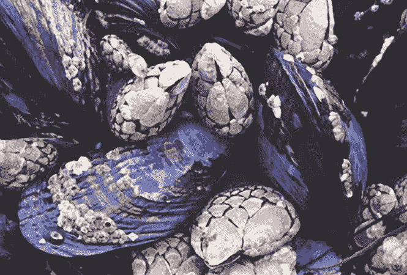
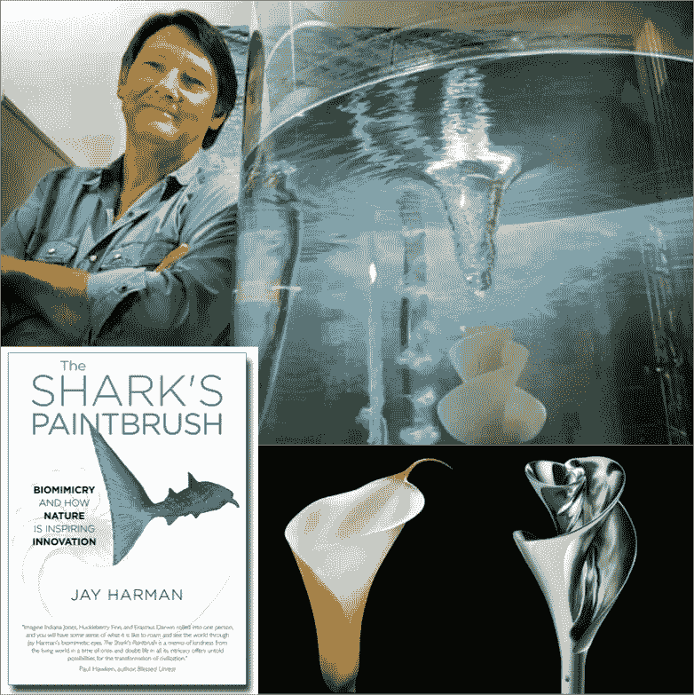
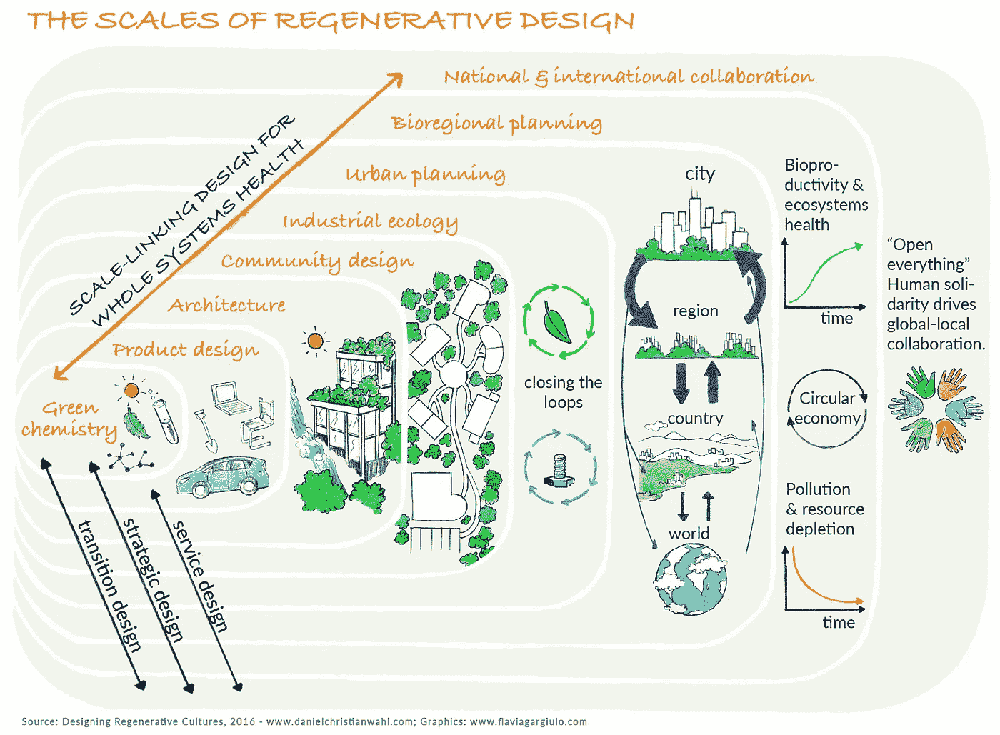
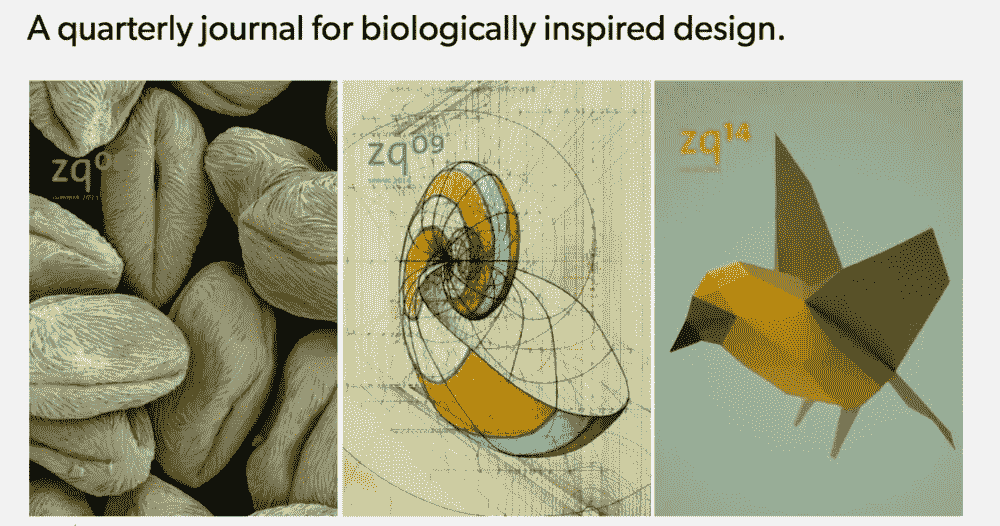

# 生物激发的创新

> 原文：<https://medium.com/hackernoon/biologically-inspired-innovation-1f8c30aed46b>

一般来说，生物启发的创新过程是为了确定一个特定的需求或设计问题，例如，“我们如何才能创造出一种有效的无毒粘合剂？”然后找出一个可以学习和启发的生物类比——以此为例:一个物种成功地以一种有效的方式将自己粘在一个表面上。普通或蓝色贻贝(*紫贻贝*)设法将自己“粘”在潮间带的岩石上，在那里它暴露在强大的波浪和海流力下。

Blue Mussle ([Image Source](https://columbiaforestproducts.files.wordpress.com/2013/01/mussels-copy.jpg?w=665&h=450&crop=1))

一旦我们确定了一个有前途的生物模型，我们就详细研究它，探索哪些模式、原则或过程可以被模仿和抽象，从而为如何将我们所学应用于我们的设计挑战提供可能的想法。生物模型可以在不同层面激发创新:无论是在化学、形态和功能、过程和模式层面，还是在系统整合和协同作用层面。在每一个层次上，我们都能找到一系列受生物启发的设计方案。然后将这些应用到我们的原型设计中，进行测试、评估，以及(如有必要)重新设计和优化，直到我们得出满意的设计方案。

PureBond formaldehyde free plywood panels by Columbia Forest Products ([Image Source](http://www.homedepot.com/hdus/en_US/DTCCOMNEW/fetch/FetchRules/Rich_Content/purebond-THD.jpg))

在我们贻贝的例子中，来自俄勒冈州立大学林学院的李博士发现，蓝贻贝的“足丝”是由一种特殊的蛋白质组成的，这种蛋白质具有非常强的粘性，同时又具有弹性。在哥伦比亚森林产品公司的资助下，李运用仿生学思维，通过改变大豆蛋白的功能，最终成功创造出一种新的粘合树脂，其功能类似于贻贝的丝线。仿生发明带来了一种制造无脲醛胶合板的方法，这反过来有助于减少使用这些产品的室内环境中毒素的积累(哥伦比亚森林产品公司，2014 年)。

从全球来看，我们正处于一场由生物学启发的业务和创新方式变革的风口浪尖。在*的《鲨鱼的画笔——仿生以及自然如何激发创新》*中，连续创业家和发明家杰伊·哈曼(Jay Harman)在 2013 年展示了受生物启发的设计是如何改变行业的。这本书给那些仍然怀疑我们有能力共同创造再生文化的人带来了希望。

Jay Harman and [Pax Scientific](http://paxscientific.com) are the inventors of the Lily Impeller and many other technological innovations inspired by biological form and flow in nature ([Image Source](https://quicket.azureedge.net/media/0047365_0.Png))

Pax Scientific 的创始人杰伊已经建立了许多不同的仿生企业，并与之合作和研究。他认为，它们的一些定义性特征是，它们建立在跨学科合作的基础上，涉及生物学家、工程师、设计师以及企业家。他强调，这就产生了在这些不同学科的语言和视角之间进行翻译的需求。

> “生物启发的解决方案通常不仅仅代表对现有技术的渐进改变，还代表对如何解决问题的彻底反思。”
> 
> 杰伊·哈曼，2013: 219

文化变革需要时间。突破性的新技术通常需要至少 15 年才能进入市场并取代既定的做事方式，但向生物启发技术的过渡已经在加速。在过去十年中，已注册的创新、仿生出版物的数量以及仿生技术的投资金额都在快速增长(第 22 页)。“受生物启发的产品已经创造了数十亿美元的销售额”(第 20 页)。

2010 年[的一项研究](http://www.sandiegozoo.org/images/uploads/BiomimicryEconomicImpactStudy.pdf)预测，到 2025 年，基于仿生学的技术和业务可以创造 1 万亿美元的营业额(圣地亚哥动物园，2010: 33)。许多有道德的投资者热衷于投资这一增长领域(Katherine Collins，2014)。这种投资从退化型投资转向再生型投资的转变积极推动了向“太阳能时代”的过渡(Henderson，2014 年)和再生型文化的传播。道德仿生金融为这些投资者提供支持。

美国和其他地方的主要基金会正在将投资从化石燃料领域转移到可再生能源、复原力建设以及仿生和绿色化学领域的创新。当像约翰·洛克菲勒这样的石油大亨的继承人将他们的 8.7 亿美元基金从石油和天然气投资中转移出来时，事情就不妙了。

蒂姆·迪金森在*滚石*的一篇文章中报道，“随着气候变化活动家向公共机构施压，要求其放弃化石燃料投资，越来越清楚的是，正确的事情也是明智的事情”(迪金森，2015)。我们在学习！仿生创新将从中受益。

旨在为现有市场带来变革性创新和设计的仿生创新者往往会撞上[第一地平线管理](/@designforsustainability/the-three-horizons-of-innovation-and-culture-change-d9681b0e0b0f)的墙。H1 管理层关心的是保持现有业务的运行，仿生创新往往是破坏性创新。

同样重要的是要认识到，并非所有的仿生创新都一定是可持续的。有很多受生物启发的设计推进了武器和军事技术。这是 Horizon 1 捕获颠覆性创新的一个明显例子。

然而，总的来说，仿生创新具有成为 [H2+创新](/@designforsustainability/the-three-horizons-of-innovation-and-culture-change-d9681b0e0b0f)的内在潜力，帮助我们建立一座通向文化转型和系统仿生学的桥梁，通向[再生文化的第三个地平线](/@designforsustainability/the-three-horizons-of-innovation-and-culture-change-d9681b0e0b0f)。

> “仿生学通过提供不会产生新问题的解决方案，为未来的盈利能力奠定了基础；它提供了一些短期成本节约解决方案无法提供的东西。”
> 
> 杰伊·哈曼，2013: 231

Jay Harman 从他自己的经历中知道“生物启发的商业需要做好长期准备”(第 233 页)，然而它有一个重要的优势。

> "仿生学提供了终极性能——这一点正日益得到业界的认可."
> 
> —杰伊·哈曼(第 247 页)

仿生 3.8 的团队描述了仿生的三个层次:从自然的模式中学习；从自然过程中学习；在生态系统的层面上向大自然学习。每一个不同的层次都可以应用于不同规模的生物灵感设计。

正如我已经提到的，21 世纪最大的转变之一将是转向太阳能化学，这是由生命基于可再生能源和材料资源创造有效化合物的方式所激发的。“绿色化学”和生物启发的材料科学是再生文化设计的重要基础。

我们可以应用仿生思维的其他设计领域包括:产品设计、建筑、社区设计、工业生态学、城市规划和以生物区域为中心的循环经济。图 10 展示了不同的设计尺度，以及不同的设计方法如何跨越这些尺度，试图以尺度链接的方式将它们连接起来。让我们更详细地探讨这些不同设计尺度的一些例子。

Firgure 10: The scales of regenerative design and innovation (From ‘[Designing Regenerative Cultures](http://www.triarchypress.net/designing-regenerative-cultures.html)’ by Dr. Daniel Christian Wahl)

…

【这是摘自《T4》设计再生文化的一个分章节，Triarchy 出版社 2016 年出版。]

Zygote Quarterly is a publication focused on biologically inspired design and innovation. Here is and [interview with Daniel Christian Wahl from ZQ17, 2016](/@designforsustainability/interview-on-bio-inspired-design-with-daniel-christian-wahl-zygote-quarterly-issue-17-2016-c24f0ff5f88b)

—

如果你喜欢这个帖子，**请鼓掌**记住，如果你非常喜欢，你可以鼓掌**多达 50 次**；-)!

**丹尼尔·克里斯蒂安·瓦尔**——在面临多重危机的情况下催化变革性创新，为可再生整体系统设计、可再生领导力以及可再生发展和生物区域再生教育提供建议。

国际知名书籍[设计再生文化](https://www.triarchypress.net/drc.html?source=post_page---------------------------)的作者

**请考虑成为赞助人来支持我正在进行的工作:**

 [## 丹尼尔·克里斯蒂安·沃尔正在创造支持再生文化和区域再生的内容…

### 亲爱的潜在支持者，自从《设计再生文化》在 2016 年初出版以来，我一直在分享它…

www.patreon.com](https://www.patreon.com/DanielChristianWahl?fan_landing=true)