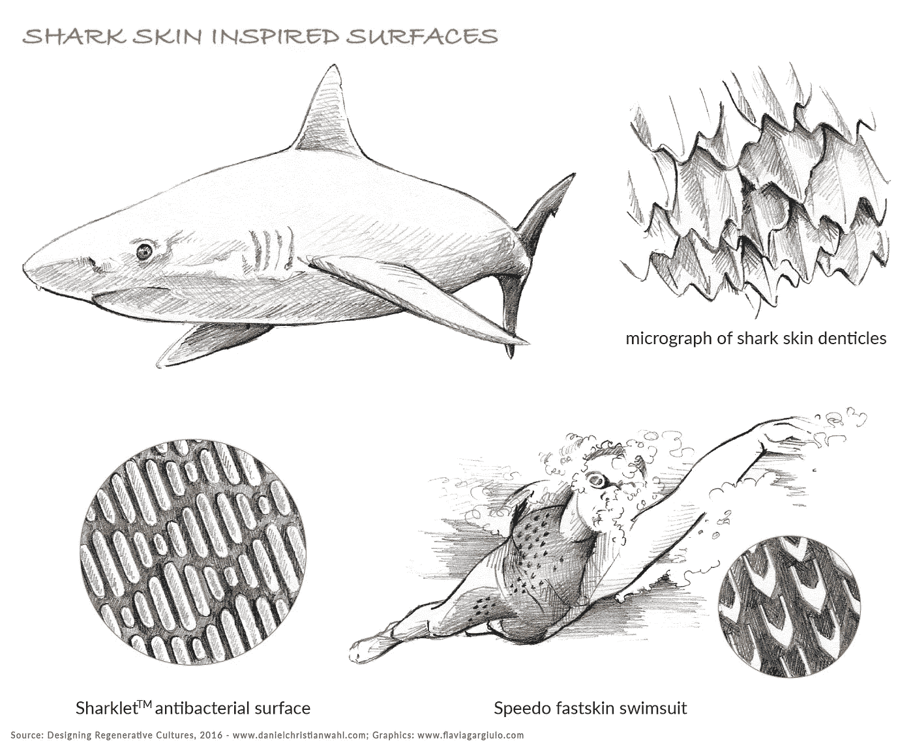
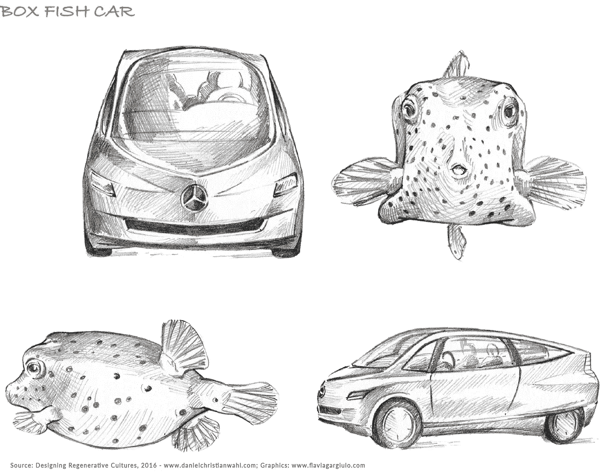
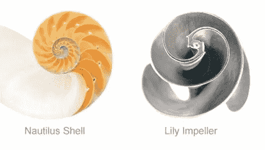

# 受生物启发的产品设计

> 原文：<https://medium.com/hackernoon/biologically-inspired-product-design-1161497707c>

从新纺织品、涂料和油漆的材料科学规模开始，仿生产品设计的例子包括改进的医疗工具、风扇、推进机制、车辆、火车、船只、飞机、可再生能源系统、智能仪表、海水淡化技术、地毯、窗户和包装系统；仅举几个当今市场上令人惊叹的生物灵感产品的例子。让我们探索其中的一些创新。

关于没有颜料和染料的颜色，蝴蝶能教会我们什么？Morpho 属的蝴蝶可以通过它们彩虹般的蓝色来识别，这不是基于色素，而是基于它们翅膀的表面结构如何衍射和散射光线。这一属的不同物种用颜色来吸引注意力。澳大利亚时装设计师唐娜·斯格罗用一种名为 Morphotex 的面料制作了三件连衣裙，这种面料是由日本特金纤维有限公司开发的无色素无染料纺织品。这种彩虹色的蓝色材料根据不同厚度和结构的纤维相互交织的方式(Ask Nature，2015a)，从光学干涉中汲取颜色(Vanderbilt，2012)。

有很多例子可以说明大自然是如何根据纳米尺度的结构来进化功能表面的。荷叶的微观形貌使其极其疏水，因此具有防水性。这创造了自我清洁的特性，从而产生无尘表面。荷叶(*荷花*)迫使水变成水滴，而不是让它粘在上面。这些水滴然后滚下，在这个过程中收集灰尘颗粒(问问自然，2015b)。1982 年，Wilhelm Barthlott 将这种仿生学的见解应用于创造一种自我清洁的涂料，这种涂料以商标名 Lotusan 出售，现在被用在成千上万的建筑物上。

我们能从鲨鱼皮的功能表面设计中学到什么？鲨鱼是游泳最快的海洋生物。这不仅是因为它们有效的流线型外形，还因为它们特殊的皮肤覆盖着小牙齿(*真皮小齿*)而不是鳞片。这些小齿排成一行，产生漩涡，螺旋形的漩涡沿着鲨鱼的身体流动，减少动物在水中滑行时的摩擦(阻力)。Speedo Aqualab 的创新者将这一原则应用于一款革命性的新泳衣的设计中，这款泳衣在 2000 年奥运会上引起了轰动，当时 80%的奖牌由穿着这种鲨鱼皮材质的游泳运动员获得。Fastskin 套装让游泳者的游泳速度提高了 3%(Waller，2012)。此后，该套装被禁止参加比赛。

总部位于加州的 Sharklet Technologies 公司制造了一种覆盖着微型菱形板的薄膜，这种薄膜模仿了鲨鱼皮的表面结构，并有效地阻止了潜在的危险微生物在覆盖着这种薄膜的表面上繁殖。这种方法不会攻击或杀死细菌，只是使细菌很难附着在这些表面上，以至于它们不能形成菌落和传播。因此，这种方法 *—* 不像使用抗生素 *—* 不会产生耐药微生物(Cooper，2009)。这很重要，因为所谓的“超级细菌”的传播，如耐甲氧西林金黄色葡萄球菌和大肠杆菌的其他潜在致命菌株是世界卫生组织越来越担心的问题之一。Sharklet Technologies 正在与美国海军合作，开发一种目前用作海洋防污剂的铜基涂料的替代品(Sharklet Technologies，2015 年)。更换这种油漆不仅可以大大减少海洋污染的主要来源，还可以防止船体附着藤壶和藻类，从而通过防止拖曳来减少燃料消耗。

仿生设计可以从生物材料和某些物种的表面结构和身体形状或形式中获得灵感。2004 年，梅赛德斯-奔驰技术中心和戴姆勒-克莱斯勒研究中心的工程师团队决定开发一种仿生概念车，寻找优化单体积方法的方法，以提高空气动力学性能和强度。他们从中汲取设计灵感和经验的生物模型是盒子鱼。令人惊讶的是，这种热带鱼的立方体形状的身体非常流线型。在风洞中测试的鱼模型的风阻系数仅为 0.06，这是空气动力学的理想值。由此产生的全尺寸概念车是这一尺寸类别中最符合空气动力学的车辆之一。据戴姆勒称，油耗降低了 20%。

除了从盒子鱼的空气动力学形状中获得灵感，该团队还研究了这种鱼的骨骼结构的强度重量比，以最少的材料(重量)使用赋予它最佳的强度。根据戴姆勒的说法，将 boxfish 的优化骨架设计转移到概念车上，工程师们可以将外部车门板的刚度比传统设计增加 40%，并在不降低强度或碰撞安全性的情况下将总重量减少三分之一(戴姆勒克莱斯勒股份公司，2004 年)。

鲸鱼能教我们建造更有效的风车吗？发明家弗兰克·菲什(Frank Fish)研究了座头鲸( *Megaptera novaeangliae* )鳍前缘的驼峰。他发现这些所谓的结节压缩了流过鳍的液体，当这些动物(重达 36 吨)将自己推出水面时，给了鲸鱼额外的升力和推进力来进行令人惊叹的“突破”。

Whalepower Corporation 现在正在将这一见解应用于设计效率更高的新型风扇和风力发电机叶片，以增加给定风力条件下的功率输出。这项技术也可以在现有的涡轮叶片上进行改造。将这种结节技术应用于飞机工业可能会产生更高效、升力更大的飞机。也许座头鲸会激发飞机效率的下一步？

航空业已经有很多仿生设计了。例如，天鹅启发了协和式飞机独特的机头，现在大多数飞机上常见的上翻翼尖是受猛禽启发的减少湍流的措施。

基于仿生学的创新的一个最著名的例子是新干线 500 系列子弹头列车，它通过使用从翠鸟(*阿尔塞多·阿蒂斯*)嘴里复制的设计原则，变得更快、更节能、更安静。许多快速高效的火车设计都是基于其他鸟类的空气动力学形状，如西班牙 AVE 102 系列，其机车形状像鸭嘴。

从自然过程中学习不一定要局限于模仿特定的物种，还可以基于我们在自然界中可以观察到的一般模式和过程。杰伊·哈曼是一名船舶设计师。他对海洋的热爱和对水流方式的痴迷启发他研究漩涡形成背后的“流线型原理”。

从流动和旋转的水形成的几何形状中学习，Harman 创建了 PAX Scientific，将自然流动的卓越效率引入流体处理技术，如混合器、泵、涡轮机、热交换器、管道和螺旋桨。该公司的产品之一 Lilly 叶轮是一种基于这些原理的高效混水装置。其他例子包括用于冷却应用的更高效的风扇、船舶推进系统和一种新型的海水淡化系统。

[PaxWater Technologies](http://www.paxwater.com/biomimicry) — The Lily Impeller ([Source](http://www.mnn.com/leaderboard/stories/the-lily-impeller-nature-based-design-inspires-game-changing-efficiencies))

受生物启发的产品设计创新几乎是无穷无尽的。这些例子简单地说明了在产品规模上仿生学应用的多样性。还有很多。

【这是摘自《T4》设计再生文化的一个分章节，Triarchy 出版社 2016 年出版。]