# 比特币、以太坊、区块链、代币、ico:为什么有人要关心？

> 原文：<https://medium.com/hackernoon/bitcoin-ethereum-blockchain-tokens-icos-why-should-anyone-care-890b868cec06>


Source: [https://www.youtube.com/watch?v=hxtB01iPK6w](https://www.youtube.com/watch?v=hxtB01iPK6w)

密码市场正在变得越来越活跃。

不顾重力的价格反弹…

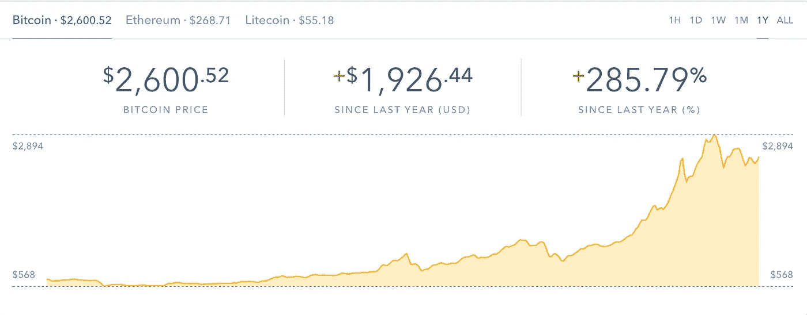

Bitcoin Price Chart (1 year)

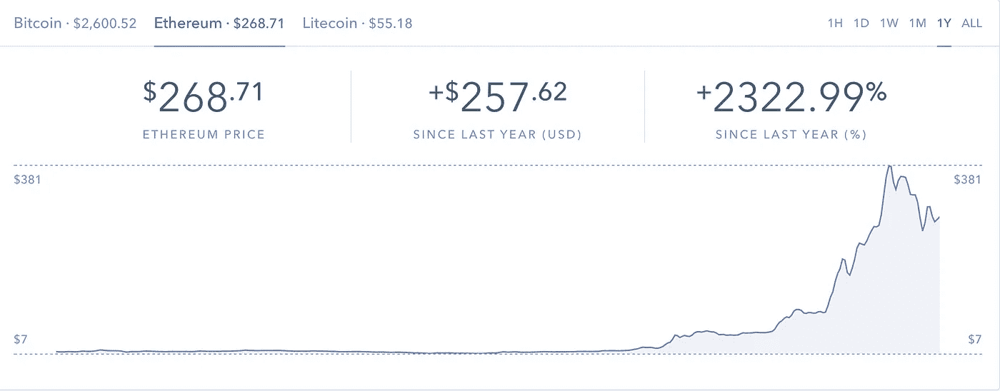

Ethereum Price Chart (1 year)

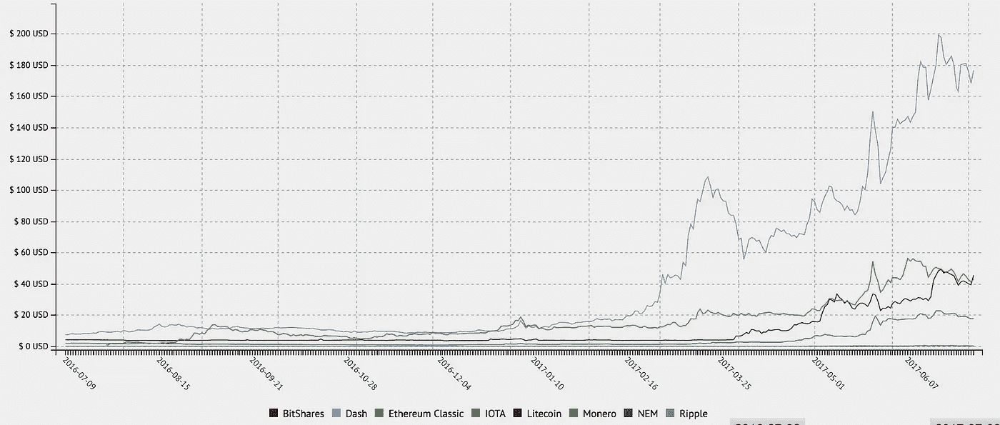

Top 8 Cryptocurrencies Price Chart (excluding Bitcoin & Ethereum)

…数百万美元的代币销售司空见惯，传统新闻媒体讨论以太坊、比特币、ico、代币、硬叉子和其他技术话题的[头版头条](https://www.nytimes.com/2017/06/19/business/dealbook/ethereum-bitcoin-digital-currency.html)也是如此。

甚至我 13 岁的弟弟也一直打电话给我要求解释！

我个人已经在这个领域投资了一段时间——最近是作为比特币基地的一名工程师——但即使是我也对加密领域在过去六个月的发展速度感到惊讶。

如果你想了解为什么 crypto 会受到关注，你必须了解推动市场发展的幕后催化剂。现在，催化剂是“代币销售”或“首次发行硬币(ICO)”现象。

# ICO vs IPO:投资的蛮荒西部

到底什么是 ICO？你可能听说过“首次公开募股”(IPO)，即一家公司通过向机构投资者出售部分股票而上市，机构投资者再在证券交易所向公众出售股票。公众对首次公开募股感到兴奋，因为他们允许任何拥有经纪账户的人购买 Snapchat 等公司的股票。

ico 是一回事吗？是也不是。IPO 和 ico 都是公司用来筹集资金的。主要(也是真正重要的)区别在于监管。首次公开募股受美国证券交易委员会监管，有一套法律要求和正式的执行程序。ico 目前不受监管，更像是一种“狂野西部”的做法。

总的来说，说到 ico，似乎有很多困惑和不确定性。一些人认为，它们已经变成了一场“反常且不可持续的凯恩斯式选美比赛”支持者很乐观，声称这是一种新形式的风险投资。像这样激烈对立的观点主导着对话，我们大多数人都在一旁摸不着头脑。

# 必要的背景知识

如果不了解 ICO 中出售的底层数字资产，就无法理解 ICO。如果你已经知道了加密的基础知识，可以跳过这一部分。对于我们其余的人，让我们从头开始！

# 加密货币技术栈

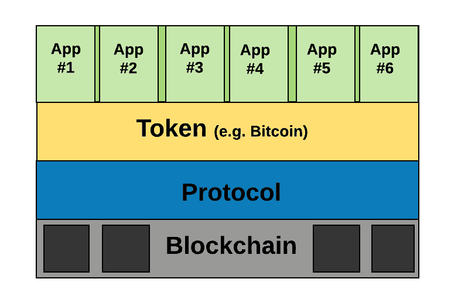

Cryptocurrency technology stack

## **比特币**

比特币是一种使用点对点技术的去中心化数字货币。点对点本质上意味着没有一个中央机构来发行新货币或跟踪交易。相反，这些操作由网络集中管理。用户之间的交易直接发生，并被记录在*区块链*(下文将详述)。

互联网上充斥着伟大的比特币解释者，所以我不会在这篇文章中深入探究。相反，这里有一些让你快速上手的起点:

[比特币维基](https://en.bitcoin.it/wiki/Main_Page)，[维基](https://en.wikipedia.org/wiki/Bitcoin)，[什么是比特币](https://www.youtube.com/watch?v=Um63OQz3bjo)，[比特币杂志](https://bitcoinmagazine.com/articles/you-say-bitcoin-has-no-intrinsic-value-twenty-two-reasons-to-think-again-1399454061/)，[比特币为什么重要](https://dealbook.nytimes.com/2014/01/21/why-bitcoin-matters/?_php=true&_type=blogs&_r=0)。

## **区块链**

区块链是一个分散的公共数据库，保存数字交易的永久记录。

换句话说，它是一个日志文件，存储了所有数字交易的不可变记录。这种分散的数据库不受中央管理员控制，而是一个复制数据库的网络(意味着网络中的每个节点都存储自己的区块链副本)，网络中的任何人都可以共享和查看该网络。


区块链由“矿工”集体维护，他们是网络中的成员，通过解决与区块相关的复杂算法问题，竞争验证每个区块中的比特币交易。他们通过购买或租用大量计算能力来运行这些复杂的算法问题。他们使用计算能力来验证交易的动机是，如果他们解决了问题并验证了一个比特币块，他们就会得到比特币的奖励。

这种去中心化网络的力量在于，经济价值和治理是在网络的利益相关者(即矿工和消费者)之间分配的，而不是集中在一个单一的组织中(如银行、政府&会计师)。由于这种设置，任何人都可以拥有和转移数字资产，而不需要第三方。

区块链技术不仅限于比特币。它可以用来创建任何其他加密货币，如以太坊和莱特币，它们利用自己的区块链。

你可以在[维基百科](https://en.bitcoin.it/wiki/Block_chain)阅读更多关于比特币和区块链的内容，或者观看[这个伟大的讲解视频](https://www.youtube.com/watch?v=Lx9zgZCMqXE&feature=youtu.be)。

## **协议层**

接下来，我们有协议层。一般来说，协议是网络中的节点在传输信息时使用的一组特殊规则。这些规则规定了通信实体之间的交互。

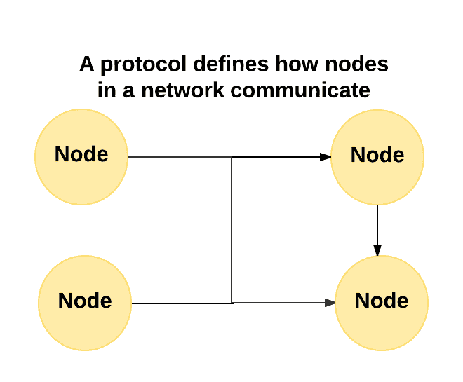

电信中使用的协议的一个例子是传输控制协议(TCP ),它是一组用于在因特网上的信息分组级交换消息的规则。TCP 保证数据分组将被传送，并且它们将以它们被发送的相同顺序被传送。协议的另一个例子是互联网协议(IP ),它是在互联网地址级别发送和接收消息的一组规则——它本质上规定了互联网上数据包的格式和寻址方案。


TCP/IP Protocol

当讨论区块链时，术语“协议”指的是由区块链实施的“加密经济规则”，以便在区块链的对等网络中维护分布式共识。

**加密经济规则是管理分散数字经济的规则:**

**(i)使用公钥加密进行认证**

**(2)有经济激励以确保规则得到遵守**

例如，在比特币区块链的情况下，它向矿工提供财务激励，以验证每一笔比特币交易，从而保护网络。

这些经济激励到底是什么？

## **代币**

输入令牌。

对矿商的财务激励来自于建立在比特币区块链之上的原生代币——比特币。硬币起到了“胡萝卜加大棒”的作用——利用自己的计算能力验证交易的矿工会得到一定数量的硬币奖励。

一般来说，当你听到“加密货币代币”或简称为“代币”时，它们指的是建立在区块链之上的代币，如比特币，代表你拥有并可以转让给其他人的数字资产。

有多种方法可以在区块链上创建令牌。例如，最容易理解的令牌是像比特币这样的内在令牌，它直接建立在比特币区块链之上。或者你可以选择[分叉](https://en.wikipedia.org/wiki/Fork_(software_development))比特币区块链，并在其上构建代币——一些例子包括 ZCash、Litecoin、Monero 等。**或者你可以建立一个全新的区块链技术，并在此基础上建立一个令牌——这就是以太坊所做的**。以太坊区块链顶上的令牌是“以太”。你甚至可以在以太坊的区块链上建造代币。[灵知](https://gnosis.pm/) (GNO)和[占卜](https://app.augur.net/)(代表)就是这样的例子。也许令人困惑，因为“以太”是建立在以太坊区块链之上的固有令牌。稍后我会在帖子里解释。目前，只要接受一个事实，即除了以太坊区块链上的固有令牌之外，还可以建立其他令牌。

这里有一个与传统货币的有用类比——你可以把代币想象成货币本身(例如，美元、欧元等)。)和《区块链议定书》作为货币政策。

这里的主要观点是**每一个代币都基于一些潜在的区块链**——无论是比特币的区块链，以太坊的区块链，还是其他一些分叉的/新的区块链。

不管问题中的加密货币是什么，代币都是有价值的，因为区块链为资产操纵提供了一个不可改变的、分散的和不可能伪造的支柱。

## **应用层**

到目前为止，我们已经了解了比特币及其背后的区块链。我们还了解了决定区块链规则的协议，以及在此基础上构建的令牌。

总之，这些技术让我们重新思考我们对金钱的定义，它是数字化的、易于转移的、安全的和分散的。

但重要的是要认识到，金钱只是区块链的一种应用。除了钱之外，我们这些密码世界的人对区块链如此紧张的原因是因为它揭示了一般的 **(1)协议**和 **(2)应用**的潜在未来。

**(1)协议**
加密货币开发者的终极梦想是，我们可以利用这项区块链技术从头开始构建新的、改进的通信协议。正在开发的加密货币协议有可能解决自第一个拨号调制解调器开始运转以来一直困扰互联网的集中化问题。

这样的协议有哪些例子？

嗯，它们可能包括支付、身份、域名系统、云计算、信誉系统等协议。如今，许多这样的系统都是高度集中的(例如 Stripe、Paypal、Google、Amazon ),在网络上没有默认或标准这样的东西。

因此，从长远来看，我们的希望是区块链技术将使分散、开放和安全的协议能够与加密货币之外的用例*一起构建。*

***(2)应用**
区块链实现了我们所说的“去中心化应用”。

分散式应用，或称“dApp”，是构建在区块链之上的应用。这是怎么回事？*

*让我们以比特币区块链为例。比特币使用一个脚本系统来处理在比特币区块链上发生的交易。脚本是一个简单的指令列表。因此，比特币的脚本语言使我们能够编写记录每一笔交易的脚本。该脚本的目的是定义接收者必须满足的要求，才能访问正在转移的比特币。*

*对于典型的比特币转账，该脚本将定义挥霍者必须提供的内容:*

1.  *一个公钥，经过哈希处理后，它与脚本中包含的目标地址相匹配*
2.  *显示与刚刚提供的公钥相对应的私钥证据的签名*

*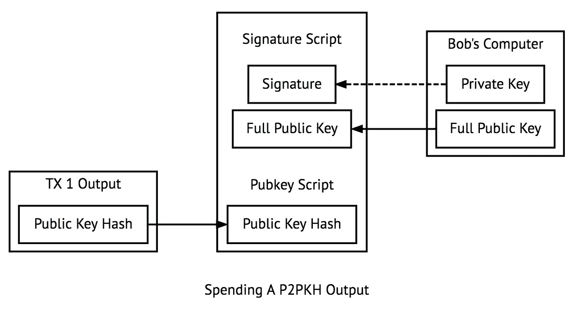*

*但是有趣的是，我们可以在每次交易中发送的参数有一定的灵活性。例如，我们可以编写一个脚本，说明“该事务只有在有两个私钥的情况下才有效”。因此，本质上，这种脚本语言现在允许我们对如何转移资金，或者更一般地说，任何信息进行编码，而不需要我们信任某个第三方来遵循我们关心的一组规则。我们只是信任代码，一切都很好。*

*因为比特币有这种脚本语言，所以可以使用这种语言来构建在区块链上交易的特定类型的应用程序。**换句话说，我们可以构建使用比特币交易进行交流的应用。***

*例如，假设我们想要构建一个基于区块链的众筹应用程序。您可能有一套在脚本语言中编码的一方与另一方之间如何转移(或交流)资金的规则。然后，该应用程序的用户可以运行由区块链管理的众筹活动。*

*这是 dApps 背后的主要思想:定义特定应用程序的一组分散的规则。这套规则位于一个公共的、分散的区块链上(而不是某个大型实体(如脸书或亚马逊)拥有的中央服务器)。这使它能够自治管理，并对审查有弹性。*

# *“应用程序在哪里？”困境*

*我们许多在加密领域的人都有这样的印象，即开发者会立即跟上潮流，使用比特币的脚本语言在其上构建去中心化的应用程序。

但快进八年(比特币于 2009 年发布)，比特币还没有变得不仅仅是一个价值储存的[和一个投机投资的](http://www.investopedia.com/terms/s/storeofvalue.asp)。当然，我们已经看到了一些钱包和交易所的建立。([比特币基地](https://www.coinbase.com/)、[北海巨妖](https://www.kraken.com/)、[波洛涅克斯](https://poloniex.com/)、 [GDAX](https://www.gdax.com/trade/ETH-USD) ，不一而足。)

…当然，我们不能忘记[丝绸之路](https://en.wikipedia.org/wiki/Silk_Road_(marketplace))，这个数字匿名药品市场在 2.5 年内处理了[超过 10 亿美元的销售额](http://blogs.marketwatch.com/thetell/2013/10/02/silk-road-drug-market-handled-1-2-billion-of-transactions-in-2-5-years-before-fbi-seizure/)，并于 2013 年末被执法部门关闭。从某些方面来说，比特币*可以*被认为是第一个去中心化的应用，因为它运行在区块链技术上，是完全开源的，并且在没有中央权威的情况下运行。但是严肃地说，我们中的很多人仍然在环顾四周，想知道，“杀手级的应用程序在哪里？”可悲的是，我认识的人中几乎没有人在日常生活中使用基于区块链的应用程序。

**以下是一些阻碍这些应用受欢迎程度的因素**(注:这些是我的个人观点):*

# *1.缺乏开发人员友好性和工具*

*使用比特币的脚本语言编写应用程序并不容易。为什么？

举个例子，脚本语言太有限了。脚本语言是一种编程语言，您可以在其中编写代码来执行某些操作。今天在网络上广泛使用的脚本语言的一个例子是 JavaScript。*

```
*const greeting = (name) => "Hello, " + name + "!";const add = (a, b) => a + b;const subtract = (a, b) => a - b*
```

*与比特币的脚本语言相比:*

```
*OP_DUP OP_HASH160 62e907b15cbf27d5425399ebf6f0fb50ebb88f18 OP_EQUALVERIFY OP_CHECKSIG*
```

*上面的 JavaScript 读起来很像英语。另一方面，比特币的脚本语言看起来像机器代码。大多数开发人员习惯于用 JavaScript、Ruby 或 Python 等表达性语言编写，而不是机器码。[比特币脚本](https://en.bitcoin.it/wiki/Script)让大多数开发者望而生畏。

其次，开发工具和优秀的文档对开发人员的采用大有帮助。以 [React](https://facebook.github.io/react/) 为例，它是当今最流行的前端库之一。React 变得如此受欢迎的最大原因之一是因为社区在构建一套强大的开发工具(例如 ide、 [Babel](https://babeljs.io/) 、 [Webpack](https://webpack.github.io/) 、[样板文件](https://www.reactboilerplate.com/)、 [Create React App](https://github.com/facebookincubator/create-react-app) 等)、文档和教程方面投入了大量精力。另一方面，比特币的生态系统与用户友好相反。

最后，比特币的脚本语言不是[图灵全集](https://en.wikipedia.org/wiki/Turing_completeness)。图灵完全编程语言是一种可以用来模拟任何单带[图灵机](https://en.wikipedia.org/wiki/Turing_machine)的语言。换句话说，只要有足够的时间和内存，它可以用来解决图灵机可以运行的任何计算问题。(有关这方面的更多信息，请阅读此[堆栈溢出讨论](https://stackoverflow.com/questions/7284/what-is-turing-complete))。由于图灵不完整，比特币脚本限制了你能做的事情。

**总的来说，比特币的脚本语言在历史上是有限的，难以使用，并且缺乏足够的工具和文档。结果，它没有鼓励开发者社区的形成，而这是杀手级应用的先决条件。***

# *2.构建一个具有强大网络效应的分散式应用程序并不容易*

*我们在日常工作中使用的许多应用程序(市场、交易、社交网络等)都从其强大的[网络效应](https://en.wikipedia.org/wiki/Network_effect)中获得价值。网络效应是指随着越来越多的人使用，产品或服务的价值增加。

一个经典的例子是脸书。每个连接到平台上其他用户的新用户都会非线性地增加连接数。同样，如果平台上只有你一个人，Venmo 也没用。对于每一个加入的新朋友，产品的价值上升，因为你现在可以支付和/或接收来自这个朋友的付款。

网络效应帮助打造更好的产品和服务。然而，建立这个网络是打造一个成功产品最难的部分之一，经典地被称为“[鸡和蛋](http://cdixon.org/2009/08/25/six-strategies-for-overcoming-chicken-and-egg-problems/)的问题。

因此，即使开发者努力在比特币区块链的基础上建立一个去中心化的众筹平台，让平台两边的用户(即投资者和产品建设者)都参与进来也是一个极其艰难的挑战。

区块链提供了创建分散应用的技术基础，但它没有提供推动网络采用所必需的框架或工具。*

# *3.光是分散化并不能带来 10 倍的改善*

*当我们谈到构建在区块链之上的去中心化应用时，我们可能会想到基于交易的平台，如众筹、汇款、支付、优惠券等。拥有这些类型的服务的分散版本可能是一个整洁的技术壮举，但现实是，我们已经有了现有的应用程序，可以完美地工作在每个用例中。

对于众筹，我们有 [Kickstarter](https://www.kickstarter.com/) 。对于汇款，我们可以使用[转账方式](https://transferwise.com/us/)。对于支付，我们可以使用信用卡、 [Paypal](https://www.paypal.com) 、 [Venmo](https://venmo.com/) 、 [Square](https://squareup.com/) 等。

[当我们考虑如何让用户用新的分散解决方案替代现有解决方案时，彼得·泰尔的 10x 法则](https://www.amazon.com/Zero-One-Notes-Startups-Future/dp/0804139296/ref=sr_1_1?s=books&ie=UTF8&qid=1498775144&sr=1-1&keywords=zero+to+one)很重要。截至目前，就用户而言，尚不清楚这些 10 倍的优势来自哪个方面。

以[微基金](http://weifund.io/)为例，这是一个去中心化的众筹平台。作为用户，WeiFund 的界面和用户体验似乎与 Kickstarter 或 GoFundMe 等常规众筹平台相似。主要的区别似乎是他们声称成本更低，并且他们使用智能合同来运行众筹，允许更复杂的协议。这是否足以让用户努力转换(尤其是当成本没有 T21 低很多的时候)？我绝不相信分散式应用程序没有好处。事实上，我预见未来的应用程序会比现在的安全 10 倍，便宜 10 倍，高效 10 倍，或者在某些方面高出 10 倍。重点是这些好处还没有被证实，所以用户今天没有理由考虑使用一个分散的应用程序。*

# *去中心化应用的兴起…也许吧。*

*进入以太坊。*

*以太坊是一种于 2015 年推出的加密货币，使用自己的区块链技术从头开始构建。它被设计成一个比比特币的区块链更通用的协议，其明确目标不仅仅是创建和记录区块链网络本地令牌的转移。*

*正如[以太坊白皮书](https://github.com/ethereum/wiki/wiki/White-Paper)中所写:*

> *“Ethereum 的目的是为构建分散式应用程序创建一个替代协议，提供一组不同的折衷方案，我们相信这对一大类分散式应用程序非常有用，特别强调快速开发时间、小型和很少使用的应用程序的安全性以及不同应用程序高效交互的能力非常重要。以太坊通过构建本质上是**的终极抽象基础层来做到这一点:一个内置图灵完全编程语言的区块链，允许任何人编写智能合同和分散应用程序，在那里他们可以为所有权、交易格式和状态转换功能创建自己的任意规则。”***

*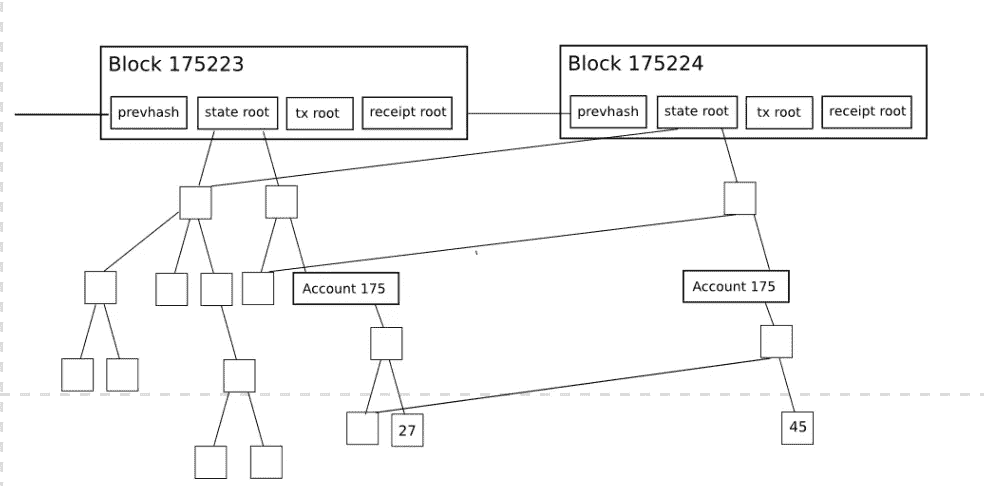*

*Ethereum*

*本质上，以太坊只是一个基于事务的状态机:我们从一个“起源状态”开始，并逐步执行事务以将其转换为某个最终状态。最终状态是我们所接受的以太世界当前状态的规范版本。*

*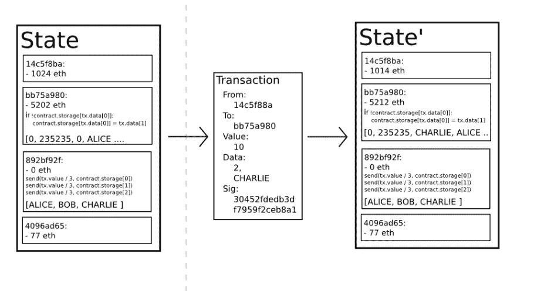*

*Ethereum transaction*

*虽然比特币是比特币区块链的内在令牌，但以太是以太坊区块链的内在令牌。*

*就像比特币一样，以太坊区块链包含类似交易的事件日志。用户使用“日志”互相发送以太网，矿工被激励在网络内验证和保护这些交易。*

*但它还可以超越这些——以太坊区块链可以充满来自任何种类的计算机程序的各种各样的事件信息。*

*让我们看看以太坊区块链背后的几个核心概念，以理解为什么这是可能的:*

## ***以太坊基础知识***

*首先是**账目。有两种类型的账户:外部所有账户和合同账户。两种帐户类型都有余额。***

*主要区别在于合同账户有一些相关的代码，而外部拥有的账户没有。因此，当执行相关代码时，契约帐户能够执行任何类型的计算。*

*接下来，我们有所谓的**事务，**事务是加密签名的数据包，存储从外部拥有的帐户发送到区块链上另一个帐户的消息。当交易被发送到合同账户时，与合同账户相关联的代码由每个节点上的“以太坊虚拟机(EVM)”执行(下面将详细描述)。*

*最后还有**条消息**。消息允许合约帐户相互调用。当一个合约账户向另一个合约账户发送消息时，与该账户相关联的代码被激活。从本质上讲，消息类似于交易，只不过它是由合约账户而不是外部账户产生的。*

**

*让我们快速解释一下“以太坊虚拟机(EVM)”的概念。还记得我们是如何得知比特币区块链的协议决定了网络交易如何得到验证的吗？在以太坊的例子中，参与以太坊网络的每个节点都运行 EVM 作为验证过程的一部分。*

*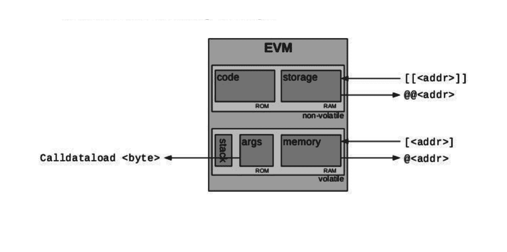*

*Source: Coinspace.io*

*假设我们有一组由一些外部账户启动的交易。这些累积到一个块中，然后以太坊网络中的节点遍历块中列出的事务，并在 EVM 中运行与这些事务相关的代码。值得注意的是，网络中的每个节点都运行代码并存储结果值。正如你可能猜到的，这往往是非常昂贵的计算。为了补偿这一开销并激励节点(或挖掘器)运行这些计算，挖掘器指定运行这些事务的费用。这笔费用被称为“汽油”(你可以在这里阅读更多关于汽油[)。这类似于比特币的收费方式，比特币交易的任何费用都归开采包含该交易的区块的矿商所有。](https://ethereum.stackexchange.com/questions/3/what-is-meant-by-the-term-gas)*

**

**注意:这是对以太坊区块链如何工作的高度描述，为了简洁起见，它当然跳过了很多细节。以后我会写更多有深度的文章。**

*最后，我们有以太坊的**编程语言**，用于编写可执行的分布式应用程序和契约。与比特币不同，以太坊的编程语言( [Solidity](http://solidity.readthedocs.io/en/latest/) 类似于 JavaScript， [Serpent](https://github.com/ethereum/wiki/wiki/Serpent) 类似于 Python)看起来不像机器代码。它具有程序员习惯使用的语言的表达能力和功能，如 JavaScript 或 Python。此外，它允许您做高级编程语言允许您做的任何事情。于是，就有了“[图灵全集](https://en.wikipedia.org/wiki/Turing_completeness)”。*

*所有这一切的关键是以太坊进入了密码世界，为我们提供了一个通用的框架，让我们可以更容易地在区块链上运行任何类型的代码。因为以太坊的语言是图灵完整的、有状态的和开发者友好的，所以希望开放区块链的好处，而不仅仅是实施一个特定的规则集(例如，数字货币如何转移)，并支持一个安全、开放、高度可用、自治、高效、可信和可靠的机制来构建任何规则集。这将使开发人员能够开发任何类型的应用程序。*

*在以太坊上构建非常简单的应用程序的一个例子是“[智能契约](https://en.wikipedia.org/wiki/Smart_contract)”。智能契约是一种分布式契约，用代码表示，基本上是说“如果发生这种情况，那么就这样做”。他们可以接受和存储以太网和数据，并可以将以太网发送到其他帐户甚至其他智能合同。就像常规合同(例如，财产租赁或雇佣协议)一样，它们用于与人或实体达成协议，但与常规合同不同，它们就像完全在区块链上运行的自主代理，将人排除在循环之外，使它们自动化、开放、安全且不可信。*

*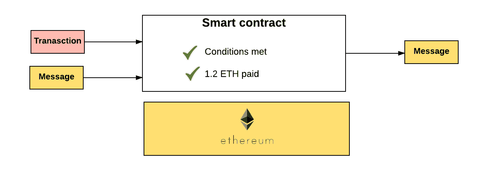*

*另一个应用程序的例子是一个分散的组织。分散式组织是一种基于智能合约中编码的规则运行的编程式组织。因此，与由人管理的组织的典型层级结构不同，分散式组织将其所有规则编码到智能合同中，然后完全由区块链管理。*

*尽管以太坊让我们现在在区块链上构建应用程序变得很容易，但让我们承认，我们大多数人，甚至包括我们这些密码爱好者，仍然生活在一个日常生活中不使用分散式应用程序的世界里。*

*这是为什么呢？

为了解释，让我们回到我之前的假设，为什么我们最终会遇到“应用在哪里”的问题，并看看以太坊是如何解决每个问题的。*

***问题#1:缺乏开发者友好性***

*如上所述，以太坊通过其富于表现力的编程语言和强大的开发工具解决了这个问题。*

***问题 2:建立网络效应很难***

*不管有没有以太坊，播种和旋转网络效应仍然是一个巨大的障碍。正如我们之前所说，取代已经建立了巨大网络效应的现有网络企业是非常困难的。如果有人建立了一个分散的 Airbnb，他们仍然需要说服平台的双方，用户和主机，加入进来。*

***问题#3:没有提供 10 倍的改进***

*我们之前了解到，除非在某些方面比现有的解决方案好 10 倍，否则大多数用户不会愿意切换到分散平台。*

*仅仅因为在以太坊上更容易构建一个去中心化的应用程序，并不意味着它能提供我们所寻求的 10 倍体验。因此，我们可能会问的问题是，我们是否仍然回到了起点？还困在战壕里吗？*

*不完全是。*

*因为尽管以太坊没有直接解决网络效应问题，也没有解决 10 倍问题，但它确实能够创建一套全新的应用程序，这在以前是不可能的。提高 10 倍的最清晰的方法是发明全新的东西。我相信以太坊通过简化智能合约的建立，使得发明全新的东西成为可能。*

# *协议、令牌和应用的兴起*

*为什么能够建立智能合同如此重要？*

## ***协议***

***嗯，能够在以太坊上轻松构建智能合约的好处在于，它使任何人都能够在以太坊上轻松构建新的协议。请记住，协议只是网络中节点传输信息时使用的一套规则。智能合同让我们能够做到这一点——在两方或多方之间创建一套自动化的可信规则。***

*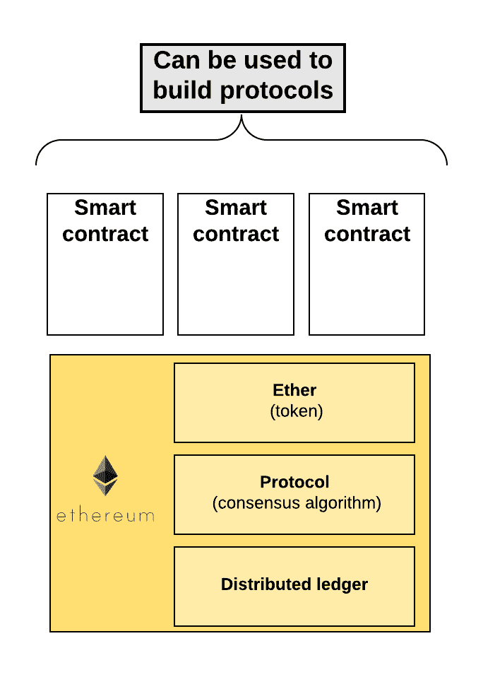*

*前面，我们提到了区块链协议如何具有与之相关的固有“令牌”，这是一种数字资产，可以在网络中的两个用户之间传输，而无需第三方的同意。在比特币区块链的情况下，固有令牌是比特币，在以太坊区块链的情况下，固有令牌是以太。*

*但是，仅仅因为以太坊和比特币区块链协议具有与其相关联的内在令牌来驱动网络，并不意味着使用智能合约构建在以太坊上的协议必须具有与其相关联的令牌。请记住，协议的目的只是为节点之间的通信指定规则。*

*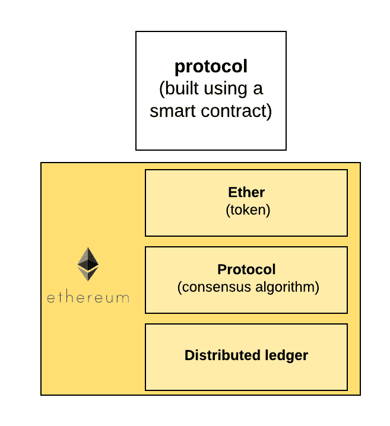*

*所以本质上，有两种协议:*

1.  *有一个内在的令牌与它相关联，有助于创造经济激励，推动网络*
2.  *没有驱动财务激励的令牌，仅用作节点之间的通信协议的协议(*注意:这些类型的协议仍然可以有与之相关联的令牌，例如代表网络中的成员资格、公开市场上的股份等。不同的是，它们不是用来推动某种经济激励的。)**

*由于没有更好的名称，我将把第一种称为“**加密令牌协议**”，第二种称为“**加密协议**”。*

*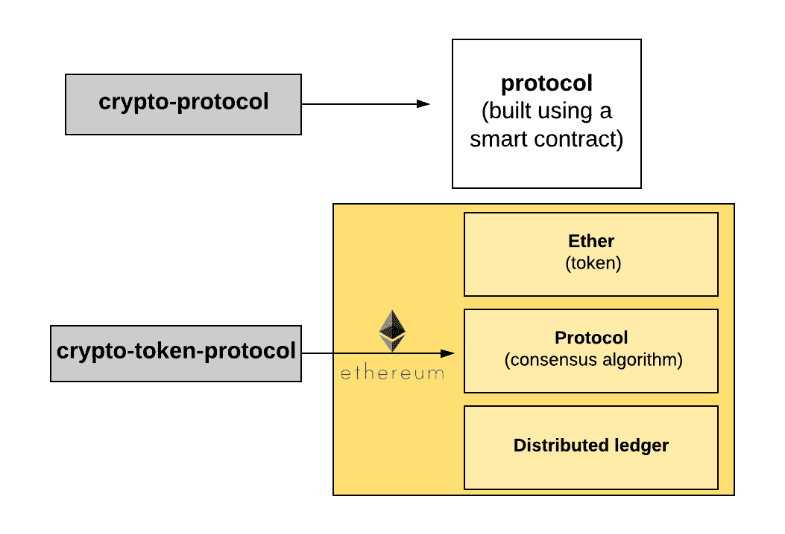*

## ***代币***

*现在谈谈代币。*

*就像以太坊使在其区块链之上构建新协议成为可能一样，它也使在其区块链之上使用智能合约构建新令牌成为可能。让我们称这些类型的令牌为“非内在令牌”。*

**

*关于这一点，广义地说，我们可以把代币系统想象成一个只有一次运算的数据库:从 A 中减去 X 个单位，给 B X 个单位，条件是:

(i) A 在交易
之前至少有 X 个单位(ii)交易得到 A 的批准*

*以太坊使得实现这样的令牌系统变得特别容易。更具体地说， [ERC20](https://github.com/bokkypoobah/TokenTrader/wiki/Supported-ERC20-Tokens) 令牌接口提供了一种标准化的方式来开发与现有以太坊生态系统(如开发工具、钱包和交易所)兼容的令牌。*

*此外，这些非内在令牌可以作为以下形式存在:*

1.  *基于以太坊的独立令牌(如上图所示)*
2.  *与建立在以太坊上的任何新的底层加密令牌协议相关联*
3.  *与建立在以太坊上的任何新的底层加密协议相关联*

*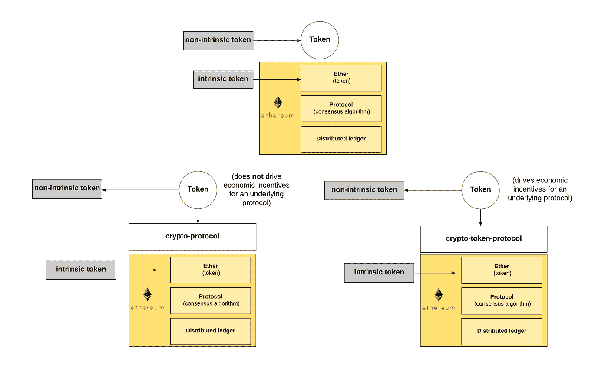*

*协议？代币？协议+令牌？为什么这很重要？

我们来看看。*

# ***代币销售(即“ICO”)***

*推出一种新的加密货币区块链并不容易——它需要大规模的自举努力，以汇集启动和运行所需的资源。但在以太坊的例子中，它的内在代币被用来提升他们的区块链——为了启动一个由开发者、矿工、投资者和其他利益相关者组成的大型网络，以太坊创造了一些以太代币，并向公众推出了这些代币的预售。然后，该公司利用这些资金开发了区块链。*

*以太坊并不是第一个这样做的。2013 年，当 [Ripple](https://ripple.com/) 开始开发其 Ripple 支付系统时，它创造了大约 1000 亿 XRP 代币，并出售这些代币来资助 Ripple 平台的开发。*

*这种通过象征性销售筹资的概念有时被称为“首次发行硬币”，或 ICO。但这种代币的结构可以有很大的不同(正如我们在上一节中看到的)，而术语“ICO”使它听起来更正式，更像一种投资证券，所以让我们坚持“代币销售”。*

*代币销售是指某一方以一定的价格向投资者提供一些新加密货币(即代币)单位，然后可以在以后与其他加密货币(即代币)交换。这个想法是投资者购买这些代币，代币的单位可以在加密货币交易所(如 Bitfinex、GDAX、Liqui 等)互换和转让。)如果对他们有需求。*

*虽然过去大多数代币销售仅限于构建新的加密货币(如以太坊、Ripple 等)，但以太坊的智能合约现在也使初创公司能够使用代币销售来资助基于现有区块链构建的各种**协议和应用**的开发。*

*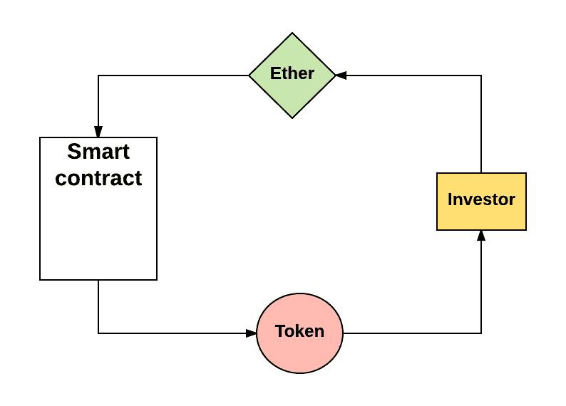*

*在继续之前，有一个重要的区别是应用程序和协议之间的区别。*

***应用与协议***

*一个应用程序可以建立在一个或多个协议上。一个例子是[auger](https://augur.net/)，这是一个基于两个协议的分散式预测市场应用程序:*

*   *分散 oracle 协议*
*   *交换协议*

*分散式 oracle 协议是一种“加密令牌协议”，它有财务激励来驱动网络使用 Augur 的信誉令牌( [REP](http://blog.augur.net/guide-to-augurs-rep/) )围绕现实世界事件的结果形成共识。另一方面，交换协议是“加密协议”,并且不具有与其相关联的令牌来驱动财务激励，而是在买方和卖方之间定义的一组规则，以便在彼此之间移动令牌。*

*但是这些协议都不需要绑定到一个应用程序上。理论上，任何应用程序都可以建立在这些底层协议之上。*

*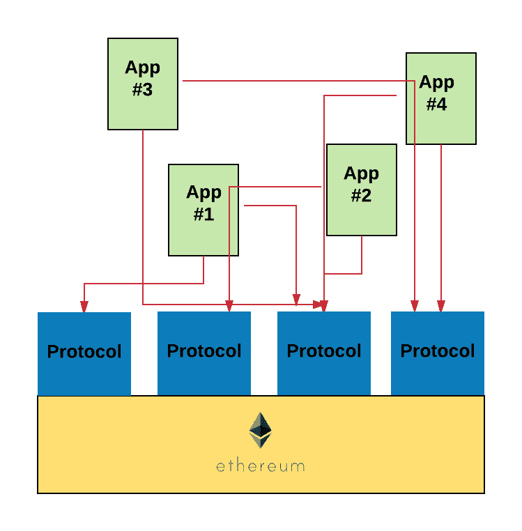*

***协议与应用的令牌销售***

*前面，我提到了如何使用令牌销售来推动新协议的开发和/或新应用程序的开发。

所以本质上，一个团队可以用代币销售来融资:*

*   *一个**区块链**(例如波纹)*
*   *一个建立在现有区块链之上的**加密令牌协议***
*   *一个建立在现有区块链之上的**加密协议***
*   *建立在**加密协议**之上的**应用***
*   *建立在**加密令牌协议**之上的**应用***
*   *建立在**加密协议**和**非加密令牌协议**之上的**应用***
*   *一个**应用***

*所以，几乎任何事情:)*

*最后一点很有趣，因为要进行代币销售，应用程序甚至不需要在协议下构建。我可以建立非营利组织，并使用代币作为资助项目的机制。从这个意义上来说，代币销售仅仅是为传统的集中式应用程序提供资金的一种新方式。一个普通的老集市。*

*投资者购买这些代币，然后会发生什么？*

*看情况。当令牌被绑定到 cryto-token-protocol 时，它们看起来更像以太和比特币等内在令牌，并用于驱动协议的开发和网络。但是当它们不是的时候，记号只是简单地表示更一般的东西。事实上，这些标记足够灵活，可以表示许多不同的事物。*

*例如，假设我想构建一个分散的存储服务。我可以使用智能合同建立一个存储协议，智能合同是存储提供商和他们的客户之间的协议，定义将存储什么数据以及以什么价格存储。*

*然后，我将为该协议构建一个令牌，并进行令牌销售。如果该协议被广泛使用，那么该协议将变得更有价值，这反过来会增加令牌的价值。此外，作为该服务的开发人员，我可以选择让令牌代表对应用程序中提供的服务的购买权。*

*值得注意的是，一般来说，创建令牌的机制非常灵活，它们可以表示许多不同的东西:*

*   *分散式应用程序中的付费积分/会员资格*
*   *分享利润和/或损失或资产和/或负债的权利*
*   *协议(或项目)的所有权或股权*
*   *公司的投票权*
*   *除了存在之外没有其他功能——只是一种可以在加密货币交易所自由交易的数字资产*
*   *等等..*

*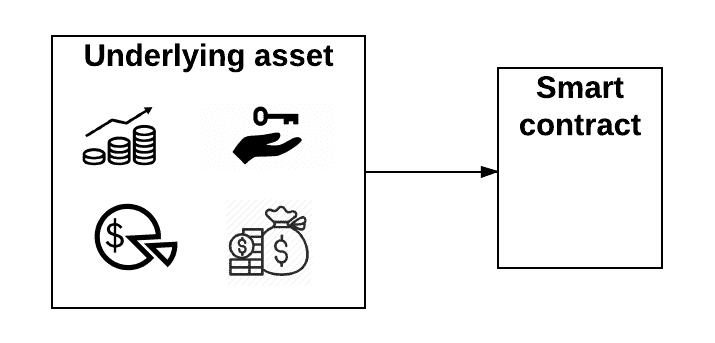*

*有几个项目通过象征性销售成功筹集了资金，包括 Augur、Antshares、Melonport、Gnosis、Antshare 等等。如果你想了解更多，我建议你阅读他们各自的白皮书。*

# *协议，代币，代币销售，现在怎么办？*

*我们正处于这样一个阶段，以太坊不仅使构建支持分散化应用的协议变得容易，而且也使构建网络变得容易。以太坊通过两种方式做到这一点:

**1 .钱***

*这个很明显。正如我们已经看到的，令牌销售现在使开发人员能够轻松地发布可交易的令牌，以筹集资金来构建协议和/或应用程序。使用这笔钱，团队可以选择投资于销售、营销等。来驱动网络。*

***2。用户***

*这是拼图中更有趣的一块。协议和分散应用可以通过使用令牌销售作为机制来获得早期贡献者和采纳者，从而解决网络效应问题。相信该协议或应用程序的早期采用者有购买令牌的动机，因为该令牌在未来可能更有价值。*

*所以本质上，令牌可以帮助引导早期采用者的网络，因为早期采用者和开发团队的动机完全一致。*

*假设您想要建立一个新的文件共享协议。你可以发起一次象征性的销售，通过它你可以获得一些对“买进”感兴趣的早期采纳者、投资者和企业家。他们可能只是猜测，或者他们可能真的相信这个产品。在这一点上，他们成为协议本身的利益相关者，并在财务上投资于协议的成功。然后，这些早期采用者中的一些人要么成为构建在协议之上的产品的用户，要么围绕协议本身构建产品和服务，以进一步推动协议的成功，从而增加他们的令牌的价值。随着协议的采用，它增加了令牌的价值，这进一步吸引了更多投资者、应用程序构建者和用户的更多关注，从而导致更多的应用程序，等等。*

*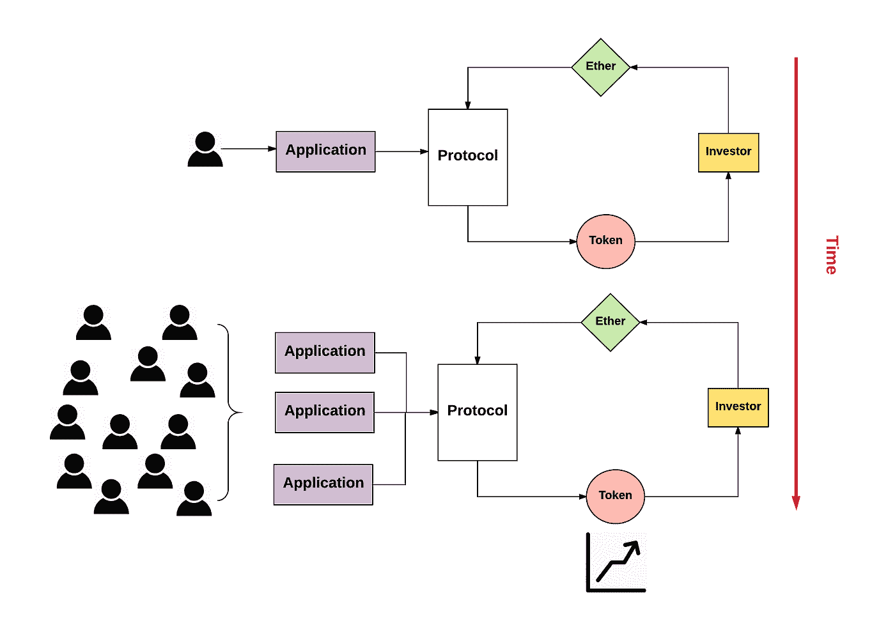*

*以太坊所做的是创建一个令人难以置信的灵活系统，在协议层和应用层进行创新。在未来几年，我们很可能会看到大量实验性和创新性的协议和应用被构建出来。其中很多都会失败，就像[很多创业公司失败](http://cdixon.org/2015/06/07/the-babe-ruth-effect-in-venture-capital/)一样。但随着时间的推移，一些核心协议和相关网络可能会成功推动主流采用。*

*最后，一旦协议开始成形和标准化，我们将会看到一个完整的分布式应用程序主机被构建在上面。*

*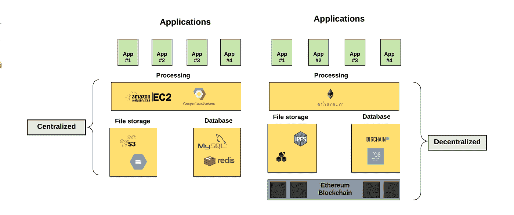*

# *这还不是一个快乐的结局*

*令牌销售为开发基于区块链的协议提供了动力，并进一步激发了开发人员在这些协议上构建应用程序的兴趣。*

*当然，这不是完美的大团圆结局。*

*首先，获得一群早期用户是不够的。你也需要努力工作来维持网络效应的增长，就像传统企业一样。这意味着投入数年的辛勤工作来构建一个有用的应用程序并推动其采用。*

***其次，我注意到的另一个趋势是，我们今天看到的大多数令牌销售都被用来推动围绕特定应用的网络效应，而不是开放和分散的协议。**由于令牌非常灵活，dApp 开发人员正在创建与 dApp 耦合的令牌，而不是可以在应用程序之间共享的标准化底层协议。这可能导致协议的碎片化。*

*第三，代币价值的最初增长主要是由投机驱动的(因为正在构建的平台需要一段时间才能变得有价值)。因此，很可能会有高波动性。目前还不清楚我们是否以及如何能够缓解这种情况，也不清楚我们是否能够找到一种机制，让代币价格随着时间的推移稳定下来。总的来说，随着时间的推移，围绕代币价值的可行性有很多悬而未决的问题。理想情况下，我们希望令牌的价值与协议或应用程序的价值联系在一起，就像上市公司的股票与发行它的公司联系在一起一样，或者代表某项服务的一些有价值的数字权利。但时至今日，这些代币的价值仍大多是猜测。*

*第四，代币销售市场目前存在令人难以置信的泡沫。因为证券法规很难将令牌(未注册的证券)作为股权出售(请记住，令牌可以代表任何东西，包括协议或应用程序中的股权)，所以开发人员没有这样做。相反，他们把它们组织成众筹销售。虽然有一些非常值得尊敬的项目以这种方式筹集急需的资本，而没有监管的麻烦，但也有一些长尾项目只是利用 ICO 市场的高需求筹集了数百万美元的资本，却没有什么回报——其中一些甚至被证明是彻头彻尾的骗局，在这个过程中携款潜逃。我们希望这些众筹销售有利于聚集在一起建立共同公益的人群，但不是骗子。我们如何实现这一目标？*

*除了这些问题之外，在代币销售成为一种可行的融资形式之前，仍有许多未解的问题需要解决:*

*   *象征性销售的正确[设计](http://vitalik.ca/general/2017/06/09/sales.html)和结构是什么？*
*   *在什么情况下，将代币作为投资证券有意义？这种代币销售应该如何监管？*
*   *个人投资者应该用什么标准来评估代币销售？(团队、商业模式等)*
*   *投资者如何保证销售过程以安全合法的方式进行管理？*
*   *是否需要有一种机制在令牌持有者之间分配公司清算价值的一部分？分红？*
*   *令牌持有者可以通过投票权来控制协议或应用程序吗？*
*   *资金筹集后，这些钱会怎么花？*
*   *投资者可以使用哪些指标来衡量构建协议或应用的团队对长期计划和愿景的信任度？*
*   *移植令牌的智能合约以直接使用以太网，而不是为每个协议创建一个新令牌，这样会更有效吗？*
*   *对投资者的收益或损失有什么税收影响？*
*   *如果出售代币成为创业公司筹集资本的新方式，传统风险投资家会发生什么？*
*   *…还有更多*

*如果你对这些问题感兴趣，你很幸运——我会在接下来的文章中写下其中的一些。*

# *结论*

*在这篇文章中，我尽了最大努力来阐述我对代币销售的观点，并从总体上澄清了围绕区块链开发的一些困惑。*

*谈论加密货币和区块链发展就像试图拍一张奔跑的猎豹的照片。这个空间正在以极快的速度移动，任何试图锁定它的努力都会导致画面模糊。无论如何，我仍然相信我们就加密货币主题教育更广泛的社区是很重要的。*

*如果你觉得我在这个演练中做了任何过分的假设，请在下面分享评论！我很乐意多谈谈，互相学习。*

*我们需要每个人的投入，以找出通向健康和可持续的加密经济未来的正确道路。*

*[](http://bit.ly/HackernoonFB)**[](https://goo.gl/k7XYbx)**[](https://goo.gl/4ofytp)*

> *[黑客中午](http://bit.ly/Hackernoon)是黑客如何开始他们的下午。我们是 [@AMI](http://bit.ly/atAMIatAMI) 家庭的一员。我们现在[接受投稿](http://bit.ly/hackernoonsubmission)并乐意[讨论广告&赞助](mailto:partners@amipublications.com)机会。*
> 
> *如果你喜欢这个故事，我们推荐你阅读我们的[最新科技故事](http://bit.ly/hackernoonlatestt)和[趋势科技故事](https://hackernoon.com/trending)。直到下一次，不要把世界的现实想当然！*

**