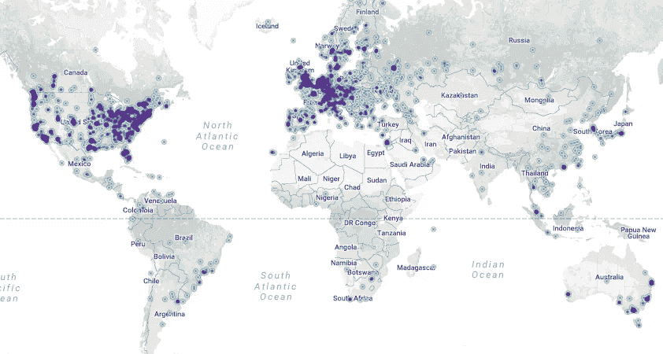

# 为什么比特币不是不可信的

> 原文：<https://medium.com/hackernoon/bitcoin-is-not-trustless-350ba0060fc9>

**加密货币存在信任问题。**

区块链传道者声称，随着比特币的出现，中央集权的当局和金融机构将很快过时。区块链技术将统治世界，腐败将被彻底根除。社会将变得“不可信”。

讽刺的是，绝大多数人*仍然不信任加密货币*。

福音派声称这些人不了解区块链背后的技术创新。(好像一堂关于共识协议的讲座就足以让某人放弃怀疑和储蓄账户。)

这里有一个花招:“有了比特币，你不再需要信任任何中央实体或任何交易对手。所以，比特币是不可信的。”所以因为我们不需要信任银行或与我们交易的人，根本就没有*信任？*

现实中，不信任比特币是完全合理的。因为比特币不是不可信的。事实上，比特币需要的信任远远超过美元。

加密货币的关键创新在于它们分散了信任。他们没有消除它。

# 没有不信任这回事

一切都需要信任。除了同义反复，你不可能不把你的信任*放在某个地方*去验证任何事情。

以科学为例。

科学中没有中央权威——它都是基于经验观察、公开出版物和分散的同行评议。听起来有点类似于区块链背后的原则。那么是“不可信”吗？

理论上，也许吧。但实际上，科学是建立在信任的基础上的。

想想阅读一项科学研究时所涉及的信任。如果你认真对待这项研究，你相信什么？

首先，你相信你正在阅读的文章[准确地报道了研究实际上所说的](http://journals.plos.org/plosmedicine/article?id=10.1371/journal.pmed.1001308)。你相信数据集和[统计数据是正确的](https://www.nature.com/articles/nn.2886)，因为你自己没有重新运行回归。你相信他们没有 [p-hack 他们的方式进入统计意义](https://en.wikipedia.org/wiki/Data_dredging)。你相信不会有更多的研究显示出完全相反的结果，也不会有更多的研究被扔进文件抽屉。你相信[这种方法是可重复的](https://en.wikipedia.org/wiki/Replication_crisis)，并且不会被简单到[实验者的性别](https://www.nytimes.com/2014/04/29/science/for-lab-rats-a-male-scientist-effect.html)或者所有[受试者都是大学生的事实](http://www.jakebowers.org/ITVExperiments/Sears%201986.pdf)所污染。你相信这些发现不是由行业基金或教授推动的，他们知道他们需要产生某种结果来推进他们的事业。当然，你相信研究人员不仅仅是完全捏造数据。

你信任科学，因为你把你的信任委托给了被称为“科学共识”的分散过程。这有时会奏效，但通常不会。科学不是不可信的。

但是你仍然有理由相信科学。你不信任科学，因为它是分散的、不可信的或诸如此类的东西。你信任它是因为，尽管有这么多问题，科学还是成功了。这比我们所知的推进人类知识的任何其他过程都要好。它为这种信任付出了极大的努力，现在科学在社会中占据了举足轻重的地位。

我们对科学的信任与它的去中心化是正交的。

那么加密货币呢？

# 对加密货币的信任

分散的加密货币意味着你不必信任一个中心政党。毕竟，比特币协议规定，每个节点都会存储每笔交易的记录，并亲自对所有事情进行双重检查。不需要信任，对吗？

Heat map of reachable Bitcoin nodes around the world ([https://bitnodes.earn.com/](https://bitnodes.earn.com/))

废话。信任并没有消失，只是分布在更多的当事人身上。那么现在信任在哪里呢？

几乎无处不在。

你相信开发人员不会开发出[漏洞百出或不安全的软件](https://bitcointechtalk.com/segwit2x-bugs-explained-8e0c286124bc)。你相信[矿工不会勾结](https://blog.acolyer.org/2017/12/07/be-selfish-and-avoid-dilemmas-fork-after-withholding-attacks-on-bitcoin/)。如果你没有运行一个完整节点(你很可能没有，世界上只有 10K 比特币完整节点)，那么你就是[明确信任你碰巧连接到](https://en.bitcoin.it/wiki/Clearing_Up_Misconceptions_About_Full_Nodes#Myth:_There_is_no_incentive_to_run_nodes_so_the_network_relies_on_altruism)的任何完整节点。你相信社区不会硬从你手中夺走。你相信[民族国家](http://fortune.com/2017/09/15/china-shutting-down-beijing-bitcoin-cryptocurrency-exchanges/)和企业不会停止采矿，或者[发动 51%的攻击](https://learncryptography.com/cryptocurrency/51-attack)。你相信市场没有被操纵(或者，如果市场被操纵，市场被操纵的情况对你有利)。你相信矿工和坏演员不会抢在你前面，不会让你悲伤，也不会攻击你使用的合同。你信任你的钱包软件[生成加密的安全密钥](https://www.theguardian.com/technology/2015/jun/01/bitcoin-app-critical-update-bug-crypto-breakdown)。您相信攻击者不会使用 [BGP 路由攻击](http://hackingdistributed.com/2017/05/01/bgp-attacks-on-btc/)来分割网络。你相信交易所会持有你的资产，而[不会](https://www.wired.com/2014/03/bitcoin-exchange/) [被](https://www.coindesk.com/cryptsy-bankruptcy-millions-bitcoin-stolen/) [黑](https://en.wikipedia.org/wiki/Bitfinex_hack)，或者[不会对你隐瞒。当然，您相信无论您如何存储您的加密货币，您的凭证都不会被盗。](https://blockonomi.com/mt-gox-hack#The_Mt_Gox_hack)

当然，在一个简化的对抗性模型中，你可以挥挥手扔掉所有的细节，加密货币具有优雅的安全属性。但在现实中，有一个巨大的信任海洋，填补了所有这些差距，你挥手离开。

工程学填补了这些空白。固体工程需要时间。大概有十多年的时间了。

尽管如此，在比特币诞生 9 年后，加密货币仍有许多挥之不去的未知。你相信共识协议实际上是正确的，并且没有任何[潜在的主要漏洞](https://bitcoinmagazine.com/articles/bitcoin-network-shaken-by-blockchain-fork-1363144448/)吗？你相信收费不会只是将[气球变成无法使用的](https://blockchain.info/charts/transaction-fees-usd)？你相信加密货币不会在[网络拥堵](https://blockchain.info/unconfirmed-transactions)下崩溃吗？你相信量子计算机不会出现并[破解所有的公钥密码学](/@hosseeb/this-is-not-entirely-correct-6f9a6304ea34)吗？你相信即使他们真的成功了，民族国家也不会意识到威胁并立即[复制](https://www.cnbc.com/2017/08/23/estonia-cryptocurrency-called-estcoin.html) [他们的](https://techcrunch.com/2017/10/15/russia-may-soon-issue-its-own-official-blockchain-based-currency-the-cryptoruble/) [成功](https://www.bloomberg.com/news/articles/2016-11-16/singapore-working-on-interbank-payments-blockchain-with-r3-dbs)，除了这次有地缘政治力量的支持？

不言而喻，美元比比特币需要更少的信任。没有人能打破美元，但一个有动机的民族国家或公司可以轻松操纵或摧毁比特币。他们可能会因此面临微不足道的后果。

这并不是说比特币很脆弱，或者你不应该使用它。这是一个美丽的协议，也是第一个解决双重花费问题的分散货币。

**但是工程就是权衡。**加密货币与法定货币进行不同的权衡。一个系统很少比另一个好，更多的时候，这是一个你选择什么优点和缺点的问题。

原则上，权力下放可以带来更强大的系统。但是很明显，比特币还没有做到这一点。

# 创新需要信任

事情是这样的。

加密货币需要大量的信任。**没事的**。在任何系统生命周期的早期，*当然需要信任*。这是一个实验。我们还处于早期阶段。

我相信加密货币是金融的未来。但如果加密货币赢了，那也不是因为它们“不可信”他们不是。**这将是因为他们更好**。他们必须比法定货币更好地解决实际问题。

如果加密货币获胜，那将是因为它们易于执行微观和宏观支付、全球可用性、更快的清算时间、更便宜的费用、不变性、可编程性以及通过智能合约实现高成本金融关系的非中介化和自动化的能力。

关于加密货币相对于法定货币的改进，请参见:

 [## 我们已经知道区块链的杀手级应用

### 就在不久前，硅谷还对加密货币嗤之以鼻。遍布山景城的咖啡店和…

hackernoon.com](https://hackernoon.com/we-already-know-blockchains-killer-apps-f2d443eba35) 

分散式协议是美妙而迷人的。但是权力下放本身并不会给你带来任何好处。信任是通过多年的良好工程赢得的，而不是通过协议设计或优雅的白皮书。

尽管主流关注的狂热，加密货币仍处于起步阶段。也许有一天它们会比菲亚特更强劲，但我们还有很长的路要走。

有一点是肯定的:加密货币已经在提出关于货币是什么的有力问题。加密货币不再是人们和民族国家之间的契约，而是让我们想象一下:如果货币系统是一个公共社区会怎么样？由每个人拥有、管理和治理？

这是一个激进的想法，也是过去 50 年中最迷人的金融创新之一。就想法而言，我认为这是一个很好的想法。

但是有风险。

不要让任何人说服你它不是。

> —Haseeb