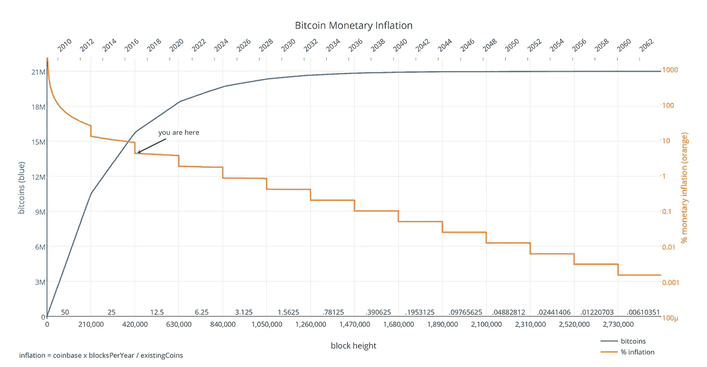
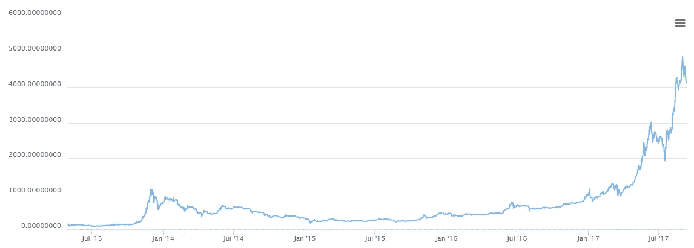

# 比特币:新黄金还是未来货币？

> 原文：<https://medium.com/hackernoon/bitcoin-the-new-gold-or-the-currency-of-the-future-48ec80496256>

*   比特币不是新的黄金，目前，我甚至不认为它是钱。
*   *往好里说，比特币目前是一种价值储存手段，往坏里说，是一种投机资产。*
*   *它未来的成功不可避免地取决于人们认同比特币基本理想的可能性:独立于我们当前的金融体系。*

# 介绍

你可能已经听说过比特币和加密货币。它最近被大肆炒作，结果导致市场上一片繁荣。

当我看到标题如下的文章时，我感到害怕:

*“比特币价格只能涨。”*

*“为什么比特币比黄金好。”当然还有*

*“你应该买比特币的 7 个理由，#6 会让你震惊。”*

因此，这篇文章旨在对比特币进行更平衡、更现实的审视。

我将首先探讨为什么加密货币会被“发明”出来。然后我会介绍比特币的优势和劣势。最后，我将批判性地审视手头的问题:比特币是新的黄金还是未来的货币？

# 这种炒作到底是怎么回事？

比特币是在分布式账本上转移和注册的数字货币。换句话说，它是一种加密货币。加密货币的想法已经存在很长时间了，但大多数人都不知道这个想法对一些人如此有吸引力的原因。

> *“我们已经有钱了，为什么还需要加密货币？”*

在我们的时代，加密货币的概念可能有意义，原因有很多。这些原因大多是对我们当前金融体系的批评的直接结果。以下是最常见的论点:

*   首先，大多数货币已经数字化了。经济学家估计，世界上只有 8%的货币以实物现金的形式存在。因此，加密货币和普通货币之间的差异并没有人们想象的那么大。区别在于控制和集权。
*   如今，银行记录着大多数人的余额。如果银行的服务器没有得到适当的保护，这就产生了中心故障点。对银行的信任是为了确保这种安全，但银行是由人经营的，而人远非完美——他们也不能免受道德风险的影响。
*   在我们目前的体系中，零售银行和投资银行没有分离。银行被允许参与客户资金的投资。他们只需要保留一小部分存款作为准备金。由于这种广泛使用的银行形式，客户要承受银行承担的风险。
*   围绕银行的中央集权也使得政府更容易通过审查来控制资金流动。专制政府大规模参与此类审查。我经常听到这样一种观点，即在法治强大的国家，这一因素应该被忽视。然而，审查制度在这里也不是闻所未闻。举个例子，万事达卡、维萨卡和贝宝开始阻止向维基解密捐款。这一封锁背后没有民主机构的合法决定。相反，我们只能假设存在这样做的政治压力。
*   尽管我们的货币系统是以银行为中心的，但没有一个统一的数据系统(或分类账)适用于所有银行。每家银行都在自己的系统中跟踪客户的余额和交易。相反，它们各自为此使用稍微不同的技术基础设施。因此，从一家银行向另一家银行汇款存在技术障碍，导致需要 SWIFT 系统等中间支付处理器。反过来，这导致高交易成本和延误。
*   此外，中央银行通过印刷钞票和改变利率来控制货币供应和市场供应。以[欧洲央行的量化宽松](https://www.theguardian.com/business/2015/jan/22/what-is-quantitative-easing)为例，它人为地将南欧国家债务的利息保持在低水平。通货膨胀在传统货币中是不可预测的，并且很可能继续下去，尽管人们努力保持通货膨胀的稳定。

尽管如此，加密货币最重要的*存在理由*是人们受够了当前的系统。他们受够了机构风险。受够了政府债务。厌倦了部分准备金银行和中央银行。大多数情况下，人们受够了金融危机，他们感受到了危机的后果，而引发危机的人似乎逃避了所有责任。

在大多数加密货币社区中，有一种观点认为，我们当前基于债务的社会将不可避免地崩溃——导致法定货币的大规模通货膨胀。人们害怕他们的钱会贬值，因为金本位已经被抛弃很久了。比特币提供了一种规避这种风险的方法。毫不奇怪，中本聪的比特币白皮书是在雷曼兄弟(Lehman Brothers)倒闭仅几天后发布的。

> “人们厌倦了当前的体系，比特币是一种逃避它的方式。”

基于上述所有原因，人们想要控制自己的钱并不是不可思议的。然而，没有多少人想把现金放在床垫下。就目前而言，我们需要银行，因为它们是最值得信赖的安全储存我们的钱的解决方案，我们已经设计了立法，让它们尽可能值得信赖。然而，如果人们可以把他们的信任放在其他地方，会发生什么？上面提到的所有风险都不适用的地方？

*插图 1:2011 年占领华尔街运动*

# 比特币是什么？

数字货币的概念早在 20 世纪 80 年代就有了，远在比特币之前。区块链和点对点系统在比特币之前就已经存在了。比特币带来的真正创新是工作证明共识机制，这使得比特币的区块链值得信赖。

根据中本聪的定义，[比特币是一种点对点支付系统。所有比特币的余额和交易都发生在同一个系统中:比特币的分布式区块链账本。因此，没有必要让中介方负责支付处理。交易直接在区块链上记录和执行。为了理解如何，我们必须了解区块链是什么。](https://bitcoin.org/bitcoin.pdf)

区块链是一个分布式数据库。它由充满数据的虚拟“块”组成。一旦一个块被事务性数据填满，它就被添加到链中，并且由于高级别的加密，它再也不能被改变。每个块都有一个时间戳，将它链接到最后一个块，这样就形成了一个链。存储在块中的数据将永远是区块链的一部分，并且由于先进的加密技术而完全不可改变。这种不变性使得区块链成为一个记录谁拥有什么的账本。

比特币的区块链总是包含所有用户的所有余额。它通过注册在其块中进行的所有事务来做到这一点。理论上，我们可以从比特币诞生的那一刻开始追溯比特币。

假设爱丽丝发给鲍勃 1 个比特币(Tx 1)。她建立交易并进行数字签名。交易数据和她的数字签名一起被注册为块的 [merkle 树](https://brilliant.org/wiki/merkle-tree/)中的散列(Hash0)。merkle 树只是一种数据结构，可以轻松地包含所有事务，而不会占用太多空间。

merkle 树的根包含在块 11 中，并且将永远是链的一部分。为了验证该事务已经发生，可以检查区块链中的块 11，然后在 merkle 树中找到从 Alice 到 Bob 的 1 BTC 的事务。

*插图 2:区块链的可视化*

为了正确验证该交易是否发生过，区块链必须是公开可用且可信的。为此，全世界的大量计算机(节点)存储并提供整个区块链的完整和最新副本。这些相同的节点通过称为工作证明的一致协议来验证交易是否有效，从而使网络安全。

# 比特币的优势

在比特币中，没有必要把你的钱托付给第三方。换句话说，比特币就是 [**【不可信】**](https://steemit.com/technology/@jacor/trustless-what-does-it-mean-in-laymen-s-terms) **。**所有交易均由区块链本身执行。在资金的发送方和接收方之间没有其他方。

如上所述，比特币是去中心化的。这种**去中心化让比特币变得极其安全**。跟踪你的余额的账本被安全地保存在数千个节点上，而不是一个集中的服务器上。换句话说，恶意的一方将不得不同时攻击数千台计算机，而不是一台服务器。

比特币的去中心化也使得**不可能审查**比特币网络上的交易。这是因为要做到这一点，政府必须说服比特币全球网络中 51%的计算机不允许某个区块进行某种交易。

而且，比特币**做跨境交易**非常有用。传统的支付处理平均需要 3 到 5 天，而比特币需要 10 分钟才能得到确认。这样做的交易费用也大大降低，这使得比特币对于汇款非常有用。

比特币的另一个优势是它的**通货膨胀是 100%可预测的**。只有 2100 万枚比特币将被创造出来，目前约有 1650 万枚在流通。新的比特币通过块奖励引入市场。矿工(向链中添加区块的节点)目前每添加一个区块可以获得 12.5 个比特币。这种奖励会定期减少，直到 2140 年，之后矿工只收到一个区块所有交易的交易成本作为奖励。

*插图 3:Cointelegraph.com 的《随着时间的推移比特币货币膨胀和区块回报》*

最后，经常有人争论比特币是匿名的。我认为事实并非如此，因为我们可以追踪在区块链发生的所有交易。然而，要知道谁真正进行了交易，人们必须能够将“发送钱包”与身份联系起来，这可能证明是困难的。然而，这将使比特币 [**【假名】**](https://bitcoinmagazine.com/articles/is-bitcoin-anonymous-a-complete-beginner-s-guide-1447875283/) 充其量。

# 比特币的弱点

尽管比特币被设计成去中心化的，但在实践中，由于采矿的**中心化**，情况并非如此。采矿(通过解决难题将新区块添加到链中的过程)变得越来越困难，区块链变得越来越大，使得普通用户不可能开采区块。随着采矿变得越来越困难，而能源成本保持不变，只有拥有大量资金来支付 GPU 和电力成本的大公司才能盈利。集中化导致审查和矿业卡特尔的风险增加(51%的攻击)。

比特币的**交易能力**远不及 VISA/SWIFT 等系统。目前，最大容量大约是每秒 3 个事务。目前，比特币社区对如何改善这一点存在巨大分歧。然而，就解决方案达成一致很困难，因为对矿商和用户的激励并不完全一致。矿商不关心集中化，只是希望网络上有更多的交易，这样他们就能收到更多的交易费。他们应对网络使用增加的解决方案是增加块的大小，以便可以容纳更多的事务。另一方面，用户和开发人员担心这会导致更多的集中化，因为更大的块会使区块链的千兆字节大小增加得更快。这反过来会让用户更难运行他们自己的完整节点。相反，他们认为其他技术解决方案(SegWit、Lightning Network 等。)也有可能解决网络的容量问题。

无论你支持辩论的哪一方，很明显比特币正在处理**治理问题。**事实上，有多种方法可以尝试和改变网络，这增加了问题的严重性。“大块”阵营甚至通过所谓的**硬分叉，分化出一种叫做比特币现金的新区块链。**换句话说，在 8 月 1 日的某个区块，一部分矿工复制了区块链，并开始在上面开采更大的区块。现在，两个链都在运行，并且有两个不同的比特币。

把它想象成你的欧元分成欧元和“欧元现金”。您可以保留您的欧元，同时也可以获得相同数量的欧元现金。虽然这看起来是一笔不错的交易，但这显然会造成困难。在这之后，你原来的欧元还会一样值钱吗？人们会接受你的“欧元现金”作为支付方式吗？

# 比特币是货币吗？

要回答这个问题，我们首先要知道钱是什么。

发明货币是为了让商品和服务的交易变得更容易。没有它，任何购买都需要用其他商品或服务作为回报。要发挥功能，货币必须具备三个内在品质。让我们看看比特币是否符合这些标准。

## 1.货币必须是一种交换媒介:它必须允许作为商品和服务交换的对价

比特币可以作为交换商品或服务的对价。然而，商店实际接受比特币作为支付的金额仍然极低。市场渗透率很低。事实上，在比特币网络的所有交易中，只有极小一部分是作为交易媒介实际使用的。绝大多数交易是由价格投机构成的。

## 2.货币必须充当记账单位:它必须充当相对价值的标准。

作为一种记账单位，比特币比法定货币更有优势。两者都有一个价值标准，每个人在特定的日期和时间都认同这个标准。但是，比特币的可分性更强。一欧元的最小单位是一欧分，而比特币的最小单位是 1 先令(1 先令等于 0.00000001 BTC，在本文撰写之时相当于 0.0000325073€)。

你可能不明白为什么这很重要，因为你从来不买低于 1 美分的商品或服务。但是由于区块链，这种情况在未来可能会改变。

想象一下，出售一个物联网设备收集的一个人的数据。或者想象一下，当你阅读一篇新闻文章时，你会自动付钱给它的作者。微交易在未来将发挥更大的作用，这是非常合理的。

## 3.货币必须起到价值储存的作用:它必须考虑到储蓄。

这既是比特币争论最多的，也是最有趣的属性。如果你认为价值储存应该是价值稳定的，比特币肯定不符合标准。它的价值非常不稳定。6 月 12 日至 7 月 16 日期间，比特币价值缩水超过三分之一。然而，在更大的范围内，比特币只是升值了。事实上，自诞生以来，它一直是世界上最好的价值储存手段。2011 年€100 的比特币现在价值接近€160 万。然而，过去的成果并不能保证未来。

*插图 4:比特币的价格历史。摘自 coinmarketcap.com*

*比特币也是钱吗？*

如果你问我，我不会。

它很少被用作交换媒介，因为它作为支付手段还没有被广泛接受。大多数交易都是投机性质的。此外，比特币的价值目前太不稳定，不能作为货币使用，因为它不是一种可靠的价值储存手段。

# 比特币是新的黄金吗？

很多人认为比特币将成为经济不确定性的有效对冲工具。“比特币是新的黄金”这样的断言在某个时候出现在几乎所有金融媒体的头版。而且这种说法也有一定的道理。比特币绝对是逃避恶性通货膨胀的好方法。比特币的价格和主流资产类别的价格之间存在相对较小的相关性，这也是事实。然而，黄金和比特币有一个重要区别:黄金具有内在价值。比特币没有。一枚比特币现在大约值 4000 美元，因为我们认为它值 4000 美元。如果有一天所有人都认为比特币一文不值，那就是事实。有些人可能会说黄金也是如此，但还是有区别的:

*   黄金有着良好的记录——几千年来，我们一直相信黄金的价值。
*   黄金可用于珠宝、电子芯片制造等。

所以说比特币是新的黄金是幼稚的。比特币的价值没有经过时间的检验，它没有内在价值。认为比特币的内在价值存在于底层技术优势中的人显然是错误的，因为这项技术很容易复制。然而，比特币的基本理念将使其在全球经济低迷时期成为一种可能的对冲工具。在一切都付诸东流的情况下，比特币最有可能繁荣发展。

# 最后

*那么，比特币是未来的货币还是新的黄金？*

只有时间能证明一切。

还是那句话，只要比特币不作为货币使用，我个人就不会认为它是货币。比特币网络目前完全无法处理每秒高数量的交易。这项技术仍处于早期发展阶段，应该这样理解。目前，比特币充其量只是一种价值储存手段。在最坏的情况下，它只是一种投机资产。

> “目前，比特币充其量只是一种价值储存手段。在最坏的情况下，它只是一种投机资产。”

这并不是说比特币永远不会成为未来的货币。如果有足够多的人开始采用比特币交易，网络效应可能会完成剩余的工作。我无法猜测这种情况发生的可能性。然而，我确实认为，这种可能性将不可避免地取决于人们认同比特币的基本理想的可能性:独立于当前的金融体系。因此，看看下一次金融危机期间比特币会发生什么将是非常有趣的。比特币永远不会取代黄金，但可能会成为抵御经济不确定性的更具波动性的对冲工具。

如果你读到这里，我希望你发现上面的信息很有价值。*尽管密码货币的未来很有趣，但区块链允许更广泛的应用。有很多很多的可能性。*

*在我的下一篇文章中，我将进一步探讨这个问题。我将研究智能合同、首次硬币发行和分散式自治组织的潜力。这些概念支持更多的用例，并且很可能对我们的整体经济产生更大的影响。*