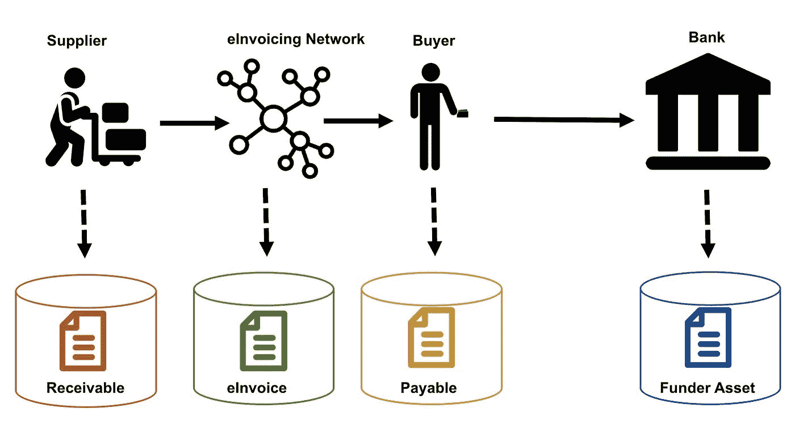
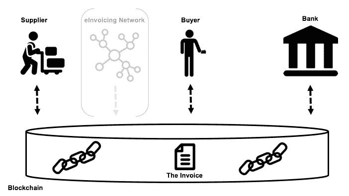

# 区块链第一

> 原文：<https://medium.com/hackernoon/blockchain-first-1bdbe39d7778>

你还记得诺基亚和 RIM(当年的黑莓制造商)忽视真正智能手机的出现，尤其是第一代 iPhone 的日子吗？这一点在 RIM 公司首席执行官拉扎里迪斯先生的著名遗言中显而易见:“没关系，我们会好起来的”。历史清楚地向我们展示了接下来发生的事情——RIM/黑莓和诺基亚都退出了手机业务。但这篇文章并不是关于手机行业是如何被颠覆的，也不是关于创新者的困境是如何以教科书的形式出现的。你可以在克莱·克里斯滕森的《T2》作品《T3》中读到更多细节和准确性。

然而，我想把手机制造商行业作为我们今天所看到的与另一种技术的比较和类比，这种技术仍处于起步阶段，经常被现任者忽视甚至嘲笑。我说的技术，你从题目就猜到了😀，就是区块链。分布式账本技术最初是作为比特币的技术基础引入的(作为区块链的第一个应用程序)，现在被数百家甚至数千家初创公司、项目和财团使用。我不会解释什么是区块链，因为在其他地方[有很多精彩的解释](https://www-01.ibm.com/common/ssi/cgi-bin/ssialias?htmlfid=XIM12354USEN)。

那么这个区块链的东西和手机有什么关系呢？表面上看，很明显，不是很多。或者准确的说，什么都没有。然而，在我看来，这两种技术经历的(对于智能手机)和可能将要经历的(对于区块链)非常相似。让我解释一下。

21 世纪初，在 iPhone 问世的近七年前，手机上的“上网”技术变得有些流行。其中之一是 WAP(无线接入协议)，它允许移动用户通过他们的手机访问网络内容。它既不美观也不实用，但它是从一项非常成功的技术(WWW)到移动电话的桥梁。尽管如此，绝大多数网络是为运行在桌面上的传统浏览器构建的，在某些情况下，早期采用者可以通过手机访问这些应用及其内容。这是一个开始。step 之后不久，第一个“真正的”应用程序开始在一些手机上出现。例如，J2ME 应用程序。这在某种程度上是一种改进，但是部署和使用起来仍然很麻烦。在那些有点笨拙的将内容和应用程序引入手机的解决方案之后，苹果在 2008 年通过 App Store 推出了第一批真正的应用程序。开发者开始为 iPhone 开发专门的优化应用，并拥有苹果的分销渠道。用户界面和整个体验看起来与电脑浏览器不同——它们针对屏幕尺寸、电池寿命、有限的互联网接入、触摸屏功能等进行了优化。尽管如此，那些早期的移动应用程序是对他们的老大哥浏览器/网络应用程序的事后反思。

2009 年前后，一种新的设计方式开始流行:*移动先行。这意味着移动应用程序现在是为智能手机从头开始开发的。在许多情况下，移动体验是在开发或启动传统的网络应用程序之前就出现了。这是我想与我们今天看到的区块链世界进行比较的地方。这就是我认为区块链在未来几年的发展方向:区块链优先的方法。*

*让我们以*企业*区块链和企业软件空间为例来阐述。我用这个作为比较，因为首先，这是我的专业领域，其次，这个比较在这个行业中是最清晰和最先进的。*

*最大的咨询公司[将](https://www.fool.com/investing/2016/11/10/why-ibm-is-betting-big-on-blockchain.aspx) [数百万](http://www.ictspring.com/deloitte-announces-multi-million-investment-blockchain-lab/)投入该领域，以便利用分布式账本技术来减少供应链中的低效。优化采购到支付(P2P)流程(公司如何购买商品、接收商品和服务并为其付款)是重点关注的领域之一。这个想法是通过一个共享的分类帐为 P2P 过程的所有参与者(买家和他们的供应商)提供访问权限。此外，流程规则、逻辑和检查都被编码到智能契约中，它们也存在于链中。这极大地降低了当今劳动密集型流程对所有相关人员的低效性。*

*企业使用区块链的其他例子包括发票融资、供应链金融、保理或发票贴现。本质上，利用区块链作为可由第三方出资的金融资产的记录。区块链提供了优于现有系统的明显优势，并降低了这些融资交易中涉及的风险。这意味着融资成本更低，并导致更好的融资提议。*

*企业领域中的这些例子有什么共同点？这些用例的数据源总是第三方系统。有时是一个，通常(因此更糟)是多个系统。数据总是来源于区块链之外，被转移到分类账并在那里进行处理。通常，它随后会被复制到另一个外部系统中。*

*为了说明这一点，让我们看一下从供应公司 A 向其客户 b 发送发票的流程。在公司 A 的计费系统中有一个版本的发票(“应收款”)，在接收客户的会计或 ERP 系统中有一个版本的发票(“应付款”)。通常，中间人服务用于提交/转移发票(如供应商网络或 EDI /电子发票提供商),它将发票的表示存储在数据库中。如果该发票随后被金融机构融资(“提前付费”)，则该单据的第四个表示存储在银行或保理公司的环境中。现在，我们有多达四个不同版本的相同文件，一个发票交易。然后，这些记录中的每一个都相互独立地被更改、调整、取消等。很多时候，所有的数据只是“不同步”。这造成了巨大的效率低下，增加了投资者的风险。因此，这一流程的所有参与者的成本都在上升。这就是为什么目前使用一个单一的真相来源，一个区块链，看起来确实是好主意。一个位置，一个有效的文档，每个人都可以访问相同的版本。但是，即使每个人都指向共享分类账，我们仍然有一个问题，即现有的遗留系统在自己的数据库中保存自己的副本。除了区块链上的发票，这些系统还会产生大量副本。现在用哪一个作为「真理之源」？使用分布式账本让各方访问“共享流程”的共同真相来源已经解决了一些问题，但每个人仍然保留本地记录，并再次将他们的本地状态与区块链进行推送/拉取和同步。*

**

*区块链优先的方法将很快在许多业务流程中成为现实。应用程序将被设计为所有的业务逻辑和数据存储主要发生在区块链上。所有其他系统和参与者都可以访问这个逻辑和数据，并将必要的对象镜像回他们的系统。例如，一个会计系统的所有帐户和业务逻辑都在一个链上。当供应商生成发票时，它首先在链上创建，购买组织从区块链读取该发票，以在他们自己的 ERP 系统中进行进一步处理。所有涉及的应用程序都同意，只有区块链上的更新对进一步处理(如为发票融资)有效。这样，就不再有应收账款或应付账款了。应收账款和应付账款成为同一笔交易。区块链上有一个唯一的发票，所有授权方都可以看到和访问。再举一个常见且充满冲突的业务流程的例子，由一个系统创建的*采购订单*被发送给供应商，在那里它被表示为*销售订单*变得相同:只是一个订单，表示为智能合同，其中嵌入了各方同意的所有业务逻辑。*

**

*这就是我看到的与移动世界惊人的相似之处。一开始是一句“让我们除了桌面还做移动”，堪比“让我们用一个区块链作为不可改变的备份”。我们现在正进入区块链第一世界，这也与智能手机世界非常相似，智能手机世界现在将新技术和范式视为主要考虑因素，而不是次要的设计方面。*

*智能手机上的许多应用程序现在都遵循“仅移动”的方法(Snapchat、N26、Tinder 等)，这是因为易于使用，也是因为手机的卓越功能(传感器、位置跟踪、相机、移动性等)。).*

*让我们猜猜什么时候我们会看到一场“只支持区块链”的运动！*