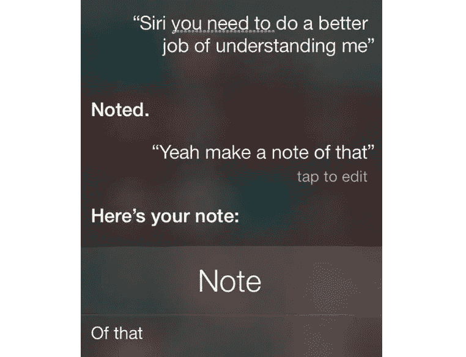
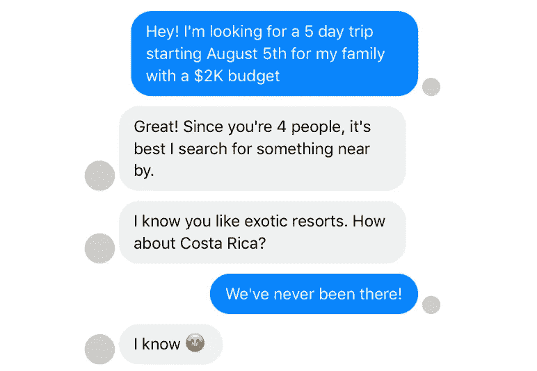
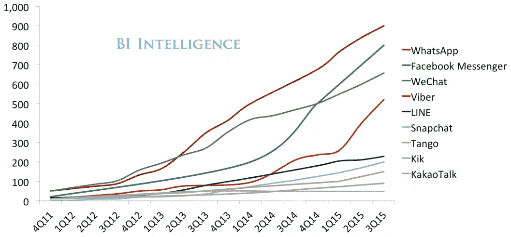

# 机器人已经存在了。以下是四个原因。

> 原文：<https://medium.com/hackernoon/bots-are-here-to-stay-here-are-4-reasons-why-caaec6bf5be3>

## 机器人仍处于早期阶段，但它们存在的理由很充分。

在过去的几年里，我一直致力于学习、设计、构建和写作聊天机器人。总的来说，聊天机器人吸引我和对话界面的主要原因是因为它们提供了人类与机器互动的最自然的方式。不仅交互自然，而且简单、干净，并专注于您即时需要的内容。想想谷歌的搜索界面。你所能做的就是在一个小文本框中输入搜索查询。接下来的一切都是魔法。

由于几个因素，聊天机器人仍处于非常早期的阶段:

**1。聊天机器人能做的和用户期望的之间缺乏期望**(或者换句话说，糟糕的用户体验)。这导致了瞬间的失望，从而降低了可用性。它从 Siri 等最大的机器人开始，一直到基本的机器人，这些机器人让用户对它们的实际能力感到困惑。理论上，Siri 声称她可以做几乎任何与你的 iPhone 设备、日历和其他苹果内部应用程序相关的事情。

事实上，你问 Siri 的问题有超过 60%是不被理解的，或者会出现在一般的网络搜索结果中。只是为了让你知道她能做什么，这里有一个 Siri 命令的[列表。你知道她能做大部分吗？我以前不知道。](https://www.cnet.com/how-to/the-complete-list-of-siri-commands/)

**2。教育用户创造新习惯的限制。我制作的最后一个机器人完全专注于对话，因此没有任何按钮或菜单。保留率很低，尽管事实上机器人和用户之间的大部分对话都是成功的。我发现，我添加的按钮和菜单越多，记忆就越长。[swell ly](http://swelly.biz)是一个成功的机器人用最少的对话和最多的按钮的伟大例子。**

这种行为让我得出结论，大多数用户仍然不习惯自然地与机器交谈，而是更喜欢像过去 30 年那样点击按钮。其次，点击按钮比键入句子更快。然而，按钮并不比语音快，这就是为什么我相信语音最终将主导机器人领域。从按钮到自然对话的转变正在增长，但仍处于早期采用阶段。

**3。人工智能可能已经有所改善，但仍处于起步阶段。**这是最后一个而不是第一个原因，因为我真的相信我们可以用今天的人工智能解决方案(如 Api.ai、Wit.ai 等)构建伟大的聊天机器人。)如果机器人更专注于如何创造用户习惯，并提供符合用户期望的精心设计的用户体验。

你可以在我之前写的关于[如何用三个简单的步骤](http://www.assafelovic.com/blog/2017/4/14/how-to-improve-your-chatbot-in-3-simple-steps)提高你的聊天机器人的文章中读到更多关于如何做到这一点的内容。显然，随着越来越多的数据在多个领域被收集和训练，人工智能只会随着时间的推移而改进。

出于以上种种原因，我们还远远没有看到聊天机器人的真正潜力。然而，以下是聊天机器人存在并将随着时间的推移呈指数增长的有力理由:

# 1.最佳的人机交互

如果你想一想，在过去的 30 年里，我们学会了调整自己以适应机器的复杂性和局限性。这种调整是通过网站、应用程序、按钮、图标等进行的。但在我看来，最佳场景应该恰恰相反——无论是从自然语言理解的角度还是从个性化的角度，机器都应该能够根据我们人类来调整自己。

人类应该能够自然地向机器提出任何要求，而不是必须为他们需要的每项服务学习新的界面、产品和习惯。

例如，假设你想知道天气。直到最近，你还不得不从众多选择中找到并挑选一个你所选择的服务，并学习如何在功能上使用它。现在，由于每个服务都试图创新并与它的替代品不同，这通常会导致不同的 UX/用户界面，这意味着用户需要更多的学习和努力。最佳解决方案是你可以直接问。谢天谢地，现在有很多很棒的天气助手解决方案(比如 Siri 或者 [Poncho](https://poncho.is/) )，其他领域还会有更多。

# 2.特定领域人工智能

不久前，公司建立了虚拟助手，他们试图变得非常广泛和开放，但很快意识到理解自然语言和上下文是多么困难。回到 Siri 的例子，苹果试图占领许多领域，将 Siri 展示为终极个人助理。这个野心很快就失败了。另一方面，成功的人工智能解决方案是那些狭隘地专注于一个特定领域的解决方案。

以 [Getdango](http://getdango.com/) 为例——一个预测表情符号的人工智能解决方案。他们在基于自然语言预测表情符号方面做得很好，这是因为他们的关注点很窄。另一个例子是 [x.ai](https://x.ai) ，一个通过电子邮件为团队安排日程的助手。X.ai 有一个名为 Amy 的虚拟助手，致力于提供尽可能轻松地安排事件的最佳解决方案。

个体机器人专注于特定领域的协同作用的力量是解决更大人工智能挑战的正确方法。你可以看到一些公司正朝着这个方向发展，比如 FB Messenger 最新发布的[移交协议](https://developers.facebook.com/docs/messenger-platform/handover-protocol)，它可以让两个或更多的应用程序进行协作。更重要的是，[亚马逊与微软](https://www.theverge.com/2017/8/30/16224876/microsoft-amazon-cortana-alexa-partnership)合作，在 Cortana 的帮助下在 Alexa 上合作，提供更强大的虚拟助手。如果每个机器人都专注于一个特定的领域，那么整个人工智能竞赛将会更快、更有效地得到解决。令人高兴的是，这正是我们前进的方向。

# 3.长期关系的力量

当今大多数产品的设计方式是在用户进入应用程序后，最大化他们的短期价值。虽然网络和移动应用程序关注的是短期价值，但机器人可以也应该关注长期价值。Bot 开发人员应该关注他们的 bot 如何随着时间的推移与用户建立关系，以便在每次交互中获得并不断增长价值。随着时间的推移，机器人应该足够了解他们需要什么，以最大化和个性化用户体验，并最小化输入摩擦。

例如，假设你正在寻找一个旅游规划服务。你今天要做的，就是浏览旅游网站，填写适当的表格，并且每次都告诉网站你的偏好和过滤器。机器人的工作方式应该是知道哪些信息与了解用户相关，比如个人信息、偏好、预算、用户已经去过的地方等等。机器人应该不断从用户的行为中学习，并提供更加个性化的响应。

一段时间后，您与这种机器人对话的最佳方式如下:

一段时间后，机器人应该知道你家里有多少人，他们的年龄，你已经去过哪里，你现在在哪里，你喜欢做什么，你不喜欢什么等等。换句话说，这个机器人应该和真正的旅行社没有任何区别。

为了了解用户愿意在对话中分享多少个人信息，我用我的一个机器人进行了一项研究。这个机器人开始问用户一些基本的问题，比如“你多大了”，以及一些更私人的问题，比如“你最不安全的是什么？”。猜猜总共有多少用户如实回答了所有问题？…超过 85%。更具体地说，89%的女性如实回答了所有问题，而“只有”81%的男性回答了所有问题。

所以如果你是一个机器人开发者，不要担心用户不分享他们的信息。考虑你应该问什么问题来提高用户的长期价值。这种信息检索在今天的应用程序中很难实现，聊天机器人在这方面有着巨大的优势。

# 4.跨平台可用性

短短几年间，移动应用已经成为智能手机用户的必备应用。但是，根据尼尔森最近的一份报告，尽管应用程序的使用和应用程序的选择增加了，但每个用户使用的应用程序数量却保持不变。大多数人都厌倦了下载移动应用程序和学习如何使用新界面。

此外，研究表明，美国公民平均拥有 3.6 台联网设备。这些设备可以从移动设备到智能电视和亚马逊 Alexa 这样的产品。连接的设备太多了！显然，用户希望在他们使用的任何设备上与你的服务互动。但是你会怎么做呢？为 iOS、Android、智能电视、Alexa、智能手表、iPad、Windows 和 Mac 等构建应用程序？听起来工作量很大。首先，你很难让用户下载你的应用，因为他们已经被其他应用淹没了。

这一不断增长的挑战正是消息平台的魅力所在。目前，大约 75%的智能手机用户使用一些消息应用程序，如 WhatsApp、微信、Facebook Messenger 等。

哦，我们说话这会儿统计数据还在增长:

全世界有超过 12 亿人在他们的设备上使用 Messenger，所有拥有移动设备的人都有 SMS，显然，大多数人都有电子邮件帐户。这样的例子不胜枚举。

与其构建应用程序和花费数十万美元，不如专注于构建你的机器人后端。对于前端，只需将您的机器人集成到用户设备上已经存在的多个消息平台上，就万事俱备了。你的服务带来价值，用户就会来。更重要的是，这是用户想要的。

聊天机器人的未来和成功不仅取决于大型科技公司，还取决于继续创新并推动人工智能和对话界面边界的开发者和企业家。这个部门目前的大多数错误都是明天的改进和解决方案。最终，机器人将带来当今应用程序无法实现的巨大价值。

要了解更多关于聊天机器人的信息，请阅读[聊天机器人初学者指南](http://www.assafelovic.com/blog/2016/7/11/chatbots-the-beginners-guide)。如果你想开始建造一个，阅读这篇关于[如何开发 Facebook Messenger bot](http://www.assafelovic.com/blog/2016/9/11/how-to-develop-a-fb-msg-bot) 的文章。

*如果你喜欢这首曲子，请鼓掌👏🏻！你也可以在网上的某个地方分享，这样其他人也可以阅读。*