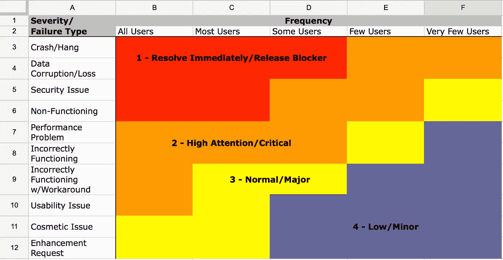

# bug 和优先级

> 原文：<https://medium.com/hackernoon/bugs-priority-3b5cf5f6aadd>

以任何规模、任何时间表编写[软件](https://hackernoon.com/tagged/software)意味着你已经加入了[权衡的世界](https://hackernoon.com/tagged/tradeoffs)。这并不是一件坏事，事实上，这是每天有多少组织完成他们的工作。然而，通常情况下，做出权衡的标准并不明确，如果所有相关人员都不理解，这可能是有害的。

Some Standard Priorities In [Atlassian’s JIRA](https://www.atlassian.com/software/jira)

跟踪 bug，并积极地对它们进行分类是非常重要的，然而大多数跟踪工具默认提供了一个简单的优先级镜头。这里出现了一个问题，因为每个团队对于优先级的实际含义可能(理解为:确实)有不同于你的团队的定义。那么，我们为什么还要费心使用这个字段呢？

在理想世界中，优先级是完美的。清楚地确定我们应该何时开始解决这个问题，以确保我们的所有用户都不会看到它，然而，为一个面向人类的产品编写软件永远不会是一个理想的世界。让我们试着把优先级的真正含义分开，也许我们可以用它来代替。

**优先级问题**

我对优先级的主要问题是，它实际上是一个不透明的派生值。无论是谁设定了一个 bug 的优先级，他们都经历了一些内部过程，认为 bug X 是一个发布阻塞，需要尽快修复。希望分配优先级的人已经清楚并公开了他们是如何做决定的，但我想更多的时候，这是直觉和当前情绪的混合。

有了这种内部优先级模型，分配这些值的人必须不断地尝试交流为什么他们断言某个给定的 bug 现在值得交易，或者不值得。更糟糕的是，如果这个人出局了，其他人必须弄清楚这个人会如何排名(WWTPRT)？也许他们做对了，但也许他们没有，他们误解流程的机会非常高。

我关于优先级的第二个问题是它们并不固定！[这里的](https://confluence.atlassian.com/adminjiraserver071/defining-priority-field-values-802592398.html)是关于如何给你的 JIRA 项目添加新的优先级的说明，我相信其中有一些有效的案例，但只会推动每个团队进一步对优先级达成共识。对这些价值的理解正处于历史最低点，组织混乱，票据没有完成，用户非常不高兴。那么，我们如何才能让所有人都达成共识呢？

**分解出优先级变量**

当围绕给定缺陷的优先级做出重大决策时，我觉得大多数内部过程可能至少包括两件事:

*   **什么样的缺陷？** —缺陷的范围很广，据我所知，它在这个范围内处于什么位置？
*   **缺陷出现的频率是多少？** —这种情况是不是每次都会发生，有些时候，有些时候对某些用户来说，很少发生，只有在满月的时候？

这两个变量(对于您的组织可能更多)是将直觉决策与正确决策分离的关键。更有价值的是，这可以为您提供可重复性，以确定为了发布还有哪些未完成的版本。优先级是这些值的汇总，但即使现在变量被分解，我们也需要实际定义它们如何排列在一起。

**图表**

An example of defect frequency vs defect type chart

在图表中，您的组织可以帮助决定所有项目中缺陷的优先级。这种方法是从我的第一个老板[萝莉](https://twitter.com/wwlorihc)那里传下来的，但它是如此的理性，以至于我觉得直到多年后它才打动了我。这个图表是消除对缺陷进行分类的决策过程中的直觉的最后一步，并确保您按照您的组织的定义做出正确的权衡。

显然，我们看到在图表的中心有一些典型的优先级值，但是我们如何得到它们不是靠猜测，而是靠我们在上一节中创建的数据。每个公司的图表可能看起来有点不同，但这没关系，只要每个人都同意使用相同的图表。

这是否意味着外观问题有时不会成为发布障碍？不，因为也许它们看起来像裤子(这是我从萝莉那里学到的另一个术语)😀)而你只要把它们修好，就可以了。没有过程应该是不灵活的，但是它们都应该有一定的结构。

这种分类系统也给你带来了好处，现在你已经有了关于你有什么样的缺陷的结构化数据，这有助于揭示相关过程中的其他问题，以及围绕你的缺陷跟踪器中可用的新数据构建报告的能力。

这是组织你收集的 bug、特性等的正确方法吗？也许是，也许不是，它确实是对你的组织起作用的任何东西。这会给你更多关于软件项目进展的信息吗？希望围绕这个 bug 追踪器信息有更多的结构化数据能够帮助您的组织做出更明智的决策。

> [黑客中午](http://bit.ly/Hackernoon)是黑客如何开始他们的下午。我们是 [@AMI](http://bit.ly/atAMIatAMI) 家庭的一员。我们现在[接受投稿](http://bit.ly/hackernoonsubmission)，并乐意[讨论广告&赞助](mailto:partners@amipublications.com)机会。
> 
> 如果你喜欢这个故事，我们推荐你阅读我们的[最新科技故事](http://bit.ly/hackernoonlatestt)和[趋势科技故事](https://hackernoon.com/trending)。直到下一次，不要把世界的现实想当然！

