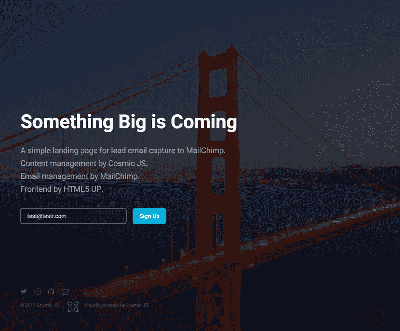
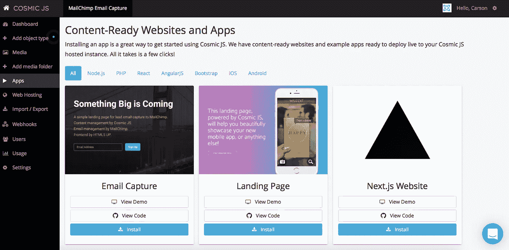
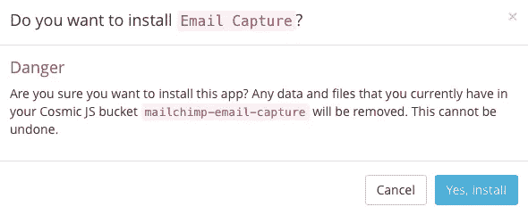
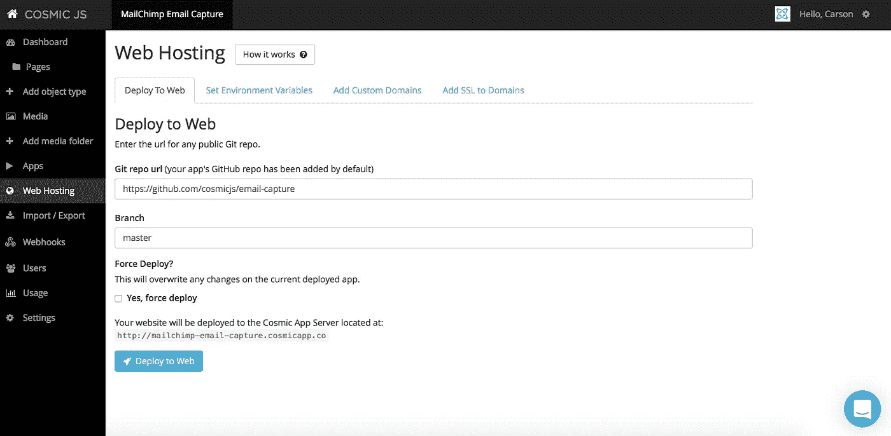
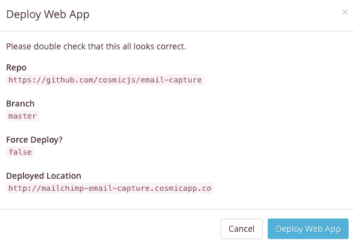
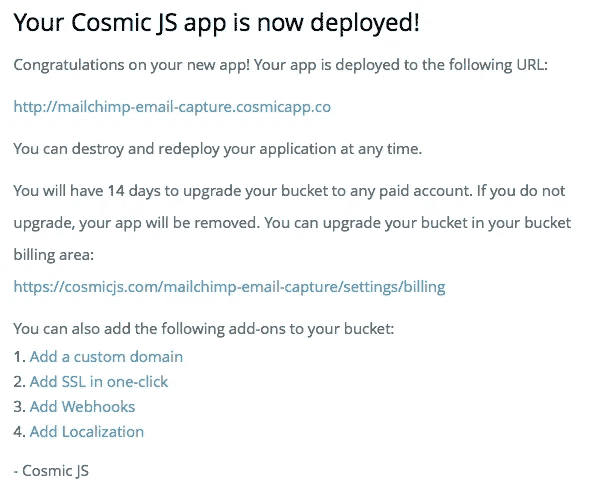

# 用 4 个步骤构建一个 MailChimp 集成的电子邮件捕获登录页面

> 原文：<https://medium.com/hackernoon/build-a-mailchimp-integrated-email-capture-landing-page-in-4-steps-7f315fb8900c>

如果你的生意是在线的，最好是转换。依赖于数字存在作为实体位置替代方案的企业知道搜索引擎排名、社交媒体关注者和明显转化的重要性。“转换”可以被归类为产品销售、金融交易、提交手机号码、免费应用程序下载等等。2017 年追求的最高优先级转换之一是客户信息/数据。

今天，我将向您展示如何建立一个简单的电子邮件捕获登录页面。我将使用的[电子邮件捕获登陆页面](https://cosmicjs.com/apps/email-capture)是来自 [Cosmic JS](https://cosmicjs.com/) 的一个内容就绪的网络应用。这是一个简单的引导电子邮件捕获到 MailChimp 的登录页面。它具有美丽的整页旋转背景图像。只需几分钟即可设置您的登录页面并捕捉销售线索。

在这个示例应用程序中，我将使用[宇宙 JS](https://cosmicjs.com/) 。Cosmic JS 是一个 [API 优先的 CMS](https://cosmicjs.com/) ，它使得管理和构建网站和应用程序更加快速和直观。通过将内容从代码中分离出来，Cosmic JS 增强了开发人员的灵活性，同时确保内容编辑人员能够以最适合他们的方式规划和部署内容。我们将使用 Cosmic JS 来安装我们的示例应用程序，部署和更新来自[基于云的内容管理平台](https://cosmicjs.com/)的内容。

如果你还没有，那就从[注册](https://cosmicjs.com/signup)参加[宇宙 JS](https://cosmicjs.com/) 开始吧。下面提供了有用的资源来简化您的开发操作。

> [电子邮件捕获应用页面](https://cosmicjs.com/apps/email-capture)
> 
> [电子邮件捕获应用程序演示](https://cosmicjs.com/apps/email-capture/demo)
> 
> [GitHub 上的邮件捕获应用代码库](https://github.com/cosmicjs/email-capture)

# 1.创建新的存储桶

您的 bucket 的名称是您正在构建的网站、项目、客户端或 web 应用程序的名称。我将我的命名为“MailChimp Email Capture ”,以保持示例博客的简洁。

# 2.安装电子邮件捕获登录页面应用程序

一旦你注册并命名了你的桶，你将被提示从头开始或者“查看一些应用”。对于这个博客，我简单地点击了右键“查看一些应用程序”，这样我就可以开始安装宇宙 JS 电子邮件捕获应用程序。

# 应用程序安装选项

[Cosmic JS](https://cosmicjs.com/) 让你能够在编程语言之间进行过滤，比如 [Node.js](https://cosmicjs.com/apps) 、 [PHP](https://cosmicjs.com/apps) 、 [React](https://cosmicjs.com/apps) 、 [AngularJS](https://cosmicjs.com/apps) 等等。

只需点击[电子邮件捕获](https://cosmicjs.com/apps/email-capture)图标下方的“安装”即可开始，或者访问[宇宙 JS 应用页面](https://cosmicjs.com/apps)。

# 3.部署到 Web

我点击了“部署到 Web”。然后，我可以在部署 web 应用程序时编辑对象。您将收到一封电子邮件，确认您的 web 应用程序的部署。如果您在部署过程中遇到任何问题，您可能会被转到 [Cosmic JS 故障排除页面](https://cosmicjs.com/troubleshooting)。

# 确认部署位置和分支

# 部署分支机构确认模式

我从一个回购中提取，我的分支被澄清，我有一个与我在步骤 1 中创建的 slug / bucket 名称相匹配的部署位置。

# 展开，展开

一个小小的保证，你很快就会生活和捕捉线索！

# 4.编辑全局对象

现在你可以编辑全局对象、文件、用户、媒体等等。要编辑电子邮件捕获应用程序的内容和电子邮件触发器，请点击“页面”并向下滚动到“元字段”以编辑社交链接、MailChimp 列表 URL、行动号召按钮文本等。编辑是在宇宙 JS 仪表盘中实现的梦想。要了解更多关于如何在考虑编辑内容的情况下构建 [Cosmic JS](https://cosmicjs.com/) 的信息，请阅读[在考虑内容编辑器的情况下构建](https://cosmicjs.com/blog/building-with-the-content-editor-in-mind)。

# 应用部署确认

就像注册、创建新的存储桶、安装 web 应用程序、编辑对象和部署一样简单！我收到了访问我的 web 应用程序的确认电子邮件，还看到了我的桶升级选项，如自定义域、一键式 SSL、webhooks 和本地化。

[Cosmic JS](https://cosmicjs.com/) 是一个 API 首创的基于云的内容管理平台，可以轻松管理应用和内容。如果你对 Cosmic JS API 有任何疑问，请通过 [Twitter](https://twitter.com/cosmic_js) 或 [Slack](https://cosmicjs.com/community) 联系创始人。

> 卡森·吉本斯是 [Cosmic JS](https://cosmicjs.com) 的联合创始人& CMO，这是一个 API 第一的基于云的[内容管理平台](https://cosmicjs.com)，它将内容与代码分离，允许开发人员用他们想要的任何编程语言构建流畅的应用程序和网站。

> [黑客中午](http://bit.ly/Hackernoon)是黑客如何开始他们的下午。我们是阿妹家庭的一员。我们现在[接受投稿](http://bit.ly/hackernoonsubmission)并乐意[讨论广告&赞助](mailto:partners@amipublications.com)机会。
> 
> 如果你喜欢这个故事，我们推荐你阅读我们的[最新科技故事](http://bit.ly/hackernoonlatestt)和[趋势科技故事](https://hackernoon.com/trending)。直到下一次，不要把世界的现实想当然！

