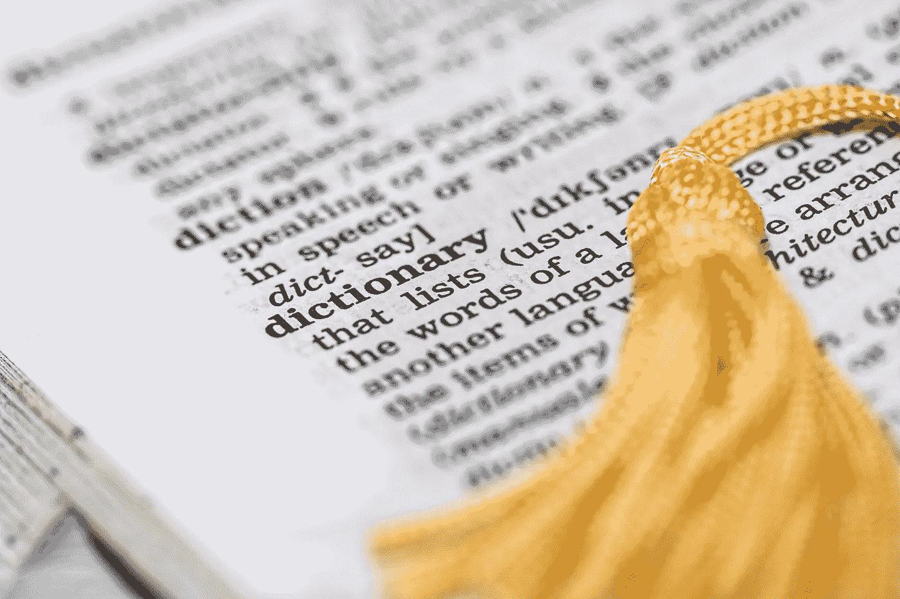

# 用 10 行 Python 代码构建一个简单的文章拼写检查器

> 原文：<https://medium.com/hackernoon/build-a-naive-article-spell-checker-in-10-lines-of-python-code-b325a67f2c3>



[*https://pixabay.com/en/dictionary-reference-book-learning-1619740/*](https://pixabay.com/en/dictionary-reference-book-learning-1619740/)

对于正在努力寻找兴奋剂项目的迷失的初学者来说，这里有一个简单而有效的项目可以添加到你的文件夹中！

你好，初学者，总是带着解决问题的目标开始你的项目(对不起，这不是典型的硅谷解决问题的心态，而是下一步做什么的明确目标)

**我们的目标:**创建一个文章拼写检查器，可以列出错误拼写的单词。

**语言:** Python(初学者友好的语言，用其丰富的软件包生态系统帮助初学者变魔术)

**算法/流程:**

1.  **输入:**定义必须检查拼写的 url(链接)
2.  **Extract:** Tokenize(将整篇文章拆分成单词包)
3.  **匹配:**对照英语词典单词交叉验证提取的单词
4.  **输出:**列出不匹配的单词(拼写错误/非词典单词)

# **正在使用的 Python 包/模块:**

```
import newspaper 
from nltk import word_tokenize  
import enchant  
import re 
```

**报纸** —文章摘要
**NLTK** —对摘要内容进行标记
**附魔** —英语词典
**Re** —正则表达式/模式匹配

*如果您还没有安装软件包，以下是您可以安装软件包的方法:

```
pip install newspaper
```

# **输入:**

```
 url = 'https://hackernoon.com/dilemmas-of-a-digital-lifestyle-27c044940157'
```

# 提取文章内容

```
my_article = newspaper.Article(url,language='en')
my_article.download()
my_article.parse()
```

# 打印解析后的文章文本

```
print(my_article.text)Dilemmas of a Digital Lifestyle

Is two blueteeth one bluetooth too many?

A few weeks ago, I finally traded in my old car for a newer model. Among other things, the new car came with a decent audio system that had four speakers, and bluetooth connectivity.

After a bit of fiddling, I was able to connect my phone via Bluetooth to the car’s system. I was late to the party, but it was still quite a thrill to take handsfree calls while driving, and enjoy the luxury of listening to the caller’s voice over the car’s stereo system. However the Bluetooth only connects to one device at a time. And that can be an issue if you have kids at home.

My 14 year old and all her friends have their own personal collections of songs on their phones or iPods. And they are all dying to try out their songs on the car’s music system every time I cart them around.

I didn’t want them using the car’s Bluetooth as that would mean losing my handsfree calls, and going through the whole circus of disconnecting and reconnecting my phone. The car does have USB and auxiliary ports but the first can’t connect to the phones, and the second needs a cable that has to be extra long to reach the kids in the back seat, which can be kind of messy.

My solution was a little Bluetooth adapter that I picked up on eBay for around ₹300 ($5). One end has a USB connector, and the other an auxiliary cable. You power it by plugging it in to the car’s USB port. You then pair the bluetooth adapter with the phone, after which it pipes music played on the phone into car’s audio system, via the car’s auxiliary port. It’s simpler than it sounds, and it worked seamlessly, even temporarily turning off the music whenever a call comes on the car’s bluetooth.

But it felt a bit weird to sitting there in my tiny car, with two active Bluetooth connections. Deep down, I couldn’t help worrying whether all those electromagnetic Bluetooth waves madly bouncing around inside the metal car were cooking up our brains.

Yes, most of believe Bluetooth is harmless as everyone’s using it with seemingly no ill-effects. But then everyone used to happily smoke not so long ago, and nearly everyone is still swilling down tonnes of sugar without a care, in cokes, cakes and almost every other packaged food.

What wouldn’t I give to travel twenty years into the future, and see science’s verdict on the effects of Bluetooth. But there’s only so much a Dad can do.

As of now, the kids have their music, I have my phone, and all’s well in the world.
```

# 对标记化的单词进行拼写检查

```
d = enchant.Dict("en_US")
non_dict_words = list(set([word.encode('ascii', 'ignore') for word in word_tokenize(my_article.text) if d.check(word) is False and re.match('^[a-zA-Z ]*$',word)] ))
non_dict_words
```

# 输出:

```
['USB', 'Bluetooth', 'bluetooth', 'blueteeth', 'eBay', 'handsfree']
```

# **完整代码:**

这里是 github 上的完整代码:

Tada！你刚刚开始了一个很酷的项目，以此来鼓励自己。你现在不爱编码了吗？

[](http://bit.ly/HackernoonFB)[](https://goo.gl/k7XYbx)[](https://goo.gl/4ofytp)

> [黑客中午](http://bit.ly/Hackernoon)是黑客如何开始他们的下午。我们是 [@AMI](http://bit.ly/atAMIatAMI) 家庭的一员。我们现在[接受投稿](http://bit.ly/hackernoonsubmission)并乐意[讨论广告&赞助](mailto:partners@amipublications.com)的机会。
> 
> 如果你喜欢这个故事，我们推荐你阅读我们的[最新科技故事](http://bit.ly/hackernoonlatestt)和[趋势科技故事](https://hackernoon.com/trending)。直到下一次，不要把世界的现实想当然！

