# 使用 Onion Omega 和亚马逊 AWS 构建物联网仪表盘

> 原文：<https://medium.com/hackernoon/building-an-iot-dashboard-using-the-onion-omega-and-amazon-aws-a3520f850c9>

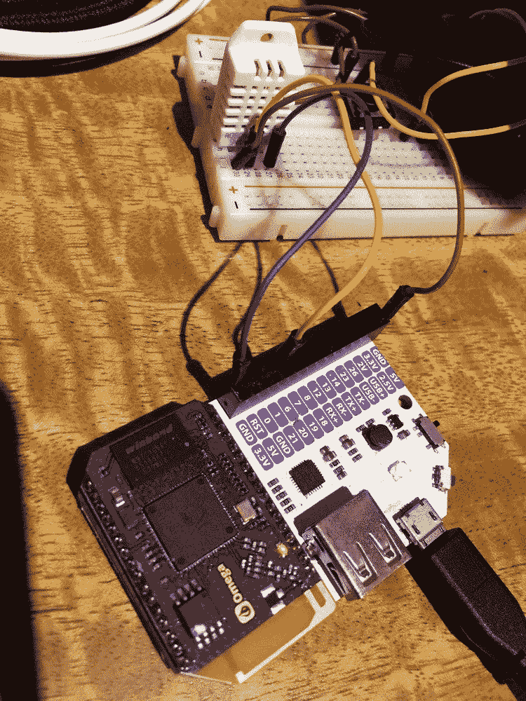

作为一名程序员，我还是一名狂热的吉他手，多年来，我已经收集了相当多的各种类型和型号的吉他。关于吉他(尤其是原声吉他)，有一点是它们对环境条件非常敏感，比如温度和湿度。

和人一样，吉他喜欢保存在相对凉爽的温度和不太干燥或潮湿的地方。因为我住在热带地区，这有时会是一个挑战，这就是为什么我试着把我的吉他放在我的家庭办公室，那里很安全，而且大部分时间都有空调。

然而，空调并不完美，有时像停电或有人让窗户半开这样的事情会影响房间的整体气候。因为我经常出差，每次都要离开家庭办公室好几天，所以我想留意任何异常情况，这样我就可以建议家里的另一位家庭成员检查或纠正这种情况。

还有什么比尝试使用我的编程技能更好的方式呢?( a)学习一些新技能,( b)尝试整个物联网热潮。请注意，我的正常编程工作涉及商业和企业类型的数据库和报告工具，所以对硬件设备编程对我来说是一件新鲜事。

最终的结果是，我想要一个可以从世界任何地方访问的网页，它可以给我 24 小时内吉他室内温度和湿度变化的实时统计数据。

请记住，我将尝试并记录我构建这个系统的所有步骤，所以这篇博文很长，但希望能为其他想要构建类似系统的人提供指导。

我将在这里经历的步骤是:

1.设置欧米茄洋葱和我的电脑一起工作
2。将 DHT22 温度和湿度传感器连接到我的洋葱上
3。在洋葱上安装所有必要的软件，以便能够做我想做的事情
4。建立亚马逊物联网，让洋葱成为亚马逊物联网云上的“东西”
5。在亚马逊 AWS 上建立一个 DynamoDB 数据库来存储洋葱的温度/湿度读数
6。设置一个网页，从 DynamoDB 中读取数据，并以图表的形式显示出来。

这是最终仪表板的外观:

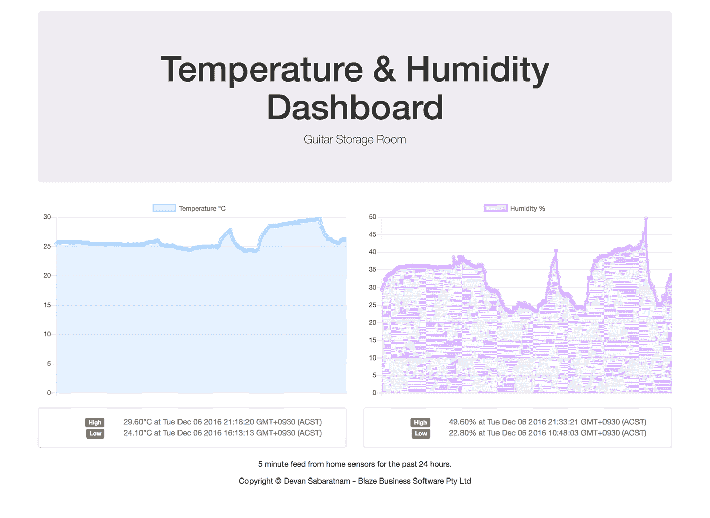

帽子提示:我用这篇博文[作为设计仪表板和从 DynamoDB 中提取数据的灵感。](/aws-activate-startup-blog/building-dynamic-dashboards-using-lambda-and-dynamodb-streams-part-1-217e2318ae17#.r7u6gxuyb)

# 硬件

一年前，我参加了“洋葱欧米茄”kickstarter 项目。我有一台拇指大小的 Linux 电脑，但是我不知道该怎么处理它，所以它在盒子里放了很长时间，直到我决定这周把它掸掉。

将洋葱连接到它的编程板上，我将它连接到我的 iMac 的 USB 电缆上。为了进行通信，我必须从这里下载并安装 USB 转 UART 驱动程序:

[https://www . sil ABS . com/Support % 20 documents/Software/Mac _ OSX _ VCP _ driver . zip](https://www.silabs.com/Support%20Documents/Software/Mac_OSX_VCP_Driver.zip)

关于将 Omega Onion 连接到 Mac 的完整说明在他们的 Wiki 页面上:

【https://wiki.onion.io/get-started 

一旦我连接了两个设备，我就可以发出命令了

```
screen /dev/tty.SLAB_USBtoUART 115200
```

从终端屏幕连接到设备。耶！

我要做的第一件事是设置 WIFi，这样我就可以使用本地家庭办公室的 WiFi 网络访问设备。这是发出命令的一个简单例子

```
wifisetup
```

这是一个简单的一步一步的程序，要求您提供您的 WiFi 接入点名称和安全密钥。再一次，上面的 Wiki 链接对此有更详细的解释。

一旦在洋葱上设置了 Wifi，您就可以使用网络浏览器通过其 IP 地址访问它。我的设备最终是 *192.168.15.11* ，所以在 Chrome 中输入那个地址是一个问题。登录后(默认用户名为' **root** '，密码为'**on oneer**')，您将看到:

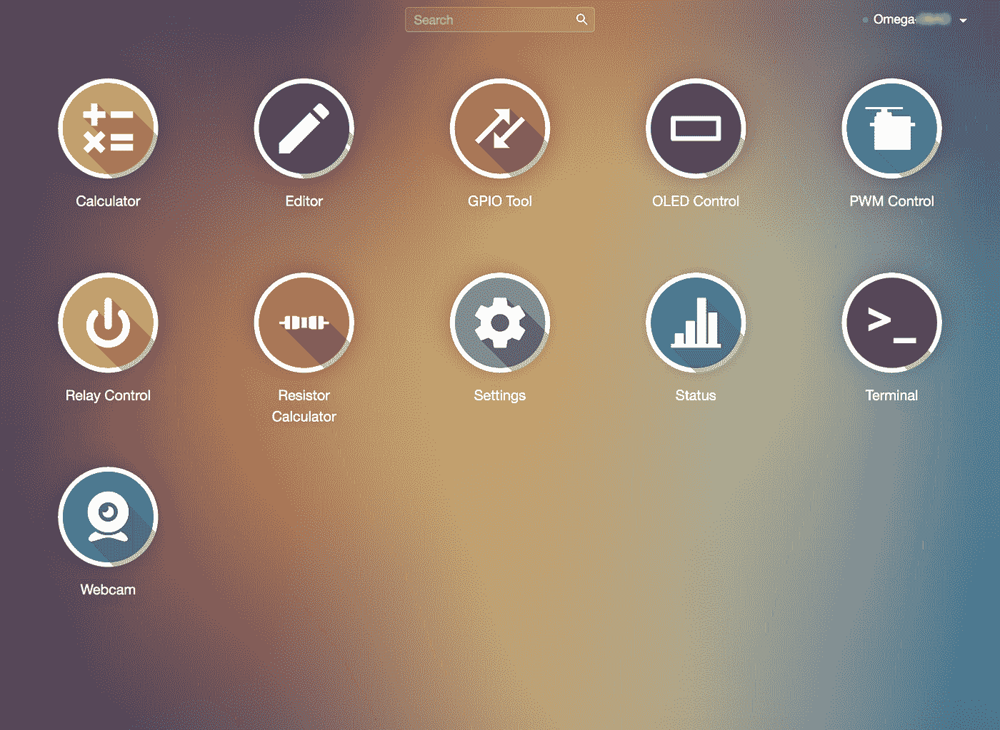

首先，因为我的设备太旧了，我不得不去“*设置*并运行固件更新。

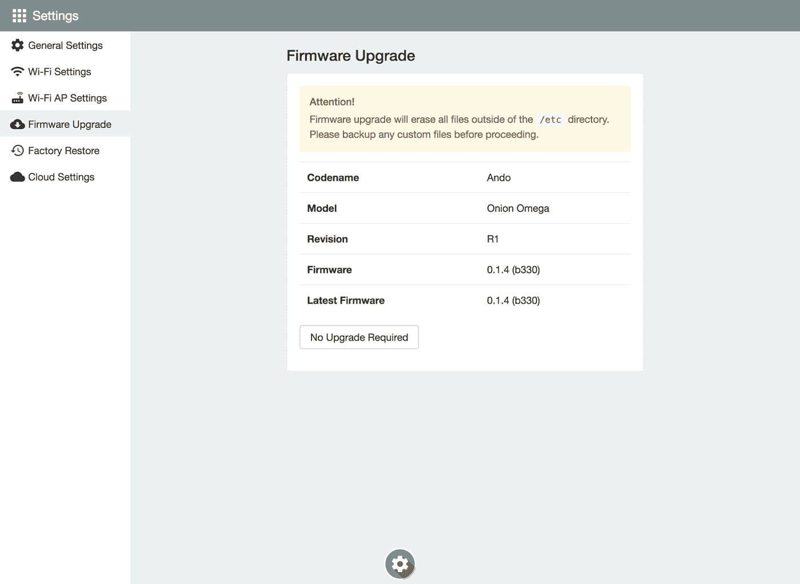

我还翻出了一个旧的 [HDT22 传感器单元](https://www.adafruit.com/product/385)，这是我不久前涉足 Arduino 项目时玩的。我想知道我是否可以将 HDT22 与 Onion 设备配对，瞧，在 Onion 论坛上快速搜索显示，以前已经很容易地做到了这一点。这里有一篇博文详细介绍了如何将 HDT22 连接到洋葱上:

[https://wiki . onion . io/Tutorials/PHP-DHT 11-DHT 22-Sensor-Examples](https://wiki.onion.io/Tutorials/PHP-DHT11-DHT22-Sensor-Examples)

这篇文章向您展示了如何只用 3 根电线将两个设备连接在一起。简而言之，我的设备上的布线如下:

HDT22 的引脚 1 连接到 Omega Onion 的 5.5V 插头
HDT 22 的引脚 2 连接到 my Onion 的 GPIO 端口 6
HDT 22 的引脚 3 未使用
HDT 22 的引脚 4 连接到 Onion 的 GND(接地)插头

# 软件

现在我们来看看收集数据所需的所有软件，并将其发送到亚马逊。简而言之，我们将在 Node.js 中编写所有代码，但我们也将调用一些命令行实用程序来(a)从 HDT22 读取数据,( b)将其发送到 Amazon IoT cloud。

为了收集数据，我们将使用一个名为“*check weather*的应用程序，上面的页面详细介绍了如何设置 DHT22。为了与亚马逊物联网云对话，我们需要使用 [MQTT](http://mqtt.org/) 协议。为此，将使用一个名为“ *mosquitto* 的应用程序，它是一个漂亮、简洁的 MQTT 包装器。我们可以使用 HTTPS，但是 MQTT 似乎更有效，我想尝试一下。

因此，让我们通过这些步骤进行安装。所有的包都很小，所以它不会占用洋葱上 16MB 的空间。我认为我的洋葱仍然有大约 2MB 在所有安装之后离开。下面是(来自洋葱命令行):

(1)安装*检查湿度*应用程序并设置运行权限。check weather 比试图读取 Node.js 中洋葱上的针要干净得多，运行它会在文本响应中返回温度(以摄氏度为单位)和湿度(以百分比为单位)。

```
opkg update
opkg install wget
cd /root
wget [https://community.onion.io/uploads/files/1450434316215-checkhumidity.tar.gz](https://community.onion.io/uploads/files/1450434316215-checkhumidity.tar.gz)
tar -zxvf 1450434316215-checkhumidity.tar.gz
chmod -R 755 /root/checkHumidity/bin/checkHumidity
```

如果你的 HDT 22 和我的板一样连接到第 6 针，试试看:

```
/root/checkHumidity/bin/checkHumidity 6 HDT22
29.6
49.301
```

显示温度为 29.6 摄氏度，湿度为 49.301%。

(2)在洋葱上安装 Node.js。从现在开始，我们将使用 opkg 管理器来安装:

```
opkg install nodejs
```

(3)我还安装了 nano，因为它是我在 Linux 上最喜欢的编辑器。如果您对任何其他编辑器都满意，您可以绕过它(注意:在 web 界面上也有一个编辑器，但我在保存它时遇到了一些问题):

```
opkg install nano
```

(4)为 MQTT 对话安装 mosquitto 应用程序:

```
opkg install mosquitto
opkg install mosquitto-client
```

这将安装 mosquitto 代理和客户端。我们不会真的使用代理，主要是客户端，但是如果您想在以后将洋葱设置为 MQTT 桥，这是很方便的。

# 亚马逊 IOT

好了，现在我们已经在设备本身上准备好了几乎所有的东西，我们需要在亚马逊的物联网云上建立一个“东西”来模仿洋葱。你在亚马逊上设置的“东西”充当了你想要存储在物联网设备上的信息的云储存库。亚马逊使用了一个“影子”的概念来描述可以存储数据的“东西”。这样，即使你的物理“东西”关机或离线，你仍然可以向“东西”发送 MQTT 数据包，数据将存储在云中“东西”的“影子”副本上，直到设备恢复在线，此时亚马逊可以将“影子”数据复制回物理设备。

你看，我们的 Node.js 应用程序将把温度和湿度数据推送到云中“东西”的影子副本。从那里，我们可以在 Amazon IoT 上设置一个规则，进一步将数据推入 DynamoDB 数据库。

在云上设置“东西”可能有点棘手。主要是因为安全问题。因为物理设备将在无人值守的情况下匿名工作，所以使用安全证书进行身份验证。让我们一步一步地完成“东西”的创建。(注意:本教程假设您已经设置了一个 AWS 帐户)。

从亚马逊控制台，点击顶部工具栏上的“服务”，然后选择“物联网”下的“AWS 物联网”。

在左侧菜单中，单击“注册表”，然后单击“事物”。


如果你以前从未创建过任何东西，你的屏幕可能会是空白的。点击屏幕右上方的“*创建*”。

你需要给你的东西一个名字。随便你怎么称呼。我刚刚给我的欧米茄洋葱取了一个独特的名字，它看起来像**欧米茄-XXXX** 。

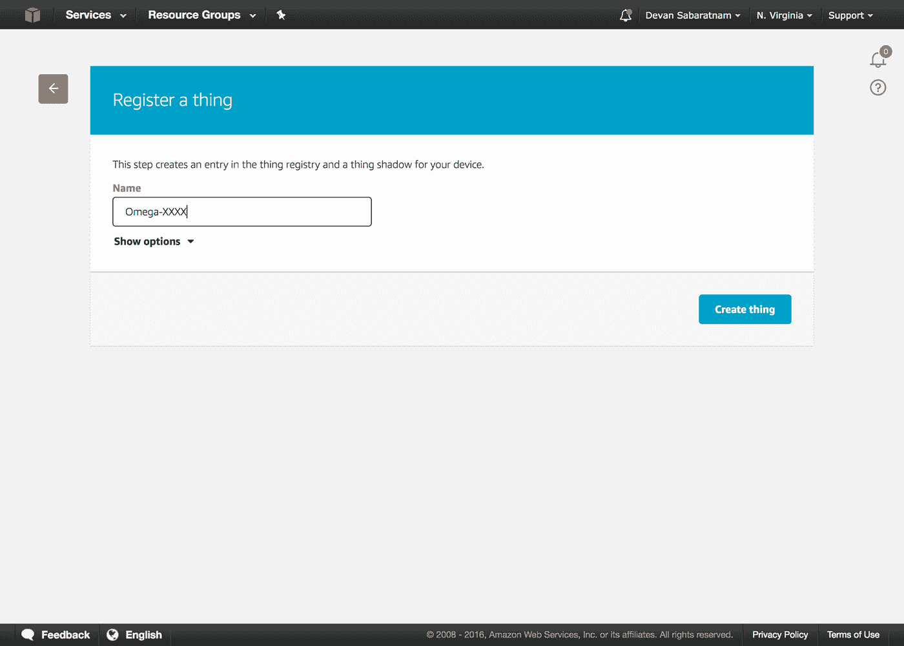

太好了！接下来，你将被带到一个屏幕，显示你的“东西”的所有信息。点击左侧的“安全”选项。

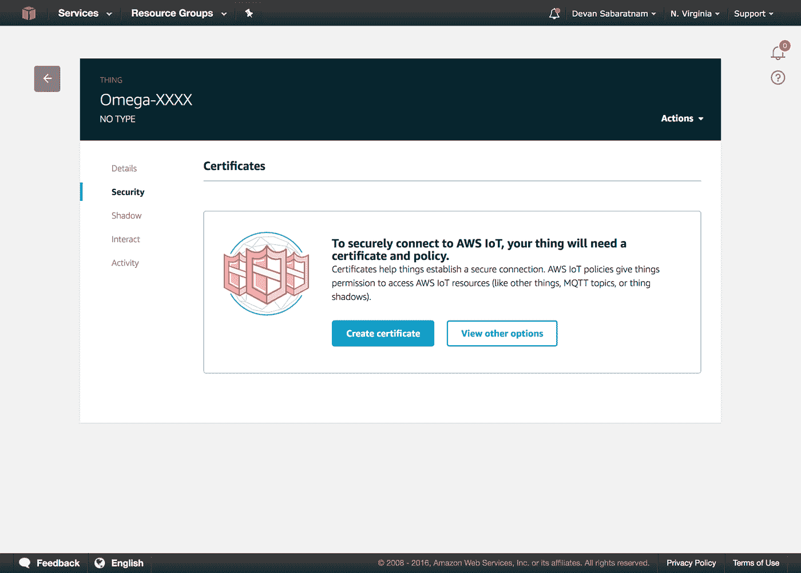

点击'*创建证书*按钮。

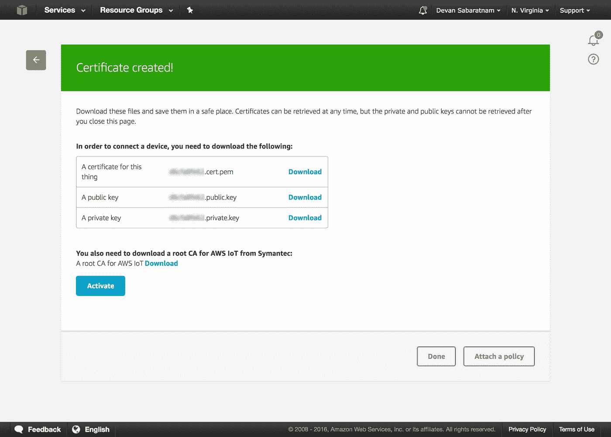

现在，您可以从该屏幕下载所有四个证书，并将其存储在安全的地方。

> **注意**:不要忘记点击“AWS IoT 下载的根 CA”链接。这是我们稍后将需要的根 CA 证书。将所有 4 个证书暂时存储在本地硬盘上的安全位置。不要丢失它们，否则您将不得不重新创建证书并重新附加策略等。凌乱的东西。

最后，点击*激活*，激活您的证书和物品。

接下来，我们必须给这个证书附加一个策略。该安全屏幕上有一个标记为“*创建策略*的按钮。单击它，您将看到下一个屏幕，要求您创建一个新策略。


我们将创建一个简单的策略，允许我们针对任何设备执行任何物联网操作。这是相当全面的，在生产环境中，您可能希望稍微限制策略，但出于本练习的目的，我们将在此策略下对所有设备启用所有操作:

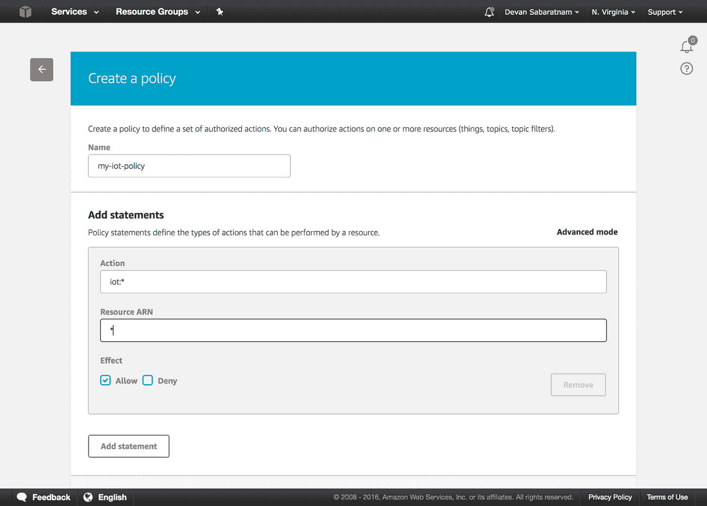

在“*动作*”字段中，为所有物联网动作输入“**物联网:*** ”，在“*资源 ARN* ”字段中，为所有设备和主题等输入“ ***** ”。不要忘记勾选下面的“*允许*按钮，然后点击“*创建*”。

您现在有了一个东西，一组该东西的安全证书，以及一个控制该东西的证书的策略。希望该策略应该附加到您刚刚创建的证书上。否则，您必须手动将策略附加到证书。为此，单击左侧菜单上的'*安全*'，然后单击'*证书*'，然后单击您刚刚创建的证书。


点击证书屏幕左侧的“*策略*”。


如果您看到'*没有附加到此证书*的策略，那么您需要通过点击右上角的'*操作*下拉菜单来附加它，然后从下拉菜单中选择'*附加策略*。

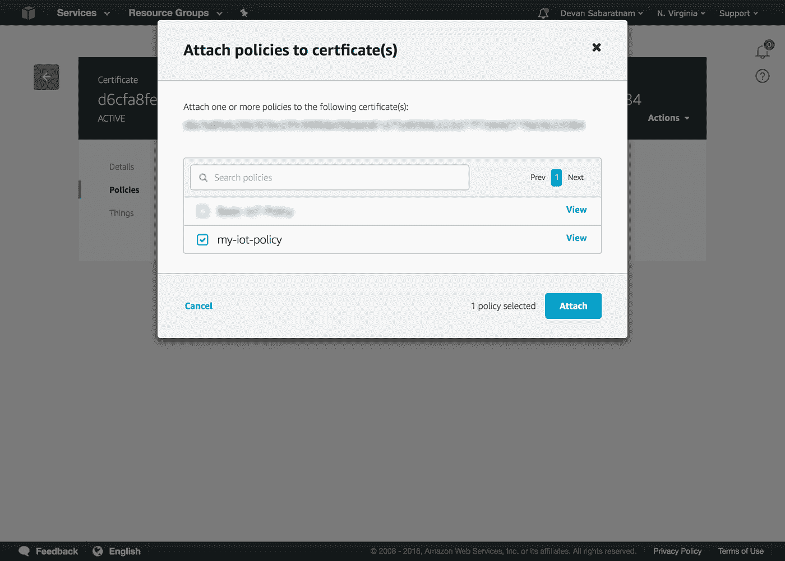

只需勾选您想要附加到此证书的策略，然后单击“*附加*”。

现在，您可能希望单击左侧菜单上的'*东西*'，以确保您创建的东西也附加到证书上。

为了确保你所有的鸭子都在一条线上

> “东西”->需要有->安全证书->需要附加到->策略

事实上，还有一个因素，我们想在这里指出，这是很重要的。继续点击物联网仪表盘上的“*注册表*，然后点击“*事物*”。选择您刚刚创建的东西，然后在弹出的左侧菜单中单击'*交互*'选项。

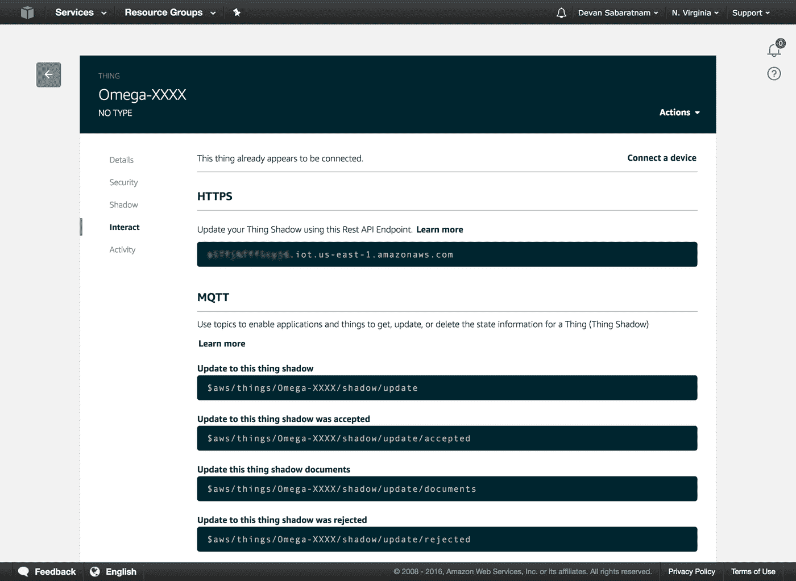

注意，在 HTTPS 下面，显示了一个 REST API 端点。将这些信息复制下来，暂时放在一边，因为我们稍后将在 Node.js 代码中需要它来指定我们想要与哪个主机对话。这个主机地址对于每个亚马逊物联网帐户来说都是唯一的，所以要保持安全和保密。

还要注意，在这个屏幕上有一些特殊的亚马逊物联网保留主题，可以用来更新或读取你的物联网东西的影子副本。我们在这个项目中不会用到这些，但在更复杂的项目中，可能会有几个设备相互通信，也可能有一些设备频繁开启和关闭，知道这些会很方便。“影子”功能允许您即使在这些设备离线或不可用的情况下仍能与它们“对话”，并让它们稍后同步。非常强大的东西。

接下来，我们将从物联网部分休息一下，并设置一个 [DynamoDB](http://docs.aws.amazon.com/amazondynamodb/latest/developerguide/Introduction.html) 表来收集来自洋葱的数据。

# 亚马逊 DYNAMODB

点击“数据库”下的“*服务*，然后点击“*发电机数据库*”。


点击*创建表格*。

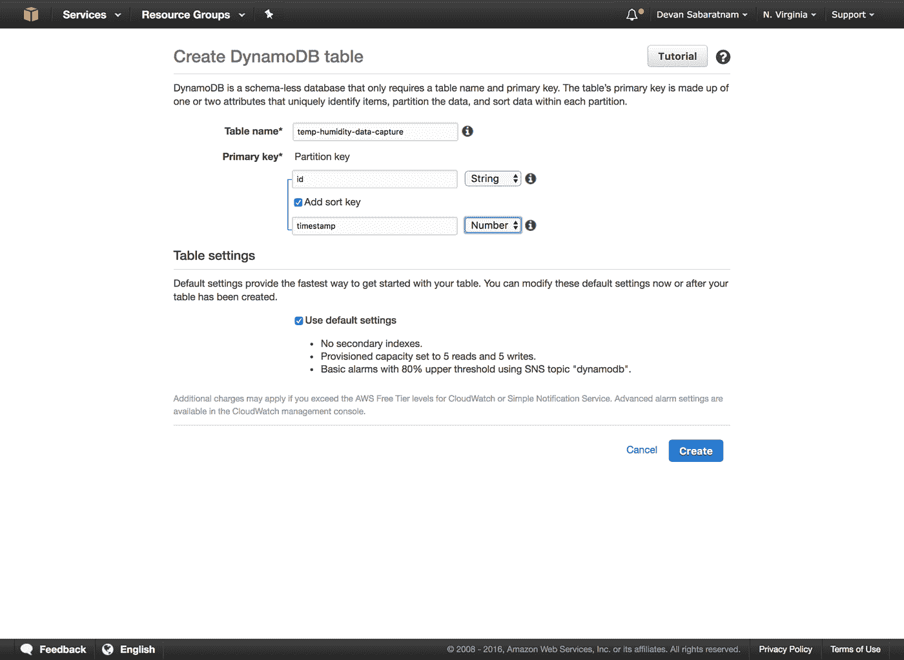

给表格起一个有意义的名字。重要提示:将分区键命名为' **id** ，并将其设置为' **String** 类型。勾选“**添加排序关键字**的方框，将关键字命名为“**时间戳**，并将其设置为“**编号**类型。这是非常重要的，你不能改变它，所以请确保你的设置如上。

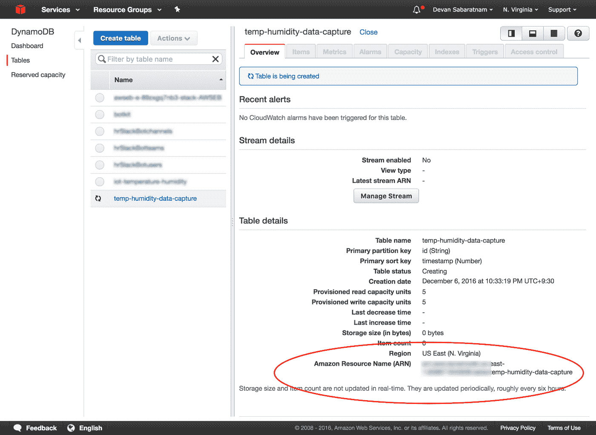

> **提示**:一旦你创建了你的 DynamoDB 表，在表信息屏幕的底部复制下“亚马逊资源名称(ARN)”(上面用红色圈出的)。以后创建从该表中读取数据以显示在网站图表上的安全策略时，您将需要这些信息。

好了，现在您已经创建了一个表，您可以再次返回到亚马逊物联网仪表板进行下一步操作(控制台顶部菜单中的*服务*，然后是 *AWS 物联网*)。我们现在要做的是在物联网中创建一个“规则”,它会将进入某个主题的任何数据传递到 DynamoDB，以存储在一个数据文件中。

> **提示**:当你使用 MQTT 向物联网传输数据时，你一般会将数据发布到一个‘主题’上。题目可以是你喜欢的任何东西。Amazon IoT 有一些保留的主题名称来做某些事情，但是您可以将 MQTT 包发布到您当场编造的任何主题名称。你的设备也可以监听来自亚马逊等网站的特定主题的数据。MQTT 是一种非常好的、强大的、简单的与物联网设备和服务器交互的方式。

在物联网仪表盘中，点击左侧的'*规则*，然后点击'*创建*按钮。

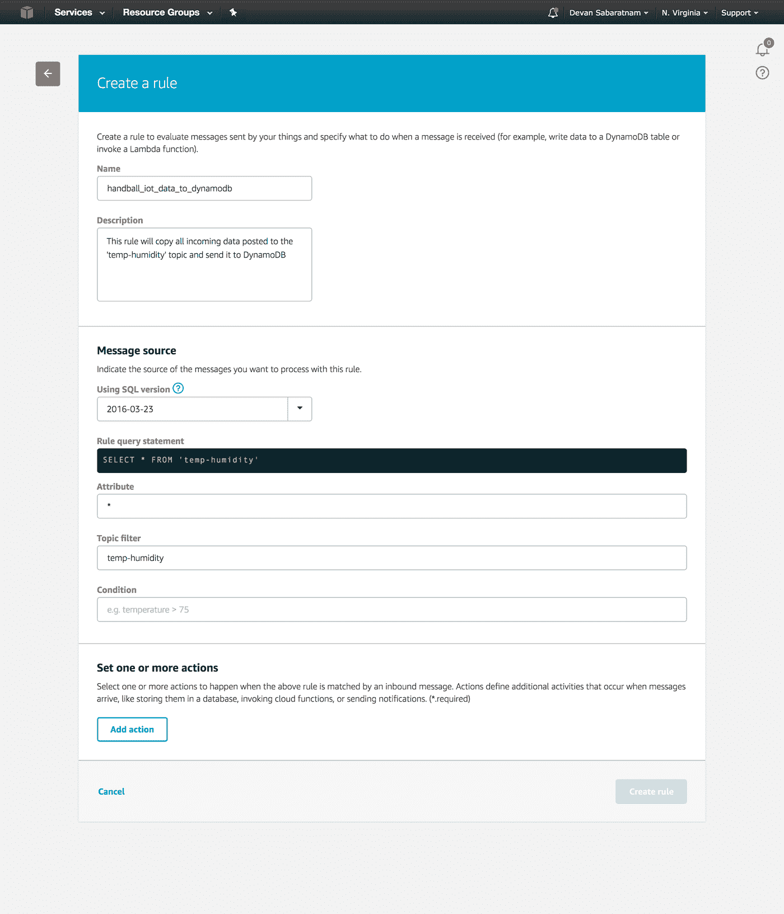

“*名*可以是你编造的与众不同的东西。添加一个'*描述*'来帮助您记住该规则的作用。对于' *SQL 版本*'，只需选择'**2016–03–23**'即可，这是本文撰写时的最新版本。

接下来，在“*属性*”上，键入“ ***** ”，因为我们将选择发送给我们的所有字段。在“*主题过滤器*中，输入“**温度-湿度/+** ”。这就是我们将要收听的主题名称。你可以随便叫它什么。我们在主题名称的末尾包含了一个' **/+** '，因为我们可以在此之后添加额外的数据，并且我们希望查询将这些额外的数据视为“通配符”并仍然选择它。(注意:我们将在主题末尾添加设备名称作为标识符(例如 ***温度-湿度/ω-XXXX***)。这样，如果我们以后有多个温度/湿度传感器，我们可以通过不同的主题后缀来识别每个传感器，但仍然可以将所有传感器的所有数据发送到 DynamoDB。

> **勘误表**:上面的截图在“主题过滤器”栏中显示的是“**温度-湿度**，但实际上应该是“**温度-湿度/+** ”。

将*条件*留空。

现在在这个下面，你会看到一个“*添加动作*按钮。点击此处，选择“*将消息插入 DynamoDB 表*”。


如您所见，您还可以做许多其他事情，包括将数据转发到另一台物联网设备。但是现在，我们将只专注于写数据，并在那里结束。点击屏幕底部的“*配置操作*按钮。

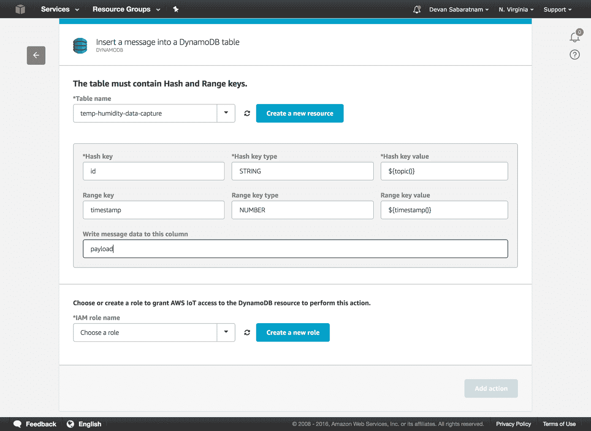

从下拉菜单“*表名*中选择我们刚刚创建的 DynamoDB 表。“*哈希键值*应该是“ **id** ”，类型为“**字符串**”，在“*哈希键值*”中输入“ **${topic()}** ”。这意味着我们将把主题名存储为主键。

'*范围键*应为'**时间戳**，类型为'**号**'。“*范围键值*应该是“ **${timestamp()}** ”。这将在该字段中放置数据包时间戳的内容。

最后，在“*将消息数据写入此列*”中，我输入了“**有效载荷**”。这是包含对象的数据列的名称，该对象带有从设备发送的 JSON 数据包。你可以给这个专栏起任何你喜欢的名字，但是我喜欢把它叫做' **payload** '或者' **iotdata** '或者类似的名字，这样我就知道所有的包信息都存储在这里。

还有一件事要做，出于安全目的，我们必须设置一个 IAM 角色，它将允许我们向 DynamoDB 表添加数据。这实际上很容易做到。点击'*创建新角色*按钮。

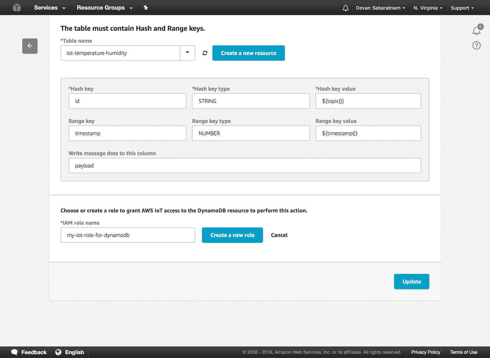

给角色起一个有意义的名字，然后点击“*创建一个新角色*”。将显示一个新按钮，旁边的文本显示“*授予 AWS IoT 向所选资源*发送消息的权限”。点击'*更新角色*按钮。

> **重要提示**:您必须点击“更新角色”按钮才能正确设置权限。完成后，单击“更新”按钮。

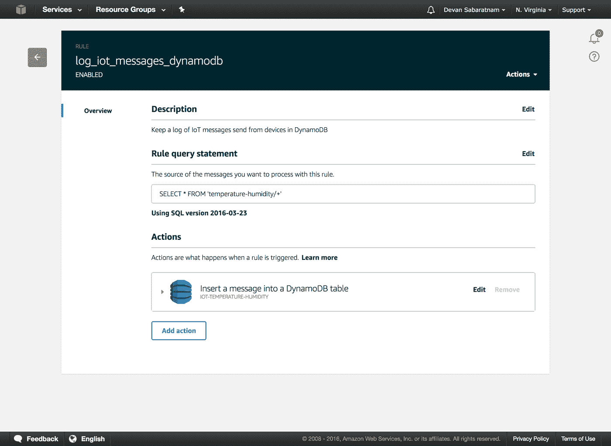

就是这样！我们已经基本完成了亚马逊物联网和 DynamoDB 的设置。这真是一件繁琐的事，不是吗？许多步骤必须按照一定的顺序完成。但好消息是，一旦完成了这些，项目的其余部分就很容易了，而且很有趣！

# 安装证书

哦，等等——还有一个稍微乏味的步骤要做。还记得我们之前下载的 4 个证书吗？现在是我们需要好好利用它们的时候了(好吧，至少是 4 个中的 3 个)。我们需要把这些证书复制到洋葱上。我发现最简单的方法是将证书的文本内容复制并粘贴到洋葱上的“ */home/certs* ”文件夹中。我只是使用 web 界面编辑器在“ */home/certs* ”文件夹中创建文件，并粘贴我下载的证书的内容。我需要的三个证书(我复制并重命名了它们)是:

*   VeriSign-class 3-Public-Primary-Certification-Authority-G5 . PEM-->**/home/certs/rootca . PEM**
*   x 1234 ABCD 56 ef-certificate . PEM . CRT->**/home/certs/certificate . PEM**
*   x 1234 ABCD 56 ef-private . PEM . key->**/home/certs/private . key**

如你所见，为了便于处理，我缩短了文件名，并将它们放在一个文件夹中，以便从我的 Node.js 应用程序中访问。就是这样。一旦完成，你就再也不用拿着证书瞎折腾了。

您将证书存储在什么位置或者如何命名它们并不重要，您只需要在以后编写 Node.js 脚本时了解细节。

# 编写代码

好了，现在回到 Omega Onion，我们将编写代码从 HDT22 获取信息，并将其传输到 Amazon IoT。这是橡胶接触路面的地方。使用 nano 或 Onion 上的 web 编辑器，创建一个名为“ **/home/app.js** ”的文件，并输入以下内容:

```
var util = require('util');
var spawn = require('child_process').spawn;
var execFile = require('child_process').execFile;var mosqparam = [
 '--cafile', '/home/certs/rootCA.pem',
 '--cert', '/home/certs/certificate.pem',
 '--key', '/home/certs/private.key',
 '-h', 'a1b2c3d4e5f6g7.iot.us-east-1.amazonaws.com',
 '-p', '8883'
];setInterval(function() {
 execFile('/root/checkHumidity/bin/checkHumidity', ['6','DHT22'], function(error, stdout, stderr) {
  var dataArray = stdout.split("\n");
  var logDate = new Date()
  var postData = {
   datetime: logDate.toISOString(),
   temperature: parseFloat(dataArray[1]),
   humidity: parseFloat(dataArray[0])
  }
  // publish to main data queue (for DynamoDB)
  execFile('mosquitto_pub', mosqparam.concat('-t', 'temp-humidity/Omega-XXXX', '-m', JSON.stringify(postData)), function(error, stdout, stderr) {
   // published
  });
  // publish to device shadow
  var shadowPayload = {
   state: {
    desired: {
     datetime: logDate.toISOString(),
     temperature: parseFloat(dataArray[1]),
     humidity: parseFloat(dataArray[0])
    }
   }
  }
  execFile('mosquitto_pub', mosqparam.concat('-t','$aws/things/Omega-XXXX/shadow/update', '-m', JSON.stringify(shadowPayload)), function(error, stdout, stderr) {
   // shadow update done
  });
 });
}, 1000 * 60 * 5);
```

注意:为了安全起见，我在这里混淆了 Omega 设备的名称，以及 Amazon IoT 主机名。您需要确保主机名和设备名与您自己的上述设置相对应。

让我们一节一节地看这段代码。顶部是我们需要的 Node.js 模块的“require”语句。幸运的是，这里不需要安装 NPM，因为我们需要的模块是核心 Node.js 安装的一部分。

然后我们定义一个名为' *mosqparam* '的数组。这些实际上是我们每次需要传递给 mosquitto 命令行的参数——主要是为了让它知道它将与之对话的 MQTT 主机(-h)和端口(-p ),以及在哪里可以找到我们之前从 Amazon IoT 下载并复制的 3 个证书。

> **提示**:如果您的应用程序无法运行，几乎可以肯定的是，证书文件要么找不到，要么在下载或复制到 Onion 的过程中已经损坏。mosquitto 错误消息最多是含糊不清的，证书错误并不总是显而易见的。小心这一点。

这是代码的核心部分。我们基本上是在一个每五分钟触发一次的[JavaScript](https://hackernoon.com/tagged/javascript)*setInterval()*函数中运行一个函数。

这个函数的作用是运行一个 *execFile()* 来执行我们之前下载并安装的***check 湿度*** 应用程序。然后，它获取应用程序返回的两行，并用回车符(\n)将它们分开，形成一个包含两个元素的数组。然后我们创建一个 *postData* 对象，它包含温度、湿度和日志时间，作为一个 ISO8601 字符串。

然后，我们通过在'***mosquito _ pub***'命令上调用 *execFile()* ，将 *postData* 对象传输到 Amazon IoT，该命令也是我们之前作为 mosquito 包的一部分安装的。mosquitto_pub 基本上代表' MQTT Publish '，它将把由翻译成 JSON 的 *postData* 对象组成的消息(-m)发送到主题(-t)'**temp-weather/Omega-XXXX**'。

这就是我们真正需要做的，然而，在上面的代码中，我做了其他的事情。在将数据包发布到“**温度-湿度/欧米茄-XXXX** ”主题后，我又发布了一个到“**$ AWS/things/欧米茄-XXXX/阴影/更新**”主题的数据包，数据基本相同，但在*阴影有效载荷*中使用了一些额外的对象包装器。

我为什么要这么做？嗯，‘**$ AWS/things/Omega-XXXX/shadow/update**’主题实际上是一个特殊的亚马逊物联网主题，它将数据包存储在云中 *Omega-XXXX* 事物的“影子”副本中。这意味着以后，我可以在世界任何地方使用另一个软件系统来询问云中的*ω-XXXX*阴影，以查看最新的数据读数。

如果出于任何原因，洋葱离线或家庭互联网关闭，我可以询问卷影副本，看看最后一次读取是什么时候。我不需要设置这一点，但对于未来的计划，我认为这将是一个好主意。

说够了——保存上面的文件，让我们运行代码

```
cd /home
node app.js
```

你不会在屏幕上看到任何东西，但在后台，每隔 5 分钟，欧米茄洋葱就会读取数据并传输到。希望它正在工作。

如果它不起作用—要检查的是证书文件的位置和有效性。还要检查您的家庭或工作防火墙没有阻塞端口 8883，MQTT 使用该端口与 Amazon IoT 进行通信。

理想情况下，我们希望 Node.js 应用程序在 Omega Onion 上作为服务运行。这样，如果设备重启或断电并恢复在线，应用程序将自动启动并继续记录数据。幸运的是，这也很容易。

使用 nano 创建一个名为 **/etc/init.d/iotapp** 的脚本文件，并在其中保存以下内容:

```
#!/bin/sh /etc/rc.common
# Auto start iot app scriptSTART=40start() {
  echo start
  service_start /usr/bin/node /home/app.js &
}stop() {
  echo stop
  service_stop /usr/bin/node /home/app.js
}restart() {
  stop
  start
}
```

保存文件，然后使其可执行:

```
chmod +x /etc/init.d/iotapp
```

现在将它注册为自动运行:

```
/etc/init.d/iotapp enable
```

完成了。该服务应该在启动时启动，您可以通过命令行随时启动/停止它:

```
/etc/init.d/iotapp stop
```

或者

```
/etc/init.d/iotapp start
```

如果您回到 DynamoDB 仪表板，单击您创建的表，您应该能够看到大约每 5 分钟发送和更新一次数据包。

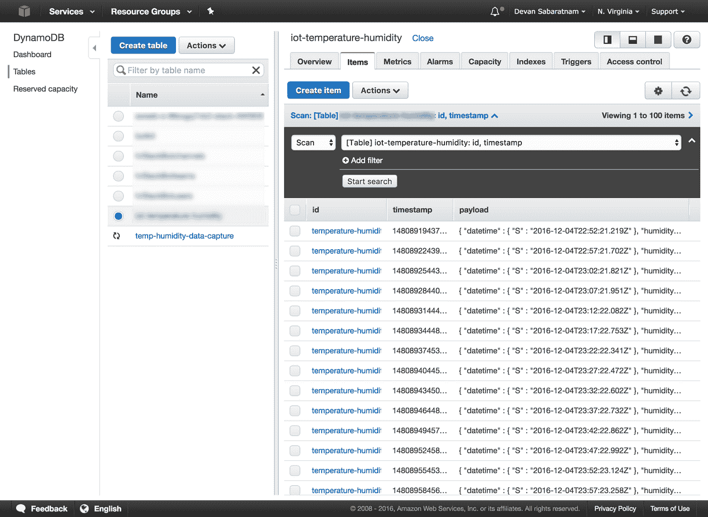

此外，如果你去亚马逊物联网仪表板，点击“*注册表*，然后点击“*事物*，然后选择你的物联网事物，然后点击“*活动*，你应该会看到从物理板到在线事物的活动历史。您可以单击每个活动行来显示正在发送的数据。

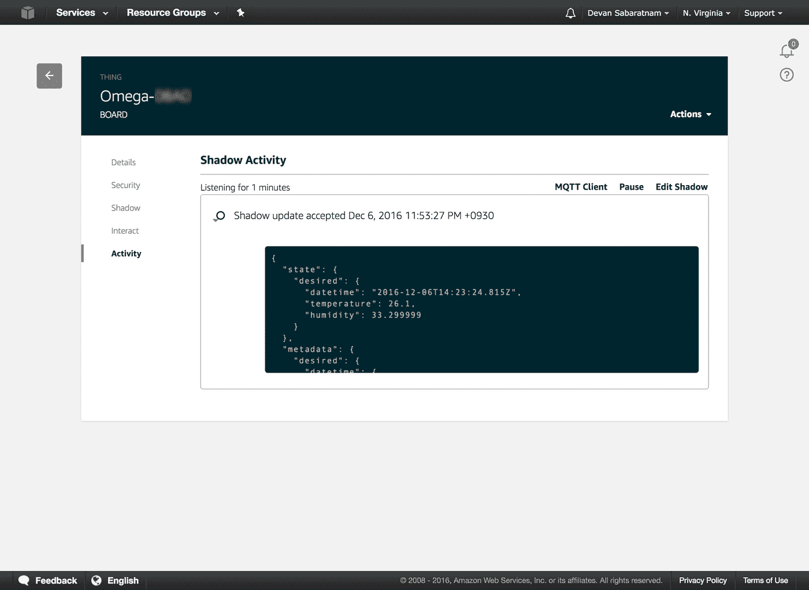

希望你在这里一切顺利。随意将 *setInterval()* 计时调整到一分钟左右，这样您就不必等那么久才能看到数据是否正在传输。事实上，可以根据自己的需要调整间隔设置。5 分钟对一些人来说可能太短，对另一些人来说可能太长。该值位于 Node.js 代码的最后一行:

1000(毫秒)x 60(一分钟中的秒)x 5(分钟)

# 建立网站

最后冲刺了。可笑的是，我们在上面所做的努力实际上是看不见的。但这一点是我们作为最终用户将会看到并与之交互的。

我们在这里要做的是建立一个简单的网站，它将从我们上面创建的 DynamoDB 表中读取过去 24 小时的数据，并将其显示在一个漂亮的 [Chart.js](http://www.chartjs.org/) 折线图中，向我们显示这段时间的温度和湿度图。网站本身是一个简单的基于 Bootstrap/jQuery 的网站，有一个单独的 HTML 文件和一个单独的文件。js 文件和我们创建图表的脚本。

因为我用亚马逊做几乎所有的事情，所以我决定用亚马逊 S3 来托管我的网站。你不一定要这样做，但这是一个非常便宜和有效的方法来快速建立一个静态站点。

更大的问题是如何读取网页上 javascript 代码块中的 DynamoDB 数据。一切都在客户端进行意味着我的亚马逊证书将不得不在一个公共可访问的平台上公开——这意味着任何人都可以获取它并在自己的代码中使用它。

我浏览的大多数知识库文章都建议使用亚马逊的 Cognito 服务' *Identity Pools* '来设置身份验证，但设置身份池是另一个漫长而痛苦的过程。到目前为止，在完成上述所有设置后，我感到很疲劳，所以我选择了一个快速的解决方案，即在我的 DynamoDB 数据表上设置一个只具有只读权限的“一次性”Amazon IAM 用户。这不是“最佳实践”,但我认为像这样的非关键应用程序(我真的不在乎谁能看到我吉他室的温度设置——它不像私人视频或安全馈送)可以满足我的需要。

此外，我在 DynamoDB 表上设置了 CloudWatch 警报，因此如果我看到恶意用户的读取率过高，我可以很容易地撤销 IAM 凭证或关闭表访问。

# 亚马逊 IAM

要设置一次性 IAM，请转到 AWS 控制台中的“*服务*”菜单，然后选择“安全性、身份和合规性”下的“ *IAM* ”。

点击左下方菜单上的“*用户*选项，然后点击“*创建*创建一个新的 IAM 用户:

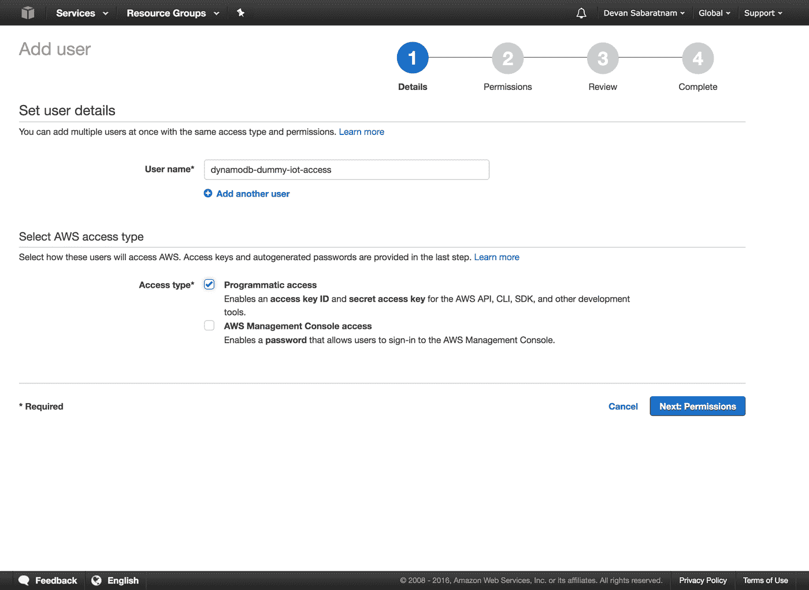

给用户起一个你喜欢的名字，但是确保你勾选了“**编程访问**”这个框。然后点击“*下一步:权限*按钮。

在下一个屏幕上，单击顶部的第三张图片，上面写着“**直接附加现有策略**”。然后点击显示“*创建策略*”的按钮。


> 注意:这将在新的浏览器选项卡上打开创建策略窗口。

在创建策略屏幕上，单击最后一个选项上的“*选择*按钮，即“*创建您自己的策略*”。

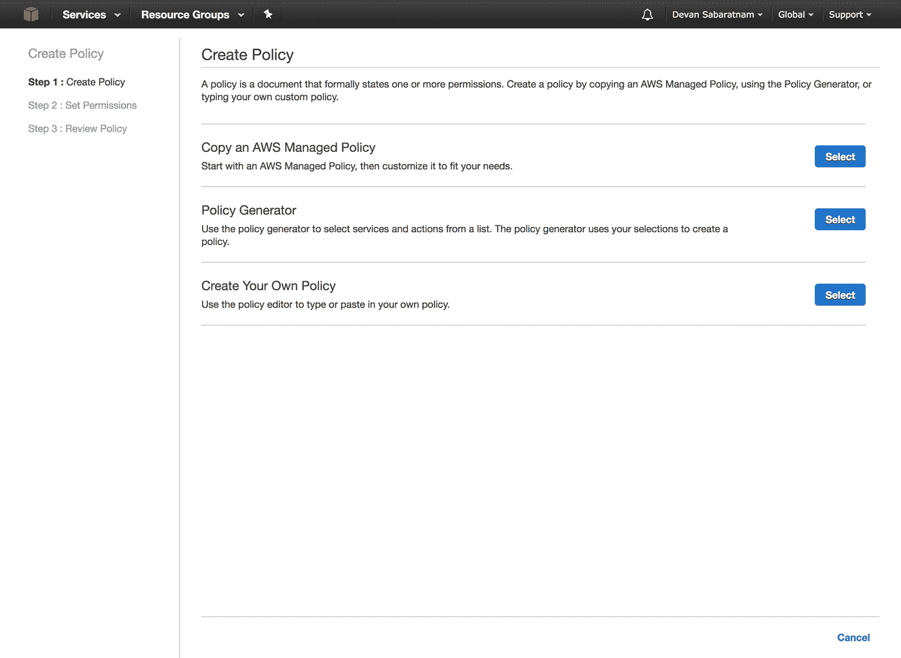

按如下方式输入保单详情。确保' *Resource* '行包含您的 DynamoDB 表的 ARN，就像我们在上面发现的那样。

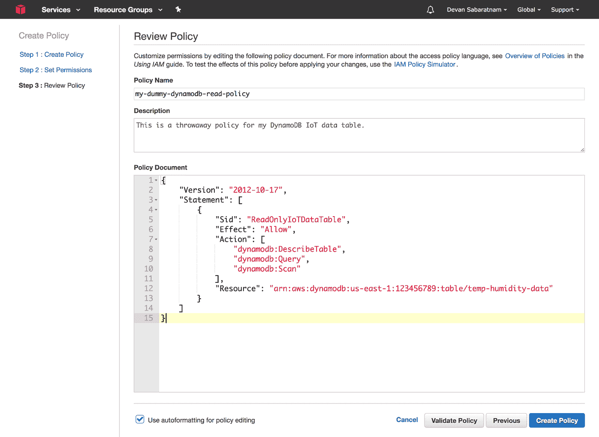

下面是您可以自己剪切并粘贴到编辑器中的策略(在其中替换您的 DynamoDB ARN 之后):

```
{
  "Version": "2012-10-17",
  "Statement": [
    {
      "Sid": "ReadOnlyIoTDataTable",
      "Effect": "Allow",
      "Action": [
        "dynamodb:DescribeTable",
        "dynamodb:Query",
        "dynamodb:Scan"
      ],
      "Resource": "<insert your DynamoDB ARN here>"
    }
  ]
}
```

完成后，单击“*验证策略*”以确保一切正常，然后单击“*创建策略*”。

现在返回到您创建用户的前一个浏览器选项卡，并单击“*刷新*”按钮。现在，您应该可以在列表中看到刚刚创建的策略。(**提示**:您可以对策略名称进行搜索)。勾选它。

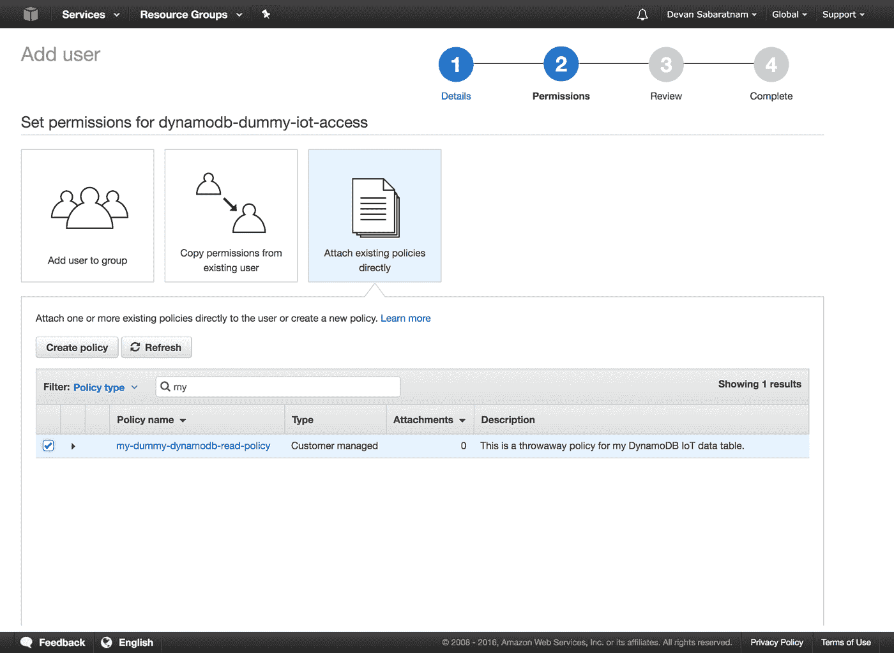

单击下一个的*进入审查屏幕，然后单击*创建用户*。*

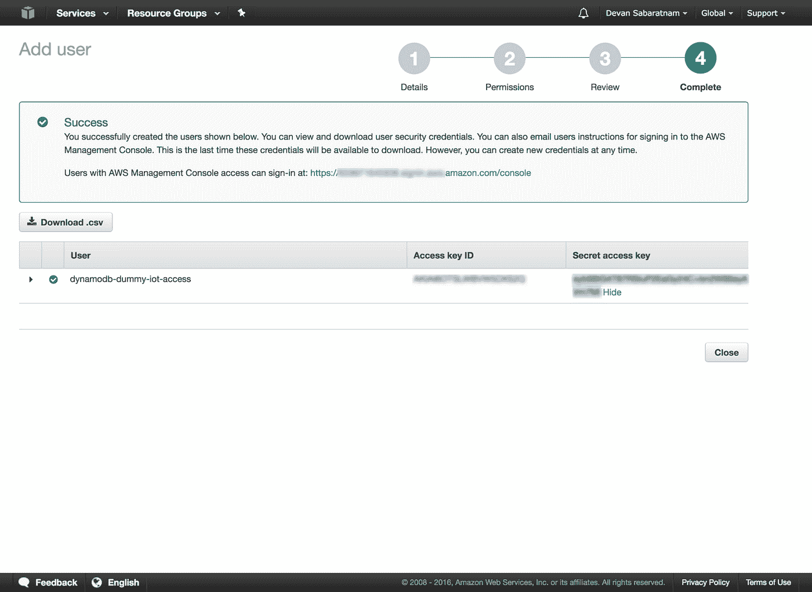

抄下密钥，点击*显示*显示秘密。把这两份都复印下来，安全地放在一边。我们将需要他们在我们的网站脚本如下。

好了，现在让我们设置亚马逊 S3 桶来托管我们的网站。

# 亚马逊 S3

点击 AWS 控制台上的“*服务*，然后选择“存储”下的“ *S3* ”。如果您以前使用过 S3，您应该会看到一个存储桶列表。点击左上角的*创建存储桶*，创建一个新的存储桶来托管您的网站。

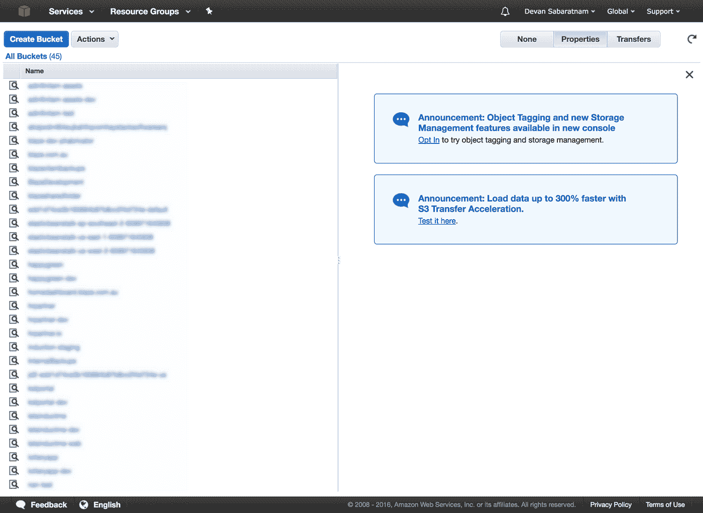

给你的桶取一个有意义的名字。

> 提示:你需要在浏览器中输入网站名称的一部分，这样有助于容易记忆，如果它给出了它的作用的提示。

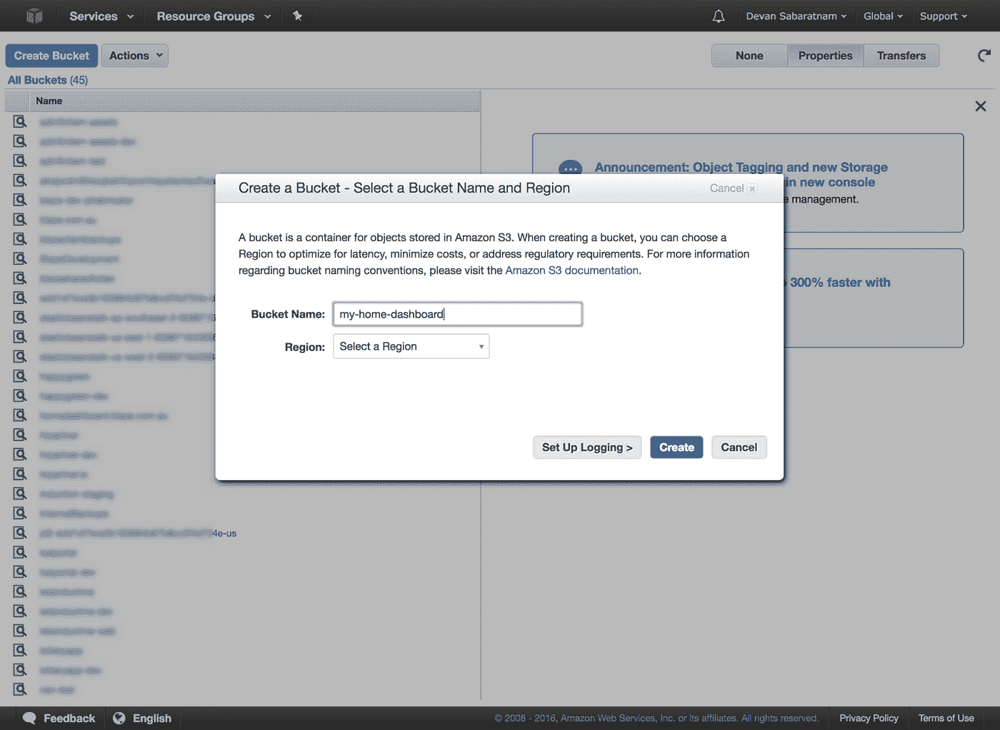

创建存储桶后，通过单击名称从存储桶列表中选择它。你的桶现在显然是空的。

点击右上角的“*属性*按钮，然后展开“*权限*部分。您将看到自己的用户名是完全访问用户。

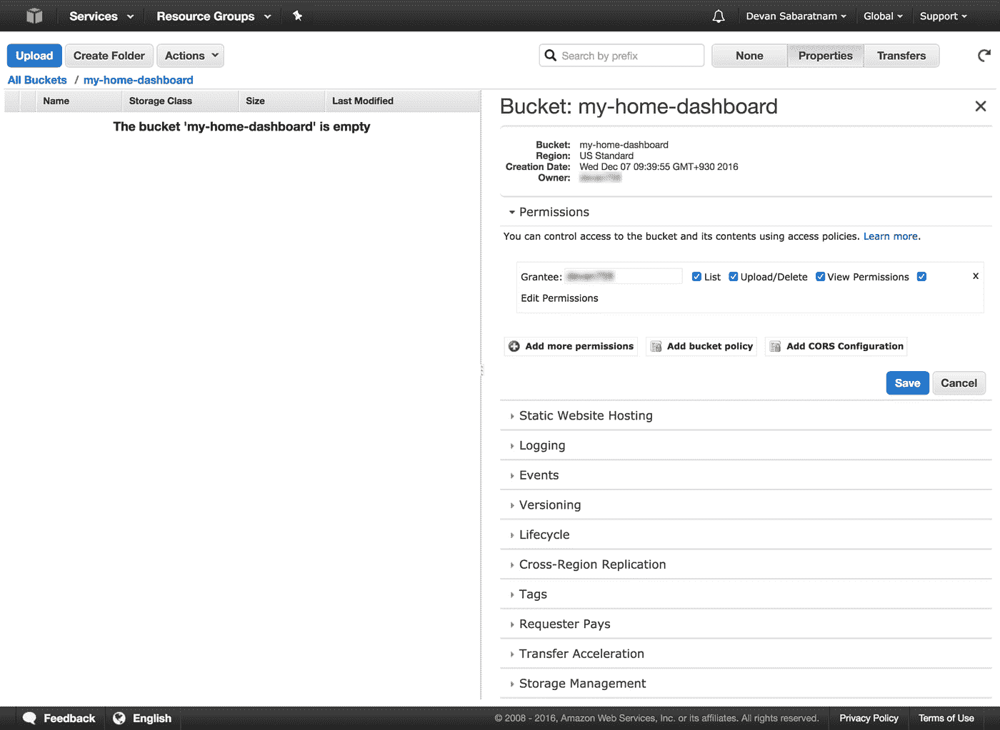

点击此处的“*添加更多权限*”按钮，从下拉列表中选择“**所有人**”，并勾选“**列表**”复选框。这将使所有公共用户能够看到这个桶的内容(即您的网页)。点击*保存*保存这些权限。

接下来，展开下面写着“*静态网站托管*”的部分。

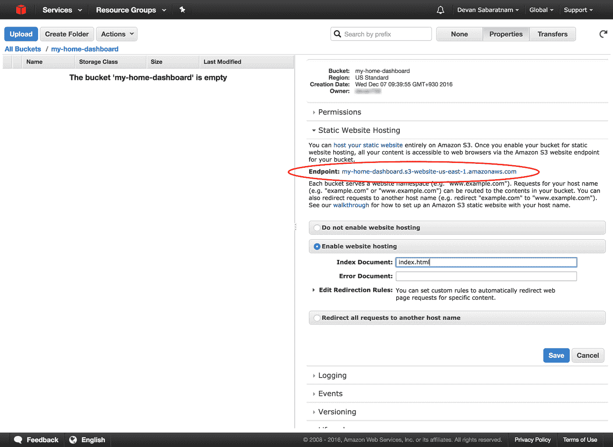

点击单选按钮“**启用网站托管**”，并在“*索引文件*”字段中输入“**index.html**”。

点击*保存*。

大概就是这样——这是在 S3 建立一个网站的最低要求。您可以稍后返回来包含错误页面文件名并设置日志记录等。，但这是我们目前所需要的。

> **注**:抄下本页的“端点”链接(用红色圈出)。这将是您稍后需要在浏览器栏中键入的网站地址，以便访问我们将设置的网页。

提示:你可以使用 Amazon Route53 为你的网站设置一个更加用户友好的名字，但是我们不会在这篇冗长的教程中深入讨论。谷歌上有很多详细的资源。

# 代码

现在谈谈网站代码本身。使用你最喜欢的编辑器创建这个**index.html**文件:

```
<!DOCTYPE html>
<html lang="en">
  <head>
    <meta charset="utf-8">
    <meta http-equiv="X-UA-Compatible" content="IE=edge">
    <meta name="viewport" content="width=device-width, initial-scale=1">
    <meta name="description" content="">
    <meta name="author" content=""><title>Home Monitoring App</title><!-- Bootstrap core CSS -->
    <link rel="stylesheet" href="[https://maxcdn.bootstrapcdn.com/bootstrap/3.3.1/css/bootstrap.min.css](https://maxcdn.bootstrapcdn.com/bootstrap/3.3.1/css/bootstrap.min.css)"><!-- HTML5 shim and Respond.js for IE8 support of HTML5 elements and media queries -->
    <!--[if lt IE 9]>
      <script src="[https://oss.maxcdn.com/html5shiv/3.7.2/html5shiv.min.js](https://oss.maxcdn.com/html5shiv/3.7.2/html5shiv.min.js)"></script>
      <script src="[https://oss.maxcdn.com/respond/1.4.2/respond.min.js](https://oss.maxcdn.com/respond/1.4.2/respond.min.js)"></script>
    <![endif]--></head><body><div class="container">
      <br />
      <div class="jumbotron text-center">
        <h1>Temperature & Humidity Dashboard</h1>
        <p class="lead">Guitar Storage Room</p>
      </div><div class="row"><div class="col-md-6"><canvas id="temperaturegraph" class="inner cover" width="500" height="320"></canvas><br />
          <div class="panel panel-default">
            <div class="panel-body">
              <div class="row">
                <div class="col-sm-3 text-right">
                  <span class="label label-danger">High</span>&nbsp;
                </div>
                <div class="col-sm-9">
                  <span id="t-high" class="text-muted">(n/a)</span>
                </div>
              </div>
              <div class="row">
                <div class="col-sm-3 text-right">
                  <span class="label label-success">Low</span>&nbsp;
                </div>
                <div class="col-sm-9">
                  <span id="t-low" class="text-muted">(n/a)</span>
                </div>
              </div>
            </div>
          </div>
        </div><div class="col-md-6"><canvas id="humiditygraph" class="inner cover" width="500" height="320"></canvas><br />
          <div class="panel panel-default">
            <div class="panel-body">
              <div class="row">
                <div class="col-sm-3 text-right">
                  <span class="label label-danger">High</span>&nbsp;
                </div>
                <div class="col-sm-9">
                  <span id="h-high" class="text-muted">(n/a)</span>
                </div>
              </div>
              <div class="row">
                <div class="col-sm-3 text-right">
                  <span class="label label-success">Low</span>&nbsp;
                </div>
                <div class="col-sm-9">
                  <span id="h-low" class="text-muted">(n/a)</span>
                </div>
              </div>
            </div>
          </div>
        </div>
      </div><div class="row">
        <div class="col-md-12">
          <p class="text-center">5 minute feed from home sensors for the past 24 hours.</p>
        </div>
      </div><footer class="footer">
        <p  class="text-center">Copyright &copy; Devan Sabaratnam - Blaze Business Software Pty Ltd</p>
      </footer></div> <!-- /container --><script src="[https://ajax.googleapis.com/ajax/libs/jquery/1.11.1/jquery.min.js](https://ajax.googleapis.com/ajax/libs/jquery/1.11.1/jquery.min.js)"></script>
    <script src="[https://sdk.amazonaws.com/js/aws-sdk-2.1.40.min.js](https://sdk.amazonaws.com/js/aws-sdk-2.1.40.min.js)"></script>
    <script src="[https://cdnjs.cloudflare.com/ajax/libs/Chart.js/2.4.0/Chart.min.js](https://cdnjs.cloudflare.com/ajax/libs/Chart.js/2.4.0/Chart.min.js)"></script>
    <script src="refresh.js"></script>
  </body>
</html>
```

这里没有什么神奇的——只是一个简单的 HTML 页面，使用 bootstrap 构造将图表画布元素放在页面的两列中。我们使用外部 CDN 链接加载所有脚本和 css 好东西，如 Bootstrap、jQuery、Amazon SDK 和 Chart.js 等。所以我们不需要用额外的东西来塞满我们的网络服务器。js 和。css 文件。

接下来，我们在一个名为 **refresh.js** 的文件中编写脚本:

```
AWS.config.region = 'us-east-1'; // Region
AWS.config.credentials = new AWS.Credentials('AKIZBYNOTREALPQCRTVQ', 'FYu9Jksl/aThIsNoT/ArEaL+K3yTR8fjpLkKg');var dynamodb = new AWS.DynamoDB();
var datumVal = new Date() - 86400000;
var params = { 
                TableName: 'iot-temperature-humidity',
                KeyConditionExpression: '#id = :iottopic and #ts >= :datum',
                ExpressionAttributeNames: {
                  "#id": "id",
                  "#ts": "timestamp"
                },
                ExpressionAttributeValues: {
                  ":iottopic": { "S" : "temperature-humidity/Omega-08AD"},
                  ":datum": { "N" : datumVal.toString()}
                }
             };/* Create the context for applying the chart to the HTML canvas */
var tctx = $("#temperaturegraph").get(0).getContext("2d");
var hctx = $("#humiditygraph").get(0).getContext("2d");/* Set the options for our chart */
var options = { 
                responsive: true,
                showLines: true,
                scales: {
                  xAxes: [{
                    display: false
                  }],
                  yAxes: [{
                    ticks: {
                      beginAtZero:true
                    }
                  }]
                } 
              };/* Set the inital data */
var tinit = {
  labels: [],
  datasets: [
    {
        label: "Temperature °C",
        backgroundColor: 'rgba(204,229,255,0.5)',
        borderColor: 'rgba(153,204,255,0.75)',
        data: []
    }
  ]
};var hinit = {
  labels: [],
  datasets: [
    {
        label: "Humidity %",
        backgroundColor: 'rgba(229,204,255,0.5)',
        borderColor: 'rgba(204,153,255,0.75)',
        data: []
    }
  ]
};var temperaturegraph = new Chart.Line(tctx, {data: tinit, options: options});
var humiditygraph = new Chart.Line(hctx, {data: hinit, options: options});$(function() {
  getData();
  $.ajaxSetup({ cache: false });
  setInterval(getData, 300000);
});/* Makes a scan of the DynamoDB table to set a data object for the chart */
function getData() {
  dynamodb.query(params, function(err, data) {
    if (err) {
      console.log(err);
      return null;
    } else {// placeholders for the data arrays
      var temperatureValues = [];
      var humidityValues = [];
      var labelValues = [];// placeholders for the data read
      var temperatureRead = 0.0;
      var humidityRead = 0.0;
      var timeRead = "";// placeholders for the high/low markers
      var temperatureHigh = -999.0;
      var humidityHigh = -999.0;
      var temperatureLow = 999.0;
      var humidityLow = 999.0;
      var temperatureHighTime = "";
      var temperatureLowTime = "";
      var humidityHighTime = "";
      var humidityLowTime = "";for (var i in data['Items']) {
        // read the values from the dynamodb JSON packet
        temperatureRead = parseFloat(data['Items'][i]['payload']['M']['temperature']['N']);
        humidityRead = parseFloat(data['Items'][i]['payload']['M']['humidity']['N']);
        timeRead = new Date(data['Items'][i]['payload']['M']['datetime']['S']);// check the read values for high/low watermarks
        if (temperatureRead < temperatureLow) {
          temperatureLow = temperatureRead;
          temperatureLowTime = timeRead;
        }
        if (temperatureRead > temperatureHigh) {
          temperatureHigh = temperatureRead;
          temperatureHighTime = timeRead;
        }
        if (humidityRead < humidityLow) {
          humidityLow = humidityRead;
          humidityLowTime = timeRead;
        }
        if (humidityRead > humidityHigh) {
          humidityHigh = humidityRead;
          humidityHighTime = timeRead;
        }// append the read data to the data arrays
        temperatureValues.push(temperatureRead);
        humidityValues.push(humidityRead);
        labelValues.push(timeRead);
      }// set the chart object data and label arrays
      temperaturegraph.data.labels = labelValues;
      temperaturegraph.data.datasets[0].data = temperatureValues;humiditygraph.data.labels = labelValues;
      humiditygraph.data.datasets[0].data = humidityValues;// redraw the graph canvas
      temperaturegraph.update();
      humiditygraph.update();// update the high/low watermark sections
      $('#t-high').text(Number(temperatureHigh).toFixed(2).toString() + '°C at ' + temperatureHighTime);
      $('#t-low').text(Number(temperatureLow).toFixed(2).toString() + '°C at ' + temperatureLowTime);
      $('#h-high').text(Number(humidityHigh).toFixed(2).toString() + '% at ' + humidityHighTime);
      $('#h-low').text(Number(humidityLow).toFixed(2).toString() + '% at ' + humidityLowTime);}
  });
}
```

让我们详细地看一下这个脚本。

前两行设置了 Amazon AWS SDK。我们需要指定 AWS 区域，然后我们需要指定用于查询 DynamoDB 表的凭证。将您在上一节中创建的密钥和密码复制并粘贴到这里。

下一位是初始化' *dynamodb* '中的 AWS DynamoDB 对象。' *datumVal* '变量包含当前日期/时间之前 24 小时的时间戳。这将在 DynamoDB 查询中用于仅选择前 24 小时内的数据行。

' *params* '对象包含的参数将被发送到 *dynamodb* 对象以选择表，并对其运行查询。我不是 NoSQL 的粉丝，主要是因为查询数据是一种巨大的痛苦，这证明了这一点。接下来的 10 行纯粹是建立一个表达式来查看 DynamoDB 表中的 *ID* 和*时间戳*列，并提取包含“*temp-weather/Omega-XXX*”的所有 ID(记住，ID 实际上是主题，包括事物标识符)，以及一个大于或等于我们之前设置的“datum”的时间戳。

接下来，在第 20 行和第 21 行，我们为两个图表设置了上下文占位符。简单的 Chart.js 文件。

第 23 到 62 行我们只是为图表设置一些默认的占位符，包括线条的颜色和阴影等等。我还使用了一些 xAxes 和 yAxes 属性来关闭 X 轴标签，并确保 Y 轴从零开始。如果您希望图形看起来更动态(或更杂乱),可以省略这些。:)).

第 64 和 65 行只是用上面的选项和上下文初始化 Chart.js 对象。

接下来是一个通用函数，它每五分钟调用一次 *getData()* 函数。您可以将 *setInterval()* 参数从 **300000** (每秒 1000 毫秒 x 每分钟 60 秒 x 5 分钟)更改为您喜欢的任何值。但鉴于我们也只是每 5 分钟将温度和湿度数据从我们的洋葱推送到亚马逊物联网，任何少于 5 分钟的检查都是多余的。尽管如此，请随意修改这些数字以适合您自己的目的。

第 70 行到最后只是 *getData()* 函数本身。这只是使用我们为查询参数等提供的' *params* '对' *dynamodb* '对象运行一个查询。

结果返回到**数据['Items']** 数组中。

第 81 到 84 行只是为图表上使用的值和标签设置占位符数组。

我设置的第 86 到 99 行纯粹是为了检查温度和湿度读数的最高和最低设置。您可以选择不这样做，但我想在主页上显示之前 24 小时内的高点/低点。我只是在这里初始化一些空变量，以便在下面的循环中使用。

第 101 到 129 行只是一个简单的循环，它遍历返回的**数据[' Items ']【T1]数组，并将键解析为我在上面定义的变量和数组。我还将读取值与最高值和最低值进行比较。对于我读取的每个数组元素，我检查最高值是否高于最后的最高值，最低值是否低于最后的值，并相应地更新最高值/最低值。**

然后，在循环之后，第 132 到 136 行用我们在循环中读取的内容更新 Chart.js 图表数据和标签。

第 139 行和第 140 行强制图表自己重绘。第 143 到 146 行使用 jQuery AJAX 调用用读数和时间更新主 web 页面上的 High 和 Low 部分。

就是这样！

保存这两个文件，然后通过返回到您的亚马逊 S3 存储桶屏幕，点击“*操作*按钮并选择“*上传文件*，将它们上传到您的存储桶。


将这两个文件拖放到上传屏幕上，但不要启动它！点击底部的*设置详细信息>* 按钮，然后立即点击*设置权限>* 。

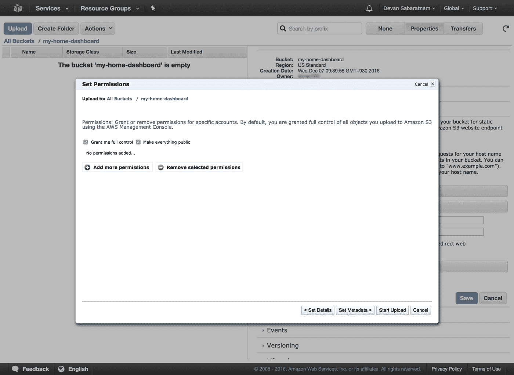

确保你勾选了写着“公开一切”的方框，否则没人能看到你的 index.html 文件！

现在点击*开始上传*开始上传这两个文件。


你完了！你能相信吗？？我们完了。完成了。已完成。

如果您在浏览器中输入我们之前记下的网站地址，您应该能够看到一个漂亮的仪表盘，显示从您的 Onion Omega 设备收集的数据。

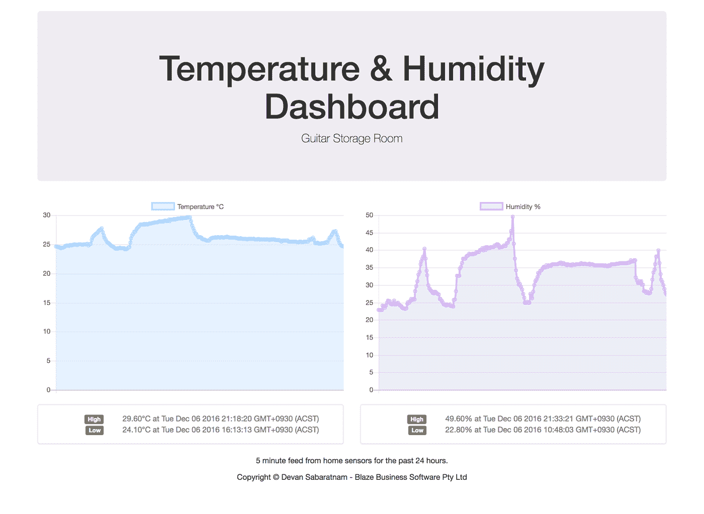

# 结论

如果你做到了这一步，那么恭喜你完成了这场马拉松。我花了几天时间来完成上面的设置，随之而来的是许多错误的开始和挫折。我希望通过记录最终对我有用的东西，我可以减少你的压力和浪费的时间，让你更快更容易地走上物联网开发的道路。

对我来说，下一步是为我的 Omega Onion 设置一个电池电源，这样它就不必连接到我的电脑上，可以放在我吉他储藏室的某个架子上，仍然可以向我报告。

如果你觉得这个教程有用，请告诉我，也请让我知道你们用物联网构建了什么——这是一个迷人的领域！

注:转自[我的个人和发展博客](http://devan.blaze.com.au/blog/2016/12/7/building-an-iot-system-using-the-onion-omega-and-amazon-aws)。如果你喜欢这篇文章，请点击下面的“心”图标。:)

[](http://bit.ly/HackernoonFB)[](https://goo.gl/k7XYbx)[](https://goo.gl/4ofytp)

> [黑客中午](http://bit.ly/Hackernoon)是黑客如何开始他们的下午。我们是 [@AMI](http://bit.ly/atAMIatAMI) 家庭的一员。我们现在[接受投稿](http://bit.ly/hackernoonsubmission)，并乐意[讨论广告&赞助](mailto:partners@amipublications.com)机会。
> 
> 如果你喜欢这个故事，我们推荐你阅读我们的[最新科技故事](http://bit.ly/hackernoonlatestt)和[趋势科技故事](https://hackernoon.com/trending)。直到下一次，不要把世界的现实想当然！

