# 在不丹建立一个开源的国家级物流系统

> 原文：<https://medium.com/hackernoon/building-an-open-source-national-scale-logistic-system-e45b597605f2>

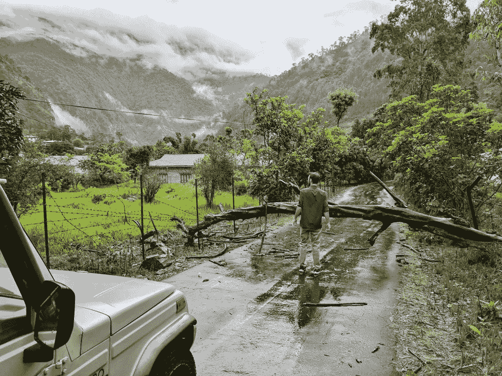

你如何建立一个复杂的物流系统，在一个发展中国家，在全国范围内收集全国范围的收获，只有很少或没有好的数据，道路条件也不平坦？。在这个案例研究中，来自 [Mountain 榛子风险投资](http://www.mountainhazelnuts.com/)(“MHV”，一家位于不丹的专门的盈利性环境公司— [参见世界经济论坛博客](https://www.weforum.org/agenda/2017/06/going-nuts-in-bhutan-using-data-to-merge-for-profit-for-purpose-and-green-at-scale/)的背景信息)，目标是从全国各地(目前地图绘制不良的道路)的数千名农民那里收集榛子收获。

> 这种方法同样适用于其他分发或收集案例，如优化向医疗中心的疫苗交付、向分销商交付材料、计划培训旅行、收集社区信息、运营最后一英里小额贷款网络等

这是完整方法的相当长的文档。从树到旅行。从战略开始，然后解释支持系统，然后是 3 步过程(1-估计收获；2-将农民的收获分成收集点，3-将收集点分成详细的卡车行程)。

从零开始建立和培训团队总共花费了大约 1000 个工时。它正在积极地更新和改进。它也基于许多开放软件。没有它是不可能的，我们会为我们拥有的每一件额外的作品节省很多时间。

# 从树到旅行:MHV 榛子物流

我们如何估计和收集不丹数百万棵树木的收成并将其送入加工厂？

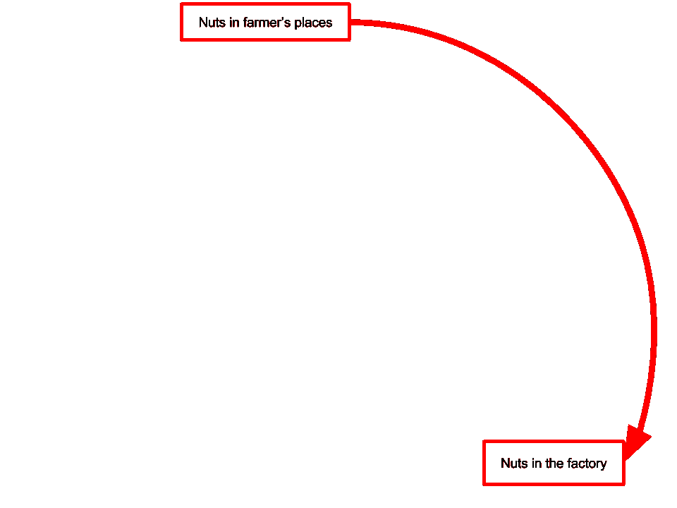

Our goal is to bring the nuts to the processing plant.

收集收获是主要的结果，但流程和管道也建立了一个可靠的、适应性强的、本地运行的数据科学团队和服务，能够支持其他问题。

# 物流系统概述

要知道收割需求，我们需要知道收割量、时间和道路通达情况。要了解这些，我们需要好的路线图(我们将使用 [OSM](http://osm.org) ，和一个定制的路线引擎( [OSRM](http://project-osrm.org/) ，它运行在 OSM 之上)来引导我们的装载卡车(“DCM”s，[一种卡车](https://www.google.ca/search?q=DCM+truck&newwindow=1&safe=off&client=ubuntu&hs=p8r&channel=fs&source=lnms&tbm=isch&sa=X&ved=0ahUKEwja9tr1uffUAhVDwj4KHfN6ANAQ_AUIBigB&biw=1920&bih=885))。这意味着我们需要 JOSM 来改善 OSM，也需要 QGIS 来可视化收获并支持决策。为了帮助绘制地图，我们使用商业服务的免费层 [MAPBOX](http://mapbox.com) (获取 OSM 数据)，以及数字地球(DG)卫星图像和来自我们的企业管理工具(RMT)的处理数据，其中包含农民位置、GPS 跟踪和树木物候数据等信息。然后，为了确定追踪的优先顺序，统计物流和估计收获，我们需要做一些数据科学。我们将使用 PYTHON，在 JUPYTER 笔记本上运行，以便于文档化和清晰化。为了注册和管理我们创建的知识，并在团队成员之间进行协作，我们将使用 GIT，并将它备份在 GITHUB 上，我们还在 GITHUB 上记录进度和问题。

软件总成本:0 美元。

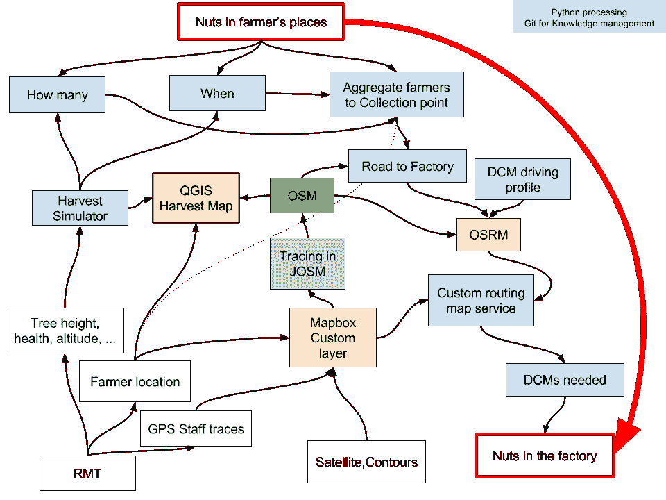

The logistics system rabbit hole. In order to bring the nuts to the processing plant, we pull several levels of tools, connecting each component. Each blue box is a “data science” python notebook on git. White boxes are input data. Other colored data are isolated tools.

# A—人员和软件

为了确保最适合的目的，连接性挑战，并最大限度地利用其他应用，我们正在集中于内部开发和培训，同时尽可能减少成本和时间投入。这意味着只要有可能，就要支持“现成的”软件工具和开源软件，运行在低规格计算机上的代码，并尽量减少对互联网的依赖。

我们最终建立了一个由 3 名本地数据科学家组成的团队(1 人以前没有编码经验，2 人来自 IT 团队，有“php”编码经验)。该团队建立了使用 *Ubuntu* 、 *Git* 、 *Github* 、 *python* (在 *jupyter* 笔记本上)、 *docker* 、 *node* 的能力，以及如何建立一个本地服务器来运行一些服务并作为二级本地存储库。


MHV Data Science team. June 2016

# B —地图

地图，尤其是地图上的道路痕迹，将是物流的核心部分。例如，安排卡车往返于农民之间。使用谷歌地图或 ESRI 不是可行的选择，原因有几个，例如:

*   许可限制(或昂贵，或不可能)使离线支持或编程定制路由。
*   他们地图在数量和质量上都是严重的、不完整的和不连贯的。更重要的是，尽管有数据和当地的勘测能力，也不可能修复它。
*   在可行的情况下，为到达农民的路线和驾驶时间设定的速度是不现实的。例如，尽管是一条“高速公路”,但许多路段正在进行翻新，未铺路面，砾石，或遭受许多路障(由于天气或施工)。换句话说，在这个“高速公路”等级中，90 公里/小时是不现实的:

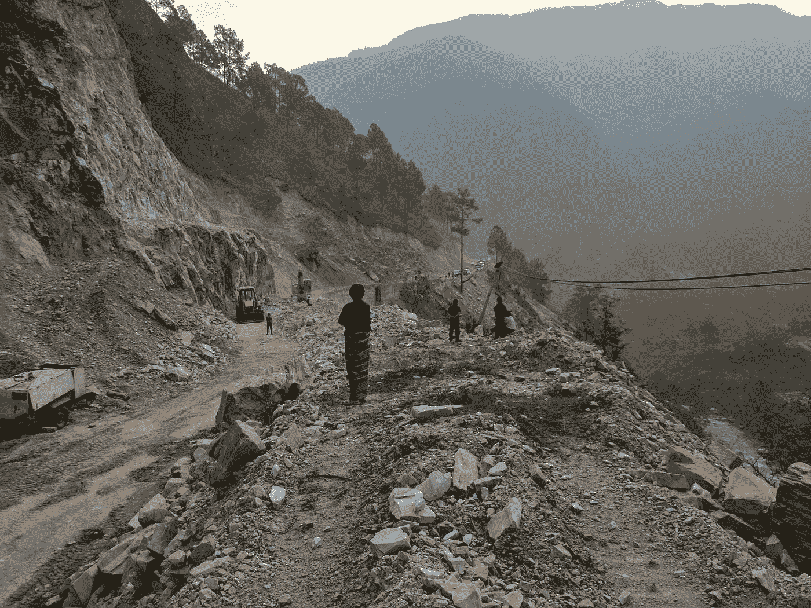

A section of the main national “Highway” outside Lighmethang

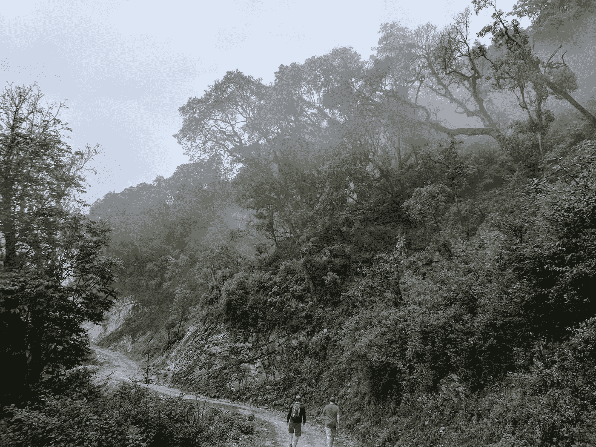

“Secondary” national road from Gyelposhing to Mongar.

我们决定使用 Openstreetmap [ [OSM](http://www.osm.org) ]。不丹[的 OSM 地图很糟糕](https://www.mapbox.com/data-platform/country/#bhutan)，比谷歌、苹果地图或必应差多了。然而:

*   它让我们能够改进它，我们有丰富的数据可以贡献给它:无论是来自公共来源，如 2017 年 5 月 9 日的[超级定时发布的数字全球优质图像](http://blog.digitalglobe.com/news/digitalglobe-satellite-imagery-launch-for-openstreetmap/)；或者我们的公司数据，例如我们的支持团队多年来每月访问每个农民的记录。
*   它使我们能够利用 OSM 的服务生态系统，从 Mapbox 使用改进的 OSM 数据的路线，到直接运行我们自己的定制路线，完全离线和针对满载卡车行驶速度的定制路线服务。
*   它允许我们以编程的方式以多种方式查询数据，例如计算农民到道路的距离，或者在道路堵塞(或铺设)时进行场景规划。

根据多项估计[例如[地图框](https://www.mapbox.com/data-platform/country/#bhutan) ]，不丹的道路只有不到 1/3 被绘制，而且还有大量的“道路岛”(被描绘的道路与其他道路不相连，因此在路线方面是孤立的。

政府、世界银行和 OSM 社区对 OSM 的大力支持也让我们深受鼓舞，他们最近开展了非常积极的试点项目，对首都进行培训和规划。

# 改进地图

一旦改进 OSM 地图成为提供良好物流规划、可视化收获需求和安排卡车路线的核心支柱，我们就决定投入时间培训团队进行道路追踪，并找出如何利用我们的公司数据实现这一目的。

我们花了一些时间在基本的网络编辑器( [iD](http://ideditor.com/) )上培训团队，但主要是在 [JOSM](https://josm.openstreetmap.de/) 上，这更适合弱互联网连接和利用定制数据源。

该公司有数百名现场支持人员监控果园的健康状况，帮助农民照顾树木和运输材料。这支队伍已经工作了几年，大约每月一次，为数千名农民中的每一个人服务；同时携带公司电话输入报告。手机还会每小时自动报告他们的位置。换句话说，我们有数百万个道路点的 GPS 记录。

为了利用我们内部的 GPS 道路登记，我们使用[地图框](https://www.mapbox.com/)。对于我们的使用量，我们可以使用他们的免费层，因此没有成本。在部署我们自己的 OSRM 实例之前，我们使用他们的服务创建了一个带有 GPS 轨迹的自定义地图，同时也测试了 OSRM 方法(这样我们就可以使用自定义的驾驶配置文件)。

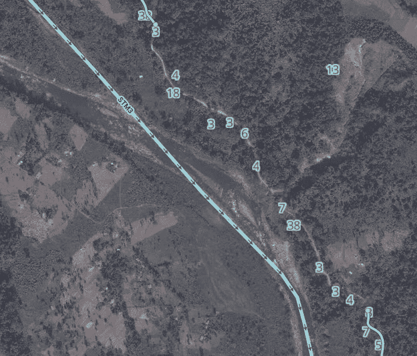

Example of an unconnected road (yellow trace on top, and yellow trace on bottom right. In this case the satellite images (Digital Globe) also shows the road connecting the sections, but we also have several GPS registration from the field staff along the untraced section of the road (red dots with number showing the GPS accuracy in meters). Map traces “© OpenStreetMap contributors”

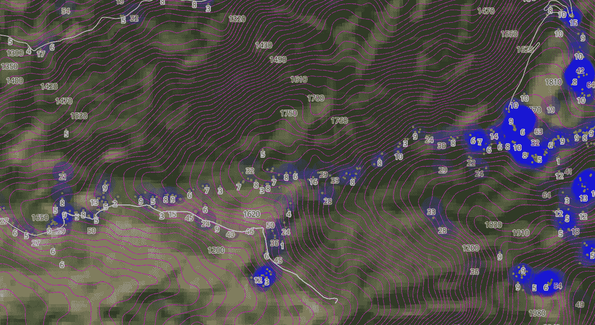

Example close-up of the custom map. In this case the underlay satellite image is not high resolution enough, or old, to see the road. The custom layer with GPS traces (green dots) show a clear untraced road across the middle. The pink lines (elevation contour lines) help trace the map, since most roads tend to follow contour lines if possible (flat). Map traces “© OpenStreetMap contributors”

# 自定义路由引擎

我们使用 [OSRM](http://www.osrm.org) ，这是一个运行在 OSM 数据上的路由引擎。其中一个好处是，我们可以创建一个“驾驶模式”,根据道路类型设置卡车的速度。例如，我们可以在高速公路上将其最大速度设置为 30 公里/小时(而不是标准行驶路线引擎的传统 120 公里/小时)，在未铺设路面的道路上设置为 15 公里/小时，在砾石路面上设置为更慢的速度，…

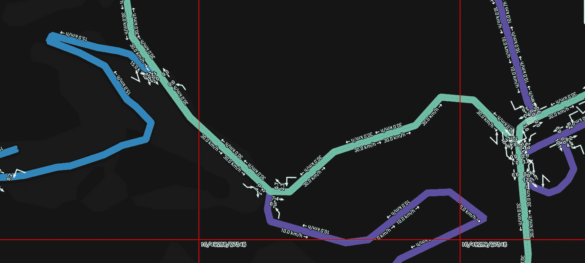

Example view of the OSRM debug map. Using a combination of the OSRM driving profiles, OSM road segment attributes, local knowledge of the roads, driving specs of loaded trucks and speed depicted on this debug map, we can tweak the parameters to create a custom routing engine for the logistic trucks.Map traces “© OpenStreetMap contributors”

我们在每个数据科学家的笔记本电脑上本地运行 OSRM 服务，以最大限度地提高速度，但也在办公室的服务器上运行，该服务器会从 OSM 自动更新，因此公司的任何人都可以使用它来制定计划或解决路障。随着我们的团队更新和改进 OSM 的地图，我们将数据下载到 OSRM，从而为我们提供最大的价值，同时使使用 OSM 的更大社区受益。运行该服务只需要三个命令，其中有[“docker”指令](https://docs.google.com/document/d/1LMaCfMxi9KqGb9SkqnvuJZNZi3olyuV9dXEsZIpO9cc/edit#)和一些用户界面定制，还有[“osm update”指令](https://docs.google.com/document/d/1LMaCfMxi9KqGb9SkqnvuJZNZi3olyuV9dXEsZIpO9cc/edit#)来自动获取最新的更改。

# 通往农民的道路

通过内部管理工具(RMT ),我们知道农民的位置，但重要的因素是知道从农民到加工厂的所有道路*和*。

该团队使用卫星数据通过 JOSM 来改善 OSM，但我们也可以通过计算每个农民到最近的已知道路的距离来帮助进行优先排序。农民可能不会住在靠近卡车路的地方，但我们可以对这些差距进行排序，以利用当地知识、卫星数据和我们的 GPS 追踪来计算出这些到道路的距离是真实的，还是未跟踪路段的结果。

使用 python，我们可以计算从每个农民到最近的道路的距离，因为 OSRM 会跟踪请求点(农民)和路径中第一个点的位置。有了这两点，我们计算“大地距离”作为地表距离的估计值:

对最大距离进行排序给出了一个非常好的制图优先级，但是我们也可以绘制“农民到道路的通路”的直方图。当地图准确时，它为“可达性”(一个重要的社会经济发展指标)提供了一个很好的代理。

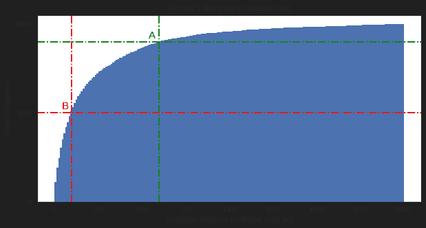

Distance from farmer to the closest road. This is a good proxy for how complete the maps is, for logistical purposes. If accurate, is also a proxy of road accessibility, an important development metric. 90% of the farmers are within 600 meters (Point “A” in green). 50% of the farmers are within 100 meters (Point “B” in red).

作为副产品，我们还可以绘制从农民到工厂的大地测量距离(直线)和道路距离之间的差异，从而了解由于山脉、河流、悬崖等原因我们需要多少偏差……这种差异表明了准确道路信息的重要性，因为道路距离大约(50%的情况下)是大地测量距离的 3 倍以上，但在 10%的情况下超过 5 倍。从这个意义上说，不丹的距离是地图上“看上去的三倍”。

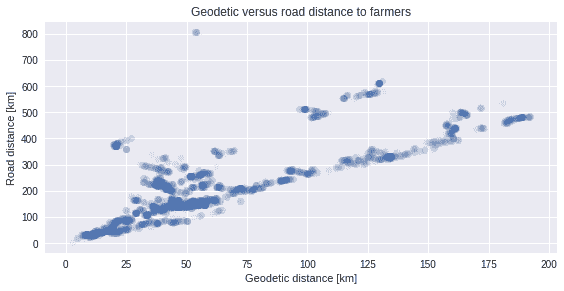

Difference in straight line (geodetic) distance and road distance to farmers. In general roads are roughly 3 times longer, but in some cases up to 5 times longer.

使用 QGIS，我们可以将结果可视化，基本上是将 OSM 背景分层，用点代表每个农民，然后汇总为省总数(使用“按位置连接”)，并根据收获总数和采集时间进行样式化。

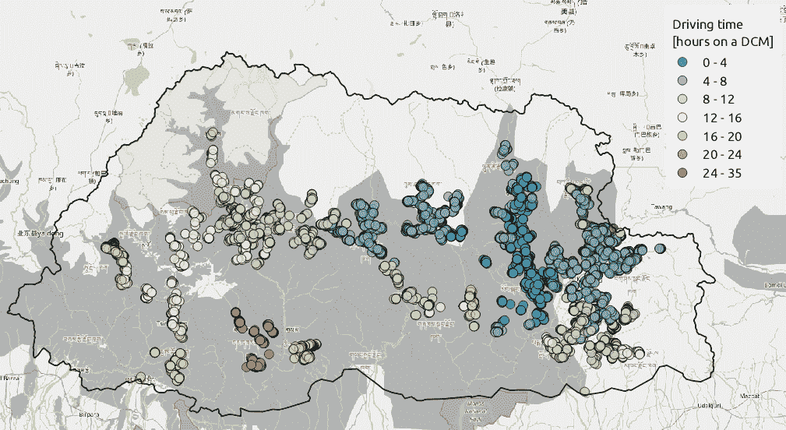

Isochrone map. Location of farmers, color-coded by the time it takes to drive to them from the processing plant. Background map is OSM. Background Map “© OpenStreetMap contributors”

# c——物流管道

一旦基础工作和所有支持系统到位，物流管道包括 3 个步骤:

1.  *估计农民的收成*
    得到每个农民将会有多少坚果，以及它们什么时候会准备好。我们的第一个模型是极其*幼稚的*，纯粹基于树高(更高的树给更多的坚果)，以及基于海拔的计时(海拔更高的树稍后给坚果)。在数据驱动模型创建了收成估计值后，应该根据每个农民的当地知识进行人工修正。
2.  *集群农民收割成集合点*
    我们不会为每一个成千上万的农民停下脚步。相反，我们创建收集点。这些收集点离拥有最多坚果的农民更近，没有农民需要通过公路去 3 公里以外的收集点。数据驱动的收集点应根据本地知识、存放预期数量坚果的实际位置等进行调整
3.  *用卡车对所有收集点进行线程访问*
    找出每个司机收集所有坚果的指令，以及他们在每次停车时应该从谁那里收集多少坚果。

如上所述，每个数据驱动的步骤之后都应进行手动调整，以考虑几个因素，如不完整的数据、文化或实际原因……例如，收集点可能装不下 2 吨坚果，但沿着道路 200 米外可能有一个好地方。

# 1-估计农民收成

第一步，要知道有多少坚果，从哪里来，什么时候准备好。

我们还没有足够的收获年份来创建一个基于上一年和公司正在收集的许多变量的更复杂的估计器。目前，我们纯粹根据果园树木的平均高度，乘以 80%的健康生长的树木，得出一个保守而天真的产量。定时是随高度的线性延迟(作为榛子专家告知的第一个粗略估计)。

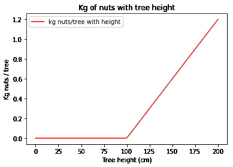

坚果，数据可以在果园一级获得，每个农民可能有几个果园。由于收集的第一阶段是让农民在他们的房子里晒干它们，我们需要将它们全部聚集到农民的位置。物流是在农民层面，而不是果园层面。

# 2 个收集点

我们不能停下来为成千上万的农民中的每一个人收割庄稼，尤其是当许多农民聚集在一起时。创建收集点效率更高，这样卡车可以最大限度地减少停车次数。每个收集点应确保农民不必带着收获走很远的路，并根据收获准备好的时间安排收集窗口。

既然我们现在已经有了收成估计值和通往农民的道路，那么创建收集点的第一步在程序上就很简单:订购收成递减的农民，并通过道路将 3 公里内的所有其他农民带到该点。

我们只需要在收获季节停下来一次。由于时间主要取决于海拔高度，在一个收集点的所有农民之间不会有太大的传播。低海拔的农民可以等一两个星期，让高海拔的农民准备好。我们跟踪每个农民的时间，以及时间的分布，以防我们手动将这些分成不同周的两个收集点。

基于邻近阈值对采集点进行聚类的代码，以及基于收获量的优先级，归结为几行 python 代码。第一部分计算每个农民到所有其他农民的距离，第二部分按照预期收获量递减的顺序计算农民，并加上 3 公里以内的所有其他农民。

请注意，任何道路都不能短于测地距离，因此跳过直线距离超过 3 km 的农民非常有效(“fast_range”函数)。

我们还尝试了基于其他属性的聚类，但事实证明它们比上面的方法差:

*   大地距离。速度非常快，但中间没有一条河或一座山。在不丹很常见。
*   管理边界。考虑到景观，这可能是有意义的，但这些边界为更近的农民创造了非常人为的限制。

在每个集群上，我们跟踪谁属于它，因此有一个简单而重要的步骤，即绘制这些集群，并与现场工作人员仔细检查它们，调整实际提货位置、集群成员或我们可能遗漏的其他重要信息。

# C —卡车行程的收集点

一旦我们有了收集点，我们需要从工厂调度卡车，尽量减少卡车的数量，以及它们行驶的时间。

我们的方法是按周划分收获，就好像每周都是自己的收获，一周内什么时候收集并不重要。

对于每辆卡车，我们假设 2 名司机，每天工作 8 小时，并为他们的每次行程增加 20%的时间。我们使用定制的路线引擎，该引擎根据道路类型、路面具有特定的卡车速度，限制对某些类型的访问(例如，不要使用足迹)。我们还假设装卸速度为 1 吨/小时。

当我们计算卡车车队每一阶段的停留时间时，我们打印出一张指示单，上面有行驶方向、收集站和从谁那里收集的收获物、记录卡车的累计时间和装载物…

对于每个星期，我们将第一辆卡车发送到最远的点(无论如何我们必须去那里，并且从那里开始，我们可以重复使用回程)。我们将旅行时间添加到卡车计数中，以及在该站收集收获的时间。

我们还会检查收集站的收获量是否比卡车装载的多(例如 6 吨)。如果是这样的话，我们计算出我们需要多少满载的卡车。我们发送一辆空车，计算往返行程和装载/卸载周期，并将其发送回下一辆所需的满载卡车。这些前往遥远收集点的旅行是卡车车队随着收获量的增加而增加的主要因素。

一旦收集完毕，我们会检查下一个最近的收集点，看它是否适合卡车。如果是这样，我们就把它送过去。如果卡车满载，我们把它送到工厂，计算卸货时间，然后再把它送回最远的地方。

为数百个站点选择最近的点非常耗时。与收集停靠点步骤不同，我们需要检查所有对，因此我们不能使用测地线技巧来提高效率。相反，我们使用 OSRM 的“*表*”服务。有了它，我们可以发送多达 100 个位置，OSRM 将返回所有距离对的矩阵。将这些请求批处理到一个查找表中有点棘手，但它使这一步大约快了 1000 倍:

在前往下一个收集站之前，我们还要检查卡车是否用完了一周的所有可用时间(2 名司机，8 小时/天* 7 天/周= 112 小时/周)。如果是这样，我们不是把它送过去，而是把它送到工厂，因为这意味着一周结束了。如果在回来的路上，他们用完了那一周的时间；在下一周，我们把这个时间作为溢出来添加(他们会回来)。

# 说明书

这是收获收集表的一个示例:

```
# Harvest Collection instructions
Generated on 2017–06–23 09:41:59.193354
* DCM max load: 6000
* Drivers per DCM: 2
* Max driving hours per driver per day: 8
* Max weekly hours per DCM (with above settings): 112
* Loading speed: 1000 kg per hour
71.0% of collection points (***) need full truck loads.
*** stops to make, for a total of *** tons of nuts
## Week: ***
** pickups this week to do. Total harvest *** Kg.
 — — -Status before pick up — — — 
Trucks kg. loads: [0]
Trucks hr. usage: [0]
Next pick up confirmed. Going there:
* osrm_cluster:
***
* VILLAGE:
***
* LOCATIONNAME:
***
* MONITOR:
***
* elevationmain:
***
* collection_total:
***
* farmers:
[‘***’,’***’,’***’,’***’]
* farmers_harvest:
[‘***’,’***’,’***’,’***’]
* collection_weeks:
[‘***’,’***’,’***’,’***’]
Directions to next collection point:
[http://mhv**.com:9966/?z=9&loc=27.3**,90.5**&loc=27.2**,91.1**](http://mhv**.com:9966/?z=9&loc=27.3**,90.5**&loc=27.2**,91.1**)
*** Kg, *** h away, ***h to load
9 pickups left to do. Harvest left *** Kg.
Closest stop is ***…
```

下面是一个更复杂的阶段，有一个相当大的车队，下一站需要几辆满载的卡车，一辆卡车即将完成一周的可用时间:

```
Trucks kg. loads: [*,*,*,*,*,*,*,*,*,*,*,*,*,*,*,*,*,*,*,*,*,*,*,*,*,*,*,*,*,*,*,*,*,*,*,*,*,*,*,*,*,*,*,*,*,*,*,*,*,*,*,*,*,*,*,*,*,*,*,*,*,*,*,*,*,*,*,*,*,*,*,*,*,*,*,*,*,*,*,*,*,*,*,*,*,*,*,*,*,*,*,*,*,*,*,*,*,*,*,*,*,*,*,*,*,*,*,*,*,*,*,*,*,*,*,*,*,*,*,*,*,*,*,*,*,*,*,*,*,*,*,*,*,*,*,*,*,*,*,*,*,*,*,*,*,*,*,*,*,*]
Trucks hr. usage: [*,*,*,*,*,*,*,*,*,*,*,*,*,*,*,*,*,*,*,*,*,*,*,*,*,*,*,*,*,*,*,*,*,*,*,*,*,*,*,*,*,*,*,*,*,*,*,*,*,*,*,*,*,*,*,*,*,*,*,*,*,*,*,*,*,*,*,*,*,*,*,*,*,*,*,*,*,*,*,*,*,*,*,*,*,*,*,*,*,*,*,*,*,*,*,*,*,*,*,*,*,*,*,*,*,*,*,*,*,*,*,*,*,*,*,*,*,*,*,*,*,*,*,*,*,*,*,*,*,*,*,*,*,*,*,*,*,*,*,*,*,*,*,*,*,*,*,*,*,*]
-> This place needs 2 full DCMs, and **** remains to pick up
-> Sending free truck 37 of fleet.
-> Directions:
-> [http://mhv**.com:9966/?z=9&loc=27.3**,90.5**&loc=27.2**,91.1**](http://mhv**.com:9966/?z=9&loc=27.3**,90.5**&loc=27.2**,91.1**)
-> Sending free truck 38 of fleet.
-> Directions:
-> [http://mhv**.com:9966/?z=9&loc=27.3**,90.5**&loc=27.2**,91.1**](http://mhv**.com:9966/?z=9&loc=27.3**,90.5**&loc=27.2**,91.1**)
Truck won’t hold next stop. Don’t go collect, back to factory, ** away.
Directions:
[http://mhv**.com:9966/?z=9&loc=27.3**,90.5**&loc=27.2**,91.1**](http://mhv**.com:9966/?z=9&loc=27.3**,90.5**&loc=27.2**,91.1**)
At the factory, truck aims again for further stop: ********
Next pick up confirmed. Going there:
* osrm_cluster:
********
* VILLAGE:
********
* LOCATIONNAME:
********
* MONITOR:
********
* elevationmain:
********
* collection_total:
********
* farmers:
[‘***’,’***’,’***’,’***’,’***’,’***’,’***’]
* farmers_harvest:
[‘***’,’***’,’***’,’***’,’***’,’***’,’***’]
* collection_weeks:
[‘***’,’***’,’***’,’***’,’***’,’***’,’***’]
Directions to next collection point:
[http://mhvpl.com:9966/?z=9&loc=27.270028,91.151296&
loc=27.154957,91.538055](http://mhvpl.com:9966/?z=9&loc=27.270028,91.151296&loc=27.154957,91.538055)
****** Kg, ****** h away, ****** h to load
****** pickups left to do. Harvest left ****** Kg.
```


Example of truck directions. To the 20h of travel time, the logistics system adds a 20% buffer, and 1h/ton of load at the collection site. If this is a full truck load, it means that a full truck would be used for 36 hours, or 1/3 or the available time in one week (with 2 drivers, and 8h/day).

我们期待您的评论和反馈。谢谢大家！

MHV 数据科学团队