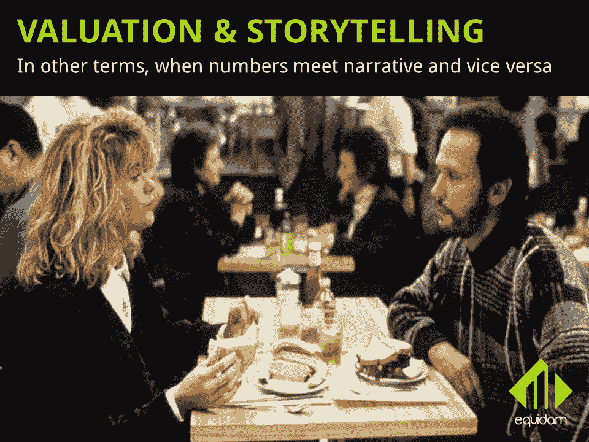

# 独角兽估值只能用数字来解释吗？

> 原文：<https://medium.com/hackernoon/can-unicorn-valuation-be-explained-only-by-numbers-919d25569ec2>

## 换句话说，当数字遇到叙事，反之亦然

你能完全依靠金融工具和模型来衡量一个公司的价值吗？你应该忽略数字背后的故事和愿景吗？

我们说，数字和故事之间的相互作用产生了最可靠的估价。

# 创业估值解释

业务评估流程是双方之间的协议，其中转让的对象是一项业务，或者经常是这项业务的一部分。为了达成协议，企业家与投资者建立关系非常重要。**信任**和**关于业务和投资条款的透明度**是与投资者建立良好关系的两个要素。

在谈判过程中，基本上有三件重要的事情需要记住(并保持透明)——放弃的股权比例、投资金额和估值。

在最初的投资讨论中，你的目标应该是找出对你的对手来说最敏感的变量是什么——他们不太愿意谈判的变量。这样你就可以准备和调整自己的谈判策略。股权通常是弹性较小的杠杆，而投资额和估值有较大的变化。

*让我们举下面这个例子:*

*如果你觉得桌子另一边的人不太愿意讨论估值范围，那就强调你需要多少资金才能达到目标，并进入下一轮融资。对资本如何投资有一个清晰的逐步计划，以及对你的增长战略有一个可理解的定义，将进一步加强你的投资主张。*

许多投资者在谈判时都牢记着他们希望得到的股权比例。要想在谈判中取得成功，你需要考虑你的创业公司的发展阶段，因为通常情况下，百分比与阶段有关。一般来说，对于第一轮融资(种子期前)，你可以谈判 10% -20%的股权。在接下来的阶段——种子到 A 轮，协商的范围增加到 15%-35%。

> *为了清楚地了解初创公司在不同发展阶段的谈判范围，请看一下* [*初创公司融资路径*](https://www.equidam.com/ranges-of-negotiation-at-different-stages-of-a-startup/)

你可以做两件事:

1)尽量在这些范围内协商

2)提出有数据支持的强有力的假设，证明风投的先入之见是错误的

创建可靠假设的方法之一是调查可比公司，即那些在规模、公司类型和行业上相似的公司或交易。为你的假设提供坚实的论据，为就你需要的投资资本和你准备放弃的股权比例进行谈判扫清道路。

你可以协商的另一点是你的**估值**——你的企业的公平市场价值。

首先，让我们澄清一下什么是估值。

估价是:

*   支持你主张的文书
*   衡量和量化未来的严格流程(基于一组假设)

估价是**不是**:

*   一个目的本身:数字只是数字
*   一门科学——一幅完美而无可争议的未来图景

总而言之，估值不是一个独立的概念。你应该利用你的财务模型、战略和增长计划来帮助你表达你的观点。

> 如果没有叙述作为支撑，金融模型、战略和增长计划就没有多大意义

# 数字 vs 故事

目前的估值格局分为两部分——叙述人和数字人。

从他们的名字就可以看出，数字人们认为**估值主要是关于数字**，叙事和故事是分散注意力的东西，只是包含了投资中的非理性因素。大多数传统估值从业者都支持这一信条。

另一方面，我们找到了记叙文的人，他们相信在评估公司时讲故事的力量。人们说**估值和一般的投资都是关于伟大的故事**，并且发现当面临不确定性时，不可能试图估计具体的数字。

我们认为，这绝不是简单的非此即彼。

> 估价是叙述和数据处理的混合

**那么，你应该如何构建你的估值案例呢？**

你需要有强有力的、可辩护的论证来巩固你的财务模型和估值背后的假设。这将使整体投资主张更加合理。你可以用市场数据来证明你的假设的可信度。

另一个让你的假设更可行的方法是使用你的故事。

这个故事让人们看到你的公司背后的愿景和潜力，并有助于将其转化为数字。最终，投资者购买的是你公司的潜力，所以你需要确保他们清楚你对公司的愿景。

*额外好处:叙述会在情感层面吸引你的潜在投资者，帮助他们记住更多关于你的投资主张的信息。*

> “如果你相信它所附带的故事，你就相信了它的价值”

# 赋值过程

NYU 大学教授 Aswath Damodaran 是初创公司估值方面的专家，他创建了一个循序渐进的框架来评估一家公司。

**第 1 步|撰写叙述**

开发一个愿景，一种使命感，一个有里程碑的可信计划，并带着紧迫感传达出来。

这里有一个定义紧急程度的有用框架:

当回答这些问题时，试着强调你的相关经验和以前在这个行业的记录。在讲述你的创业故事时，展示你的热情和激情，努力展示你的领导力和自信——投资者在企业家身上寻找这些品质。

**第二步|测试叙述**

选择一个有[可能性、似是而非的故事](https://www.equidam.com/negotiating-with-investors-three-elements-that-make-your-story-compelling/)。测试它并接受反馈。

这里需要注意几个细节。当谈到叙事时，人们真正理解的只有两层复杂性。如果他们需要更多的时间来理解，你的故事可能太复杂了。一旦你的叙述完成，试着把你的故事告诉不同的人，看看他们是否理解并认同。

*快速提示:尝试不同的受众，有保留地接受他们的反馈——不是每个人都能理解，但是越多越好。*

**步骤 3 |将叙述转化为价值驱动因素**

一旦你测试了你的故事，把它转换成价值驱动因素。换句话说，给你的故事附上数字，以加强你的叙述，使之具体化。

有两种方法可以做到这一点——自顶向下和自底向上。

**自上而下的方法**(由外向内):关注全局——总的可用市场规模、目标市场份额等。根据收购数量、转换率和其他指标对这些组成部分进行细分，以估计公司的预期业绩。

**自下而上的方法**(由内而外):关注公司及其驱动因素，如生产率、价格、招聘等。对这些指标的未来发展做出假设，并使用这些假设得出公司的预期绩效。

在这两种方法之间进行选择完全取决于公司的类型以及做出假设所需数据的可用性。无论你选择哪种方法，构成你公司业绩的数字都需要有证据支持，证明公司能够达到这些目标。例如，你可以用类似公司(可比公司)的业绩作为基准。

快速提示:自上而下的方法更适合年轻、高增长的公司。当你没有可靠的市场数据时，自下而上的方法是适用的。

**第 4 步|将驱动因素与估价联系起来**

这是你进行实际估价的时刻。你可以使用一些工具和资源来确定公司的具体价值。我们建议结合使用各种方法和计算来得出全面的估价。

不要忘记，估值只是你在金融建模过程中所做假设的反映。所以，不断质疑和挑战你自己的假设。

在谈判过程中，把重点放在假设上，而不是估价本身。如果对方同意他们，那么他们将很可能同意估价。

**第五步|保持反馈回路开放**

最后一个建议是，对你的故事充满热情，但不要把它当成教条。为你创造的故事辩护，但接受批评。如果对你提出的假设有异议，试着找出主要的批评，并努力消除分歧。

*快速提示:明确假设和价值驱动因素，并就此征求反馈，这使得设定共同的里程碑变得更加容易。*

如果你把第 1 步到第 3 步做对了，那么第 4 步和第 5 步可能会非常顺利。但是**准备好谈判**。请记住，信任仍然是每项投资的一个重要方面:没有信任，完成谈判阶段将需要长得多的时间。

# 案例研究:优步叙事(截至 2014 年 9 月)

优步的故事及其独角兽估值一直备受争议。这也使它成为叙事如何影响估值并使一家公司的价值增加数倍的完美例子。

在 FiveThirtyEight 上的一篇帖子中，达摩达兰教授试图质疑拼车公司估值的巨大数字。他说“*优步的增长潜力不仅在于能够在汽车服务市场占据更大的份额，还在于通过吸引那些使用公共交通工具或自己开车的人来扩大这个市场。*

他采用上面提到的自上而下的方法来评估公司的价值。其中一个方法是找出该公司未来现金流的现值。根据 Damodaran 教授的说法，优步的未来现金流取决于三个因素——潜在市场的规模、优步的市场份额和优步占总收入的百分比。

他做出的一个关键假设是，优步正完全专注于汽车服务市场。他估计全球出租车和汽车服务市场的年增长率为 6%，因此预计 2024 年的可用市场总额为 1830 亿美元。

他所做的另一个假设是对优步市场份额的估计。全球汽车服务市场仍然四分五裂——每个城市都有当地的领导者。网络效应是有限的，因为在纽约寻找出租车的客户不能从不同位置的可用出租车或汽车中受益。当时，优步的目标**市场份额**估计为 10%。

为了估计公司的价值，他假设优步将保留他们 20%的票价佣金以及他们的低成本模式。

达摩达兰教授为优步的**估值**得出了一个具体的数字——59 亿美元，比优步在 2014 年(进行分析的时间)的估值低了惊人的 3 倍。

2014 年 9 月，基于最近 12 亿美元的投资，优步的估值为 170 亿美元

# 数字如何解释这一点？

答案是他们不能。

比尔·格利在他的[帖子](http://abovethecrowd.com/2014/07/11/how-to-miss-by-a-mile-an-alternative-look-at-ubers-potential-market-size/)(对达摩达兰的回复)中提到了这个问题，在那里他驳斥了达摩达兰的假设。格利解释说，优步汽车公司不仅要颠覆和取代汽车服务行业，还要颠覆和取代汽车拥有行业。

考虑到全球汽车工业，优步的可用市场总量大大超过了 Damodaran 的计算。

Gurley 还指出，优步的用户群越大，他们能够获得的合作伙伴就越多。因此，全球网络效应也存在，这影响了优步能够占据的市场份额。

基于此，他声称优步的估值至少是达莫达兰当时估计的 25 倍。

**而差异完全来自于围绕数字的故事！**

事实上，优步发展得如此之快，一切似乎都有可能。但是是吗？时间会证明…

这里有一个完整的案例分析，以及一些关于如何在你的推销中融入你的愿景的见解:

> [黑客中午](http://bit.ly/Hackernoon)是黑客如何开始他们的下午。我们是 [@AMI](http://bit.ly/atAMIatAMI) 家庭的一员。我们现在[接受投稿](http://bit.ly/hackernoonsubmission)，并乐意[讨论广告&赞助](mailto:partners@amipublications.com)机会。
> 
> 如果你喜欢这个故事，我们推荐你阅读我们的[最新科技故事](http://bit.ly/hackernoonlatestt)和[趋势科技故事](https://hackernoon.com/trending)。直到下一次，不要把世界的现实想当然！

