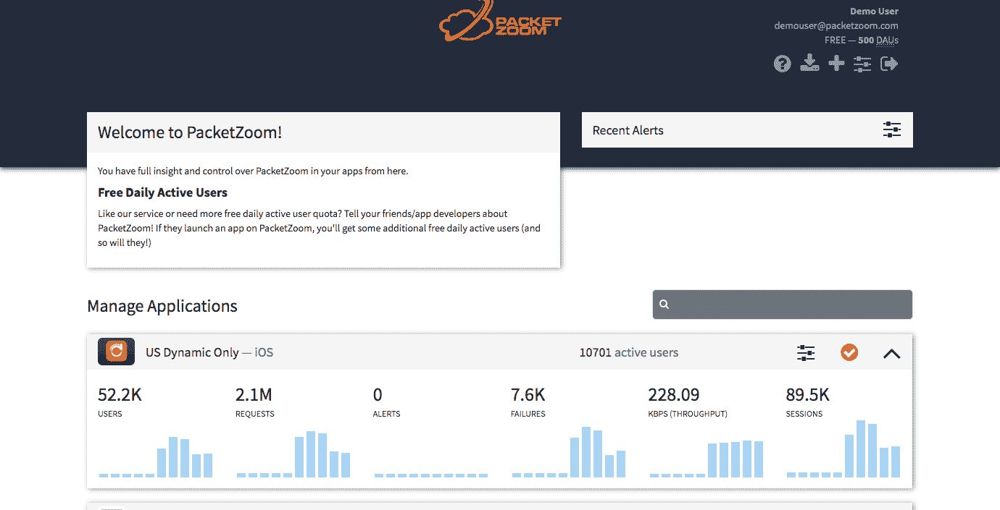
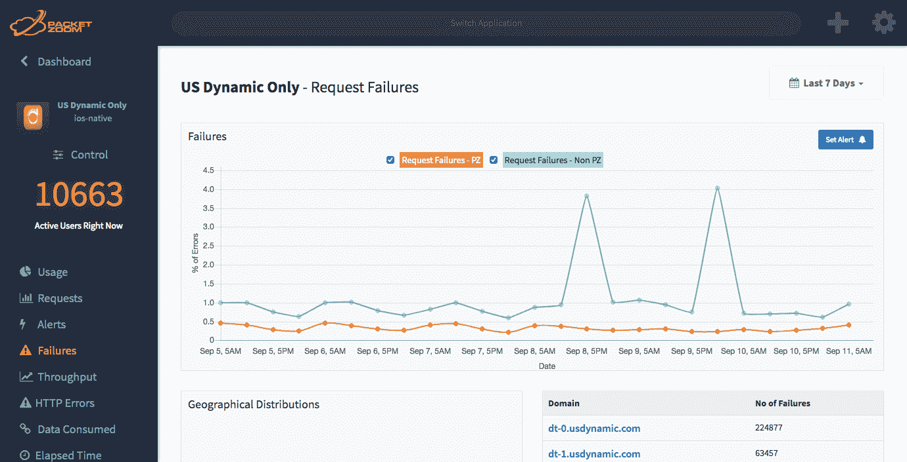

# 我们能“拯救”你的下一个计划外移动应用发布吗？

> 原文：<https://medium.com/hackernoon/can-we-save-your-next-unplanned-mobile-app-release-67bec4dd9dca>

在某些情况下，惊喜可能是好的，但当涉及到意想不到的应用程序行为，或者更糟糕的是——一个糟糕的应用程序商店评论——我们都很乐意通过。不幸的是，当操作流行的移动[应用](https://hackernoon.com/tagged/apps)时，开发者在将应用提交给商店并且用户开始下载后，对应用几乎没有控制权。如果应用程序出现问题，或者开发人员需要对其进行任何调整，他们除了向应用程序商店提交一个全新的版本并重新经历发布过程之外，几乎没有什么可以做的。

很多时候，这些计划外发布的原因与应用速度慢和性能差有关。一些这样的原因包括:

*   **缓慢的移动网络**:移动设备使用全球数百个移动和 Wi-Fi 网络访问云的方式存在太多未知的变量。东南亚或拉丁美洲的用户最有可能通过速度较慢且不稳定的手机连接使用该应用程序，而更发达国家的用户在拥挤的城市中信号会更好，但丢包率更高。
*   **太多的域/SDK**:通过使用第三方服务，移动应用变得越来越复杂。普通的移动应用程序使用大约 8 个 SDK 来提供各种服务，如货币化、细分、[记录](https://hackernoon.com/tagged/logging)和报告。在运行时使用这些服务意味着调用开发者无法控制的第三方域。
*   传统网络内容分发网络(cdn):内容分发网络(cdn)在二十年前帮助互联网扩大规模，现在仍然为移动应用提供一些价值。不幸的是，这些服务不是为移动开发者设计的，并且不需要通过他们的网络路由所有的应用流量，限制了开发者的控制。此外，网络 cdn 无法帮助第三方服务，除非他们已经直接与这些供应商合作。
*   传统网络协议:TCP 是在 30 年前设计的，迄今为止一直很好地服务于我们。可悲的是，TCP 有多个弱点，这使得它在移动网络上效率低下，但它很少或根本没有为开发人员提供控制。诸如域优先级、连接超时和并发连接数等行为无法调整。

为了获得一些可见性，许多开发人员添加了计时器来监控重要的应用程序功能，并在应用程序出现异常行为时发送警报。为了在生产危机期间挽回面子，开发人员添加了终止开关来禁用第三方服务和某些应用程序功能。通常情况下，他们不够快，人手不足，所以他们最终开发和构建一个特殊的软件补丁来解决问题。

我们能做得更好吗？

PacketZoom 是一个移动网络专家团体。我们花了四年时间为应用开发新的移动网络堆栈，并成功地将其销售给需要更快、更可靠的应用解决方案的企业。

作为开发人员，我们希望帮助其他开发人员构建更好的应用程序，并在应用程序提交到应用程序商店后获得更多的控制权。为了做到这一点，我们开发了一个免费的解决方案，可以让你回到驾驶方向盘后面。我们称这个解决方案为移动智商。

Mobile IQ 是一个 SDK，对于大多数平台来说，它只需要一行集成代码。大多数开发人员能够在几分钟内完成集成(如 t [的视频](https://www.youtube.com/watch?v=-UA9O_0XMKI&feature=player_embedded)所示)。不需要任何其他代码更改。

集成和部署后，Mobile IQ 可在多个应用 KPI 上提供来自终端用户设备的近实时信息，包括:

用户和请求信息

网络错误

吞吐量

经过的时间(即等待时间)

连接断开

Mobile IQ 旨在简化故障诊断，并具有鼠标驱动的过滤器，允许用户深入以下任何方面:

1.  地理
2.  域(即服务器)
3.  网络类型(WiFI、LTE、3G、2G)
4.  实际运营商(如美国电话电报公司、T-Mo、沃达丰等。)

Mobile IQ 提供了一种为任何类型的数据或数据趋势设置阈值的简单方法。一旦超过阈值，将使用电子邮件或 slack 集成发出警报。

及时意识到一个问题是重要的一步。能够执行快速根本原因分析甚至更好，但是现在该怎么办呢？

Mobile IQ 包括访问一些重要的应用程序网络控制功能，这些功能可以为您节省不必要的压力，降低风险，或许还可以永久消除网络挑战。这些功能包括:

*   **Http 连接优化** —在开发期间，开发人员无法知道运行时的底层网络是什么，因此我们使用默认的连接参数，这些参数基本上是为处理最小公分母而设计的。不幸的是，这意味着超时参数对于快速网络来说太高，而对于慢速网络来说太低。通过让 PacketZoom 覆盖默认参数，您基本上可以定制到用户网络环境的每个 http 连接。
*   URL 重定向(URL Redirect)—有时，将流量从一个给定的 URL 重定向到另一个 URL，以便进行调试、故障排除或暂时缓解疼痛，这可能会变得很方便。由于 PacketZoom SDK 充当应用内代理，这是一个简单而方便的功能。
*   **域阻止** —在服务问题受到单个或多个域数据包影响的情况下，Zoom SDK 可用于阻止(暂时或永久)某些呼叫。这种功能可用于“控制”有操作问题的第三方服务提供商。
*   **降低错误率—** 与应用程序错误不同，网络错误超出了应用程序开发人员的控制范围，因此可能成为挫折的来源。在高于期望的 400’或 500’网络错误的情况下，对于一定比例的用户，Mobile IQ 可以用于用新的现代协议(也称为 PZ 协议)替换传统协议，并对差异进行基准测试。这可以通过简单地定义一个内容过滤器(使用正则表达式)来实现，当特定的调用与过滤器匹配时，它们将使用 PZ 协议为选定的用户执行。

*   **加速内容下载** —与实验室测试不同，当测量来自多个地理位置和不同网络的生产内容下载速度时，很容易注意到完成某些功能(例如，加载主屏幕、下载高质量图像、播放视频广告)所需时间的高度可变性。同样，应用程序开发人员很难控制这种行为。在性能不佳的情况下，Mobile IQ 可以用于为一定比例的用户替换新的现代协议，并对差异进行基准测试。这可以通过简单地定义一个内容过滤器(使用正则表达式)来实现，当特定的调用与过滤器匹配时，它们将使用 PZ 协议为选定的用户执行。
*   **域优先级** —如前所述，第三方服务如今更受应用开发者的欢迎。不幸的是，当使用传统的 Http over TCP 时，我们对诸如连接数和它们的执行顺序之类的事情控制较少。Mobile IQ 允许开发人员尝试一种新的现代网络协议，除了提高性能和可靠性之外，还可以根据优先级列表指定 Http 请求的顺序。如果广告呈现是最高优先级，只需将广告网络域设置在列表的顶部，以确保在调用任何其他域之前获取和呈现广告。

应用开发者与两大应用商店的关系通常很复杂。虽然他们喜欢应用程序商店分发应用程序和推动应用程序发现的能力，但每当需要对他们的应用程序进行哪怕是最微小的调整时，这可能会令人沮丧，这通常是由移动网络和应用程序性能相关的问题引起的。幸运的是，许多计划外的应用程序发布现在可以通过直接通过 Mobile IQ 进行影响应用程序性能的更改来避免。查看此[产品概述视频](https://www.youtube.com/watch?v=vN1x7cNFgQU)。