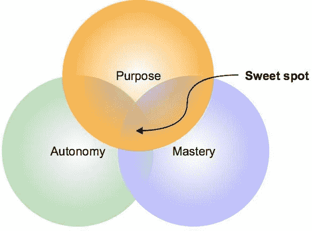

# 职业发展

> 原文：<https://medium.com/hackernoon/career-development-cdbd57956161>

多年来，作为一名经理和领导者，以及最近的一名导师，我经常有人问我他们应该如何发展自己的职业生涯——有时甚至更直白，比如“我如何获得晋升？”这些年来，随着经历和我的导师们影响了我的想法，我的答案也发生了变化。

首先声明:我唯一的经历是我所谓的渐进式职业发展。有些人在天赋、智力或机遇方面非常出众，他们走的是一条更加戏剧化的道路——比如埃隆·马斯克、比尔·盖茨或马克·扎克伯格。我会把那些故事留给传记作者，坚持我所知道的。

我认为加速晋升的一种情况是，企业家以 CEO 或 CTO 的身份创建一家成长中的公司，然后被一家大公司收购。这些人经常在大公司获得副总裁或更好的职位，有时还很年轻。但这肯定不是一条容易的路——他们真的赢得了这条路！

当你开始考虑职业发展时，最好先退一步，问问自己到底在寻找什么。我认为，我们都不时被一种猖獗的趋势所诱惑，那就是以我们赚了多少钱来衡量自己的价值。全力抵抗这个陷阱。
我强烈推荐花 13 分钟看罗伯特·瓦丁格的 [Ted 演讲，他是哈佛成人发展研究的现任主任，这是历史上最全面的纵向研究之一。他正在报道的这项研究已经进行了 75 年，跟踪了一大群男性(抱歉，是 75 年前开始的)，发现健康快乐长寿的共同模式是维持牢固健康的人际关系。与金钱和地位无关，对吗？](http://www.ted.com/talks/robert_waldinger_what_makes_a_good_life_lessons_from_the_longest_study_on_happiness)

好吧，所以让我们不要让我们在工作中的野心妨碍建立和维持强大和健康的关系。但是，我们仍然可以努力在工作中获得满足感。那么，在我们的工作中，什么是充实或激励？显然，我不能代表所有人，但是丹尼尔·平克用 50 年的行为科学推翻了关于人类动机的传统智慧。[他关于动机科学的 TED 演讲](http://www.ted.com/talks/dan_pink_on_motivation?language=en)是有史以来十大最受关注的 TED 演讲之一。关键的激励因素不是金钱，而是目标、[、自主性](https://hackernoon.com/tagged/autonomy)和掌控力(我记得这是首字母缩写 PAM，它让我想起了我的好朋友和一个干劲十足的员工。)

**目的**:将你的工作与更大的目标联系起来，无论是公司的愿景、改善生活还是让世界变得更美好。

自主性:对你的工作有足够的控制权，在合理的范围内，你可以做决定(并被问责)。)

**精通**:不断学习和提高你的知识和技能。

如果这些激励因素对你来说是真的，不要问“我怎样才能得到提升？”而是“我如何才能实现更大的目标、自主权和掌控力？”你当然可以独自追求这三个维度，但要尝试寻求你的经理的帮助。如果，当你提出这个话题时，你的经理给你这样的表情:

可能是时候找一个新的经理了。

多年来，当我与人讨论职业发展时，我很少强调积满灰尘的“职业发展计划”，而是强调“下一个有意义的挑战”。

这是一个任务或项目，大小适合个人，并符合他们的短期或长期愿望。员工比经理更容易发现挑战。这不仅有助于与利益保持一致，而且确定需求的工作也有助于发展本身。

经理和员工应确保目的得到充分理解和重视，明确活动自主性的界限，并明确地将知识和技能的获取与兴趣结合起来。经理应该提供必要的支持。

这种方法对个人(满意度和简历上的一颗子弹)和公司(有用的交付和积极参与的员工)来说是双赢的。当然，一旦完成，接下来就是“ ***下一个*** 有意义的挑战了”这是一个比制定和遵循正式计划更适合大多数人(尤其是年轻人)的踏脚石方法。长期目标会随着时间的推移而出现。

如果你真的试图在目前的职位上追求帕姆，但毫无结果，那么现在肯定是时候去别处看看了。在这种情况下，你的事业和动力会停滞不前。

职业发展也将受益于另外两个策略。首先，寻找导师，无论他们是正式的公司项目的一部分，还是非正式的，在公司内部还是外部。慢慢找一个好的潜在导师(问别人！)然后鼓起勇气直接问。在大多数情况下，潜在导师会很高兴被邀请，并乐意提供帮助。

第二，经常征求反馈。更妙的是，[求教](https://m.signalvnoise.com/unlock-honest-feedback-with-this-one-word-dcaf3839e7ee#.jiatr87qw)。问问你的经理、同事、向你汇报的人以及任何和你一起工作的人。在你的请求中要具体:“我希望在主持会议时变得更有效——你有什么建议给我吗？”当你收到反馈时，仔细听，做笔记，然后说“谢谢！”避免任何批评或防御姿态。马歇尔·戈德史密斯，这位广受认可也是我最喜欢的领导力教练，在这个问题上做了一个精彩的[视频](https://www.youtube.com/watch?v=tFX74GIxca4)。

总之，确保你:

*   知道自己在追求什么，
*   不要以牺牲重要的关系为代价，
*   寻求目标、自主和掌握(PAM)，
*   当你现在的公司不能再帮助你时，继续前进，
*   专注于下一个有意义的挑战，让宏伟的计划随着时间的推移而浮现，
*   利用各种导师，
*   经常求教。

我很想听听处于职业生涯不同阶段的人们的意见。这有用吗，有意义吗？你的经历是什么？