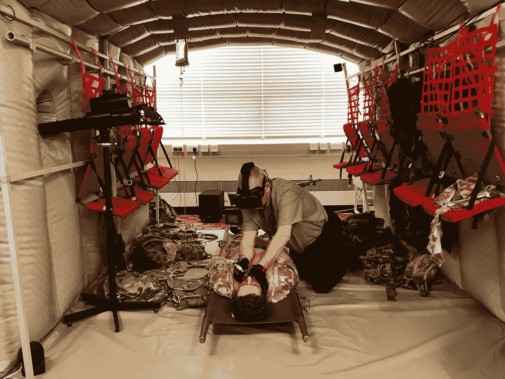
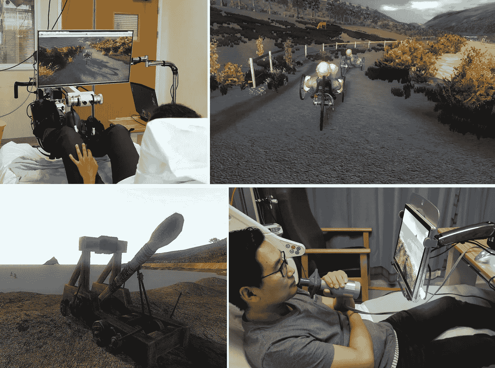
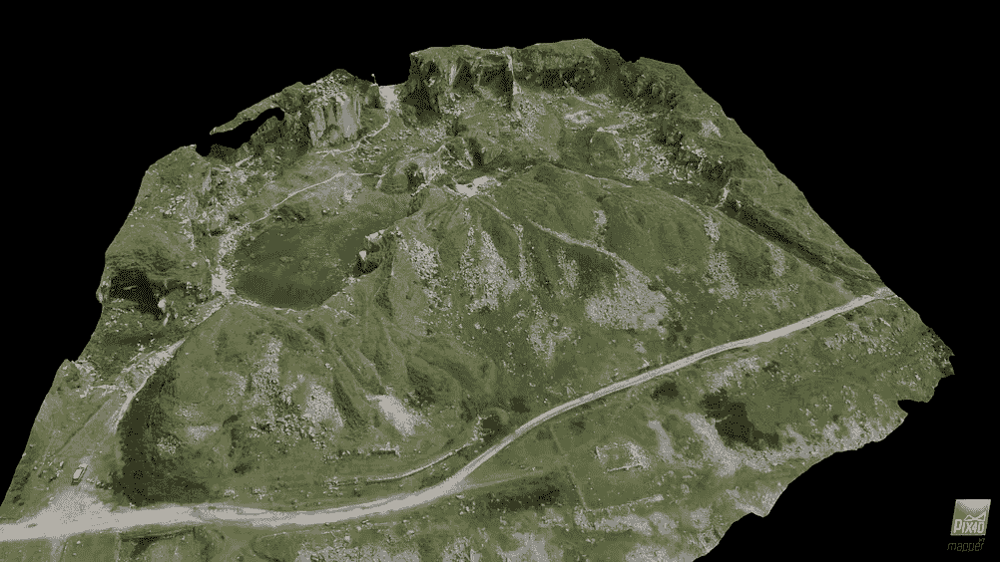
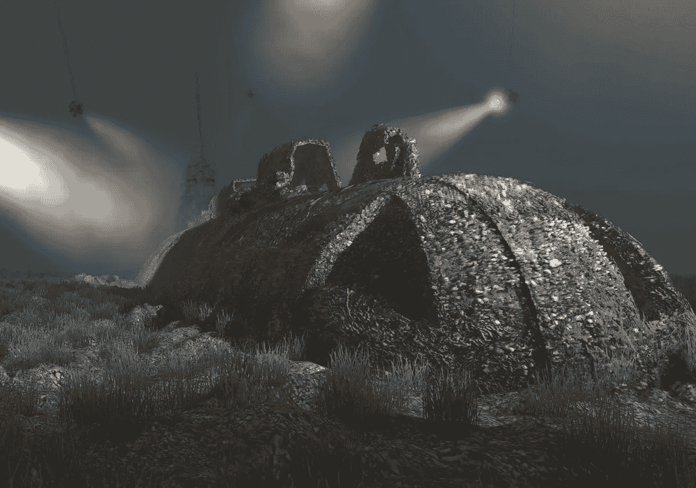

# 庆祝虚拟现实 30 周年:罗伯特·j·斯通教授谈人的因素以及虚拟现实和增强现实的未来

> 原文：<https://medium.com/hackernoon/celebrating-30-years-in-vr-professor-robert-j-508304bcc687>

领导伯明翰大学 VR/人机界面技术团队的 Robert J. Stone 教授今年(2017 年)庆祝了他在虚拟现实领域的 30 周年纪念。

他开发的虚拟现实“热门产品”包括:1993 年第一个[虚拟现实](https://hackernoon.com/tagged/virtual-reality) &模拟(VRS)倡议之一，1992 年第一个(如果不是*第一个*触觉反馈手套)的发明，以及 1995 年世界上第一个锁孔手术技能训练器 MIST *VR* 的设计和开发。MIST *VR* 成为世界上第一个部分任务手术技能训练器，在国际范围内被采用和评估，并被德国欧洲外科研究所采用为*事实上的*技能训练器。

凡妮莎·拉德采访了斯通，他也是 XR 联盟的创始成员。

***凡妮莎·拉德:鲍勃，首先祝贺你从事 VR 事业 30 周年！非常感谢您与我们分享您的经验以及您对 VR(和 AR)未来的看法。我相信我们所有人都可以从你的经验中学到很多东西，特别是在实施以人为中心的设计和让虚拟现实项目从实验室走向现实生活部署方面。***

你能先和我们分享一下你的背景吗？

鲍勃·斯通:我的学术背景是应用心理学和人的因素(也叫工效学)。简而言之，从 UCL 大学毕业后，我开始了我的职业生涯，在英国布里斯托尔的英国航空航天公司担任人为因素专家，从事国防、海底石油和天然气以及空间领域的工作，然后，在 1987 年在加利福尼亚州的美国宇航局研究中心获得惊人的经历后，我于 1979 年加入英国国家高级机器人研究中心，从事虚拟现实和“远程呈现”领域的研究和开发。然后，在 1993 年到 1995 年间成功启动并完成了一个完全由行业资助的虚拟现实和模拟项目后，我成为了一家名为 VR Solutions 的小型衍生公司的主管。这家公司在 7 年的时间里经历了许多过山车般的转变，包括被两家美国机构收购，我最终决定在 2003 年“跳到”学术界。今天，我在伯明翰大学工程学院领导一个由研究人员和学生组成的小组，叫做人机界面技术(HIT)小组。

瓦妮莎·拉德:请告诉我们你做的工作。你和你的团队专注于哪些垂直行业？

鲍勃·斯通:至于行业领域，我和我的团队倾向于参与我们认为存在特定技术挑战或我们可以帮助的任何地方——从独立的角度来看——潜在的采纳者为他们的组织和最终用户做出正确的 VR 或 ar 技术选择。然而，就我们“专攻”的领域而言，根据主要和可持续项目的发展方向，我会说我们在国防、医疗保健和遗产领域尤其活跃。

例如，在国防领域，我们在潜艇模拟、反恐和拆弹机器人培训、混合现实或用于指挥和控制的“MxR”技术，以及最后但并非最不重要的国防医疗保健(例如，未来武装部队护理人员的 MxR 培训)等领域有着特别好的记录。

在一般的医疗保健领域，我们过去已经开发了用于外科培训和教育的 VR 和 AR；今天，我们正在研究将虚拟自然场景引入医院重症监护病房，以帮助改善患者的睡眠质量和术后康复。

最后，在遗产领域，这是我个人的“最爱”(因为它使我们能够与学生和公众密切合作)，我们开展了广泛的项目，如使用无人机重建具有历史意义的偏远地区的虚拟现实模型、海底沉船可视化，以及与美国的同事合作开发虚拟现实和增强现实内容，以支持计划于 2020 年举行的*五月花 400* 纪念活动的教育方面。

**凡妮莎·拉德:你的作品中有多少是研究虚拟现实和增强现实的？**

Bob Stone:历史上，我和我的团队的工作一直专注于虚拟现实，但今天，特别是我们的许多项目领域专注于国防，医疗保健和遗产，我们可能会像在虚拟现实中一样，在 AR 和 MxR 上投入更多的精力。我预计 MxR 在未来几年将会有强劲的增长，因为我相信将“真实的最佳”与“虚拟的最佳，或增强的最佳”相结合，将会提供培训和实时可视化方面最可信和最实惠的解决方案。

说到这里，我不得不坦白，我个人在 VR、AR 或 MxR 方面的技术实现技巧相当有限！我有一个由非常能干的专家组成的小团队，他们在 3D 建模、基于物理的渲染和 VR 工具包开发等领域提供专业知识。我的主要专业领域是，并且一直是，人为因素和以人为中心的设计——试图确保我们向在真实世界中承担真实任务的真实人员提供适当的交互式硬件技术和适当的内容。

> 为了让 VR、AR 和 MxR 取得成功，特别是考虑到我的团队的学术性质，我们不能简单地在舒适的学术实验室中开发我们的解决方案和演示程序，在那些可能从我们的研究中受益的人根本不会阅读的期刊上发表论文！！我们必须从一开始就与最终用户合作，并贯穿项目的每个阶段。

Vanessa Radd:告诉我们更多关于你在 VR 和 AR 方面的进展。

Bob Stone:这些年来，我的商业和学术团队都开发了大量我们称之为“概念能力演示者”的东西。这意味着，在对未经证实的技术进行重大和高风险投资之前，我们在短时间内承担小型、独立的项目，与赞助商密切合作，开发他们和他们的同事或员工可以评估的东西(遗憾的是，我们今天在 VR 和 AR 社区看到了很多)。我的团队的投资组合是巨大的，有太多的项目要在这里总结。但是它们确实非常多样化，从潜艇安全训练到用于军事/安全服务指挥和控制的未来 AR 和 MxR 概念以及下一代飞机概念；从重现普利茅斯湾的历史沉船和海底栖息地到达特穆尔的废弃铁路线和考古遗址；从未来的自主船到英国国家海洋水族馆的 AR 展览的新想法。

偶尔，我们很幸运能够将我们的开发推向市场，或者至少让最终用户进行测试和评估。20 世纪 90 年代末，由我之前的商业 VR 团队开发的一个近距离射击 VR 训练系统被安装在皇家海军位于 HMS Collingwood 的陆地基地，并被用于多年的基础武器训练。类似地，直升机后机组人员虚拟现实系统被交付给英国皇家空军，并定期用于其在肖伯里(英格兰)和山谷(威尔士)的搜索和救援基地的训练。基于英国皇家空军*龙卷风*飞机的扩展虚拟现实模型的航空电子设备维护训练系统也被安装在英国皇家空军基地，并且多年来非常有效地使用。在将解决方案推向“市场”方面，一个特别成功的例子是英国当前拆弹机器人 *CUTLASS* 的远程驾驶和操纵模拟器。在使用虚拟现实软件工具包进行了大约 3 到 4 年的开发和测试后，我们(这在英国大学中是独一无二的)得到了赞助，与当地一家小公司合作，向英国各地的爆炸物处理(EOD)中队以及塞浦路斯和直布罗陀交付了 42 台模拟器。

Vanessa Radd:迄今为止，你在虚拟现实领域最大的成就是什么？你最自豪的是什么？

鲍勃·斯通:这个问题很难回答，因为几乎每个月都会带来新的挑战，使我们能够测试当今一些虚拟现实和增强现实技术的极限。当然，我们并不总是成功，但是当我们成功的时候，对于车队来说，这总是一个巨大而令人兴奋的成就！回顾过去 30 年，有许多成就让我感到非常自豪。早在 1993 年，我们就在 VR Solutions Ltd 发起了虚拟现实与模拟(Virtual Reality & Simulation)或 *VRS* 计划，当时我们还是英国国家高级机器人研究中心的一部分。1993 年 1 月，我的团队偶然出现在英国广播公司(BBC)的 *9 点新闻*中，之后我们从工业界得到了巨大的反响。以至于我们能够在没有任何英国政府或研究委员会支持的情况下，召集大大小小的公司来赞助一个为期 3 年的研究和演示项目！我们在 *VRS* 计划中提到的一些公司是英国核燃料公司、GEC 阿尔斯通公司、帝国化学公司、劳斯莱斯公司和维克斯造船工程有限公司(今天是英国宇航系统公司的一部分)。

不幸的是，另一项成就是在 1992 年发明了第一只(如果不是第一只的话)触觉反馈手套，尽管这只是昙花一现。*teletect*是一个气动原型，最初由 20 个小“气袋”组成，分布在莱卡手套的下部，由微毛细管供给。它最初被设计用来与 VPL 的*数据手套*配合使用。事实上，当 VPL 在 1990 年申请破产时，一个商业协议正沿着这些路线发展。

我想我最自豪的一项成就(因为它几乎影响了此后的每一个 VR、AR 和 MxR 项目)是 1995 年世界上第一个锁孔手术技能训练器 MIST *VR* 的设计和开发。简而言之，MIST *VR* 是由英国沃尔夫森基金会和卫生部于 1994 年发起的一个项目演变而来的，该项目的首要目标是评估新兴虚拟现实技术为未来的医生提供经济高效的锁孔手术培训的潜力。MIST *VR* 成为世界上第一个部分任务手术技能训练器，在国际范围内被采用和评估，并被德国欧洲外科研究所采用为*事实上的*技能训练器。

> 然而，更重要的是，MIST *VR* 项目决定性地证明，通过从 VR 项目一开始就采用强有力的以人为中心的设计方法，人们太容易受到昂贵、迷人和未经证实的技术的影响，并投入大量资金来实现最高保真度(和同样昂贵)的解决方案。

花四个下午在手术室观察外科医生进行各种锁孔手术，使我们能够设计和开发一种更简单——也更实惠——的解决方案，最终(正如医疗界所证实的)提供实习外科医生所需要的东西。

今天，我很自豪能领导一个由非常有能力的研究科学家和虚拟现实专家组成的团队。我们还非常幸运地在过去吸引了——事实上，还在继续吸引——一些非常热情和能干的学生与我们一起承担项目，包括本科生和研究生。HIT 团队确实非常小，我们的资金水平也很低，当然与目前虚拟世界中的疯狂换手形成鲜明对比(尽管我们希望有一天，我们可能会找到一个热情的捐助者，他可能会赞助我们做更多的事情，并与我们合作，将我们的解决方案推向市场！).然而，尽管我们的规模很大，但我们“力不从心”，人们经常对我们开展的广泛活动以及我们交付的速度和质量感到惊讶。

Vanessa Radd:虚拟现实和新兴技术最成功、最实用的应用是什么——你认为这些改变游戏规则的发展在哪里？以及在哪些行业？

鲍勃·斯通:VR 和 AR 电路的评论员总是喋喋不休地谈论 VR 和 AR 的“杀手级应用”的缺乏。好几年了都是这样！不过，在某些方面，我同意有一种看法，即这两种技术都还没有在非游戏领域产生重大影响，也没有得到适当的记录(即没有被公关炒作“掩盖”)。

事实上，VR 和 AR 在成为游戏领域的主流之前还有一段路要走。然而，自从 VR 的第二次急速上升和下降(即 2000 年代早期至中期)结束以来，就可用的硬件设备和软件工具包而言，VR 以及(目前)AR 的可负担性和可访问性已经在越来越多的应用程序中开辟了大量机会。

培训是一个明显的例子，现在有许多案例研究表明，在国防和医疗保健(包括外科手术培训、“挑战培训”(即上级的决定)和病人康复的各个方面)等领域，受训者接触任务和环境的虚拟再现，比其他形式的培训提供了积极的、经证明的优势。

> 其他关键部门，包括航空航天、汽车、海事等，也是该技术的主要受益者，但确实需要做更多工作来证明对员工和组织的实际影响——高级公司人员的公关评论声称，由于对虚拟现实工作室的大量投资，上市时间缩短了，这是不够的。
> 
> 我相信虚拟现实和增强现实将——事实上正在——在所有年龄层次和许多许多主题上，从科学和历史到外语培训和人文学科，彻底改变教育部门。然而，还需要做更多的工作来确保教学人员的信心——在实时游戏和在线能力方面，他们中的许多人仍然被他们的学生无可救药地超越——在设计的早期阶段得到充分的处理！

我还认为，尽管虚拟遗产本身不是一个“行业”，但对于虚拟现实和增强现实技术的应用来说，它是一个非常有价值的领域。虽然我接受(并且从艰难的经历中说出！)对遗产的追求永远不会为虚拟现实社区中的任何人赚到大笔钱，但这些项目在公众参与和拓展学童方面产生的影响是巨大的。我们在城市和农村学校、小教堂、海滩俱乐部和小村庄历史协会进行的演示，更不用说这些演示激发的后续联系，构成了我 30 年来参与 VR 和 AR 的最有价值的经历！

你对过去的虚拟现实和今天的虚拟现实“炒作”和创新有什么看法？
昨天的虚拟现实创新者是像斯科特·费舍尔和史蒂夫·埃利斯、汤姆·弗内斯、弗雷德·布鲁克斯、米隆·克鲁格、莫顿·海利格、鲍勃·雅各布森、本·德莱尼(*《网络边缘日报》*的编辑)，以及(遗憾的是)已故的迈克·比万(原*虚拟现实新闻*的编辑)……这只是少数。

> 可悲的是，在最近的 3、4 年里，也就是说在虚拟现实和增强现实的“复活”期间，我还没有真正看到任何一个人能够接近昔日虚拟现实“老兵”所取得的成就。当然，有一些动画人在越来越多的老一套虚拟现实和增强现实会议上，通过他们动画和过度宣传的舞台亮相，非常擅长说服他人。

我想我过去的 30 年(事实上我在虚拟现实的最开始就在那里——包括 1990 年在圣巴巴拉召开的极其重要的*远程操作者&虚拟环境*会议)，事实上我还在这里(！)，也许已经让我与这些好人平起平坐，特别是在为英国(至少)在全球虚拟现实社区发展中的作用“举旗”方面。我只是希望虚拟现实和增强现实领域能够迅速成熟，并且我们能够看到商业和工业组织报告的实实在在的好处。

> 我们目前发现自己处于与 20 世纪 90 年代相似的境地，当时羽翼未丰的全球虚拟现实“运动”所带来的大肆宣传和虚假承诺导致了许多对技术和非商业智能初创公司的过早投资注定失败的例子。

更糟糕的是，在那个时期，许多潜在的采纳者因为相信技术可以提供比事实更多的东西而“吃了苦头”。希望我们可以驾驭不可避免的风暴，这样 VR 和 AR 就可以再次前进——尽管比大多数人希望的要慢得多——进入另一个巩固和发展的历史时期。

瓦妮莎·拉德:谢谢你，鲍勃，祝你 30 岁生日快乐！

**关于作者**
*Vanessa Radd 是全球排名前三的增强现实影响者，也是 XR 联盟的创始成员。Vanessa 还是全球 VR AR 协会新加坡分会的主席。*推特 [@vanradd](http://www.twitter.com/vanradd)

Radd 拥有超过 17 年的互联网和广播内容及技术经验，涵盖整个媒体价值链(从制作、后期制作和内容交付，到硬件、软件、图像处理和云/虚拟化——用作奥运会的广播行业标准),在亚洲代表国际媒体和技术品牌。拉德还为一家广播行业组织工作，该组织负责监督亚太地区 30 多亿观众的奥运会转播权以及广播技术标准的制定。Radd 的国际执行联络人包括一级广播公司、企业 cxo、媒体组织、非营利组织、政府机构以及技术和开发人员社区。

**关于 XR 联盟
我们坚信培养良好的伙伴关系和协作，并对我们的工作有所选择。我们还承接合适的咨询项目，包括帮助美国和欧洲的 VR/AR 公司进入亚太市场。请询问可用性。邮箱:v @ xralliance.org 推特:[*@ xr force*](http://www.twitter.com/xrforce)**