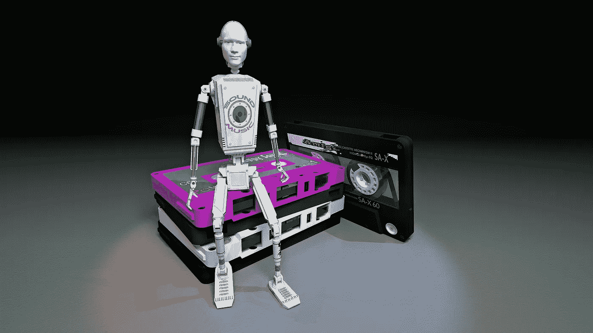

# 聊天机器人:个性化音乐营销和发行的新浪潮

> 原文：<https://medium.com/hackernoon/chatbots-new-wave-of-personalized-music-marketing-and-distribution-3154c8b3c7bf>

> *“单词是新的 UI/UX。我不断地重复单个的单词和句子，让机器人的信息感觉更个性化，更像是故事不可或缺的一部分。”-来自 Thinkbox.io 的 Max Pelzner，Studiotime 机器人的开发者，该机器人允许艺术家根据个人需求快速预订工作室时间。*

A **虽然聊天机器人不是新的**，人工智能和人工智能令人难以置信的发展与信使集成和智能 UX 策略相结合，为比以往任何时候都更先进的对话机器人铺平了道路。这些自动化助手在许多以消费者为中心的行业中获得了巨大的吸引力，音乐家们也终于开始利用它们了。

聊天机器人有许多对音乐唱片公司和艺术家有帮助的奇妙特性，其中之一是能够开发更个性化和人性化的品牌信息风格，这与历史营销策略形成鲜明对比，这些策略往往显得不具人情味，过于一般化，无法与音乐粉丝产生充分共鸣。

音乐行业中已经存在任何机器人，例如类似 Shazam 的 AudioShot、新的音乐发布 alert Record Bird、包括 Music Rover 和 Lazyset 在内的推荐引擎，以及为贾斯汀比伯、赛琳娜·戈麦斯等人创建的以艺术家为中心的机器人。更具创新性的例子包括索尼的机器人，这是一个为罗比·威廉姆斯开发的聊天机器人，允许粉丝询问歌手的音乐和巡演，以及发现播放列表，访问艺术家的在线商店，并询问其他问题。

# 那么，我们该何去何从？

毫无疑问，人们对机器人和对话界面的兴趣正在快速增长，大型和独立品牌都在自动化方面进行了深入投资，而消费者对类似人类、由人工智能驱动的机器的兴趣也在增长。聊天机器人越来越多地被用于音乐行业，而不仅仅是作为一种客户参与工具。的确，这项技术的未来可能性是巨大的，例如机器人在未来一段时间内成为重要的分销渠道的潜力。事实上，许多音乐行业专家认为聊天机器人将成为自动化音乐领域的下一个大事件。

然而，许多技术专家认为，该行业几乎没有触及什么是可能的，我们即将进入一个这种技术爆炸的时代，因为新的艺术家和唱片公司找到了激进的方式来使用聊天机器人与粉丝联系，增强现场音乐体验，以及营销和分发音乐。

可能性只受到人们想象力的限制。与此同时，正如任何技术努力的情况一样，专业知识是绝对必要的，以确保开发是高效的，最终产品是卓越的。如果你对下一级聊天机器人有很好的想法，请咨询音乐行业的技术专家，为个性化、人工智能驱动的参与和自动化带来新的兴奋和功能。

*由* [*谢尔盖布多夫*](https://www.linkedin.com/in/sbludov/) *媒体与娱乐高级副总裁* [*数据艺术*](https://www.dataart.com/industry/media-and-entertainment?utm_source=medium.com&utm_medium=referral&utm_campaign=m-regular&utm_content=da-hn-sbludov-musicchatbots)