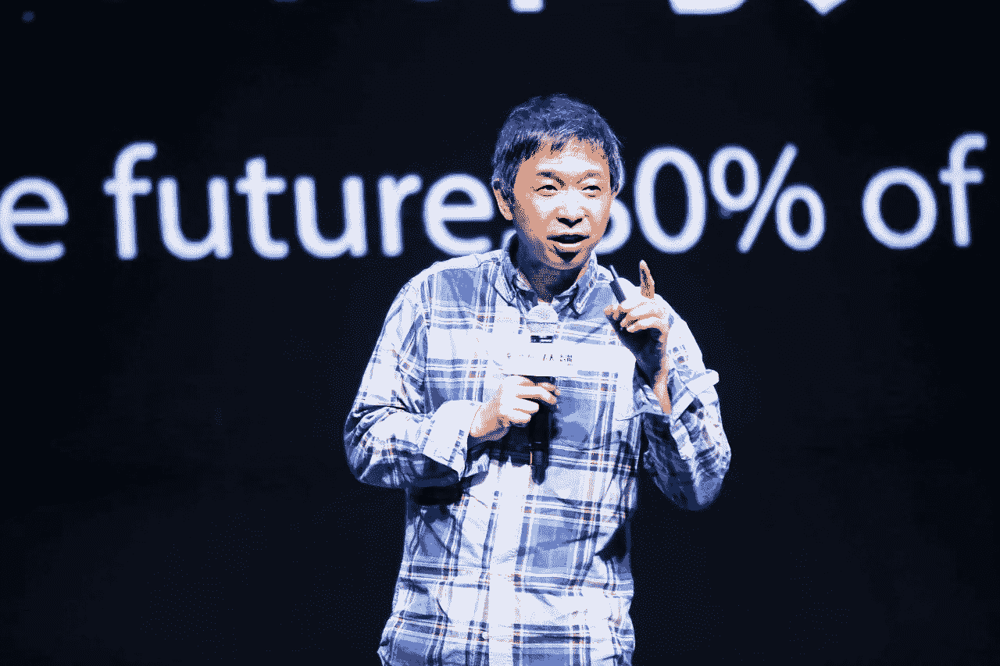
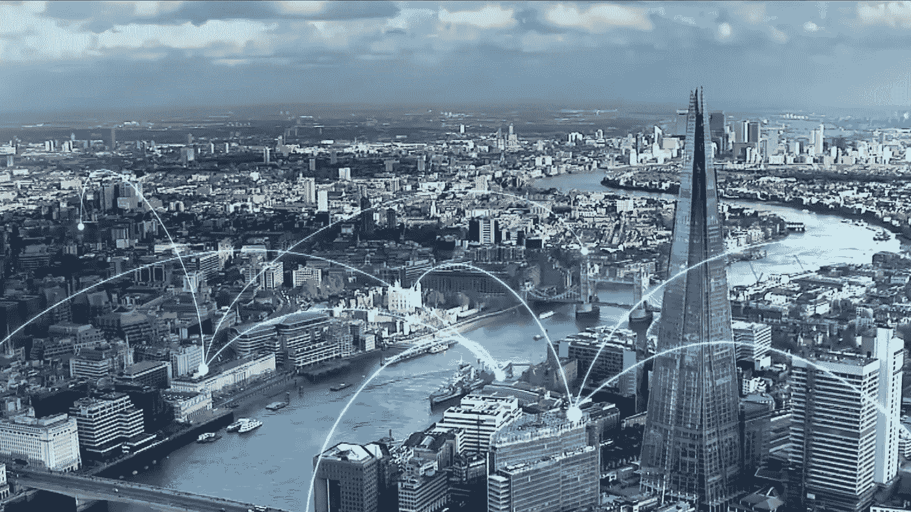
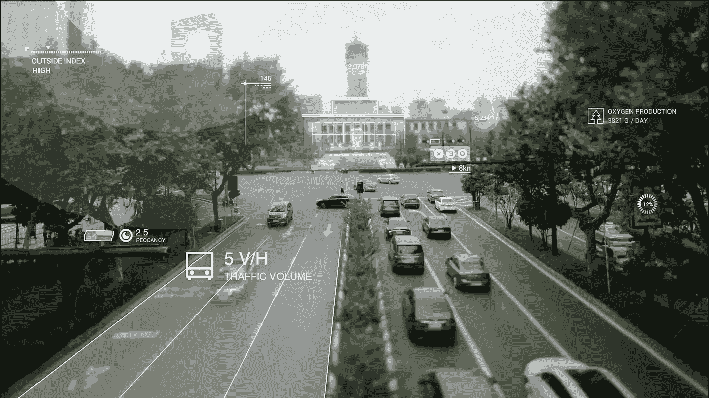

# 城市大脑:云计算和数据技术帮助我们的城市深入思考

> 原文：<https://medium.com/hackernoon/city-brain-cloud-computing-and-data-technology-help-our-city-think-deeply-382e72f7f7f>

人类需要 100 年来处理这些数据。科技只需一秒钟就能让我们的城市变得更美好。

> 2017 年 11 月 9 日，阿里巴巴集团技术委员会主席王坚博士在中国主流媒体上发表了关于“城市大脑”的文章。在书中，他解释说，在未来，通过创建“城市大脑”，数据资源在城市发展领域将比土地资源更重要。以下是那篇文章的修订摘录。

Dr. Wang Jian on City Brain during the 2017 Computing Conference in Hangzhou

互联网是改变世界的革命性技术。然而，我们现在正在进入一个新的技术时代，有人说这将是“互联网的死亡”。而这个新时代正在通过人工智能而诞生。然而，人工智能不会成为互联网的死亡，因为正是互联网创造的大量数据刺激了人工智能的快速发展及其帮助我们的能力。

当人工智能在 20 世纪 50 年代首次被提出时，科学家们努力让计算机成功模拟人类智能。然而，凭借当今互联网和计算技术的力量，我们不仅能够模拟人类的智能，而且正在创造一种全新的智能。现在，利用每天产生的大量数据，我们能够使用计算机解决仅靠人类智能无法解决的问题。就像过去人类在人类体力缺乏的地方使用工具和机器来建造东西一样，我们现在开始在我们智力缺乏的地方使用机器的智能。这样看来，把人工智能称为机器智能可能更准确。与其说它是人工的“人类”智能，不如说它是一种完全不同的智能。这使得它非常强大。

今天，世界上许多城市都面临着可持续发展的问题。如果技术创新没有进一步的突破，未来所有城市都将面临更大的挑战。因此，为了应对这些挑战，由互联网数据推动的机器智能正被用来解决许多城市发展问题，如交通管理解决方案。这是围绕机器智能的新一代技术走向成熟以及智能行业发展速度加快的黄金机会。这种情况就是“城市大脑”诞生的地方。

在过去的 20 年里，中国不断投资发展城市信息化。尤其是公安、交警部门，一直走在数据积累的最前沿。但是，如果没有机器智能的帮助，这些数据的使用总是会受到限制。例如，一个城市的交通摄像头一天记录的视频量需要一个人 100 多年才能看完，这意味着大多数数据要么被删除，要么被存储，永远不会被使用。

当我第一次听到这个统计数据时，我觉得世界上最遥远的距离不是从南极到北极，而是从红绿灯到交通摄像头。它们都在同一根电线杆上，但不共享数据，这意味着无法使用摄像头记录的交通信息来优化交通运行。这显然是对城市数据资源的浪费，增加了城市运营和发展的成本。正是为了应对这种情况，在去年的杭州计算大会上，世界上第一个城市大脑宣布在同一个城市运行。

城市大脑将利用互联网作为其基础设施，并利用每秒钟记录的大量城市数据对城市进行全球实时分析。这意味着城市将能够有效利用城市数据来分配公共资源，不断改善社会治理，促进城市可持续发展。正是这样，在未来的城市发展中，城市数据资源将比土地资源更加重要。这种想法是城市大脑发展的原动力。

在杭州(阿里巴巴总部所在地；人口:810 万)，城市大脑从城市的视频摄像头接收即时的交通流量信息。**城市红绿灯首次在实时交通的基础上，优化了路口的时间分配，提高通行效率。**城市大脑利用道路上的每一个交通摄像头进行即时交通分析，就像让交警在每个路口巡逻，一年四季，控制灯光。

今年 10 月，在云意识大会上，杭州城市大脑过去几年的运行数据被分享。结果表明，与交通数据相关的 128 个路口的时间分布优化使总通行时间减少了 15.3%。此外，在市中心，犯罪活动的自动警报每天提高 500 次，准确率为 92%，大大提高了执法的方向。目前，杭州交警部门正在使用城市大脑优化主城区的交通灯，并提供即时调度决策。

此外，杭州萧山区能够优先考虑特殊车辆，包括 120 多辆救护车。一旦接到紧急呼叫，城市大脑就会使用交通数据自动优化从救护车到事故的交通灯路线，同时仍然减少对其他交通的影响。平均来说，这将救护车到达时间缩短了一半。

交通管制只是开始。数据开始解决许多人类无法解决的城市发展问题。就像在机械设备发明之前建造东西很难一样，如果没有 AI 的帮助，目前优化城市发展是非常困难的。城市大脑将在三个主要方面帮助我们。

首先，**城市治理**将有所突破。利用城市数据，包括社会结构、社会环境和社会活动的数据，我们可以确定如何最好地利用物理资源和解决不同城市面临的突出问题，实现创新和人性化的治理模式。

其次，**城市服务**将有突破。城市大脑将成为我们改善公众生活的最重要工具。使用城市大脑，企业和个人将得到更精准、更高效的服务。比如公共服务，比如交通，将进入一个完美均衡高效的时代。

第三，**城市产业发展**将有突破。城市数据将成为传统产业转型和新兴产业发展的基础，就像半导体的发明是计算机产业发展的基础一样。

比如在苏州(上海以西 60 里；人口:1060 万)，最近决定将重点关注使用城市大脑框架的交通管理。公安部门将试点交通、旅游、轨道交通、市容和市政管理部门的联合，将不同来源的海量数据汇集在一起，由城市大脑进行分析，以帮助城市高效安全地运行。随着城市大脑系统扩展到社会治理的所有领域，苏州将有机会成为成功利用城市数据资源的价值进行城市治理、社会治理和产业治理的典范。

今天，世界上没有其他国家将城市大脑视为必需品。城市大脑最早出现在中国，得益于中国发达的互联网基础设施和中国快速采用新技术的意愿，从中国广泛使用移动支付就可以看出这一点。这种差异让中国在城市大脑领域获得了竞争优势。中国城市数据的积累将比世界上任何其他国家都要快。这给了中国一个重要的机会，以比其他国家更先进的方式解决城市发展的问题。

城市大脑不仅对中国城市发展具有重要意义，也为中国科技创新发展提供了巨大平台。凭借前所未有的计算能力和数据资源，城市大脑不仅将造福人类，还将成为未来 10 年最重要的机器智能研究平台。

十年前，阿里巴巴率先投入云计算研发，目标是让年轻人拥有跨国巨头的计算能力。现在，城市大脑也将在即将到来的全球智能时代给人们带来优势。

每一次技术革命都将城市文明向前推进了一步。蒸汽机时代，城市发展了公路和铁路；电力时代，城市发展了电灯和电网。现在，在互联网时代，城市大脑将再次提升文明。就像 160 年前伦敦的第一条地铁建设和 135 年前曼哈顿的第一个电网建设一样，城市大脑将成为城市基础设施的全新组成部分，也是中国向世界迈出的重要一步。

Help Our City Think Deeply: City Brain

# 阿里巴巴科技

关于阿里巴巴最新技术的第一手、详细、深入的信息。**关注我们**:【www.facebook.com/AlibabaTechnology 