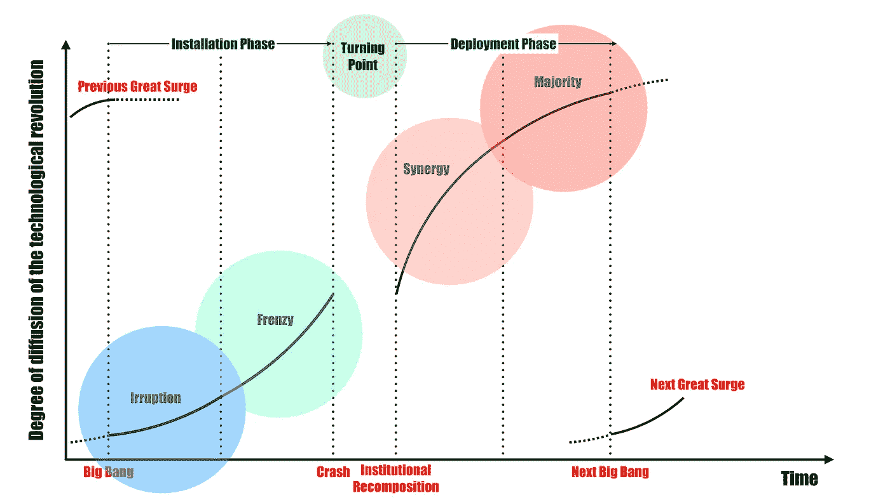

# 一起“共创”自动化的未来

> 原文：<https://medium.com/hackernoon/co-creating-an-automated-future-together-b529b629964a>

## 为什么这场“技术革命”与众不同

> 你是“技术乐观主义者”还是“技术悲观主义者”？

这个问题在 2017 年 9 月 15 日柏林*经合组织全球生产力论坛*关于数字化、生产力和监管的讨论中不断出现。它似乎框定了大部分讨论，并“分化”了参与者。

一方面，“技术乐观主义者”热爱当前的技术革命。

对于“乐观主义者”来说，创新的速度和范围，以及更短的创新周期，是惊奇和兴奋的源泉。他们认为，总的来说，技术将解决许多社会问题，改善我们的生活。政府可以也应该采取更多措施促进创新，特别是在人工智能和机器人等领域。

另一方面，是“技术悲观主义者”。

对他们来说，现在的时代不是兴奋地经历，而是惶恐和恐惧。他们认为，当前自动化的步伐是一个严重的问题，如果没有适当的警惕，人工智能和机器人领域的技术发展可能会威胁到人类。政府需要做更多的工作来控制新技术，以减少我们对技术的依赖，减轻不可预见的风险和危险。

> *“乐观主义者还是悲观主义者”*
> 
> *“好奇还是恐惧”*
> 
> *“鼓励或控制”*

这些是我们在思考新技术时经常用来理解正在发生的事情的区别。当然，这些都是在试图与以前的技术革命达成一致时所使用的区别。

但是，在柏林的活动上发言，让我意识到还有别的事情在发生。“技术乐观主义者”和“技术悲观主义者”之间的区别现在实际上已经无关紧要了。至少，它掩盖了我们都应该问自己的真正重要的问题:

> ***我是否愿意参与共同创造自动化的未来，我如何发展能力和技能来为这个“项目”做出贡献？***

要理解这意味着什么以及为什么重要，思考一下当前的技术革命与以前技术驱动的经济和社会变革时期有什么不同是有帮助的。

# **1770 年后的技术革命**

想想过去 250 年中由技术驱动的重大“革命”:

*   **工业革命**，始于 18 世纪 70 年代的英国，当时发明了一种以水轮为动力的纺纱机(“纺纱机”)，并导致了第一家纺织工厂的建立。
*   19 世纪 20 年代，也是在英国，蒸汽机的发明，以及铁路系统的快速发展，促进了原材料和成品以及人员的快速廉价运输。
*   19 世纪末，德国和美国出现了**钢铁、电力&重型工程**。钢船、横贯大陆的铁路、腌制食品、电灯照明和全球电报都是由像*通用电气*这样的大型企业实现的。
*   20 世纪早期的**汽车、石油&大规模生产**是由美国和像*标准石油*和*福特*这样的公司推动的。精炼技术的进步和廉价的大规模生产的汽车意味着新兴的中产阶级可以买得起汽车。
*   **电信&信息技术**20 世纪 70 年代初，随着*英特尔*发现微处理器及相关网络技术，硅谷出现了信息技术。

这些技术革命的评论员——例如，卡洛塔·佩雷斯(Carlota Perez)给了我们一个强有力的框架来理解在技术驱动的社会和经济变革时期发生了什么。

特别是，这种“革命”似乎有三个“阶段”:

首先是“安装阶段”。一项新技术被发现、开发和推广。在此阶段，将建立并介绍该技术的核心应用程序。

第三个是“部署阶段”，即在整个经济和社会中大规模实施和集成该技术。

但是，真正有趣的是在“安装”和“部署”之间发生的事情，即第二阶段。

所有以前的技术革命似乎都在“安装”后 20-30 年左右经历了一个“危机阶段”。人们的期望很快超过了新技术的能力，产生了一个“泡沫”，在某个时候“破裂”，推动了一个“崩溃和重新调整”的痛苦过程。

Carlota Perez Technological Surge Cycle

风险投资家克里斯·狄克逊对这一过程总结如下:

> “每一次革命都始于金融泡沫，它推动了新技术的(非理性)快速安装。然后是崩溃，接着是复苏，然后是长期的生产增长，因为新技术被“部署”到其他行业以及更广泛的社会。最终，这场革命结束了，一场新的技术革命开始了。”

 [## 计算部署阶段

### 技术革命发生在两个主要阶段:安装阶段和部署阶段。这里有一张图表…

cdixon.org](http://cdixon.org/2013/02/10/the-computing-deployment-phase/) 

在之前的所有技术革命中，“政府和企业领导人共同努力”在帮助社会从“危机”走向“部署”方面发挥了至关重要的作用。即市场失灵引发政府“管制”。

国家驱动的干预涉及一个被动的过程，即“事实调查”(收集关于新技术的所有相关信息/证据)、“理解”(确定和评估风险)，以及最后的“监管”(实施一个新的法律框架，控制/监管新技术的部署)。

这样,“危机”为国家管理的学习和理解新技术提供了一个重要的机会。然后，技术可以以受控和负责任的方式传播。

如果我们将这一框架应用于当前的技术革命，我们将很快进入电信和信息技术革命的部署阶段。

 [## 我们正处于一个新的黄金时代的边缘吗？

### 历史不会完全重演，但它确实会循环往复。这种循环最有力的理论之一是…

www.strategy-business.com](https://www.strategy-business.com/article/Are-We-on-the-Verge-of-a-New-Golden-Age) 

想想吧。

最近一次革命的安装阶段始于 1971 年，随后是 2000 年的 dot.com 崩盘和 2008 年的金融危机。这些危机可以被视为转折点。

在此之后，应该有一个由国家管理的“再调整”过程，这反过来会导致部署和“新的生活方式”、“新的生产方式”、“新的交流方式”和“新的工作方式”。

# **但是。。。如果这次情况有所不同呢？**

然而，有充分的理由认为这次情况可能会有所不同。

## **我们生活在一个多重、重叠的技术革命时代**

随着人工智能、区块链、大数据、机器人和合成生物学等新技术的指数级增长，认为我们仍处于计算机和互联网时代似乎有悖直觉。

电脑和互联网的时代已经结束了。至少在部署已经发生的意义上。相反，我们已经进入了下一次革命的“安装阶段”，这可以被称为“自动化时代”，因为它涉及到新技术的结合。

> 我们现在生活在一个不同领域同时发生高度复杂创新的时代。

## **“理解”复杂的新技术是不可能的**

技术创新的速度、范围和持久性意味着任何一种反应式的学习和管理都极其困难，如果不是不可能的话。

最近新技术的一个悖论是，它们让我们的生活变得更容易，但它们让世界变得更难——甚至不可能——理解。

我们生活在一个充满不确定性的世界里，在这个世界里，我们只知道有很多事情我们不知道。一旦我们认为我们对一个情境有了清晰的理解，一个新的发展已经发生，使得那个理解过时了。

但更重要的是，对复杂人造系统的“理解”现在已经超出了人类的理解能力，相信我们仍然可以实现这种理解是一种怀旧的幻想。有史以来第一次，我们生活在一个人类技术似乎超出人类理解的世界。

## **国家政府和企业不再能够交付受控的“部署”**

推动信息和电信革命的公司已经被“更年轻”的公司所取代，这些公司正在将技术发展推向下一个阶段。

当现有企业面临来自创新者的持续挑战时，政府不能再依赖与老牌企业的合作。

此外，新的和即将到来的技术不那么集中在一个特定的地方(创新正在到处涌现)，这使得商业领袖和*国家*政府更难开发一个协调和受控的部署。

结果呢？

与以往的技术革命相比，新技术的“部署”受到的控制要少得多。

## 消费者越来越处于主导地位

消费者在接受和传播技术方面也发挥着更重要的作用。

商界领袖和政府已不再处于主导地位。他们不再有能力领导以前发生的调整和部署过程。部署不再(主要)是“自上而下”的过程，而是“自下而上”的。

听了柏林的讨论，让我意识到“技术革命论”需要重新审视。至少，它适用于现在/未来。

# **我们应该如何应对不断的技术变革？**

好吧，首先，我们不应该等待危机，然后试图“弄清楚”正在发生什么。“反应”不再是一个选项。

## 政府

政府需要将重点从“理解”风险，然后设计一个控制技术部署的框架，转移到与其他利益攸关方合作，积极参与共同创造未来的项目。

为了做到这一点，有必要在社会中建立“接触点”(传感器)*，促进与创新企业家的持续对话和合作。*

围绕“监管沙箱”和“监管试验台”的新监管模式的出现表明(至少一些)政府理解这种对更积极主动的角色的需求。

显然，这些监管机构认为，先发制人的对话和合作可以推动/促进设计更好的监管解决方案的过程。

## 商业领袖

当今最成功公司的商业领袖似乎也明白这一点。

他们在创新上投入更多，建立创新实验室，并专注于变得更加敏捷。

仍然有许多戏剧和装饰，但“赢家”已经能够将他们的公司转变为“开放和包容的生态系统”。

特别是，他们与初创企业建立了更紧密、更流畅的关系(经常收购它们，但让它们保留自己的身份和文化)。

最成功的公司与消费者的关系也更开放。即使是 B2B 企业也明白与终端消费者更多接触的必要性。

## 那么，我们其他人呢？

每个人都需要问自己:

> *我愿意一起参与这个共创未来的项目吗？*
> 
> *我能做些什么？我该如何培养技能来做出更有意义的贡献，让我获得更大的个人满足感？*

真正重要的区别不是“乐观主义者”和“悲观主义者”之间的区别，而是那些选择忽视正在发生的事情的人，那些仍然试图理解的人和那些寻求积极参与的人之间的区别。

但是，很少有人真正参与，甚至思考这个“共同创造未来”的项目，这仍然让我感到惊讶。

当你在*媒体*上与作者和读者交流时，似乎我们都是讨论的一部分。但令我惊讶的是，很少有同事、学生(包括千禧一代)等。意识到正在发生的事情(尤其是挑战)和现在可用的可能性。

> 教育发挥着至关重要的作用。

每个人都需要做好准备，以某种方式参与“共同创造未来的过程”。重点应该是创造力、设计、速度、敏捷、选择、自由和责任。

这些是现在和未来的价值观，还需要做更多的工作，让人们掌握在这个更平坦、更开放的世界中运作的技能。

# **回到柏林。。。**

在这个日益自动化的新世界，你是“技术乐观主义者”还是“技术悲观主义者”并不重要。

当我们不再能够像十九世纪和二十世纪那样理解或控制技术发展时，这两种选择似乎都没有多大意义。

在这个新世界中，唯一真正的选择是是否参与共同创造未来的项目，每个人都需要问自己如何应对这一挑战，以及他们可以做些什么来提高自己的技能，并最大限度地增加个人实现的机会。

这些似乎是更好、更重要的问题。

*感谢您的阅读！请点击*👏*(想点多少次就点多少次)下面，或者留言评论。*

每周都有一个新故事。因此，如果你关注我，你不会错过我关于数字时代如何改变我们生活和工作方式的最新见解。