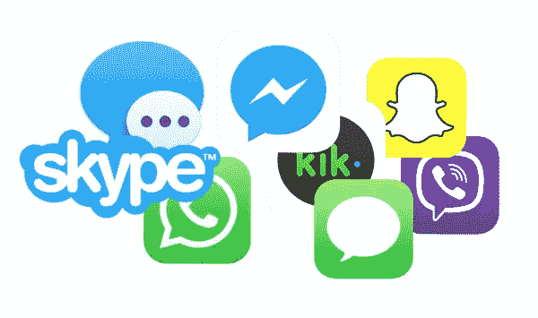

# 通信的未来:作为一种服务

> 原文：<https://medium.com/hackernoon/communication-as-a-service-20f6a1bc8d0b>

我们是糟糕的沟通者。忘记回复你工作中的同事。忘记给你的朋友回信息，告诉他这个周末的晚餐计划。不管在什么情况下，我们总是会遇到困难。解决方案不是另一个通信应用程序，我们已经有足够的应用程序:

解决方案是服务，具体来说就是[通信](https://hackernoon.com/tagged/communication)即服务(CaaS)。为了理解我们为什么需要这些服务，让我们把*为什么*我们是糟糕的沟通者分成三个部分。

# 问题分三部分:

## 混乱的系统|缺乏时间|我们健忘

# 问题#1:混乱的系统

我们用来交流的系统是杂乱的、重叠的、不智能的。仅在工作环境中，我们就可以使用电子邮件、聊天、Slack、Trello、文档评论、语音通话、视频通话，甚至面对面交谈。***喘息！*** 拥有这种选择的自由在理论上是很棒的，但很容易就会变得杂乱无章。

> 那份报告什么时候到期？我知道简告诉我了，但这是通过聊天还是在我们今天都在用的 7 封邮件中的一封？…好的，找到了。
> 
> 嗯，我知道我有两个基于我们每周通话的任务，但是我想简今天早上评论的时候在甲板上给了我另一个。让我看看…

你明白了。所有这些选择和系统都很棒，但人是问题所在。我们通常通过不同的渠道分享信息，而不是保持准确一致。

这还没有提到我们的个人生活！

Snapchat、Instagram、FB messenger、iMessage、发短信、WhatsApp、Telegram、微信，不胜枚举。我们可以用一百种独特的应用程序与朋友和家人交流。我们今天使用的应用程序一年后也不会存在。我们甚至经常在一天内通过多个平台与同一个人进行对话。

这在一定程度上是有道理的，不同的平台更适合不同的情况。与不同国家的人交流？WhatsApp 是一个极好的选择。分享公园里那只可爱小狗的视频？Instagram 或 Snapchat 可能是最佳选择。但就像在办公室一样，变得杂乱无章并在多个应用程序之间切换并不是什么好体验。

Source: Quartz

# 问题 2:缺少时间

我们都有这样的朋友:

虽然他们是极端的，但基本的想法对我们大多数人来说是一样的。我们收到的信息比我们知道如何处理的还要多。在一个忙碌的世界里，除了回复每一封邮件，我们还有其他更重要的事情。我们会很快对它们进行优先级排序，如果我们打开了低优先级的邮件，通常会在几个小时或几天后才会打开。如果我们及时回复所有的事情，信息会不断地打断我们的日常生活。因为我们有限的时间，我们选择踢消息和沟通。这就引出了我们最后也是最私人的问题。

# 问题 3:我们健忘

当我们在阅读一条信息的时候决定不回复它，我们增加了忘记回复的机会。你可能有最好的意图，但是你正在玩的乒乓球游戏会很快消除你对那个信息的任何记忆。

有时我们在一天的晚些时候抓住自己，看到这个信息。或者就像在不止一个场合发生的那样，我们发现自己在翻旧邮件，看到一条 4 天前的邮件，却忘了回复。现在继续对话还来得及吗？我们是应该说声“嗨”然后重新开始，还是就此一笔勾销？无论我们选择什么，重点仍然是，我们是健忘的。

# 解决方案:通信即服务

既然我们都一致认为沟通状态是多么糟糕，是时候考虑一个潜在的补救办法了。为什么服务有意义？好吧，每当时间不够，但有多余的事情要做时，我们有两种选择:

> 1)我们可以尽可能多的完成工作，但不一定要完成所有的事情
> 
> 2)我们可以自己做一些工作，其余的外包出去

例如，很久以前，当我们掌握了耕作技术时，我们认为还有其他问题需要解决。但是如果我们仍然需要自己种植食物，我们就没有时间去解决这些问题。所以，我们外包了。一些人专门成为农民，解放了其他人去寻求其他问题的新解决方案。

## 无论是在耕作、创作艺术品还是交流中，时间都是最大的限制。

无论我们做什么，我们都不会拥有更多。我们能做的就是更明智地使用它。所以是时候我们外包交流了。如果你是一家公司的高管，可以雇佣一名助理，或者如果你是一名青少年，有一位直升机父母为你计划一切*，那么做起来很容易。但是对于我们其余的人来说，让别人来完成我们所有的交流是不切实际或者没有效率的。*

# *人工智能驱动的通信*

*人工智能助手是答案。不，这不是 Siri，Ok 谷歌，或 Alexa。那些是人工智能助手，但它们是通用的方法。他们有时会有这种感觉。诚然，他们总是变得越来越聪明，越来越个性化，但他们目前的轨迹仍然不够个性化。我们需要的是我们自己的人工智能。想想《钢铁侠》中的贾维斯或者《蜘蛛侠》中的[凯伦。独特的人工智能适合我们自己的个性、怪癖和欲望。](https://youtu.be/5CbhoaydlkY)*

*为什么要这么做？从心理学的角度来看，如果我们觉得人工智能助手是独一无二的，只是我们的，我们就更有可能对它产生好感。Alexa 和 Siri 永远不会有这种感觉。*

*就杂乱的消息应用空间而言，这个解决方案将改变我们必须使用的应用数量，从许多变成只有一个。我们会把我们所有的奇思妙想都交给我们的人工智能助手，然后它会决定哪个频道最适合我们的信息。从某种意义上说，这些个人人工智能将有效地成为我们自身的延伸。*

*从短期来看，助理会把我们的想法传达给其他人。展望[的未来](https://hackernoon.com/tagged/future)，这类助理将会激增。这意味着它们将开始向其他人工智能发送越来越多的我们的想法，这些人工智能反过来为它们的用户解释这些信息。助理的用户在日历上有约会吗？可能现在不是传达他们可能会忽略的信息的好时机。我们的朋友刚刚开始他们 30 分钟的通勤？现在可能是查看邮件的好时机。*

*但是让我们更加自动化。想象一下，丈夫下班后例行公事地为妻子跑腿。每当他们家里的必需品用光了，他就从杂货店里抢回来。智能冰箱会确定牛奶快用完了。它会通知一家之主。妻子的人工智能助手将解释这条信息，并自动向丈夫发送一条短信，要求他在回家的路上取牛奶。(这也可以被发送到杂货递送服务)。丈夫的人工智能助手阅读了这条消息，并自动回复一条“OK”文本。丈夫下班后，助理通知他需要去商店买些牛奶。*

# *总结一下*

*1)取代杂乱的消息传递生态系统，AI 以一致和合理的方式确定最佳的通信方式。*

*2) AI 通过对消息进行优先排序并为我们回答简单的问题，将时间还给我们。*

*3) AI *不会*忘记信息，而*会*提醒我们在最合适的时间做出反应。*

*有关更多想法和示例:*

* [## 聊天机器人的承诺:个人助理不再只是富人的专利

### 一个年轻女子在路上走着，看到了一个新的早午餐地点。这正是她朋友想尝试的地方。她…

hackernoon.com](https://hackernoon.com/the-promise-of-chatbots-personal-assistants-are-no-longer-just-for-the-rich-638da4b1444f)  [## 为什么聊天机器人应该给我们点披萨🍕

### 与计算机对话>与人类对话

hackernoon.com](https://hackernoon.com/why-chatbots-should-order-us-pizza-afdc2346660a)*