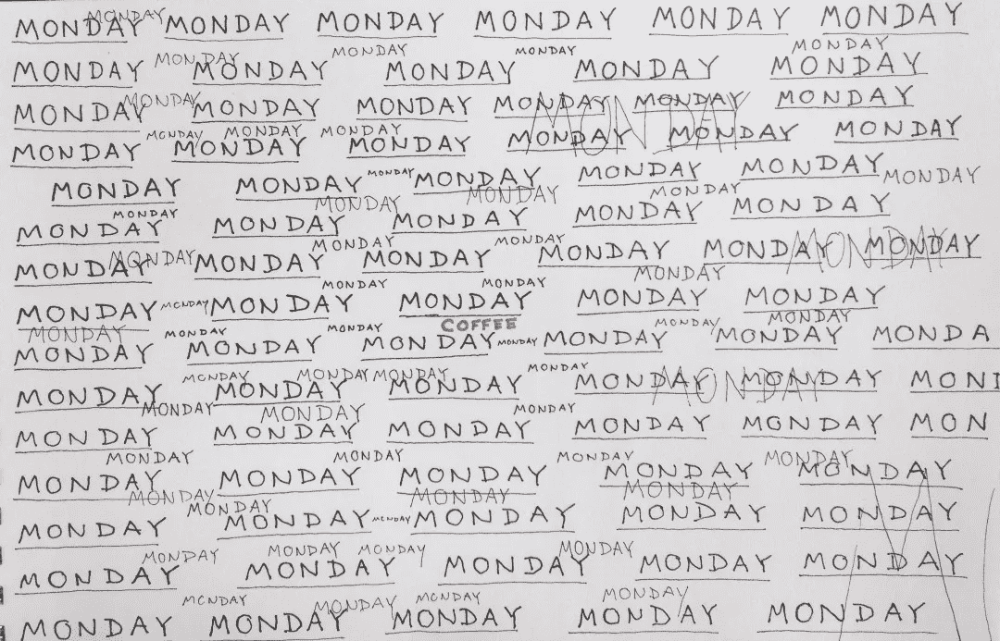
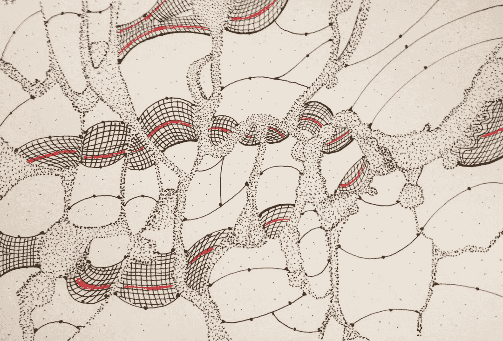
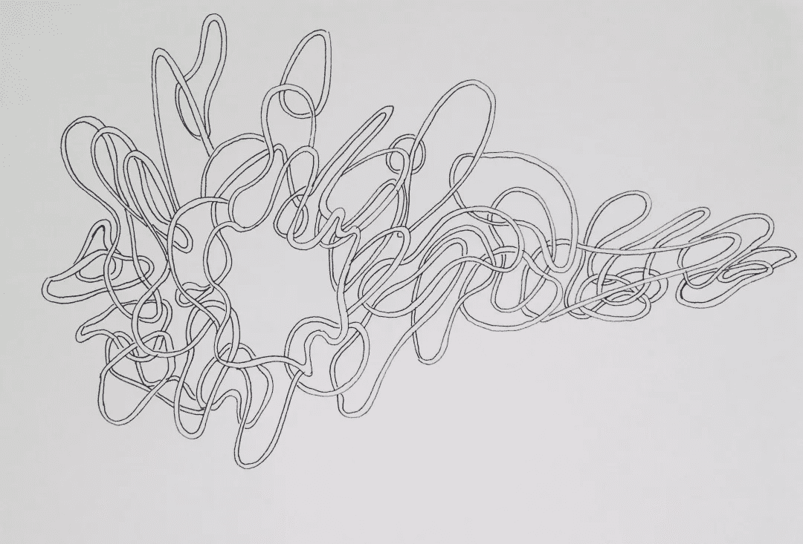
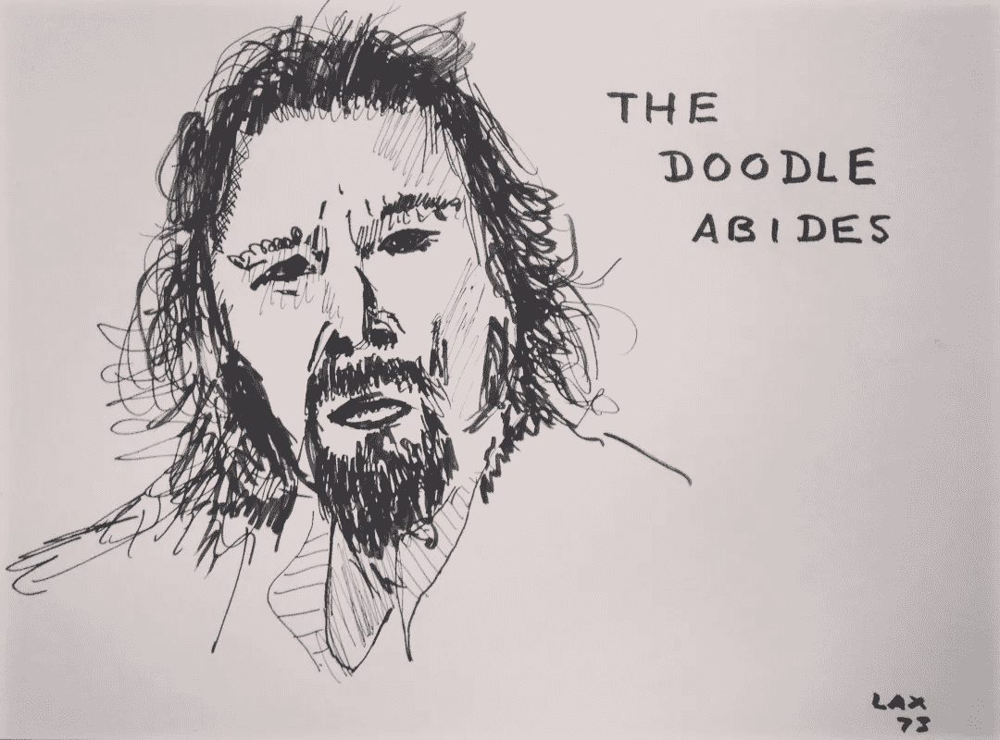

# 竞争、健康、变化和前线焦虑

> 原文：<https://medium.com/hackernoon/competition-fitness-change-and-front-line-angst-af1ab7c09aec>

*注:图纸来自我去年做的一个* [*百日涂鸦挑战赛*](/personal-growth/10-things-i-learned-by-doodling-for-100-days-straight-a802753c5a25) *。我强烈建议接受挑战！*

## 前线焦虑和健康

在我的许多中级文章中，我提到了自组织、心理安全、工艺、信任和“基于使命”的团队。我喜欢在这些环境中工作，我相信它们会带来更好的结果。我不认为自己是“反管理”，但我对某些管理风格的价值持怀疑态度(如直升机管理、指挥与控制等。).

第一线的个人贡献者经常首先看到裂缝的形成。你在“触摸机器”，直接看到糟糕决策、王国建设、“政治”和缺乏情境意识的影响。在非常个人和本能的层面上处理这种感知到的阻力是很自然的。为什么！？多么不理智！尖锐的回应是有道理的…这是我们的工作，我们的职业，我们的团队，我们的激情。

我们的讨论不再关注纯粹的“健康”——我们当前的运作模式如何与我们环境的需求相匹配——而是变成了教条和抵制的战斗。这是很危险的，因为这使得“证明这一点”变得非常困难……尤其是当这一点从表面上看是违反直觉的时候。

## 把它调到十一点

我们都听说过世界范围内“变化”的速度在加快。信息传播的速度越来越快。必须更快地做出决定。一切都在*加速。*考虑一下产品开发，让我们回到十年前，那时有一个固定的一年路线图是有意义的。如果你能在不发生爆炸的情况下完成路线图，你会做得很好。几十年过去了，这是赌桌。你不可能像这样长期工作下去，因为你会有一个变化更快的竞争对手(以天和周为周期，而不是以季度和年为周期)。

一如既往，竞争压力巨大。这家鞋类公司有 18 个月的交货时间，现在竞争对手的交货时间只有原来的四分之一。Zara(一个时尚品牌)可以在六周内将新的服装设计带入其欧洲商店。享受了几十年近乎垄断或封闭市场稳定竞争的公司，现在突然暴露在新的机会和新的竞争对手面前。正如任何有压力和威胁的系统一样，有些人会沉没，有些人会游泳，有些人会像海豚一样跃出水面。

## 敏捷和“业务”

我积极参与敏捷社区。让我们回到过去，想象 21 世纪初一群热情的书呆子聚集在犹他州时会发生什么。我想象着开发人员与这些大的内部/合同瀑布项目作斗争。必须有一个更好的方法来解决这个复杂性(并且有*个更好的方法正在被积极实践)。因此，朝圣者梳理出共同的线索，并落笔。再一次……它惊人地成功了，降低了风险，改进了工艺。*

但是…除了定义明确的接口点之外，它没有太多关于围绕 R & D 的更大组织*的内容。组织应该如何构建自己来鼓励敏捷实践？领导力怎么样？管理？在某种程度上，你可能会说敏捷宣言是对大型官僚组织的反模式的防御。如果你相信实干家能够完成工作，并给他们空间去做，那么一切都会好的！别挡路！*

## 黑盒很直观，但是…

这个故事引人入胜。你们开发商“太慢了”。嗯，关注你如何开发软件是有意义的。您可能不会立即想到更大组织的结构是如何导致“问题”的。或者你的项目融资方式是如何导致“问题”的。这些事情都不是显而易见的，所以将软件开发视为一个块盒是非常直观的。这当时很有效。这种工作方式在当时是一种竞争优势。

但是……现在，在很多情况下，fast 是一个桌面赌注。快速本身不再是一种竞争优势。采取更全面的方法的公司正在击败那些黑箱软件开发的公司，并保留他们所有的传统实践和结构。

## 变革将迫使变革

软件很神奇。移动大量的信息是惊人的。手机很牛逼。AWS、GCP 和 Pivotal Cloud Foundry 都很棒。廉价的计算能力太棒了。互联网似乎奏效了。环境已经改变，这使得我们在业务的某些部分可以“保持不变”，但在其他部分却不行，这完全不现实。想象这种变化将仅限于我们交付软件的方式是天真的。

有两家公司。公司 1 必须进行一次大批量的下注，并且由于他们对“项目”融资的政策，不能在下注的中途改变方向。公司 2 已经想出了如何进行更具流动性的押注，如果事情进展顺利，或者如果他们遇到新的信息，他们可以加倍下注。十年前，公司 1 可能做得很好。十年前，他们可能还没有足够快速地“感知和响应”的工具。也许没有竞争的需要去感知和快速反应。一切都很好。但是快进一下，现在公司 2 会赢。

## 为变革而构建

我认为我们确实需要理解我们如何适应特定环境背后的原则。你可以做得很棒，但同时你的公司可能非常不健康，过度适应当前的环境。下一个机会、冲击或破坏会滚滚而来，你就惨了。如果有人模仿你——当然是因为你做得很棒——他们会模仿他们看到的结构，而不是支撑你决策的操作系统。

> 我们只需要找到合适的人，让他们担任合适的角色！

这句话的迷人之处在于，它并没有真正讨论当环境发生变化时，你该如何转换这些角色，或者更根本地说，你如何知道环境是否发生了变化。再次…需要讨论软件开发之外的系统。

## 有些悲观

我们的公司死得更快，一切都在加速。很难改变你的形式和结构来迎接这些新的挑战。抱怨无能以及不愿意改变和拥抱新的“方式”是很容易的。解开现代公司的结构和纽带要困难得多。我们已经在高度本地化的水平上采用了这些工作方式，这很好，但是做任何“大规模”的事情都非常困难。SAFe(敏捷扩展框架)是一个创可贴……一个更大的绞肉黑匣子，你把牛肉放进里面，然后希望汉堡从另一边出来。我们的大多数公司都无法挽救，除非它们经历了一场重大的生存危机。

## 最后…

*   竞争推动创新(包括我们运营方式的创新)
*   除了教条和个人偏好，新的范式需要新的工作方式。下一个范式也是如此。习惯就好。
*   这很难
*   最好把重点放在基本原则、意义创造和匹配结构/方法上，以应对手头的挑战
*   如果你基于健康(而不是反管理，“扁平组织”等)来争论，你与领导/管理层的争论会更有说服力。)

你走到这一步了吗？带着巨大的诚意…我真的很感谢有机会分享这些灵感。