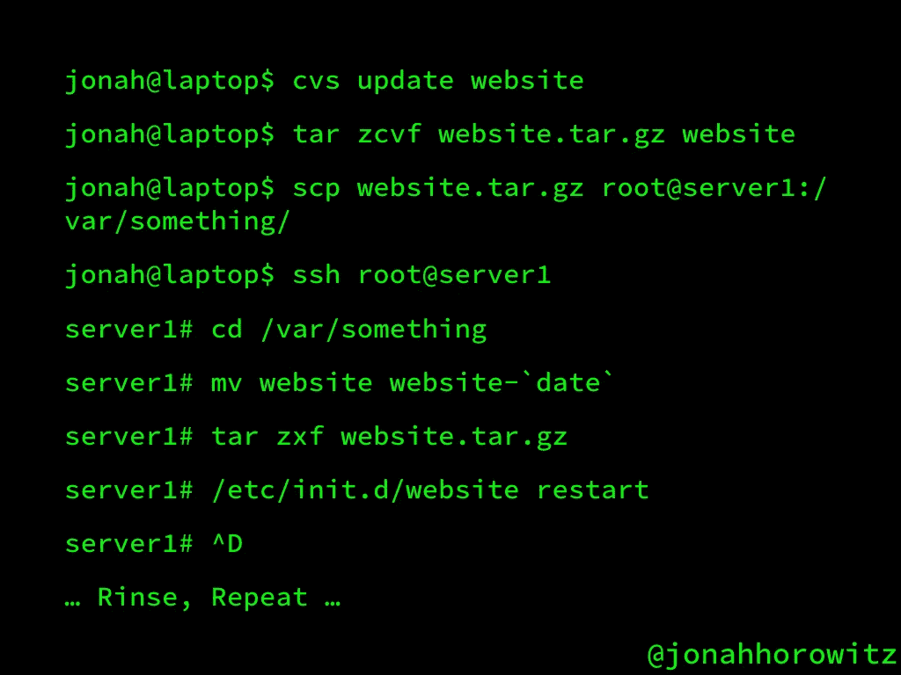
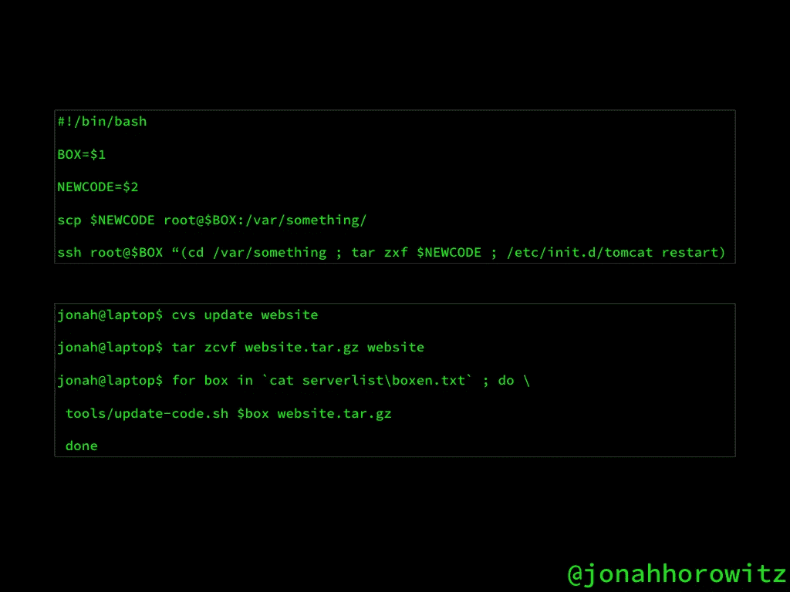
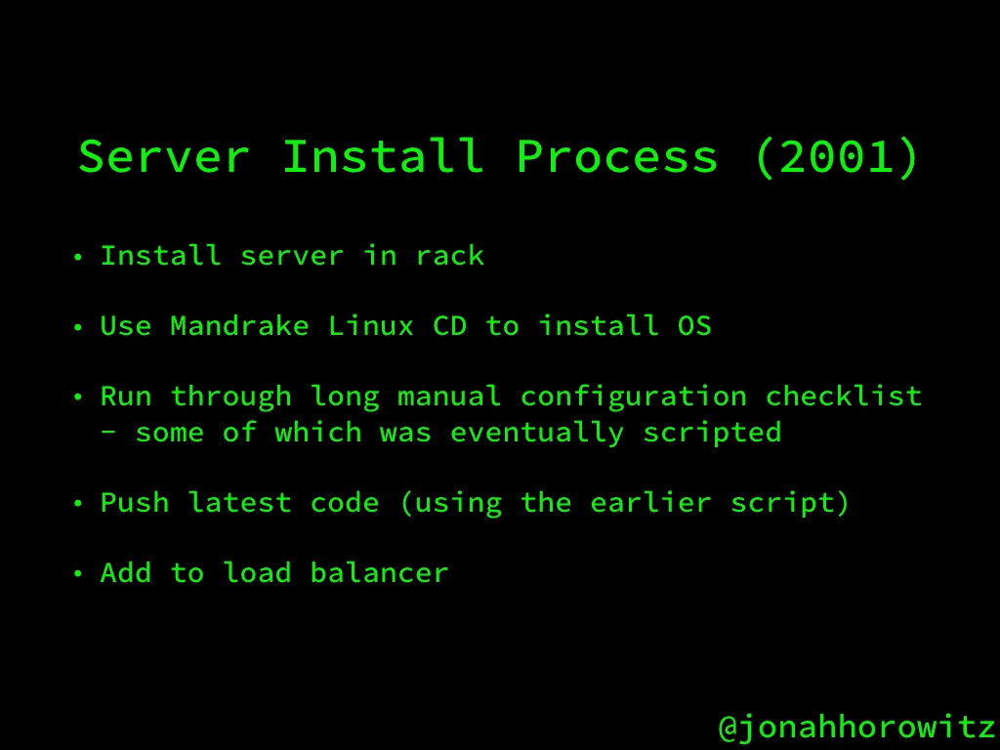
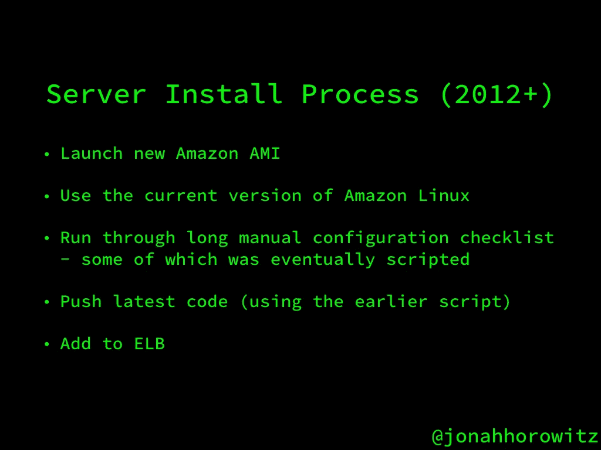
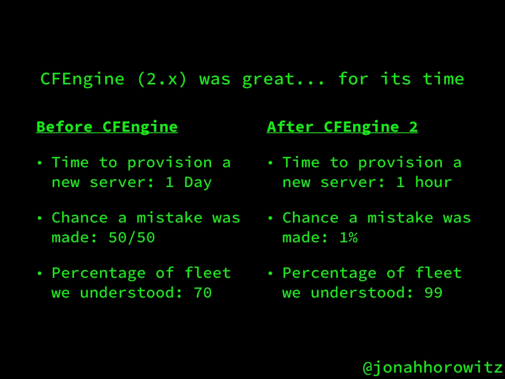
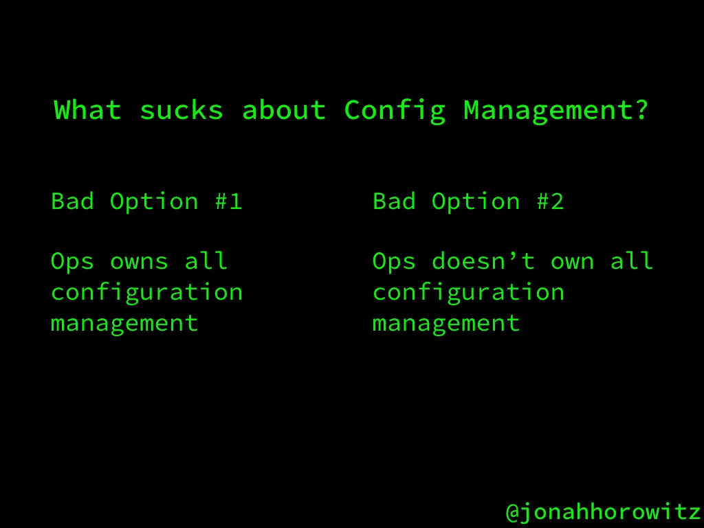
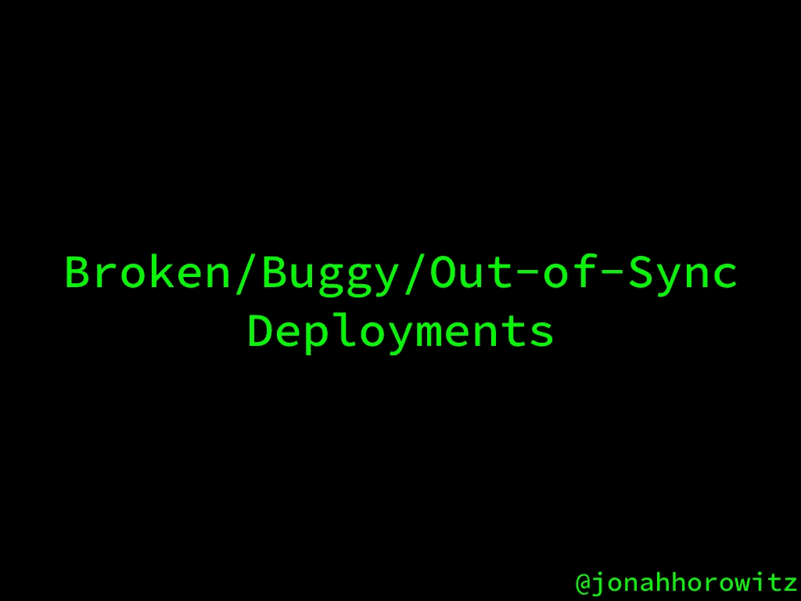

# 配置管理是一种反模式

> 原文：<https://medium.com/hackernoon/configuration-management-is-an-antipattern-e677e34be64c>

Configuration is an Antipattern talk from Scale15x

# 发布工程

当我在一家科技创业公司找到第一份工作时，这实际上是我们的发布程序。我基本上是将我们的代码从 cvs 复制到产品中，并重启每台 web 服务器。

最终，我们雇佣了一些新的系统管理员，并将这个过程转移到 bash 脚本中。

现在，使用我的 bash 脚本，我可以运行一点 ssh for loop，并很快将代码推送到所有服务器。这个脚本最终变成了超过 1000 行带有 web 界面的 Perl。

# 服务器安装

这就是我们如何部署代码，在配置管理之前，我们如何管理服务器安装呢？

有趣的是，在我们的服务器有良好的在线更新机制之前，你实际上在你的系统上有一个一致的构建，但只是因为你从来没有更新过任何东西。

你可能会认为我们已经摆脱了这一点，但事实上，这是云基础架构的更现代版本。

如果您做得好，您可以让生产中的每台服务器都运行稍微不同版本的操作系统包。

# 结构管理

在第一个电子商务网站之后，我开始和 Nate Campi 一起在 Looksmart 工作，他写了一本关于自动化 Linux 的书。Looksmart 是我第一次遇到真正的配置管理系统，这是一个启示。

当我到那里时，Nate 已经用 cfengine 自动化了大约一半的基础设施，在接下来的几年中，我们将达到基础设施 100%由代码运行的程度。整个公司的每一台服务器(不包括 Oracle 数据库服务器，稍后将详细介绍)都可以在几个小时内重新映像。

最终，我离开了那家初创公司，去了另一家。当我面试时，我总是问他们运行的是什么样的配置管理软件，因为我绝对不会回到另一家没有运行自动化的初创公司。

在我最终加入的那家公司，一位面试我的人说他们在经营 Chef，并对此非常满意，另一位面试官说他们在经营 Puppet。这可能是一个危险信号，但我还是加入了他们。原来他们两个都在运行，但是在几个月的时间里，我们合并了 Puppet。

你可能会问为什么我们选择了木偶而不是厨师，但这并不是一个特别复杂的决定。我们在 puppet 中已经自动化了更多的基础设施，因此需要替换的主厨代码更少。

# 如果配置管理如此具有革命性和强大的功能，你为什么不使用它呢？

据我所知，运行配置管理有两种模式。在第一种模式中，你有一个操作团队，它限制生产中的所有变化。他们是唯一对配置管理存储库有提交访问权的人，他们必须在生产中进行所有的更改。这是*反 DevOps* 的做事方式。

另一种选择是，您希望开发人员在他们负责的集群上运行配置管理。这是一种更为 T2 的做事方式，但是它有一个不同的问题。现在，您必须向所有的工程师教授您选择的配置管理软件的 DSL，并且根据您如何将代码部署到生产环境，每个开发人员现在都有能力通过一个糟糕的配置更改来关闭您的整个系统。我曾经让一名工程师在一个 4000 节点的集群上杀死 root 拥有的所有东西——除了 init——包括 sshd、rsyslogd 和最令人沮丧的 crond——这使得我们无法使用 cron 触发的配置管理工具来解决问题。

因此，有一种方法可以解决这个问题，当然，您只需要为您在生产中运行的每个集群创建一个单独的配置管理分支，并限制开发人员只能在他们管理的系统上运行代码。现在他们只能搬起石头砸自己团队的脚，但是很好，现在你如何管理公共基础设施代码呢？也许你用 git 子模块？很快就变得一团糟。

您还有另一个问题，那就是配置不同步。任何大规模运行配置管理的人都遇到过这个问题。在任何给定的时间，你的舰队都有一定的百分比不是最新的。这有很多原因，要么不是所有的服务器都同时运行配置管理工具，要么是因为网络中断、错误代码、错误的配置推送、您的配置服务器停机，等等。

为了解决这个问题，您最终要编写一堆错误捕获/纠正代码来处理您的配置管理工具可能失败的所有情况。然后，您编写一个监控警报，当服务器太过时时触发，无论您如何努力，您仍然会有不可预测的基础架构部分没有被您的配置管理或错误检查代码覆盖。

看，配置管理承诺您将知道您的基础设施的完整状态，但是它从来没有那样工作过。

然后，这并不是配置管理环境所独有的，但它支持配置管理环境。每个人都知道一台服务器。这是一台超级重要的服务器，但是还没有人着手实现自动化。那台服务器是一个单点故障。现在在 Hooli 工作的 Bob 安装了一台服务器，但没人知道如何重建？是啊，那个服务器！

然而，这些都没有解决我演讲开始时的问题，即发布工程仍然很糟糕。配置管理对于发布工程来说并不起作用。它可以被折磨成发布工程的服务，但是在大多数情况下，你最终会在它上面运行一些其他的工具。这并不意味着我没有尝试过。为集群的门控集更新此发布版本，然后检入该代码，让它运行，然后取消您基础架构的另一部分的门控，哦，并尝试自动对您的配置管理代码进行这些更改，以便在执行紧急错误修复时不会搞砸。太可怕了。

# 有什么选择？

另一种选择是不可变的基础设施。如果您在云中运行，这意味着您的 AMI 已经包含了您的应用程序代码。想象一下，在一个世界里，你写完代码，把它放入 git，然后它被构建到 RPM 或 Debian 包中。这个包被安装在一个由您的安全和性能工程师精心制作的基础 AMI 上，然后一个安装了您的软件的 AMI 连同它的依赖项被推送到您的 AWS 区域。

但是你对我说，我们没有在 AWS 中运行。我们有自己的私有云基础架构。嗯，你可以用 docker 做几乎同样的事情。事实上，docker 让它变得更加简单。Docker 图像从一开始就是不可变的。

顺便提一下，不要在 docker 映像中运行配置管理。说真的。如果你这样做，你就做错了。

# 图像创建

从基础图像开始——这可以是您手工制作的优化图像，也可以是来自上游供应商的默认图像。在网飞，这是由性能工程团队在安全团队的参与下构建的。您的基本映像应该具有最新的安全更新以及在平台范围内运行的任何基本基础设施包。比如你的监控包，或者你的服务发现。现在，您可以使用配置管理工具来构建您的基本映像，但是您也可以使用操作系统包和一个小 python 来安装和配置您的基本映像。

现在，一旦您有了基础映像，您可能希望在将它发布给组织的其他部分之前，用较小/不太重要的应用程序来装饰它。在网飞，我们每周都构建/升级基本 AMI，但我们也有办法在需要时以更快的发布周期推出安全更新。

一旦有了基础映像，就可以使用标准的包管理器(如 apt-get 或 yum)在基础映像上安装应用程序及其依赖项。如果在包中正确配置了依赖项，这基本上是一个步骤。

你把它编译成一个新的特定于应用程序的映像，把它推送到你所有的 was 区域，然后*瞧！不可变的基础设施！*

# 工具

让我简单地谈一下你需要的一些工具。

*   首先，如果你要使用操作系统包，你需要一个快速简单的方法来构建它们。网飞为此使用了 [Gradle](https://gradle.org) 。我推荐。
*   接下来，您需要一个系统来构建您的映像。同样，网飞使用[打包机](http://techblog.netflix.com/2013/03/ami-creation-with-aminator.html)，但是你也可以使用[打包机](https://www.packer.io)。
*   你需要一个部署系统，像[三角帆](http://www.spinnaker.io/)、[地形](https://www.terraform.io)或云形成。
*   如果您想在测试和生产中部署相同的映像，并且您应该这样做，那么您需要像 [Eureka](https://github.com/Netflix/eureka) 、Zookeeper 甚至只是内部 ELBs 这样的服务发现。
*   最后，这是可选的，但我想说的是，有一种使用特性标志进行动态配置的方法可以允许快速更改，而不需要重新烘焙/重新部署。

# 利益

它完全简化了您的操作。在发布新版本之前，您不再需要知道当前正在运行的服务器的状态。您不再需要考虑如何从一种状态转移到另一种状态，如果您的服务器坏了，您也不必修复它们(或者一次登录一个服务器来重启 crond)。你们中有谁花了几个小时或几天的时间试图让傀儡奥革阿斯代码工作吗？不变意味着你再也不用看奥革阿斯了，为了它本身，这是值得的。

这实现了连续部署，因为新代码只是通过您的管道，您不必处理可能遗留下来的旧版本的库、依赖项或配置。

当您需要扩展时，可以快速启动软件的新实例。我见过这样的配置管理环境，从实例第一次启动到准备好接受流量需要 4 个小时。这可能是一种病理情况，但也可能是一个小时。如果您必须等待一个小时来等待新的实例出现，那么很难使用反应式自动伸缩。也很难从失败中恢复过来。如果集群中的一台机器死亡，被混沌猴杀死，或者因为云提供商杀死底层实例而重启，您需要能够快速启动一台新的机器。如果你回想一下 CS1，这很像我们在编译时谈论的优化。您将反复执行代码，在只运行一次的阶段进行优化，并利用启动/运行速度。

此外，您的配置在您的节点之间总是同步的，因为它们都是在同一时间从同一映像启动的——再也不用担心 Chef 中途崩溃的那个节点了。您也不必担心 cruft 在您系统的黑暗角落里积聚。如果你的一个节点行为怪异，就杀了它，开始一个新的。

您将相同的映像部署到开发、测试和生产环境中，因此您可以相信这些系统在每个环境中的行为是相同的。

更容易应对安全威胁，因为您习惯于在生产中替换所有映像，所以您所要做的就是更新您的基本映像，并运行新的推送。不需要内核升级重启，因为您的节点从干净/升级状态启动。此外，如果您的一个节点遭到破坏，您可以限制攻击者在您的网络中存在的时间。

它使多区域操作更容易，因为您在任何地方都运行相同的映像。

那*一台服务器*，那么*一台服务器*将会非常明显。事实上，如果你在运行混沌猴，或者你依赖 AWS 作为你的混沌猴，你迟早会失去那个服务器。

# R 发布策略

转向不可变允许您利用一些很酷的发布策略。第一种是滚动发布，一次替换一个节点。当集群上有需要保留的状态时，这很方便。

我最喜欢的发布策略是蓝/绿推动。您有 100 个节点，启动 100 个新节点，然后将流量转移到新节点。如果出现问题，您可以快速将流量移回旧节点。在一段合理的时间后，比如 1-3 小时，您关闭旧节点。

# 警告

所以，当然，有几个警告。如果您正在运行自己的裸机基础架构，您仍然需要管理基本操作系统，但这应该是一个小团队，您应该使您的基本操作系统尽可能小。这减少了外部的攻击面，也降低了内部系统崩溃的风险。

# 数据库

所以，回到开始，我很快提到我们的 CFEngine 设置不能重新映射我们的数据库服务器。现在，回到那时，我们在大太阳硬件上运行老派甲骨文，但我仍然从运行 Mongo 和 Cassandra 的人那里听到这个故事。当然——我们可以运行不可变的，但不能在我们的数据库节点上运行，对此我要说——你还不够努力。只要在 db 版本之间保持磁盘上的格式，您就可以将数据库保持在 EBS 上(或者 Docker 中的挂载点)，并且现在您可以使用不可变的映像动态地重新启动数据库。如果您已经在主实例和备用实例之间编写了故障转移脚本，甚至可以使用关系数据库。这是可能的，我见过。

配置管理曾经风光一时。它确实改变了我们管理基础架构的方式，并允许我们以前所未有的方式扩展基础架构。它在可靠性和一致性方面带给我们的优势不应该被低估，但它也是一种技术，就像在它之前手工制作的 Perl 脚本一样，谁的时代已经到来。

随着云和应用程序容器的采用，我们现在可以做得比配置管理更好；我们可以永恒地奔跑。这将使基础设施比以往任何时候都更一致、更可靠、更安全、更具可扩展性。

> [黑客中午](http://bit.ly/Hackernoon)是黑客如何开始他们的下午。我们是 [@AMI](http://bit.ly/atAMIatAMI) 家庭的一员。我们现在[接受投稿](http://bit.ly/hackernoonsubmission)并乐意[讨论广告&赞助](mailto:partners@amipublications.com)机会。
> 
> 如果你喜欢这个故事，我们推荐你阅读我们的[最新科技故事](http://bit.ly/hackernoonlatestt)和[趋势科技故事](https://hackernoon.com/trending)。直到下一次，不要把世界的现实想当然！

