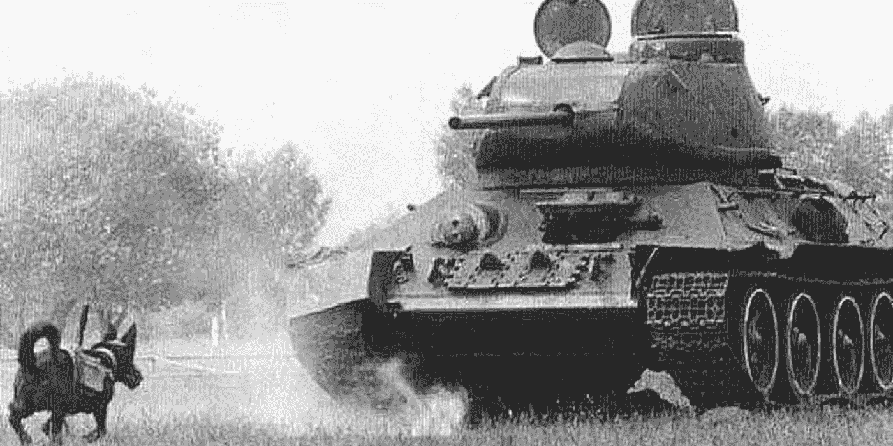

# 持续集成:一个战争故事

> 原文：<https://medium.com/hackernoon/continuous-integration-a-war-story-e442ad463473>

## 为什么我们应该尽早发布并经常发布

The old picture of a dog running towards a tank. The dog is strapped with a bag of explosives and there's a wooden lever extended out of it.

在第二次世界大战中，苏联军队在 1941-1942 年间有这个想法来帮助阻止德国的入侵。他们会释放绑在狗身上的炸弹的安全别针，这些狗被训练在德国坦克下行走。一旦他们这样做了，炸弹就会触发并爆炸，摧毁坦克。

问题是这些狗是苏联人用静止不动的坦克训练的。在战斗中，随着德国坦克的移动和射击，狗被吓得趴下。他们中的一些人被枪杀了，一些人回到战壕去杀了苏联士兵。

还有更多。

狗有很强的嗅觉。他们使用苏联使用柴油的坦克和德国使用汽油的坦克进行训练。一些狗没有在德国坦克下奔跑，而是在苏联坦克下奔跑，消灭了他们。

最初的想法是训练狗进入一个固定的目标，用牙齿释放炸弹销，然后安全地回到战壕。然而，这并没有奏效。没有人能有效地训练狗做到这一点，所以在将它们部署到战场之前，它们很早就失败了。

除了[反坦克犬](https://en.wikipedia.org/wiki/Anti-tank_dog)。

他们在战斗中失败了，**在测试中不可能重现的情况下**。与此同时，他们杀死了训练他们的士兵。

> 反坦克狗是二战中苏联军队的一个项目，它悲惨地失败了，因为他们没有在真实的战场环境中测试这些狗

[持续集成](https://en.wikipedia.org/wiki/Continuous_integration)是对一项工作进行多次集成的实践，当这项工作被认为“完成”时，尽早收到反馈，而不是等待很长时间。它可以是将分支中的代码库集成到[主干](https://en.wikipedia.org/wiki/Trunk_(software))中，或者是集成从开发到生产环境的变更。

即使开发小功能和迭代客户反馈也利用了持续集成的基础。

> 持续集成代表了尽可能早地而不是晚地集成一个工作的实践，这样一个人可以收到关于错误的事情的即时和频繁的反馈

听起来耳熟吗？

如果反坦克狗的创造者在战斗中使用一只狗而不是几十只，他们会很早发现问题并减少伤亡。他们会收到早期的反馈，说它不起作用，并采取相应的行动。毕竟控制一只狗比控制 30 只狗容易。

**这是持续集成的根本好处。**

然而，在他们的案例中，通过早期部署，他们也将向敌人暴露战术。软件开发实践与战争非常相似，但它们并不相同。我们不是在和另一个文明战斗。

在大多数情况下，当开发软件时，尽早集成东西是可以的，因为好处往往超过了潜在的成本。

> 如果反坦克狗项目使用了持续集成的原则，结果可能会不同

艾萨克·牛顿[曾在给罗伯特·胡克](https://digitallibrary.hsp.org/index.php/Detail/objects/9792)的信中说:

> 如果说我看得更远，那是因为我站在巨人的肩膀上

没有比昔日的战争领袖更好的巨人了。

我们应该总是不断地从我们做错的事情中学习。然而，有时候先从别人的错误中学习更容易也更方便。

不要成为下一个造一批苏联反坦克狗的人。

使用持续集成。

参见[我因缺乏持续集成而失败的经历。](https://hackernoon.com/continuous-integration-a-merge-story-16d8c81b4077)

感谢阅读。如果你有一些反馈，请在[推特](https://twitter.com/FagnerBrack)、[脸书](https://www.facebook.com/fagner.brack)或 [Github](http://github.com/FagnerMartinsBrack) 上联系我。