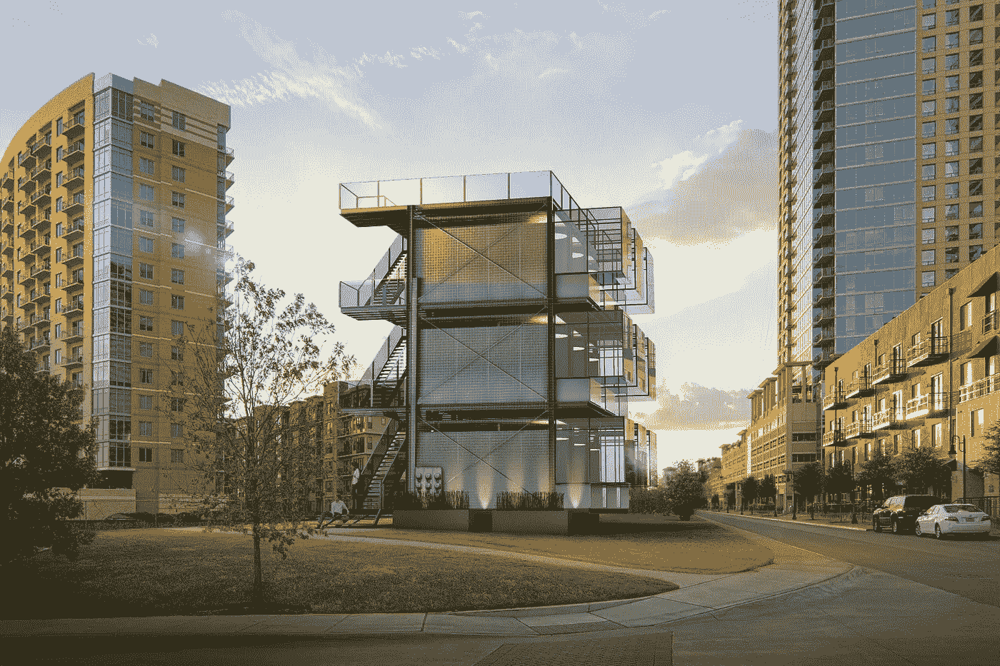
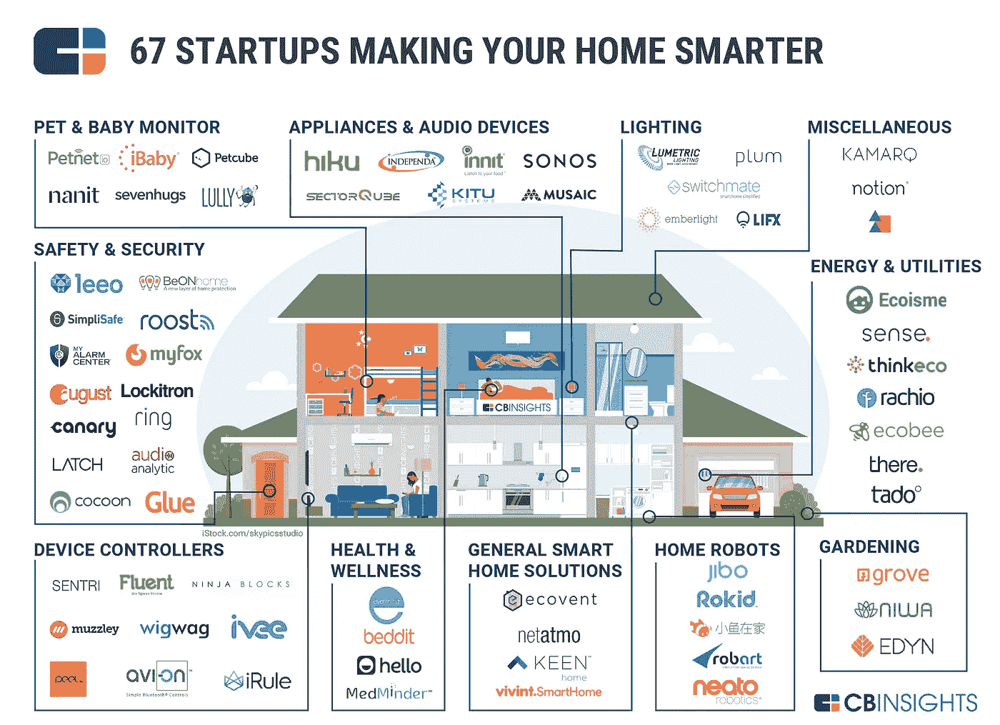

# 公共设施、建筑空间和交通。

> 原文：<https://medium.com/hackernoon/convergence-of-systems-utilities-the-built-space-and-transportation-ff0d880e0099>

A System…

## 复杂系统

我们周围的宏观系统(能源、健康、食物、水)规模宏大，相互关联，我们仍在努力把握。尽管我们对复杂系统的了解很少，但却在不断增加，我们知道当它们改变时会发生两件事:

1.这种变化是非线性的，其影响常常是指数级的

2.这些变化不仅仅影响我们正在研究的单个系统

农业是一个我们知道如何处理的系统，因为我们知道它的投入如种子、土地、土壤质量、水、人力资本等的集合。在《系统思维:初级读本》一书中，多内拉·梅多斯称“T2”为一个系统，一组相互关联的元素以某种方式连贯地组织起来，以达到某种目的。。。由三部分组成:元素、互连和功能或目的。元素(土地、种子、水)，相互联系(我们播种，我们浇灌种子，在生长、收获之前有一个死亡的循环等等。)和目的(用收获养活人)在农业上都很清楚。随着我们的工业化，也就是对复杂的农业系统做出改变，我们已经看到了其他复杂系统的影响，如就业市场、健康(来自无机食品的疾病)、天气(干旱)，同时我们也看到了好处。但是我们已经意识到农业系统与我们所关注的其他事物之间的相互联系。

## 公用事业系统

公用事业正处于变革的风口浪尖，其速度之快超出了行业的准备或应对能力。输送电力的公用事业公司总是偏爱稳定性而非灵活性。这使得电力公司能够以稳定、安全和可靠的方式为你我提供电力。曾几何时，我们无条件地重视这一点。我们有一份合同，包括实际的和隐含的，公用事业公司将在我们需要时为我们供电，我们将在收到账单时支付电费。政府通过政策和法规帮助维持这一契约。一切都很好。但这种情况正在改变。该公司现在面临来自特斯拉、谷歌和电信公司的竞争。这种变化的速度部分是由于**的快速数字化(另一个复杂系统对其他复杂系统产生非线性和指数效应)**；智能电表、传感器、[物联网](/startup-grind/new-business-models-for-iot-and-iiot-businesses-2e5177d11a4a#.x374afywp) (IoT 和 IIoT)以及我们家庭和建筑中的智能机器意味着更多的双向信息流动。

由于建筑行业的竞争，公用事业也发生了变化，他们打破常规，以完全消除公用事业服务需求的方式建造建筑物。一个住宅的例子是奥斯汀的一家公司正在建造的 [Kasita 住宅](https://kasita.com/)(下图)，在城市规模上[，我们有松岛智能城市](http://songdoibd.com/)。他们正在通过将所有公用事业服务(水、电信和电力)整合为嵌入其建筑内的*系统*的一部分，来改变遥远而独立的公用事业提供商的概念..

Model of several modules of the Kasita Home

## **作为公用事业子系统的家庭**

如果公用事业系统作为一个整体正在数字化，这一点的证据就更加明显了，我们的家庭正在以多快的速度经历这种快速的数字化。这是以互联家庭的形式出现的。互联家庭只是一个网络，它支持家庭中多种设备和产品的操作和互联。用外行人的话来说，这是一个电脑化的家。这是杰特森家。家中设备的传统分类和联网设备的使用案例(有人知道联网牙刷吗？)错过了消费者只想要家里最基本的东西。这些设备及其互操作性目前被包装为网络、媒体、娱乐、能源使用和效率等。这些术语遗漏了一点，那就是消费者不会说“我希望我的家庭联网”。相反，普通消费者会问‘家里的报警器开了吗？’当他们上床睡觉的时候。他们渴望的是在他们的住处有安全感。在这个等式中，联系没有家重要。

Image courtesy of CBInsights.

联网住宅是真正的，也应该仅仅是通过使用技术为房主提供安全、舒适和便利的住宅。但是我们已经失去了这一点。Google Home，Nest Protect，Amazon Echo，Ring，August Lock，Leeo，Sonos，Plum，Sevenhugs，Canary，KamarQ，Sentry，p pety，Latch，Wigwag，Edyn，Ivee，Rachio，Ecovent，Nanit，There，Beddit 等。在您的互联家庭中争夺空间的产品列表每天都在增长。有些毫无意义。实际上，大多数实际上毫无意义。这些产品中没有同理心。只是商业模式。注意:上面那些产品中有一个是不存在的。但如果我不提你也不会知道。如今市场上有那么多随机产品。

## **长期系统思考**

如果我们同意这些独立的部分的总和永远不等于整体，为什么我们仍然专注于将事物分解成它们的组成部分，以更好地了解情况、公司和系统？因为我们关注的是短期。分析，实际上是简化论，剥夺了我们批判性思考整个系统的能力。为家庭制造互联产品的公司在追求他们必须销售的“单一”产品时，忽略了整体。这进一步削弱了消费者考虑全局的能力，特别是对于我们上面探讨的复杂和模糊的系统，因为这是很容易做到的事情。种种迹象表明，我们在近期的决策和政策制定方面也不会做得更好。那么可能的解决方案是什么呢？

## **大爆炸破坏**

拉里·道恩斯和保罗·努内斯在他们的书中提出,[大爆炸式的破坏](http://amzn.to/2ke9Q0F)与更传统的创新不仅在程度上不同，而且在种类上也不同。这些中断更具创造性，更好地与其他服务和产品集成(例如采用平台而不是产品方法)，并且这些中断利用了客户对产品的更多信息的访问以及他们分享和促进该产品利用的能力。这听起来就像本文后面将要讨论的一些技术，尤其是分布式能源(DERs)的现状，我不会详细讨论。由大爆炸中断引起的变化可能不会完全取代，因为仍然需要发电源，但中断可能会以与物理资产接触的形式出现，例如，用户在[人工智能的帮助下管理他们的 Powerwall 用电，并通过区块链](http://amzn.to/2kplwNp)出售多余的电力。

大爆炸是如何发生的？他们倾向于走一条

1.**不受干扰者阻碍的开发**:工作在当前约束之外进行，例如现任者的监管。

2.**无约束增长**:传统产品生命周期缩短的地方。采用曲线看起来不同于传统的早期采用者、早期多数、晚期多数到落后者曲线。新的采用路径看起来更像是一条直线，一旦市场饱和，它就会上升，然后下降。

3.**散漫的战略**:不像在位者的逐步战略方法，这种方法通常是有效的，颠覆者倾向于采取一种更散漫的方法来开发产品。这使得颠覆者能够绕过从低成本、持续创新或定制产品中选择一个的更传统的方法，并试图从产品发布开始实施所有三种策略；根据客户需求定制的性能更好的产品，售价更低。这导致了现任者的战略混乱，或者在我们的情况下，公用事业公司不知道如何应对这种竞争威胁。

## **抗脆弱效用:识别破坏。**

既然公用事业是我的主要关注点，既然公用事业的工作现在与可持续建筑环境运动相融合，我们如何回到系统的方法来思考这个行业的未来？特别是，将我们的公用事业和资源更多地(我们应该说)导向一个长期的焦点？其实挺简单的。 [*就像它所模仿的自然系统一样，一个可持续发展的农场总是一个混血儿，依赖于从土壤微生物到动物的各种成分之间的协同作用。*](https://www.thesolutionsjournal.com/article/systems-thinking-and-the-future-of-cities/) 它是由公用事业变成[学习组织](http://amzn.to/2knK7WG)，或者一个我称之为抗脆弱网格的概念。

Tesla Model S: A platform, not just a product

**借鉴运输行业(特别是特斯拉)**:关于自动驾驶电动汽车的主要消息是它们将消耗的电量——[2701 太瓦时，即到 2040 年全球年电力需求将增长 8%](https://about.bnef.com/blog/liebreich-mccrone-electric-vehicles-not-just-car/)。专家们错过的是许多自动驾驶汽车运行和收集数据所带来的抗脆弱系统能力，这些数据对改善整个系统变得有价值。这个概念叫做[蜂拥](http://www.sciencedirect.com/science/article/pii/S1877050914007042)。用外行人的话说:每辆行驶了数千英里的自动驾驶汽车都在通过机器学习获取知识，这提高了每辆自动驾驶汽车的集体知识。当一辆自动驾驶汽车遇到震动，比如说事故，即使汽车可能有一点损坏，集体整体(自动驾驶汽车知识数据库)也会学习和改进。一辆车，系统中的一个节点，可能已经失效了，但是整个系统(适应性系统)从冲击到那个节点已经变得更强。现在，将运输系统中的“自动驾驶汽车”节点替换为抗脆弱电网上的“特斯拉 roadster/特斯拉 Powerwall/Solarcity panel”节点。如果一个特斯拉/Solarcity 节点的冲击不会导致整个系统或电网发生故障，也可以实现同样的抗脆弱性。事实上，整个网格从该节点的故障中学习，并通过学习动态分配资源而变得更强。

这种变化的另一部分应该是在电力公司的能力建设方法。由于公用事业系统的设计缺陷，该行业目前过度建设。提前几年进行发电预测，以满足预期的客户需求，并对未来高峰时期的电力公用事业成本和随后的客户费率进行最佳猜测。虽然这是一个长期的想法，但它需要 5-6 年的时间来规划和建造一个发电厂，错过了系统思考时所需的所有信号。这是一种孤立的思维，只关注电力公司的业务需求。相反，公用事业可以通过[成为平台提供商](http://www.vox.com/science-and-health/2017/1/19/14229090/revolution-electricity-utilities)而受益，这使得所有产品提供商(本文开头的长列表)在使用公用事业的平台时提供系统*灵活性*。该平台的工作方式是，像农业一样，它迫使公用事业公司专注于系统的目的；让消费者能够使用能源在家中舒适安全地生活。

Connected Water Quality product/platform with ‘Clean Water’ As the Purpose (Image: Axis Design)

在这个融合的新系统中，除非公用事业公司(以及它选择的任何产品)有一个明确的角色，否则消费者将继续流失。公用事业行业将被最意想不到的竞争对手吃掉午餐，因为这是大爆炸式破坏的本质，因为这种不愿意超越当前丰厚的资产负债表。留意这一警告并立即采取措施将决定我们今天看到的大多数公用事业的长期(甚至中期)存在。

你的想法？

*我和我的团队通过* [*【哈珀·雅各布斯】*](http://harperjacobs.com)*&Asha Labs**的公共事业咨询公司向能源和科技公司提供产品营销。并买* [*40 半显(启动)课*](http://www.amazon.com/dp/B01MQSYHNH) *。在这里* *报名参加我的博学者月刊* [*，我保证你会喜欢的。*](https://www.getrevue.co/profile/seyifabo?utm_campaign=Issue&utm_content=forwarded&utm_medium=email&utm_source=Seyi+Fabode)

## 如果你喜欢这篇文章，请点击下面的心。这有助于其他人看到这个故事，也有助于我知道你想看到我写更多(我们都需要一些验证:)。

> [黑客中午](http://bit.ly/Hackernoon)是黑客如何开始他们的下午。我们是这个家庭的一员。我们现在[接受投稿](http://bit.ly/hackernoonsubmission)并乐意[讨论广告&赞助](mailto:partners@amipublications.com)机会。
> 
> 如果你喜欢这个故事，我们推荐你阅读我们的[最新科技故事](http://bit.ly/hackernoonlatestt)和[趋势科技故事](https://hackernoon.com/trending)。直到下一次，不要把世界的现实想当然！

