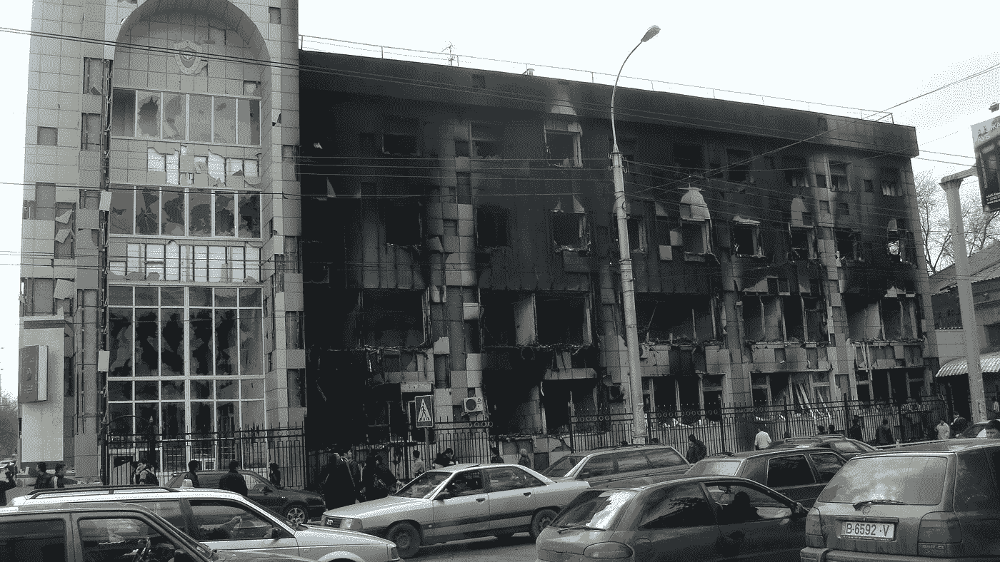

# 康威的余波

> 原文：<https://medium.com/hackernoon/conways-aftermath-a014749135e3>

A burned prosecutor’s office, courtesy of Wikipedia

## 或者，吸过来的形状

康威定律在软件行业是众所周知的。这就是，用梅尔·康威自己的话说:

> 任何设计系统(广义定义的)的组织都会产生一个设计，其结构是组织的沟通结构的复制。

但在其最初的表述中，康威定律只是在谈论软件的*创造*。软件，至少是*成功的*软件，会持续数年，往往是十年甚至更久。足够长的时间让“设计系统的组织”消失，取而代之的是一个负责维护系统的新组织。

康威定律也适用于维护遗留软件吗？我建议这样表述:

> 维护系统的难度与创建系统的组织和维护系统的组织之间的结构差异成正比。

一个软件项目的生命可以持续很多年，超过它最初的实现。处于维护模式的遗留软件通常尽可能少地更新——通常只是为了处理重大错误、安全缺陷或环境变化。

## 自身成功的受害者

假设一个团队足够熟练，足够幸运，能够构建一个成功的软件系统？大型复杂的项目，耗费团队数年时间？关键的领导者被提升，接受新的挑战，负责新的项目。杰出的工程师和分析师被其他项目挖走，或者被雇佣走。一些疲惫和沮丧的团队成员退出了。团队瓦解。

当团队成员离开时，替补人员会填补空缺。替代者缺乏从一开始就参与设计的机构知识。

代码本身不是问题。大多数有经验的程序员知道，他们不能指望理解自己几个月前写的代码。好的架构和好的测试套件对可读性和可维护性大有帮助。但是就质量代码帮助那些处理后果的人来说，它也帮助最初的开发团队做得更好。比率保持不变。

## 组织和重组

康威的余波对日益流行的重组管理实践有着非常现实的影响。每一次组织的重组，都会在构建产品的组织和现在负责产品的组织之间产生更深的差异。

这是可避免的痛苦开始的地方。重组通常不是团队成熟的结果，而是由于与团队或项目无关的外部力量——预算、政治、增长、裁员。

## 那我们该怎么办？

我认为我们对此无能为力。康威余波和康威定律一样，都是软件开发的必要条件。唯一的解决办法似乎是在软件完成并运行后，将原始团队团结在一起。这看起来既浪费又不太可能，考虑到前面提到的力量——提升英雄的冲动，以及导致其他人完全放弃项目的倦怠。最好的办法是抵制不必要的重组，尽可能保持团队的团结和稳定。管理层需要认识到大规模重组对他们公司交付和维护软件的能力的影响。

是啊，我们完蛋了。

> [黑客中午](http://bit.ly/Hackernoon)是黑客如何开始他们的下午。我们是 [@AMI](http://bit.ly/atAMIatAMI) 家庭的一员。我们现在[接受投稿](http://bit.ly/hackernoonsubmission)并乐意[讨论广告&赞助](mailto:partners@amipublications.com)机会。
> 
> 如果你喜欢这个故事，我们推荐你阅读我们的[最新科技故事](http://bit.ly/hackernoonlatestt)和[趋势科技故事](https://hackernoon.com/trending)。直到下一次，不要把世界的现实想当然！

