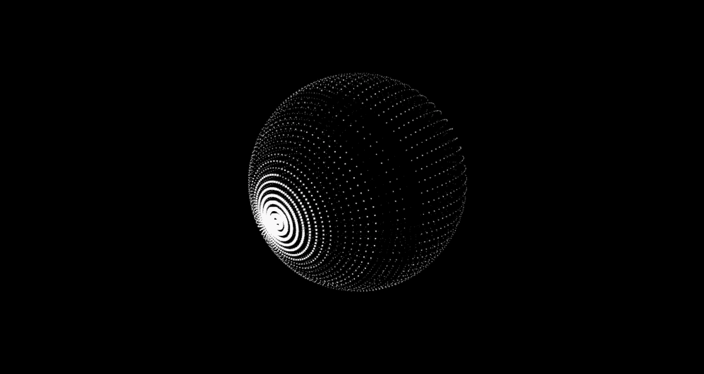

# 创造性编码基础

> 原文：<https://medium.com/hackernoon/creative-coding-basics-4d623af1c647>



## Javascript 画布入门

我花了一年的时间每天编写代码——试图提高我的 Javascript 技能，并从广告业转向某种媒体艺术职业。很艰难，但我做到了。学到了很多东西。

在收到大量请求后，我决定写一系列关于我的过程的帖子，并提供一些提示和技巧来更快地找到有趣的部分。

但是在我们到达那里之前，让我做一个免责声明。我不是程序员，尽管我从小就涉足代码。我的日常工作是在过去的 15 年里做广告，虽然代码和艺术经常有交集，但我仍然认为自己是一个新手和一个 *StackOverflow 潜伏者。我做的一些事情很可能会惹恼一群“真正的”程序员。*

我两年前才开始学习 Javascript，在那之前，我大部分创造性的编码时间都在使用 Processing，在使用 Flash 之前(对我来说，Flash 是完美的工具——在程序员接管它之前，界面和语法对我来说变得令人讨厌和不可用)。

所以在今年年初，我开始着手[# code 365](https://www.instagram.com/radarboy3000/)——每天编写一个新的艺术作品。在柏林的日子里，我曾经尝试过这种方法，使用处理，但是悲惨地失败了。虽然我对处理和它所取得的成就非常尊重，但我从来不喜欢这种语言有多迂腐，播放你的草图有多慢，在网上发布有多困难。P5.js 已经做了很多改变，但对我来说它仍然有点像一个封闭的“黑匣子”——与“真正的 Javascript”分开。就像任何刚开始学习 JS 的人一样，这种语言看起来已经够怪异的了。

对我来说，我的意图是尽可能快地到达创作部分。我制定了一个规则，这是我一直遵守的，那就是如果我做了三次，那么就需要把它变成一个函数或者一个类。我在 Sublime 中开始了一年的编码工作，现在在 [Atom](https://atom.io/) 中工作，启用了 [Atom Live Server](https://atom.io/packages/atom-live-server) ，这极大地加快了我的工作流程，这些天来我试图让我的编码更整洁一些(感谢 [Victor](http://victordiazbarrales.com/) )。

这些教程的所有代码和库都可以在这里找到:[https://github.com/GeorgeGally/creative_coding](https://github.com/GeorgeGally/creative_coding)

所以首先建立一个画布是相当重复的，对吧。所以这是我做的:

在一个单独的 javascript 文件 canvas.js 中，我有这个，它给了我一个全屏幕画布，一切就绪:

```
*// allows me global access to canvas and it’s width and height properties*
var w, width, h, height;
var canvas;function createCanvas(canvas_name){
 canvas = document.createElement(‘canvas’);
 var body = document.querySelector(‘body’);
 canvas.setAttribute(“id”, canvas_name);
 canvas.style.position = "absolute";
 canvas.style.left = "0px";
 canvas.style.top = "0px";
 body.appendChild(canvas);
 var ctx = canvas.getContext(‘2d’);
 resize();
 window.addEventListener(“resize”, resize, false);
 return ctx;
}*// this enables me to have many canvases 
// positioned on top of each other at 100% width and height of page*function resize(){
  var c = document.getElementsByTagName(‘canvas’);
  width = w = window.innerWidth;
  height = h = window.innerHeight;
  for(var i = 0; i < c.length; i++) {
    c[i].width = width;
    c[i].height = height;
  }
  console.log(“resize: “ + w +”:” + h);
}
```

就这么简单，总的来说。我刚才调用的 js 文件:

```
var ctx = createCanvas("someCanvasName");
```

…然后嘭！现在，我再也不会编写代码来创建画布了。

如果我想要一个隐藏的画布，因为我创建了一个全局画布变量(这实际上是创建的最后一个画布),我可以这样做:

```
var hidden_ctx = createCanvas("HiddenCanvasName");
hidden_ctx.style.left = -w + "px";
```

但是这太重复了，所以在我的 canvas.js 文件中我有另一个函数:

```
function createHiddenCanvas(canvas_name){
 var ctx = createCanvas(canvas_name)
 canvas.style.left = -w+"px";
 return ctx;
}
```

并且这样称呼它…

```
var hidden_ctx = createHiddenCanvas("HiddenCanvasName");
```

差不多就是这样。再也不要想着创作画布了。

[**下次**](/@radarboy3000/introduction-to-creative-coding-part-2-d869832d9ffb#.wic87b7kp) **我给你看几个画画的小技巧。快乐编码……**

我非常喜欢极简主义，声音和运动反应系统，所以这是去年练习中反复出现的主题。如果你想看我的#code365 输出，请看这里:[https://www.instagram.com/radarboy3000/](https://www.instagram.com/radarboy3000/)

在这里看看我的一些个人项目:[http://www.radarboy.com](http://www.radarboy.com)

所有的代码和库都可以在这里找到:[https://github.com/GeorgeGally/creative_coding](https://github.com/GeorgeGally/creative_coding)

这是[第二部分……](/@radarboy3000/introduction-to-creative-coding-part-2-d869832d9ffb#.lrztdnure)

[](http://bit.ly/HackernoonFB)[](https://goo.gl/k7XYbx)[](https://goo.gl/4ofytp)

> [黑客中午](http://bit.ly/Hackernoon)是黑客如何开始他们的下午。我们是 AMI 家庭的一员。我们现在[接受投稿](http://bit.ly/hackernoonsubmission)并乐意[讨论广告&赞助](mailto:partners@amipublications.com)机会。
> 
> 如果你喜欢这个故事，我们推荐你阅读我们的[最新科技故事](http://bit.ly/hackernoonlatestt)和[趋势科技故事](https://hackernoon.com/trending)。直到下一次，不要把世界的现实想当然！

