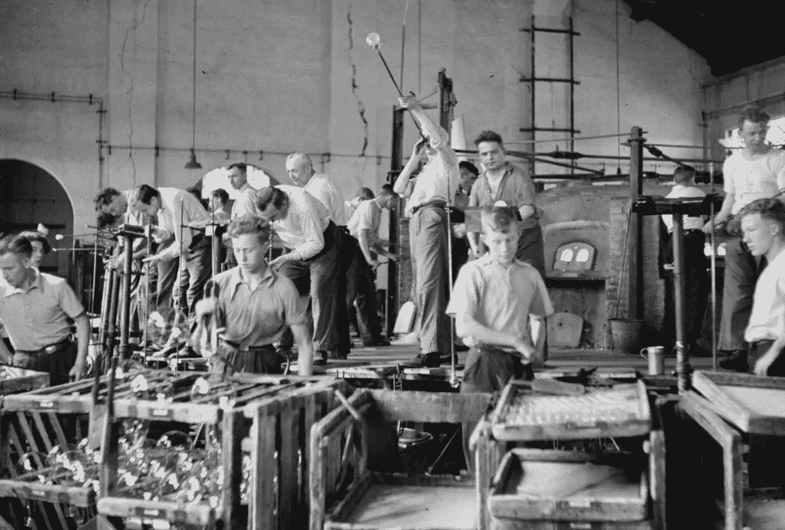
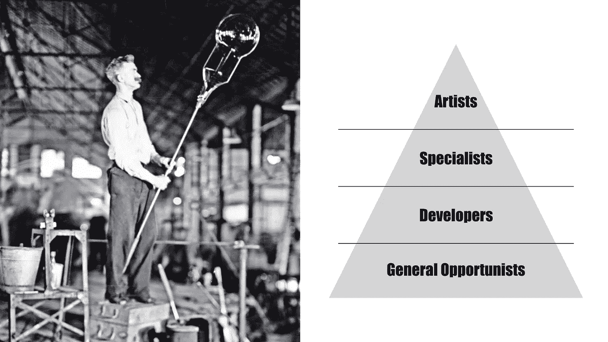

# 在数字时代，“创造力”打败了“机器”

> 原文：<https://medium.com/hackernoon/creativity-beats-machines-in-a-digital-age-fcdfd9d68ad2>

## 为什么“创造者”和“创意者”是未来的赢家

Light Bulb Factory in the 1930s

> 我们生活在一个“标准化”的世界。

我每天都在工作中看到它。

业务流程被标准化并在组织间复制。教学标准化。规则是标准化的。网站是标准化的。简历是标准化的。

甚至我们撰写学术文章、商业计划或推荐信的方式也变得越来越标准化。

> “标准化”有许多好处。

它使遵从变得更加容易。这使得比较更容易。它使控制过程变得更加容易。而且——至少，根据*维基百科*——它有潜力最大化“兼容性、互操作性、安全性、可重复性和质量”。

标准化导致日常工作很容易自动化。机器人、传感器、数据、算法和软件越来越多地用于完善标准化流程或任务。

毕竟机器犯的错误比人类少。他们一周 7 天 24 小时都有空。他们没有抱怨。他们从来不需要休假。

> 但是“现实的标准化”并非没有陷阱。

在一个标准化的世界里，创造力和“跳出框框”的思维通常不被欣赏、重视或理解。此外，让“创造者”和“创意者”遵守标准化流程可能会产生适得其反的效果。它会增加压力，最终会“扼杀”创造力。

 [## 让我来具体分析一下我们是如何欺骗有创造力的人的。

### 创意都被操了。可能已经太晚了。

medium.com](/hi-my-name-is-jon/let-me-break-down-exactly-how-weve-screwed-creative-people-over-2dda7656dae9) 

在数字时代，这真的会开始带来伤害。

正如我之前所写的，激发创造力现在尤为重要。随着“机器”在执行常规和标准化任务中取代“人类”，人类的“附加值”将取决于我们的创造力。

但是，也有好消息。

随着技术在管理和业务流程中取代人类，世界变得“更平”。“去中心化”平台和“点对点”交易已经成为一种明显的趋势。

想想 *YouTube* 和 *Medium* 。这个扁平的世界比传统的等级世界提供了更多的创造机会。

我们甚至可以说，自动化为更多的创造力和“跳出框框”的思维提供了机会。

# 向过去学习…创造力的四个层次

> 业务流程的标准化和自动化并不是什么新鲜事。

我仍然记得我祖父的故事。他是一家灯泡厂的“吹玻璃工”。

起初，制造完全由人来完成，但后来——逐渐地——整个过程变得越来越自动化。

一方面，我的祖父对自动化感到高兴。它终结了许多不健康和危险的商业行为。自动化处理了工作中令人厌烦的方面。这让工作变得更加容易和安全。

另一方面，它最终导致失业，因为人类不再是必要的。在制造灯泡的“吹制玻璃”方面，一台机器比任何人都更好、更有效率。

但我的祖父也明白如何应对这种新的自动化现实:

> 创造力。

他区分了我们的创造力水平。更有创造力的玻璃吹制工对其工艺自动化的四种反应。

## #1 —一般的机会主义者

第一类工人最好被描述为“一般机会主义者”。

他们找到了进一步发展“玻璃吹制”技能和经验的方法，并开始在其他自动化程度较低的领域使用它们。

## #2 —开发人员

第二，你有在自动化过程的设计中发现机会的工人。

他们接受了新机器，并帮助建造和改进它们。他们还确定了自动化技术的新业务应用。这些新的“创造者”与机器合作，以提高自动化程度。我们可以称他们为“开发者”。

## #3 —专家

第三，您有那些识别自动化过程中的问题的工人，并且创建了一个新的角色来解决这些问题。毕竟，自动化从来都不是完美的，在过程的某个阶段，会有限制(“链条中最薄弱的一环”)的想法。

更有创造力的玻璃吹制工认识到了这些限制，并能够为自己开拓一个专注于这些任务的新角色。他们成为特定非自动化角色的“专家”。

## # 4——艺术家

最后，工人们将他们的体力劳动转化为艺术。

这些“艺术家”瞄准了仍然需要手工吹制玻璃的利基市场。他们打赌，有些人会永远喜欢复古风格的手工制品。

4 Levels of Creativity

所有四个小组都利用他们的创造力来利用自动化创造的新机会。

当然，许多工人被迫失业，经过几代人的时间，吹玻璃工的“角色”——至少是传统的角色——消失了。我们不应该忘记这一点。

但是，同样，我们不应该忽视这样一个事实，即创造力是对这一不可避免的标准化和自动化过程的最佳(通常也是唯一的)回应。

# …回到我们的数字时代

> 在数字时代，我祖父的故事似乎仍然有意义。

毫无疑问，数字时代正在对社会产生重大影响。技术发展的速度令人震惊。不同的技术(人工智能、机器人、区块链)正在相互加速。

一直存在的自动化和标准化进程正以指数速度发展。我祖父经历的自动化发生了几十年，每次只影响一个领域的活动，而今天的自动化更快、更分散。

结果呢？

> 适应的时间越来越少，创新的需求变得越来越迫切。

这种加速带来的最重要的影响是，在数字时代，标准化不应该成为优先事项。重点应该是对标准化流程的创造性偏离。

创新的能力——以意想不到和富有想象力的方式变得异常——将会提高创造力。

# 下一步是什么？

> 自动化将要求更多的人“跳出框框思考”，以便找到创新的新机会。

作为一名“教育者”/教师，我试图鼓励这种创造性的偏离，要求学生:

*   **指出**并解释自动化产生的一个问题。
*   **协作**从事团队工作。
*   **启发**互相学习(为了找到对这个问题的创造性回应)。
*   **发展**，倾听并学习“个性化”的建议和反馈(而不是标准化的模式)。
*   **解释**创意解决方案的各个方面，掌握讲故事的艺术。
*   **测试**溶液。
*   **尝试**新技术，发现新的挑战和解决方案。

 [## 你可以帮助制作世界上第一首符号化的歌曲

### 歌曲作者和数字说书人塔瑞安·扫森在音乐和技术的交汇处感到很舒服-她的过去…

futurism.com](https://futurism.com/help-make-worlds-first-tokenized-song/) 

对于我祖父那一代人来说，创新的重要性是真实的，今天这一点实际上更加重要。这并不容易——我没这么说——但这是可能的。

我们需要鼓励创造力。我们必须记住，每个人都有“创造力”。

对于一个变得越来越自动化、竞争越来越激烈、压力越来越大的数字时代来说，尤其如此。

> 幸运的是，我看到越来越多有创造力的人在他们的工作中找到快乐、满足和意义的例子。

*感谢您的阅读！请按住*👏*下面，还是留下评论吧。*

每周都有一个新故事。因此，如果你关注我，你不会错过我关于数字时代如何改变我们生活和工作方式的最新见解。