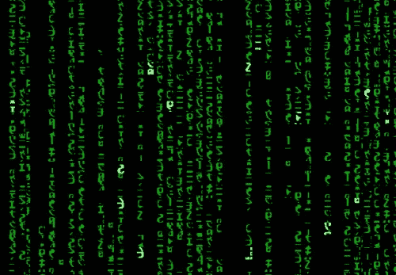

# 一个丢失的木头的故事

> 原文：<https://medium.com/hackernoon/cron-job-a-tail-of-a-missing-log-45fa700b6fff>

# 当在我的应用程序中使用 cron 作为“快速和肮脏”的调度程序时，我学到了关于日志记录的知识。

I’m sure I logged the error somewhere

我通常使用一个调度框架来运行预定的(duh)任务。但这真的不是一个重量级的应用程序，我不想添加额外的工具和配置。选择使用 [cron](https://hackernoon.com/tagged/cron) 从外部运行我的应用程序任务。

Cron 是内置的 [linux](https://hackernoon.com/tagged/linux) 调度程序。用户“MyAppUser”有一个可选的 crontab(读取“cron 表”)，crond(cron 守护进程)从其中读取配置。任务完成，任务正在运行，一切正常。开源岩石和我的快速胜利。

然后就发生了。一些关键的东西坏掉了，真的坏掉了。我真的需要我通过 cron 运行的命令的日志。

但是他们在哪里？

按照 [12 因子应用](https://12factor.net/)的建议，我的应用记录到 stdout 和 stderr 流，让这些流从外部处理。对于常规的应用程序日志，管理程序处理 stdout 和 stderr 流，写入日志文件，循环等等..

但是 supervisord 并不运行计划任务，而是运行 crond。那么谁来照顾我的日志呢？我记得在 syslog 中看到过 cron 条目，所以我查看了一下，发现了如下条目:

> 9 月 23 日 10:00:01 IP-172–30–0–129 CRON[2021]:(my user)CMD(/bin/bash/home/my user/run _ task . sh)
> 
> 9 月 23 日 10:00:05 IP-172–30–0–129 CRON[2018]:(CRON)信息(未安装 MTA，丢弃输出)

哦。所以 cron 确实尝试运行 my_task.sh 但是“丢弃输出”。但是为什么呢？什么是 MTA，它与 cron 日志有什么关系？

谷歌搜索提供了一个解释。 [MTA 是“消息传输代理”的首字母缩写](https://en.wikipedia.org/wiki/Message_transfer_agent)，通常翻译为电子邮件发送服务(后缀是一种很常见的服务)。所以 Cron 作业输出是通过电子邮件记录的。如果您没有正确的配置，它将进入内部/var/mail/myuser 文件(电子邮件格式)。

虽然我可以理解为什么在某些用例中通过电子邮件使用 cron 作业报告看起来是个好主意，但是我从来没有遇到过这样的用例:)。实际上，将 MTA 配置为发送电子邮件会让我收到大量没有价值的报告电子邮件(当我想搜索某些东西时，我会查看日志，而不是一直查看)。不配置它会使/var/mail/myuser 充斥这种输出。我们将获得文本，但没有逐行顺序和上下文、日期戳(除非我在我的应用程序日志逻辑中注意这一点)。但更糟糕的问题是，我 DONT 想安装一个电子邮件服务器在我的应用服务器。打开另一个可能的攻击媒介，另一件需要担心和配置的事情，这看起来不是一个有吸引力的选择。

> 排除安装电子邮件服务后，我们还能做什么？我发现这个问题有很多有问题的答案，至少在我看来是这样。他们中的大多数要么建议在应用程序代码中处理日志文件(将迫使我处理双重日志逻辑(常规的标准输出和文件日志，记录到我的用户也可以访问的地方，并处理日志循环等)。另一种常见的解决方案是将计划任务的输出重定向到手动日志文件:

> 15 15 * * 0–5/bin/bash/home/my user/run _ task . sh > >/var/log/my log . log 2 > & 1

这是一个更好的解决方案，但可能不够好，日志没有日期，除非我在应用程序中添加。同样，这是一个我需要添加一个 logrotate 配置的文件(这看起来并不是一件有趣的事情，并且增加了另一件需要配置和担心的事情)

我选择的解决方案(改编自我现在找不到的 stackoverflow 问题)使用了以下内容:

> 15 15 * * 0–5/bin/bash/home/my user/run _ task . sh 2 > & 1 |/usr/bin/logger-t tag _ name

*   我们将 stderr 重定向到 stdout
*   我们将结果通过管道传输到系统“logger”实用程序，该实用程序负责写入系统日志(duh)，在最近的 ubuntu 发行版中写入/vat/log/syslog(某些 linux 发行版会记录到/var/log/messages)
*   我们添加了一个标签，以便于搜索和查找

尝试:

> echo " hey there " 2 > & 1 | logger-t my _ tag

并检查/var/log/syslog 中的结果

> 9 月 24 日 09:37:47 你好

因此，结果将是把 cron 任务的输出记录到一个可靠的日志文件中，其中包含服务器上同时发生的其他事情的所有所需上下文。

任务完成。更改这个日志配置很快就发现了我一直在寻找的 bug。

> [黑客中午](http://bit.ly/Hackernoon)是黑客如何开始他们的下午。我们是 [@AMI](http://bit.ly/atAMIatAMI) 家庭的一员。我们现在[接受投稿](http://bit.ly/hackernoonsubmission)，并乐意[讨论广告&赞助](mailto:partners@amipublications.com)机会。
> 
> 如果你喜欢这个故事，我们推荐你阅读我们的[最新科技故事](http://bit.ly/hackernoonlatestt)和[趋势科技故事](https://hackernoon.com/trending)。直到下一次，不要把世界的现实想当然！

