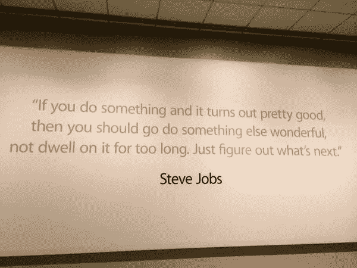

# 文化早餐吃策略

> 原文：<https://medium.com/hackernoon/culture-eats-strategy-for-breakfast-a293a4d7d4e7>

Steve Jobs Quote from tweet by [@Gartenberg](http://twitter.com/Gartenberg)

每个产品或业务领导者都明白拥有正确战略的重要性。这包括深入了解你的竞争格局，了解你的客户以及他们如何使用你的产品，并确保你有正确的计划来继续让你的客户满意，同时推动你的业务向前发展。然而，很少有人考虑到你当前的战略和你的组织文化相一致的重要性。这一点尤其重要，因为当组织文化停滞不前时，战略可能会随着市场的变化而演变。

在当今的技术环境中，唯一不变的就是变化。前一天还不受影响的公司，第二天似乎就被新贵们超越了。无论是优步导致了黄色出租车在旧金山的破产，网飞让百视达黯然失色，还是苹果的 iPhone 导致了黑莓的衰落，在最近的记忆中，有很多例子表明，那些似乎是世界上永恒不变的产品被其他产品击败，给了消费者更好的体验。在所有这些案例中，都有现任者挣扎着无法适应新世界的例子。黄色出租车公司开发了像 YoTaxi 这样的移动应用程序，Blockbuster 尝试通过邮件提供 DVD，黑莓最终提供了像 Storm 这样的触摸屏手机。所有这些被打乱的公司的一个关键问题是，他们试图改变战略，但无法克服他们的组织文化和做生意的基本方法的障碍。

# 文化冲击:黑莓如何未能回应 iPhone

《环球邮报》的一篇名为[黑莓的衰落:智能手机发明者如何未能适应](http://www.theglobeandmail.com/report-on-business/the-inside-story-of-why-blackberry-is-failing/article14563602/?page=all)的文章很好地概述了黑莓的衰落，文章摘录如下

> RIM 高管认为他们有时间重塑公司。多年来，他们成功地击退了许多挑战者。苹果咄咄逼人的谈判策略疏远了许多运营商，iPhone 似乎也不会威胁到 RIM 最忠实的客户群——企业和政府。在 RIM 解决技术问题的时候，他们会支持它。
> 
> 但智能手机用户正迅速将注意力转移到软件应用上，而不是仅仅基于硬件来选择设备。维尔软件投资研究公司(Veritas Investment Research Corp .)的研究主管尼拉杰·蒙加(Neeraj Monga)说，RIM 发现这种转变很困难，该公司的工程文化在向企业客户提供高效、低功耗设备时很好地服务了它。但适合公司首席信息官的功能对普通大众没有吸引力。
> 
> 一位前 RIM 内部人士表示:“问题不在于我们停止倾听客户的声音。”。“我们相信我们比他们更了解客户的长期需求。消费者会说，“我想要一个更快的浏览器。”我们可能会说，“你可能认为你想要一个更快的浏览器，但你不想在你的账单上支付超额费用。“嗯，我想要一个超级大的反应灵敏的触摸屏。”嗯，你可能认为你希望这样，但你不希望你的手机在下午 2 点就没电了。“我们会说，‘我们知道得更多，他们最终会弄清楚的。’"

在阅读这篇文章时，很明显，黑莓的领导层认为，从战略上应对 iPhone 的崛起对他们来说很重要。然而，正如这位未透露姓名的内部人士在上文中明确指出的那样，他们的组织文化根本没有建立起来，以在 iPhone 发布后进行思维转变，以不同的方式看待他们的产品和客户需求。

有一句厄普顿·辛克莱 *的名言:“当一个人的薪水取决于他对某事的不理解时，让他理解这件事是很难的。”*

黑莓认为其主要客户是运营商和企业，因为他们是支付设备和服务的人。运营商不希望手机支持浏览器，因为他们不希望高蜂窝数据使用率淹没他们的网络，而为员工购买手机的企业也不希望员工在应用程序中偷懒。这就是为什么当被问及他们真正想要什么的时候，不去听他们的手机用户在说什么是一种强烈的抑制因素。另一方面，苹果解决问题的方式是考虑如何为手机用户提供最好的体验，让他们相信人们会乐意为此支付额外费用。

百视达在网飞面临着类似的挑战。百视达业务的一个关键部分是向人们收取滞纳金。这意味着百视达实际上是在从他们产品体验的不便中赚钱。这意味着，作为一个在客户体验上与网飞竞争的组织，这意味着攻击他们的一棵摇钱树，而不这样做有很强的抑制力。

这些只是许多例子中的两个，它们强调了当你的战略改变时，你的整个组织文化也必须改变。你的组织文化是由你鼓励什么样的积极行为和容忍什么样的消极行为来定义的。当团队仍然因让企业首席信息官满意而受到激励和奖励时，黑莓无法与苹果竞争；当[从根本上把自己视为经典的零售视频租赁店，并忽视在线体验的力量时](http://www.siamtek.com/why-blockbuster-failed/)，百视达无法与网飞竞争。

# 文化挪用:谷歌的 Android 项目如何回应 iPhone

也有其他公司在面临行业巨变时调整战略和工程文化的例子。我最喜欢的是摘自文章[的节选，谷歌不得不在 Android](http://www.theatlantic.com/technology/archive/2013/12/the-day-google-had-to-start-over-on-android/282479/) 上“重新开始”，节选如下

> 2005 年，在谷歌庞大的大学校园里，众多团队中最秘密、最雄心勃勃的是谷歌自己的智能手机项目——安卓项目。在谷歌 44 号大楼一楼的一个角落里，40 多名工程师被谷歌广告代表包围着，他们认为自己有望推出一款将永远改变手机行业的革命性设备。
> 
> 作为一名消费者，我被震撼了。我立刻想要一个。但作为一名谷歌工程师，我想‘我们将不得不重新开始’。
> 
> 到 2007 年 1 月，他们已经连续 15 个月每周工作 60 到 80 个小时——有些工作了两年多——编写和测试代码，谈判软件许可，在世界各地飞来飞去寻找合适的零件、供应商和制造商。他们已经花了六个月的时间研究原型，并计划在今年年底推出。。。直到乔布斯上台揭开 iPhone 的面纱。
> 
> 克里斯·迪沙佛对 iPhone 的反应是直接的、发自内心的。“作为一名消费者，我被震撼了。我立刻想要一个。但作为一名谷歌工程师，我想‘我们将不得不重新开始’。"

谷歌对 iPhone 的反应很能说明问题，尤其是与黑莓的故事相比。Android 团队花了两年时间，每周工作 60-80 个小时来开发新的手机操作系统，但一旦他们看到苹果提高了标准，他们就决定重新开始。将 iPhone 发布前的 Android 原型与发布后消费者对 Android 的联想进行比较是非常明显的。

Android before iPhone launch

Android after iPhone launch

当时，对于开发 Android 的团队来说，继续他们目前的道路是非常容易的。他们已经花了两年时间努力开发黑莓风格的手机，并且知道这已经是一个被证明利润丰厚的市场。然而，由于注重客户体验的文化，他们意识到苹果的道路而不是黑莓的道路才是未来，他们重新设计了他们的产品。

# 脸书:暴发户变成了现任，避免了自满的文化。

脸书[取代 MySpace 成为美国最大的社交网络](http://www.computerworld.com/article/2514620/web-apps/facebook-dethrones-myspace-as-social-network.html)，并继续取代 Bebo、Orkut 和 Mixi 等世界各地最受欢迎的社交网络，这是暴发户取代现有用户的一个很好的例子。另一方面，更令人印象深刻的是随着智能手机越来越流行，脸书是如何发展的。

几年前，阅读像[这样的文章是司空见惯的，这就是为什么谷歌和脸书可能会在未来 5 年内完全消失](http://www.forbes.com/sites/ericjackson/2012/04/30/heres-why-google-and-facebook-might-completely-disappear-in-the-next-5-years/2/)，文章提出了以下观点

> 随着向手机的转变，脸书也可能面临着一条艰难的道路。正如 Hamish McKenzie 上周所说,“我怀疑脸书会试图通过将各种功能分解成独立的应用程序或 HTML5 网站来解决这个问题:一个用于消息传递，一个用于新闻订阅，一个用于照片，或许还有一个用于通讯录。但这分裂了核心产品，可能对其不利。”
> 
> 考虑到 [*脸书拖了多长时间才进入移动领域*](http://www.forbes.com/sites/ericjackson/2012/02/02/facebook-makes-nothing-from-mobile-now-and-seems-to-have-ignored-it-all-last-year/) *，数据显示他们的变化将会像谷歌进入社交领域一样缓慢。收购 Instagram 会改变这一点吗？在我看来，不尽然。这表明他们真的害怕被移动新贵取代。然而，为什么将一个移动应用程序连接到 Web 2.0 平台(而且是一个非常好的平台)会改变我们在这里讨论的任何潜在动力呢？我表示怀疑。*

当时，人们普遍认为，由于脸书在桌面上占据主导地位，并且相当依赖于来自 Farmville 等脸书游戏的桌面收入作为其收入的很大一部分，它将像一个典型的现任者一样，在一个新贵在移动领域击败他们的同时，加倍努力赚钱。那么，权威人士说得对吗？

这是一份三年前的报告，上面的报告宣称

> 这家全球最大的社交网络称，每天使用其服务的 8.9 亿人中，有近 84%是通过手机进行的。每月访问脸书的 13.9 亿人中，有近 86%的人也是通过移动设备访问的，创下了该公司的新纪录。
> 
> 广告商关注这些数字。移动广告约占该公司 38.5 亿美元收入的 69%。总的来说，该公司的销售额比去年同期增长了近 49%。
> 
> 这些数字突显出这家总部位于加州门洛帕克的公司越来越依赖移动设备开展业务。随着世界各地的人们从台式电脑转向智能手机和平板电脑，科技行业的大部分都变得专注起来。投资者现在更加关注脸书及其竞争对手的移动业务。很少有公司能像脸书和 Twitter 这样，像社交网络那样有效地成功转向移动设备。

在 3 年的时间里，脸书从一个因智能手机的崛起而行尸走肉的人，变成了移动领域最成功的故事，赚了最多的钱，拥有最多的用户。脸书之所以做到这一点，是因为它有一种文化，当用户流失到竞争对手手中时，这种文化看起来近乎偏执，这就是为什么他们会做一些事情，比如迫使员工使用 Android(最受欢迎的移动操作系统)，从各种初创公司复制 mad 等功能，如 [Medium](https://gigaom.com/2015/08/19/facebooks-medium-like-notes-revamp-is-yet-another-copied-page/) 、 [Timehop](http://techcrunch.com/2015/03/24/facehop/) 和 [Twitter](http://www.businessinsider.com/everything-facebook-has-copied-2013-6) ，以及[似乎超支收购 Instagram & WhatsApp](http://newsroom.fb.com/news/2014/02/facebook-to-acquire-whatsapp/) 等移动初创公司，尽管其核心应用的使用仍在疯狂增长。

其他公司，最著名的是谷歌，试图把脸书从社交网络世界的头把交椅上拉下来，但没有一家公司能比得上他们偏执狂热的方式，即创建或购买社交媒体上发生的每一件有趣的事情。事实证明，脸书文化的这一方面和他们的经营方式很难被复制或击败。

# 这如何应用于您的组织

如前所述，你的组织文化是由你奖励的积极行为和你容忍的消极行为定义的。当你定义自己的战略时，你还必须认真审视你在组织中奖励的行为，以确保你创造的文化与你的战略相一致。我现在的雇主，微软，在我写这篇文章的时候，正处于战略重新定义和 T2 文化改变的过程中，看到已经发生的大大小小的变化是很有趣的。从销售团队如何获得报酬&整个公司的绩效评估如何调整，到现在批准了哪些工程项目&庆祝，为了确保公司文化不与其新战略相冲突，已经进行了大量的改变。

到目前为止，在过去的两年里，股票市场一直非常容易接受这些变化，这证明了如果你的新战略和企业文化保持一致，事情会发展得多好。

现在播放:[少年暴徒](https://en.wikipedia.org/wiki/Young_Thug)——[力量](https://www.youtube.com/watch?v=rmS2R0p0-LU)

> [黑客中午](http://bit.ly/Hackernoon)是黑客如何开始他们的下午。我们是 [@AMI](http://bit.ly/atAMIatAMI) 家庭的一员。我们现在[接受投稿](http://bit.ly/hackernoonsubmission)并乐意[讨论广告&赞助](mailto:partners@amipublications.com)机会。
> 
> 如果你喜欢这个故事，我们推荐你阅读我们的[最新科技故事](http://bit.ly/hackernoonlatestt)和[趋势科技故事](https://hackernoon.com/trending)。直到下一次，不要把世界的现实想当然！

