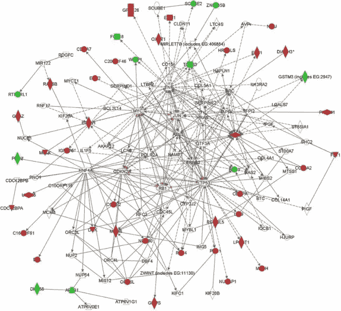
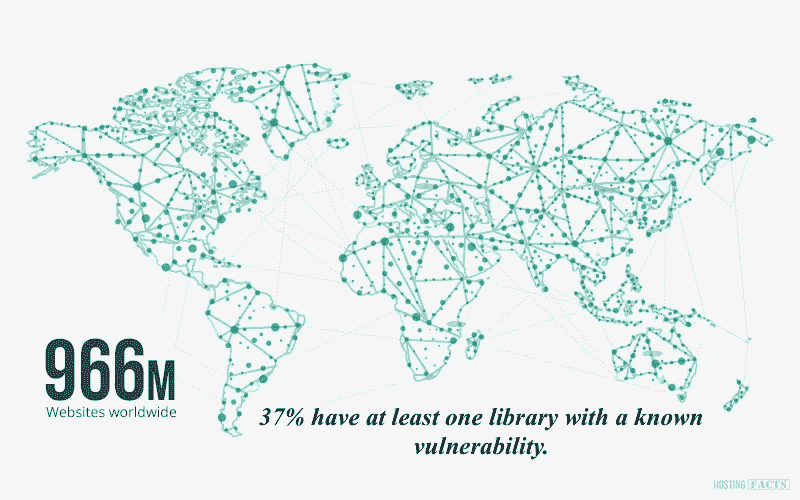

# 网络安全——复杂性风险

> 原文：<https://medium.com/hackernoon/cyber-security-the-complexity-risk-17197323190>

从人员和流程到计算机基础设施和软件，公司环境中的许多领域都可能成为黑客的攻击目标。

当我们关注技术架构时，许多黑客的特征之一是目标环境的复杂性。这篇文章简要地探讨了复杂性是如何给黑客提供机会来利用过于复杂的系统所造成的弱点的。

[*复杂性是任何生产系统的大敌*](http://krebsonsecurity.com/2014/05/complexity-as-the-enemy-of-security/) *。*当环境变得过于复杂时，相互依赖性会对上游和下游产生影响。这些环境很容易受到黑客攻击，因为随着环境的复杂性增加，环境中的元素数量也会带来额外的风险。

复杂性、安全性和稳定性之间也有直接的关联。具有多个操作系统、数据库和开源组件的环境需要全面的测试和协调，并且通常会给环境带来不稳定性。许多公司还混合使用[新旧网络设备](https://www.csoonline.com/article/2464168/identity-access/how-to-reduce-the-risk-of-insecure-firmware-in-office-gear.html)，这增加了打补丁的难度，从而增加了风险。

最近有很多关于信息是如何被黑客从所谓的安全公司窃取的文章。行业分析师和政府机构将仔细研究 Equifax，以确定此类事件发生的方式和原因。

如果您看一下 Equifax 面向外部的主机，很快就会发现该公司在面向外部世界的可能目标数量方面存在问题。似乎从 [600](https://twitter.com/Viss/status/906228129122836480) 到[1500](https://analysis.outsideintel.com/equifax.txt)的任何地方都有多个子域和面向互联网的外围主机。

我认为，管理这种规模和复杂性需要强大的安全性、[网络](https://hackernoon.com/tagged/network)和生产支持团队，他们有能力同步修补、升级和持续维护这些系统。如今可用的[安全管理](https://hackertarget.com/10-open-source-security-tools/)和[监控工具](https://techtalk.gfi.com/the-top-20-free-network-monitoring-and-analysis-tools-for-sys-admins/)也很复杂，需要大量的持续培训、维护和升级。

[研究人员发现，37%](https://snyk.io/blog/known-vulnerabilities-in-javascript/) 的被调查网站至少包含一个存在已知漏洞的库。这意味着，对于许多公司来说，跟上简单的修补通常非常困难。还有待观察 Equifax 如何管理其复杂性，以及他们是否掌握了保持环境安全所必需的关键维护。

最近的新闻报道把责任归咎于 Apache Struts 库中的一个漏洞。我认为，即使漏洞是在 3 月份发现的 Apache Struts 库，开发团队也需要几周甚至几个月的时间来正确测试补丁的影响。

当看到 Equifax 漏洞的灾难时，我认为公司应该从这些错误中吸取教训，并检查自己的技术债务，以了解他们容易受到攻击的地方。修补系统是良好网络安全策略的基础。

确保在设计阶段的开始就将安全决策[整合到架构中](https://www.computer.org/cms/CYBSI/docs/Top-10-Flaws.pdf)是至关重要的，开发人员通常不是最好的安全专家。

让您的技术足迹变得过于复杂和不可管理是一个问题，从长远来看，修复成本会更高。一个管理良好、记录完善、控制得当的环境更难渗透。

我认为，在像“Equifax 黑客”这样的事件中，大局往往被细节所掩盖，因为它指出了一个更大的问题，即许多公司专注于“照常营业”和管理成本，而不是积极主动地保护存储在他们系统中的数据的安全。如果一家公司的技术足迹在没有任何设计原则和没有持续威胁和漏洞评估的情况下有机增长，他们会将自己和客户置于风险之中。

如果让我总结一下 Equifax 的一项职责，那就是管理美国消费者的“个人信用数据”,确保未经数据所有者的事先批准，这些数据永远不会被泄露、曝光或共享。显然，对维护现有环境和管理成本的关注优先于这一单一职责。

当一名雇员点击一封钓鱼邮件并放弃他或她的证书时，美国政府的个人[管理](https://hackernoon.com/tagged/management) (OPM)办公室遭到黑客攻击。埃德·斯诺登成功地在他为之工作的承包商的资质和合规流程中找到了一个漏洞，全世界都知道他行动的结果。这些都是流程和培训缺失的例子，不需要技术解决方案来补救。

正如我在开始时指出的，网络安全是一门学科，它包含了公司环境的每个控制方面。非技术流程是公司每个员工的责任，如果缺乏信息安全意识，任何技术解决方案都无济于事。假设每个公司都强化了这种意识，那么对技术问题的集中评估将会产生一个可以管理的风险状况。

仔细观察一个环境的技术架构的复杂性，可以很快看出公司的风险状况是否与业务使命和目标一致。一次违规可能会对您的业务造成灾难性的后果，其成本远远超过投资进行强大的网络安全审查和重新构建。

*感谢阅读*

最诚挚的问候:**诺曼·金**

如果您喜欢这篇文章，请点击“喜欢”按钮；发表评论或与您的网络分享。另外，请查看我在 LinkedIn 上的其他帖子 [***这里***](http://www.linkedin.com/in/normanmking) ***，*** *也在 Medium 上* [***这里***](/@normanking) *。邮箱:【normanking@brook-port.com】**。可用于咨询、顾问和演讲活动***