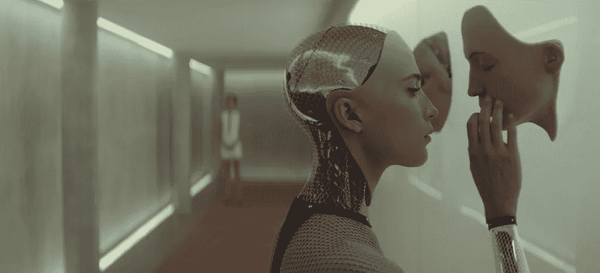
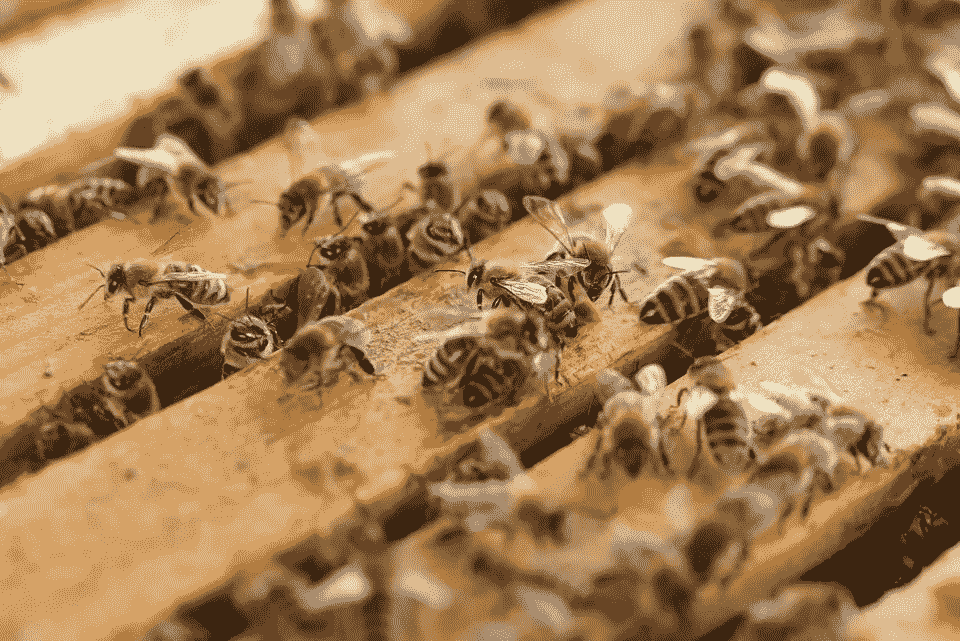

# 人工智能有多“真实”？

> 原文：<https://medium.com/hackernoon/dances-with-bees-how-we-get-from-image-recognition-to-westworld-72c3dc53a478>

A machine learning algorithm analyzes its weights and biases in the film ***Ex Machina***

有时候，当我跳上一辆自动驾驶的优步，或者注意到脸书不知何故在我的个人资料照片上标注了一个“典型的科罗拉多州徒步旅行者”的 ID 时，我不禁想知道我们离 [*Ex 玛奇纳*](http://www.imdb.com/title/tt0470752/?ref_=nv_sr_1) 或 [*西部世界*](http://www.imdb.com/title/tt0475784/) 的反主题机器人起义有多近。计算机会下棋，但是它们会策划、撒谎或作弊吗？他们能有创造力吗？他们能够批判性地分析他们在世界上的位置，并决定他们想要一个更好的吗？

最近的[机器学习](https://hackernoon.com/tagged/machine-learning)突破依靠一种叫做 [**监督学习**](https://en.wikipedia.org/wiki/Supervised_learning) 的策略来训练人工“神经元”网络执行特定任务。这些令人难以置信的算法使得每一项浮华的技术追求都取得了进步，从[浏览器内自动翻译](http://www.nytimes.com/2016/12/14/magazine/the-great-ai-awakening.html?_r=2)到[自动驾驶汽车的控制系统](http://www.roboticstrends.com/article/how_ai_is_making_self_driving_cars_smarter)，但它们都依赖于大量的标记数据来评估和调整它们在手头任务中的表现(例如[分类](http://www.sciencedirect.com/science/article/pii/S0893608012003164))。

使用监督训练来优化特定任务的神经网络是非常好的——如果你只有一种类型的任务要解决。而且，即使一些算法已经足够一般化，可以应用于一些重叠的任务，你也不能真正指望一个为语言处理设计的网络来学习如何特别好地识别图像。这是噩梦机器人起义的一个巨大障碍:有机智能的某些东西只是更具流动性，更能适应变化，更能形成微妙或意想不到的联想。

如果我们想要鼓励噩梦机器人起义的成功——出于某种原因，这也是本文的立场——我们需要重新评估我们如何试图构建我们的人工大脑。我们通常从顶层开始，这将是一个特定任务的具体结果，通过我们的网络向下移动，以便教会它如何尽可能好地执行该任务。但真正的大脑形成的方向相反:它通过网络向上发送连接，并基于一些简单的吸引规则，鼓励神经元簇和它们之间的路径的理想分布。

这种[涌现的复杂性](https://en.wikipedia.org/wiki/Emergence)被称为 [**群体智能**](http://ngm.nationalgeographic.com/2007/07/swarms/miller-text) ，其基础是庞大的昆虫群体(例如蜜蜂)如何合作寻找食物的最佳路径。这个过程依赖于大量的个体行为者，每个行为者都有一些基本的规则。蜜蜂跳舞是为了与蜂巢交流它的发现，跳舞的持续时间与食物来源的质量(在数量和接近程度方面)相对应。接下来是第二代朝圣者蜜蜂，它们被编程为遵循它们遇到的第一只跳舞的蜜蜂所描绘的路径，然后回家自己跳舞。然后第三代也这样做，这个过程继续下去。

最终，整个蜂巢会找到最佳食物来源，因为最初遇到一只在特定地方跳舞的蜜蜂的几率会略高于其他蜜蜂(基于舞蹈的长度)，并且随着更多的蜜蜂开始朝那个方向移动，这种几率会继续提高。整个蜂房，凭借的不是智力而是纯粹的数量，能够一起解决一个群体中任何一个个体都无法独自解决的问题。

Several bees teeming up to solve a difficult problem

这很像发育中的大脑如何在新神经元之间形成连接:每个神经“蜜蜂”(一个放射状胶质细胞)在穿过神经元集群时都遵循一些规则。一旦足够多的神经元在网络中移动，控制它们发育的基本规则允许神经元之间出现最佳的连接模式。

这种构建大脑的方法可能会有很大的不同。事实上，当比较人类大脑和黑猩猩大脑时，似乎最重要的区别就是神经元及其连接的数量——我的意思是，蜂巢中蜜蜂的数量。让黑猩猩用棍子大量捕捉白蚁的同样的涌现模式，使我们能够理解语言。如果他们的大脑能够像我们一样继续发展新的联系，他们大概可以学会做任何让我们成为人类的令人惊讶的事情(例如，操作推特账户、网上银行等)。).

所有这些都给我们带来了一个关键的工具，为我们可怕的人工智能超级机器人大军开发一个强大而灵活的网络:****【无监督学习】。**非监督模型还没有监督模型发展得好，但它们只是使用未标记的数据进行训练。可以想象，它们可以让优雅的图案有机地出现——如果我们能够首先确定指导我们跳舞的蜜蜂遵循的最佳规则的话。**

**我们也可以开始大胆地推测，通过将一系列神经网络包装在一个无监督的模型中，构建一个混合解决方案，这些神经网络本身在一个监督的设置中进行了预训练。无人监管的容器可以通过每个预先训练的网络发送输入，并发现哪个网络应该解决什么问题，哪个网络应该增加或减少，以及神经元可以在哪里与其他网络形成远程连接，以提供更多类似人类的创造性联想能力。这可以让人工智能程序直观地知道在看到图像时分析它，并且通过这样做，可能会想起一首相关的歌曲，并且在想起这首歌后，可以用英语会话告诉你它的整个思路。**

**让这些系统足够有效以至于伪意识智能出现仍然是一个不可思议的任务，即使整个网络不需要明确地手工编程。但是，偶尔放纵一下真实的感觉机器人的幻想是很重要的，只要机器学习和人工智能的研究不会被商业可行性的无处不在的扼杀所吞噬。**

************

> **[黑客中午](http://bit.ly/Hackernoon)是黑客如何开始他们的下午。我们是 [@AMI](http://bit.ly/atAMIatAMI) 家庭的一员。我们现在[接受投稿](http://bit.ly/hackernoonsubmission)，并乐意[讨论广告&赞助](mailto:partners@amipublications.com)机会。**
> 
> **如果你喜欢这个故事，我们推荐你阅读我们的[最新科技故事](http://bit.ly/hackernoonlatestt)和[趋势科技故事](https://hackernoon.com/trending)。直到下一次，不要把世界的现实想当然！**

****