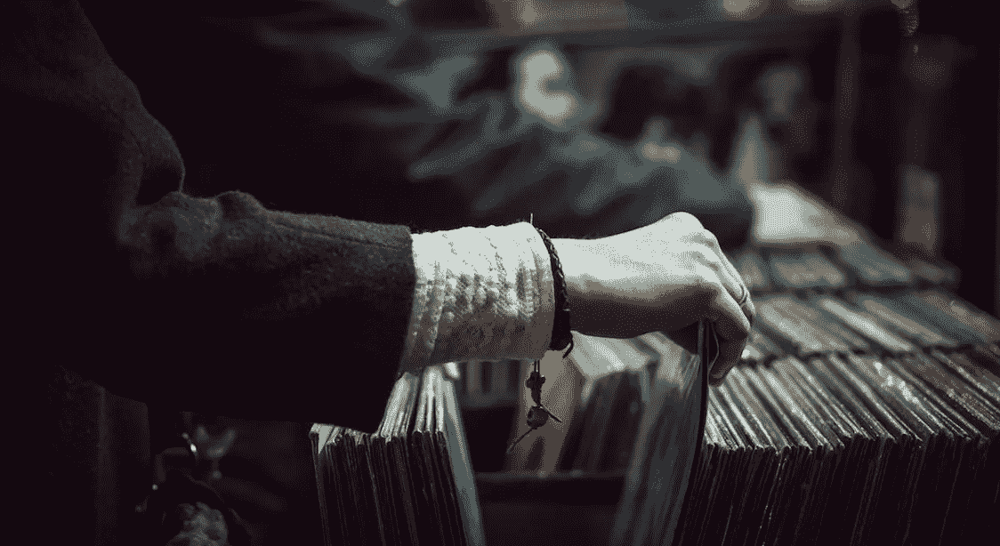

# 约会创意:追求创造力和创新变得实际

> 原文：<https://medium.com/hackernoon/dating-ideas-getting-practical-about-courting-creativity-and-innovation-cf6074f6c6e1>

**[Image:** [**Edu Grande**](https://unsplash.com/@edgr)**]**

有意识地关注你给自己的经历的广度可以让你更好地了解自己，这有助于澄清创造过程的基础。

C 创造力和创新往往源于对人们行为的密切关注: [Swiffer](http://swiffer.com/) 诞生于 Continuum 之后，这家咨询公司被宝洁& Gamble [请来](http://www.amazon.com/Everything-Connects-Creativity-Innovation-Sustainability/dp/0071830758/ref%3Dsr_1_1?ie=UTF8&qid=1473171797&sr=8-1&keywords=everything+connects)开发一种新的家居产品，研究了人们打扫房间的方式，发现人们花在清洁拖把上的时间与用拖把清洁的时间一样多。

他们采取行动来解决这一棘手问题，现在只需几分钟就能把你的厨房收拾得漂漂亮亮。在另一个国内例子中，当营销人员意识到人们在完成家务后感到自豪，并提供一种结束家务的仪式时，Febreze 开始流行，这种令人满意的喷雾现在每年创造超过 10 亿美元的收入。

新事物往往是通过两个不相关的事物的结合(或发现关系)而发现的。

这表明创新过程的核心是密切关注你周围发生的各种事件，并以古人绘制星座图的方式绘制它们之间的联系。我们试图找到所有事物之间的联系，然后发现存在于这些联系中的价值。

> *“不同经历(和不同个体)激发创造力的好处可以在个人和组织层面上实现。”*

当记者问艺术家一个懒惰的问题“你的想法从何而来？”答案只能是这样:他们的经历。

如果一个想法是战略的种子，那么一个想法的种子是什么？是*体验，*但是体验能有质的区别吗？

有可能:[研究表明](http://blogs.scientificamerican.com/mind-guest-blog/why-does-time-fly-as-we-get-older/)随着年龄的增长，时间似乎加快的原因是这个世界不再像你年轻时那么新奇。你对一个情境越熟悉——或者你感觉到你正处于一个情境之中——你就会越快地经历它。这是一个关于多样化经验的论点——创造力的预测。

怎么会？因为，这是一个关注你的经历的问题。

我们越少沉浸在自己的思考中，就越能关注这个世界。这叫什么主治经验？*好奇心*。正如爱因斯坦的名言所说，他除了强烈的好奇心之外没有任何特殊的天赋，我们可以说，除了强烈的好奇心之外，没有其他培养创造性工作的途径。

好奇心培养的一个持续部分——无论是在我们的个人工作生活中还是作为团队的一部分——是练习邀请广泛的经验，一个我们可以在以后的生活中借鉴的经验库。

有意识地关注你给自己的经历的广度可以让你更好地了解自己，这有助于澄清创造过程的基础。无论我们是设计师、厨师、项目经理还是作家，对一系列经历的取样有助于我们在一个新的环境中识别自己，并再次找到我们在世界上的位置。

实际上，我们可以通过以下方式让生活中产生更多创新:

**你消费的媒体** *。吸收一系列艺术、新闻和学术知识会让你更容易受到跨领域洞察力的影响。如果你通常阅读商业书籍，那就去看看艺术。如果你平时看的是严肃的纪录片，那就抓点爆米花，看个大片。如果你从未看过芭蕾舞，那就去看一场；如果你不明白植物园的意思，就去找一个。*

**你看**的人。网络理论发现，团队的成功是由其成员拥有的联系的质量和数量来预测的，尤其是跨学科和孤岛的联系。把它应用到我们的个人生活中，我们会从生活中不断增长的多样化的伙伴关系中受益。是的，一个真正的伴侣确实是一件罕见的事情，但这种珍贵是警惕地照顾他们的部分原因。

**你参加的活动** *。*寻找那些伙伴关系——你的部落成员，如果你愿意的话——就像确认生命一样困难。那么，问题是你的兴趣和优先圈里的人聚集在哪里？会议、谈话和阅读都是例子，你友好的邻居酒吧也是例子。无论是聚会、晚餐还是其他，都是如此。这个想法是，会议和聚会是意外收获的地方，随时可以通过友好的微笑和真诚的握手来实现。

但这只是丰富我们生活的三种方式，让我们拥有更广泛、更密切的体验。我们也可以更有意识地训练自己直接参与到我们的经历中，也就是说，更用心地生活。但那是另一天的话题。

…..

*经许可摘编自* [*万物互联:如何在创意、创新、可持续的时代变革与引领*](http://www.everythingconnectsthebook.com/) *【麦格劳希尔】作者* [*费萨尔·霍克*](http://www.fastcompany.com/user/faisal-hoque) *与* [*德雷克·拜尔*](http://www.fastcompany.com/user/drake-baer) *。版权所有 2014 年由费萨尔霍克。保留所有权利。*

**【精选图片:** [**Edu 格兰德**](https://unsplash.com/@edgr)

**. . . . .**

**我是一名[企业家和作者](http://faisalhoque.com/speaking/)。[沙多卡](http://shadoka.com/)等公司创始人。Shadoka 促进企业家精神、增长和社会影响。著有《 [*《万物互联——如何在创意、创新和可持续发展的时代进行变革和领导》》(麦格劳·希尔出版社，2014 年)和《*](http://www.amazon.com/Everything-Connects-Creativity-Innovation-Sustainability/dp/0071830758/ref=sr_1_1?ie=UTF8&qid=1376488798&sr=8-1&keywords=everything+connects%2Bfaisal+hoque) *[*生存并茁壮成长:坚韧的企业家、创新者和领导者的 27 种实践*](http://survivetothrive.pub/) 》(励志出版社，2015 年)。在 Twitter 上关注我 [@faisal_hoque](http://twitter.com/faisal_hoque) 。***

***免费使用* [*万物互联领导 app*](http://app.everythingconnectsthebook.com/login.php)*。***

****************

> **[黑客中午](http://bit.ly/Hackernoon)是黑客如何开始他们的下午。我们是 [@AMI](http://bit.ly/atAMIatAMI) 家庭的一员。我们现在[接受投稿](http://bit.ly/hackernoonsubmission)并乐意[讨论广告&赞助](mailto:partners@amipublications.com)机会。**
> 
> **如果你喜欢这个故事，我们推荐你阅读我们的[最新科技故事](http://bit.ly/hackernoonlatestt)和[趋势科技故事](https://hackernoon.com/trending)。直到下一次，不要把世界的现实想当然！**

****