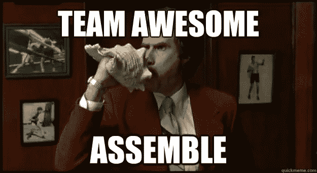
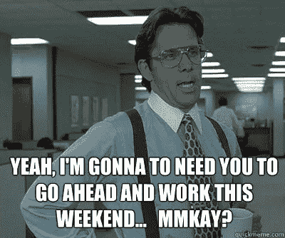

# 截止日期驱动的可预测性

> 原文：<https://medium.com/hackernoon/deadline-driven-predictability-e93869f46084>

你以前听过这些吗—

“这个团队，哦，他们会努力工作，以满足任何目标，无论它看起来多么不可能。”

“伙计们，我们致力于这一可交付成果，产品团队已经向客户承诺，我们需要以某种方式实现它。”

“如果我们在发布日期前成功完成，我们将被誉为英雄”

“这很难，但团队会想出如何及时完成。”

“团队，就为了这次发布，这一次，我会要求你们所有人在几个晚上和周末工作。如果需要，我们甚至会带午餐。”

我猜我们大多数人都听说过这些，甚至说过这些话(我知道我两者都做过)。你可能会说，这些陈述代表了将短期目标放在被管理人员福祉之前的管理。你甚至可能会争辩说，这种短期思维破坏了产品交付的长期可预测性和质量。但是，那又怎样，团队从帽子里变出兔子，我们实现了我们的承诺，拍拍自己的背，再次重复这个循环。这有什么错？我们正在把事情做好。我们觉得自己是英雄。这个团队能够展示管理，这是多么令人敬畏。每一级管理都可以对上一级做同样的事情。我们都在排队等待奖金和晋升。这真的是一件坏事吗？

人民呢？如果我们不再把我们的人推向边缘，并不意味着我们的竞争对手也会。这意味着我们不会创造奇迹，但我们的竞争对手会。这可不好。如果每个人，包括我们的竞争对手，都依赖于人们投入额外的时间，这些人没有太多的选择，不是吗？他们要做什么？辞职？辞职，然后去其他地方做同样的事情。不管怎样，如果他们辞职了，对我们来说也没关系，我们总是可以雇用替代者的。也许是一个花费更少的人。我们会帮他们收拾东西，在寻找替代者的时候和他们吻别。开发商多如牛毛。

与我们的竞争对手相比，我们不仅仅害怕失败。即使在我们的组织内部，我的团队、作为经理的我、我的老板、我老板的老板，看起来都像是不能完成任务的人。如果我看起来像一个不能完成任务的经理，我将永远不会被提升。如果我的老板看起来不能完成任务，我永远也不会得到提升。即使没有晋升和奖金，我也有责任推动团队取得成果。一旦我们做出了承诺，无论出现多少新的信息和惊喜，我们都必须遵守。

我们没有权利告诉我们的老板和客户我们将错过最后期限，因为我们可以从开发人员那里挤出一天中未使用的时间。截止日期激励人们，我说的激励是指随着截止日期的临近，激励他们工作更长时间。这里有一个想法——让我们变得敏捷。这样，我们在两周的冲刺阶段工作。也就是说，截止日期，每两周一次。让我们如此频繁地冲刺，他们会忘记他们曾经走过。我们不能靠走路领先，我们必须一直冲刺。

事情当然会发生，人们不得不休假，新的工作进来，客户问题出现，我们被拉进评估会议等等。不管所有这些，不管范围蔓延和发现事情比我们想象的更复杂，我们必须满足我们的期限。它们被称为最后期限是有原因的。我们不能延长最后期限，我们不能缩小范围。只有两个选择。投入更多的人，或者“更加努力”。人力成本很高，而且我们还有其他领域正在努力实现承诺。这就剩下一个选择——“更加努力地工作”。

我们相信我们可以让任何事情发生。我们不需要可预测性，我们自己创造可预测性。如果我们说某个特性将在某个版本中交付，那么它将以这样或那样的方式交付。我们的可预测性是由团队努力工作建立起来的。它不需要任何花哨的“可持续速度”或“稳定系统”的说法。带着你的预见性回家吧。我们会以任何方式履行我们的承诺。

这个版本有更大的风险。我们真的没有时间浪费在这种“过程改进”上，因为它可能无论如何都不会奏效。当我们压力小一些的时候，我们可以讨论下一个版本。这是最后一次发布，我们会这样推动你的团队。从下一个版本开始，我们可以寻找让事情变得更好的方法。我们知道我们在过去说过几次，但是这次我们是认真的。由于我们已经从这个版本中了解了团队的能力，我们将为下一个版本承诺我们在这个版本中完成的工作量。我们不能告诉我们的客户和老板我们会做得更少，减少产能是不可接受的。是的，下一个版本会有所不同。

我们信任我们的团队，他们有能力。他们完全有能力决定如何实现我们为他们做出的承诺。我们的团队是一个努力工作的团队。他们能做不可能的事。他们绝不会让球队的管理层看起来很糟糕。反过来，管理层也绝不会让高级管理层难堪。当团队完成不可能的任务时，我们会庆祝他们，给予他们赞美，带他们出去开心一小时。毕竟，他们需要奖励，如果我们不这样做，他们可能不会再这样做。“这个团队，哦，他们会努力工作，以满足任何目标，无论它看起来多么不可能。”