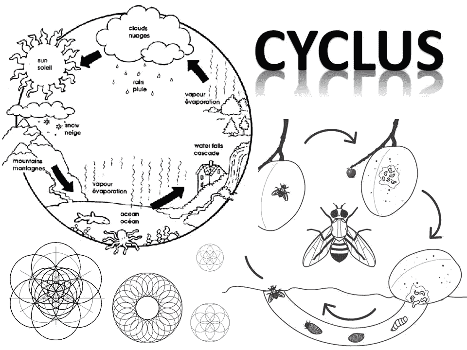
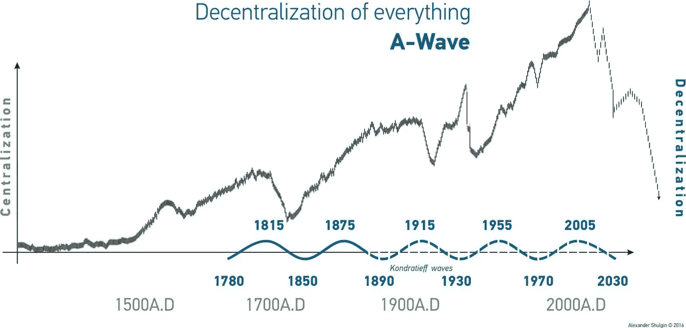
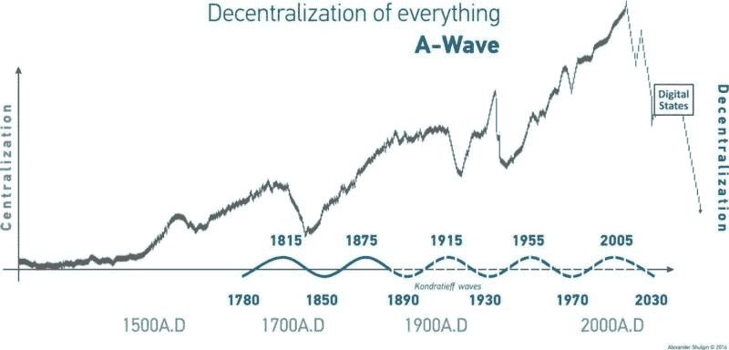
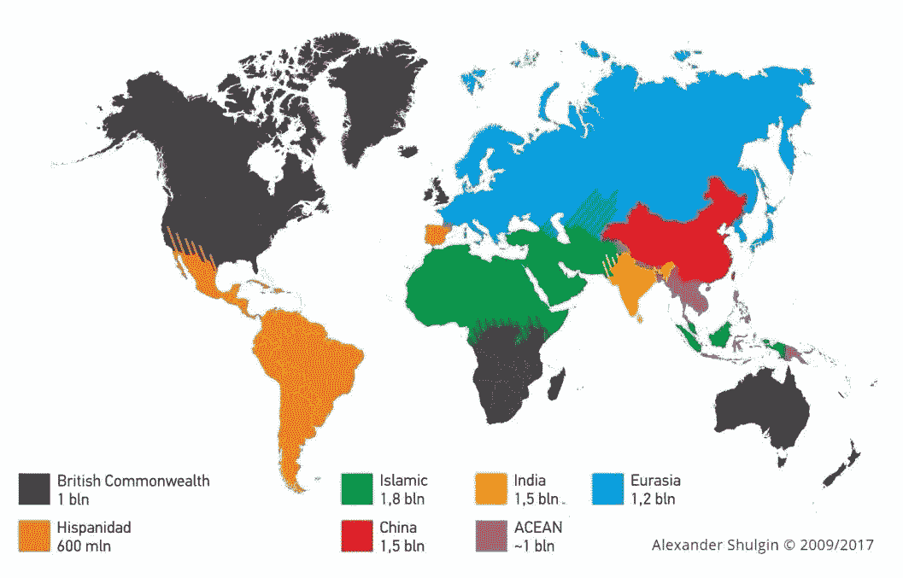
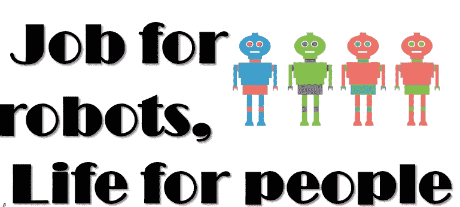

# 一切事物的分散化正在改变全球经济和生活方式

> 原文：<https://medium.com/hackernoon/decentralization-of-everything-transforming-the-global-economy-and-lifestyle-c3f3529a0bff>

## **开场白:“诺亚造方舟的时候还没下雨”**

# 周期

自古以来，把生命想象成永恒的循环运动是很常见的。古代社会广泛坚持年龄周期性变化的观点，因为天体周期性地改变它们的位置，因此被认为调节着地球上的事件。除了日月周期、沉积周期和生命周期等常见的周期形式之外，这种关于世界上存在的一切事物的周期发展的观点已经转移到由经济兴衰组成的经济周期以及政治变化的周期上。

斯宾格勒和汤因比认为特定的文化(文明)经历了特定的周期，而马克思主义概念否认了世界历史在封闭的圈子中运动的想法，以及沿着直线不断机械前进的理论。根据历史唯物主义，世界历史在社会和经济形态中作为一个整体不断前进的变化过程流动，在这一过程中，运动不是沿着一条直线，而是沿着一条螺旋，即历史发展早期阶段的一些特征再次出现，但它们是在一个新的更高的水平上出现的。

“中央集权”一词于 1794 年在法国开始使用，因为法国大革命后法国地方政府领导创建了一个新的政府结构。“分权”一词在 19 世纪 20 年代开始使用。“中央集权”在 19 世纪的前三分之一进入了书面英语。

亚历西斯·德·托克维尔写道，法国大革命始于“推动权力下放……[但]最终成为中央集权的延伸”。

在二十世纪早期的美国，对经济财富和政治权力集中的一种反应是分散主义运动。它指责大规模工业生产摧毁了中产阶级店主和小制造商，并促进了财产所有权的增加和小规模生活的回归。

已经写了许多致力于去中心化的书和其他作品。丹尼尔·贝尔写了《T2》和《后工业社会的到来》，而阿尔文·托夫勒出版了《T4》和《未来的冲击》，分别是《T5》(1970 年)和《T6》以及《第三次浪潮》(T7)(1980 年)。未来学家约翰·奈斯比特 1982 年的书《大趋势》在《纽约时报》畅销书排行榜上停留了两年多，售出了 1400 万册。这些年还出版了许多其他的书和文章。斯蒂芬·卡明斯(Stephen Cummings)写道，去中心化在 20 世纪 80 年代成为一种“革命性的大趋势”。

然而，到目前为止，所有这些都是围绕集中化趋势的一种波动，就像商业周期或经济周期和/或贸易周期一样，当我们看到围绕其长期增长趋势的向下和向上运动时，直到能够改变世界、其组织和生活方式的技术出现。随着被称为区块链的分布式账本技术，一个更大的周期正在形成。从文艺复兴开始，在一场巨大的欧洲危机之后，这场危机的原因包括小冰期、科学和创新的新突破，以及随后技术革命的开始，出现了最强有力的一切集中化，无论是电力、基础设施、制造、分销、金融还是媒体。这一波，这一周期比早期的中央集权周期要大得多。到 2000 年至 2010 年，集中化浪潮在社会、工业、金融和地缘政治领域达到了顶峰，到那时，我们可以看到新兴的区块链技术为去中心化的公共账本带来了生机。

这意味着是时候进行全球调整了。用天才的俄罗斯科学家尼古拉·康德拉蒂耶夫的话来描述他发现的经济周期——改善、繁荣、衰退和萧条——我们正处于衰退的开端。如果存在持续 50 年的康德拉蒂耶夫周期，以及较小的周期，如库兹涅茨周期、朱格拉周期和基钦周期，那么肯定也存在较大的周期。就是这样一个周期 A，一波 A，周期顶，我们走到了现在。

# **数字国家的起源**

**世界系统理论(世界系统分析或世界系统视角)**

伊曼纽尔·沃勒斯坦和他的继任者试图利用旧的经济模型，并考虑到正在转型的数字技术是未来媒体空间的基础，来揭示地缘政治未来稳定模型的前景。

亨利·卡伯特·洛奇在他 1910 年的《国家史》中写道，波斯国王大流士一世(公元前 550-486 年)是一位组织大师，“历史上第一次，中央集权成为政治事实。”他还指出，这与古希腊的权力下放形成了对比。

马克思主义强调社会冲突，关注资本积累过程和竞争性的阶级斗争，关注相关的总体性、社会形式的短暂性以及通过冲突和矛盾运动的辩证意识。

这是资本分散和再分配的前提。然而，所有这一切，以及其他设想即将到来的地缘政治变革的尝试，都是徒劳的，因为没有人能够想象这样一种技术的出现能够实现完全的权力下放。在这种分权的中途，出现了分权集权的先决条件，按照亚历西斯·德·托克维尔的说法，这是“对分权的推动……[但最终成为]集权的延伸”。股票市场操作者和交易者知道斐波那契数列和埃利奥特波的规律，以及其他周期性的衍生品，这意味着他们知道在暴风雨般的增长和突然下跌之间的某个地方有一个趋势确认点，在这个点上，通过波动、跳回或修正来确认，这就是下降趋势中的“死猫反弹”。因此，在全面的全球分权之前，这将是所有以前的分权中最大的，因此也是最引人注目的，“……分权……是最终集权的延伸”。

因此，该平台称，在去中心化的中途，将会出现新的数字联盟，这将导致最终的全球集中化。取代 200 多个州和未被承认的地区，七个数字联盟将以经济平台的形式出现。

七个数字平台将是七个数字单一市场，它们在地理上的联系不是很紧密，而是基于文化、传统和心态的共性。就人数和资源而言，这些工会将是相对相同的，在某个时刻，它们将被驱使合并，在新范式中共存。一些国家拥有技能和技术，另一些国家拥有资源，还有一些国家拥有能源。能源将发挥越来越大的作用，因为分散系统的计算能力将需要更多的能源。即使在今天，使用 Etherium 的基础设施消耗的电力和塞浦路斯一样多，而使用比特币的基础设施消耗的电力更多。当物联网、工业物联网、智能城市、智能工厂等出现时，会发生什么？变得司空见惯？当我们周围有数千亿个持续连接的设备，消耗着巨大的能源时，还会消耗更多的能源来支持这一基础设施以及有用的数据挖掘，这是维护我们未来智慧经济的实时数据所必需的。

数字环境将占全球经济的 80%。超过 50%的服务将在数字环境中提供，近 50%的商品和产品将直接在同一数字空间中创造和销售。7 个联盟中的每一个，数字国家，都应该有自己的保护经济主权的标准。

软件化、数字化、机器人化和自动化带来了新卢德分子的巨大风险，失业群众将成为社会的沉重负担。他们将不得不被支付普遍收入，外国人移民到联盟将会给现存社会带来经济和社会上的痛苦。因此，防火墙保护和自己的数字环境标准将创建一个强大的边界，堪比黑暗时代的墙壁和护城河。工会之间的通信将使用网关进行管理。如今，我们开始看到这样的孤立主义:英国退出欧盟、川普政策等等。世界现存的一切紧张，都是地缘政治转型、去中心化、整个货币体系更替之前的一种定位尝试。

在这样一个联盟中，社会的一切都将是相当分散的，然而中央集权也将经历它自己的蜕变，如果亚历西斯·德·托克维尔还活着，他会说“对权力分散的推动……[但最终成为]中央集权的延伸”。

最终分散到 7 个数字平台是采取下一步行动的必要条件，这就是利用管理和控制的高度集中和全人类的统一超级大脑的全面全球分散在我们称为地球的小家园将没有隐私，我们将无处可去，就像乘客不能中途离开飞机一样。

只有一件事会保留下来，那就是在一个绝对去中心化的社会里快乐。如果我们可以，如果我们积累的喜欢允许，这将成为信任的社会信用，我们将用它来交换东西。因为在这个时候，我们根本不会使用货币。

*原载于* [*外交世界*](http://diplomatic-world.com/?p=2497)*2017 年 12 月
另见* [*杂志*](https://www.yumpu.com/en/document/view/59623336/diplomatic-world-nummer-55) *数字副本。*