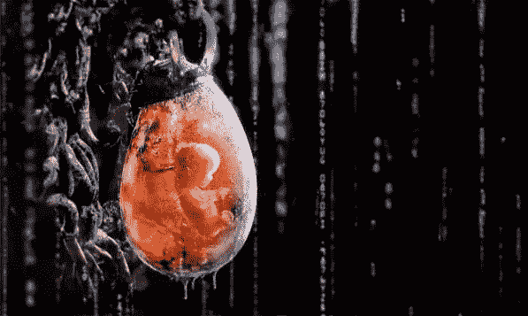

# 解读伟大风投的品质

> 原文：<https://medium.com/hackernoon/decoding-the-qualities-of-a-great-vc-d02f2d4da4ae>

上周五，我和 AngelList 的帕克·汤普森(T1)以及 T2 初创公司 L Jackson(T3)的创始人谈论了一系列话题，从投资种子期公司到从零开始建立 T4 风险投资公司(T5)。电话快结束时，他问我，我认为一个成功的风投应该具备什么样的品质。我没有当场回答，因为我们基本上没有时间了，我告诉他，我会进一步考虑这个问题，并在周末通过电子邮件告诉他我的想法。

当天晚些时候，当我有一些休息时间时，我开始考虑帕克的问题，并问自己以下相关问题:一个好的风投是由什么组成的？对风险公司、有限合伙人和创始人来说，什么是重要的？谁是最好的风投，是什么让他们与众不同？在考虑了这些问题后，我抓起笔记本，写下了我认为必不可少的属性。

*   好奇心——对知识和学习的渴望。
*   专业知识——通过经验积累的业务、工程和/或产品技能。
*   激情——对新想法、创新和企业家精神感到由衷的兴奋。
*   专注——能够淹没噪音，把时间花在重要的事情上。
*   网络——真正大规模发展和维护关系。
*   销售——在内部和外部销售和建立共识的能力。
*   情商——理解和评估动机、欲望、需求和无形资产。
*   信念——面对反对和怀疑时保持兴奋的能力。

我决定[在 Twitter](https://twitter.com/schlaf/status/913886309562949633) 上分享这份清单，在帖子上抄送给他，并参与展开的对话，而不是给帕克发一封电子邮件表达我的想法。几位创始人和投资者公开或私下插话分享他们的观点，并扩展了我开始列出的清单。虽然我不一定同意所有的建议，但提到的其他属性包括:

*   快速学习者——能够快速消费、学习和吸收各种主题的信息。
*   友好——通常乐于相处，讨人喜欢(虽然我试图尊重每个人，但我不确定这是成为一名伟大投资者的先决条件)。
*   第一原则思考者——能够将复杂的想法和现象归结为基本真理的人。
*   坚忍——在压力和动荡下保持冷静。
*   谦逊——行为、态度或精神谦虚。
*   视觉——可以看到世界的发展方向。

这 14 个属性的综合列表并不全面，但我相信它抓住了许多重要的属性。我想知道世界上最好的风险投资家——像迈克尔·莫里茨、约翰·杜尔登、马克·安德森、莎娜·费舍尔、弗雷德·威尔逊、比尔·格利和克里斯·萨卡这样的投资者——会如何描述他们自己和他们最成功的同行。我还想知道，他们的机构是否已经开发出一套系统，根据一系列特质和经验来识别下一代伟大的投资者。他们的公司已经成功地在多个周期中保持领先，我认为这不是偶然的。鉴于人和关系网是风险投资业务的核心，或许他们已经通过识别、雇佣、培训和留住优秀人才，发现了人才方程式的隐藏答案。

几年前，杰瑞·诺伊曼(Jerry Neumann)是纽约一位受人尊敬的天使投资人，他列举了每一位伟大的风投公司创始人的背景，试图回答这个问题。这是这项工作的成果，他将其命名为[风险投资谱系](http://neuvc.com/labs/vcgenealogy/)。据杰里说，他发现最有趣的事情是，除了预期的银行家、律师和[科技公司](https://hackernoon.com/tagged/tech-company)高管，还有一些记者在那里(莫里茨是最突出的)。记者的素质在他看来很突出，因为他们能够找到合适的人进行采访，提出合适的问题，验证他们得到的答案，并简洁地传达他们的发现。显然，成为一名有效的沟通者至关重要。

这让我想到了一个价值百万美元的问题:有没有可能创建一个平台或系统来识别和培训下一批世界顶级风险投资者？会是什么样子？也许这个系统是由软件驱动的。或者，这可能是一种 YC 式的新型组织，负责识别、培训和联络投资者。也许是混血儿。我可以想象这样一个系统会根据标准、属性和经验对候选人进行评分、加权和排名。这样的程序或系统如何给无形资产或软技能评分？它能识别某人网络的力量吗？这种系统的潜在输入是什么，输出会是什么样的？这些问题看起来没完没了，但这是一个有趣的思考练习，值得考虑。

也许这是一个白日梦，因为真正伟大的投资者很少，而风险投资被认为是一种学徒业务，学习需要很多年，贯穿整个周期。风险投资人在他们的职业生涯中，甚至在投资组合公司的发展过程中，面临着如此多不同的问题——即使是最适合的人也必须进行几年的在职学习才能变得优秀。如果弗雷德·威尔逊没有经历过网络公司的繁荣和熨斗合伙公司的崩溃，他还会是同样的投资者吗？比尔·格利是否从 Benchmark 的创始合伙人那里获得了多年独特的指导？Shana Fisher 在 IAC 期间获得了哪些重要见解？迈克尔·莫里茨是通过写史蒂夫·乔布斯和李·艾柯卡发现了理想的创始人原型，还是从唐·瓦伦丁和他在红杉资本的前辈那里学到了什么？这些经历和互动如何塑造了他们的投资品味和哲学？鉴于经验在塑造投资者的过程中扮演着如此重要的角色，老实说，我不确定是否有可能开发一个通过寻找和培训未来投资者来传递阿尔法的系统，除非这是一项长期努力。

尽管如此，实验和时间会告诉我们这是否可能。我有预感，未来几年我们将见证一个“投资者的 YC”的出现。虽然风险投资者的创新速度赶不上我们的创始人，但在过去几十年里，风险投资人一直试图创造新的模式和项目。例如，DFJ 特许经营(品牌)，500 特许经营(品牌)，500 有一个 VC 类(edu)，考夫曼研究员(edu)，AngelList 辛迪加(技术，网络)，和球探(网络)。我们已经看到技术、网络、教育和品牌被人们尝试以各种方式组合来创造新的风投。其他显而易见的选择是“雇佣和培训”和“自己掏钱学习”我怀疑还会有更多，这总是一件好事。

最后，我希望任何新的创新都足够聪明，能够找到下一个仅仅基于已被证明的品质和经验的伟大风投。我也希望这些努力能扩大候选人的范围(想想:性别、种族、地理)。鉴于进入风投行业的门槛非常高——资本、网络、经验、地理位置——我认为扩大人才库对基金和有限合伙人来说是件好事。这很可能是这些创新给行业带来的持久利益和贡献之一。我希望，二十年后，伟大的风险投资家的名单将是一个多元化的群体，他们拥有强大的品质和能力，这些品质和能力已经得到了帮助建立这个行业的巨头们的认可。

如果你对如何成为一名优秀的风投有什么想法，并愿意参与讨论，请加入我们在 Twitter 上的[主题。我很乐意收到你的来信。](https://twitter.com/schlaf/status/913886309562949633)

(*感谢帕克·汤普森、杰里·诺依曼和利奥·波洛韦茨阅读了这篇文章的早期版本)*