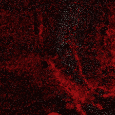
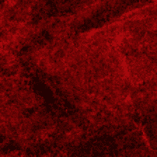
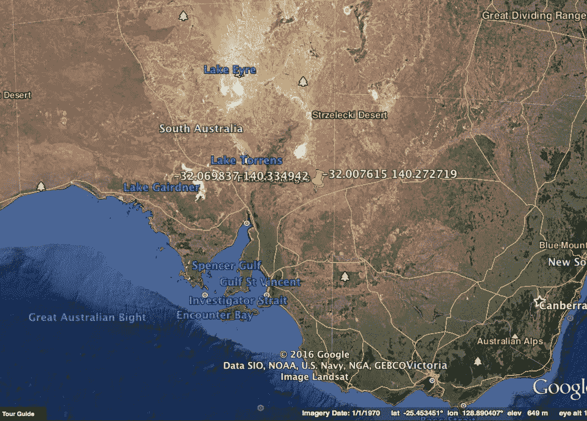

# 深部金矿:利用卷积网络寻找矿物

> 原文：<https://medium.com/hackernoon/deep-gold-using-convolution-networks-to-find-minerals-aafdb37355df>

机器[学习](https://hackernoon.com/tagged/learning)有点神奇吧？但它是那种能让我们变得富有的魔法吗？我指的不是利润丰厚的咨询工作，我指的是从地下挖掘有价值的金属。那种可以藏在宝箱里的富人。

此外，我一直想尝试一些迁移学习，并寻找一个好的话题来尝试。迁移学习就是你采用一个预先训练好的卷积(或其他)[网络](https://hackernoon.com/tagged/network)并将其用于你的任务。这对卷积网络非常好，尤其是因为它们需要很长时间来训练。我所居住的南澳大利亚花了很大力气来共享数据集，包括一些很棒的地质资源，所以我想为什么不把这两者粘在一起，用卷积网络来寻找黄金。利用卷积网络最简单的方法是把它们变成特征提取器，这就是我将在这篇文章中向你展示的。

这篇博文附带的代码可以在 GitHub 上找到:

[](https://github.com/scottvallance/DeepGold) [## 苏格兰/深金色

### DeepGold 使用卷积网络特征来学习矿物数据

github.com](https://github.com/scottvallance/DeepGold) 

## 矿物

所以，要让一台电脑找到你的宝藏，你必须给它一些可以使用的东西。就像藏宝图一样。所以我的第一个假设是，如果你知道如何看的话，一张地质特征的地图可能足以找出可能的地点。

当然，这并不是说地质学家已经不这样做了。他们甚至可能知道他们要找的矿物的名字，不像我。所以我找了一些写利用图像寻找矿物(特别是黄金)的论文。我的第一个想法是地图，这对于卷积网络来说是一个有趣的挑战，但现在有了一个名为 ASTER 的多光谱卫星图像源，它可以提供地上和地下矿产资源的线索。

[](http://asterweb.jpl.nasa.gov/) [## ASTER:高级星载热辐射和反射辐射计

### ASTER(高级星载热辐射和反射辐射计)是一种高分辨率成像仪器，它是一种高分辨率成像仪器

asterweb.jpl.nasa.gov](http://asterweb.jpl.nasa.gov/) 

多光谱成像是用一个不仅仅能看到红色、绿色和蓝色的相机来拍照。ASTER 中的一些波段擅长识别特定的矿物或矿物家族。接下来的文章将介绍这些频段以前是如何使用的，以及如何使用它们。

[](https://www.researchgate.net/publication/222300125_Detecting_areas_of_high-potential_gold_mineralization_using_ASTER_data) [## 利用 ASTER 数据探测高潜力金矿化区

### 遥感在矿产勘探中起着重要的作用。它的一个被证实的应用是提取和…

www.researchgate.net](https://www.researchgate.net/publication/222300125_Detecting_areas_of_high-potential_gold_mineralization_using_ASTER_data) 

虽然论文提出了他们自己的方案，但他们提到以下矿物指数对寻找黄金特别有用:“OHI 是含 OH 矿物的指数，KLI 是高岭石指数，阿里是明矾石指数，CLI 是方解石指数”。

ASTER 有很多地方可以免费下载，但 ASTER 这样的真实数据集的缺点是它充满了各种真实世界的复杂性。比如云层挡道，比如自 2008 年以来卫星上的一些传感器基本上被煮熟了。幸运的是，澳大利亚地球科学已经做了许多拼接和处理数据的艰苦工作，并产生了一批大的。要处理的 tif 图像。

[](http://www.ga.gov.au/scientific-topics/earth-obs/satellites-and-sensors/aster-radiometer/national-aster-maps) [## 国家 ASTER 地图-澳大利亚地球科学

### 澳大利亚 ASTER 计划由澳大利亚联邦科学与工业研究组织(CSIRO)的西澳大利亚三维矿物测绘卓越中心领导…

www.ga.gov.au](http://www.ga.gov.au/scientific-topics/earth-obs/satellites-and-sensors/aster-radiometer/national-aster-maps) 

你可以在他们的 ftp 站点上找到这篇文章在 Github repo 中的链接。我用 AlOH、MgOH 和高岭土波段图像为我感兴趣的地点抓取了一堆图像。

然而，这只是故事的一半，我们有许多图像，但没有黄金在哪里的线索。使用机器学习来帮助我们找到黄金的最简单的方法是给它一组有黄金的图像和一组没有黄金的图像，并让它找出其中的区别。为了得到训练数据，我们需要知道哪里有金子。另一个政府部门进行救援，这次是南澳大利亚州政府部门，他们有一个很棒的小工具叫做 SARIG。

[](https://sarig.pir.sa.gov.au/Map) [## 南澳大利亚资源信息地理服务器-地图

### 编辑描述

sarig.pir.sa.gov.au](https://sarig.pir.sa.gov.au/Map) 

这是一张地图，上面有许多不同的矿产相关的覆盖图，其中一个让我们特别感兴趣，那就是“所有的矿山和矿藏”,它有一个方便的选项来下载形状文件地理数据库，我们有我们需要的一切数据。

## 数据处理

现在我们有了大量的数据，但这不仅仅是把数据输入电脑的问题。你必须把它切成所需的格式。为了处理地理空间数据，他们有一堆伟大的工具，统称为 GDAL:地理空间数据抽象。

[](http://www.gdal.org/) [## GDAL: GDAL -地理空间数据抽象库

### 传统上，GDAL 用于设计库的栅格部分，而 OGR 用于简单特征的矢量部分。开始…

www.gdal.org](http://www.gdal.org/) 

这些工具将很高兴地从我们的“所有矿山和矿藏”形状文件中导出信息，并分割也具有地理空间意识的大量图像文件。由于 shape 文件中的每个矿床条目都是一个点位置，因此我们可以将大量输入图像切割成每个点周围的片段，这些片段的大小适合于馈入卷积网络。这些切片可以有多种矿物，我们不允许重叠切片，以便最终的机器学习不只是记住不同的片段看起来像什么，并从死记硬背中学习。

然后就是把不同波段的图像合并成一个假的彩色图像。当我们在图像中使用真实的红色、绿色和蓝色值之外的其他值时，就会出现虚假的彩色图像——在这种情况下，我们使用的是 AlOH 含量、MgOH 含量和高岭土指数。每个色带一个测量值。下面是准备输入卷积网络的假彩色图像的样子:



A false colour image using GEOScience Australia reprocessed ASTER data

## 卷积网络

卷积网络显示出惊人的学习视觉问题答案的能力。最近发布了一批开发卷积网络的开源工具，包括:TensorFlow、Theano、Caffe、Torch。这些都是很棒的工具，但是我们真的需要一些容易访问预训练数据的工具。对于这个问题，以及将卷积网络从实现中抽象出来，Keras 非常有用。

[](https://keras.io/) [## Keras 文档

### Keras:用于 Theano 和 TensorFlow 的深度学习库

keras.io](https://keras.io/) 

作者还为这个 [Github repo](https://github.com/fchollet/deep-learning-models) 提供了模型和经过预处理的数据。 [ResNet50 网络](https://arxiv.org/abs/1512.03385)已经产生了良好的效果，所以这是该网络的一个明显的起点。我们将使用这个网络将我们的训练图像转换成矢量特征。本质上，我们在 ResNet50 的输出变成一堆图像类别预测之前的某个时间点获取它，并将其用作另一个分类问题的输入。虽然训练卷积网络很慢，但使用它来生成要素却很快，并为我们提供了一个已被证明可以很好地转移到其他问题的数据源。这无疑是一个开放的问题，如何才能很好地转移到像处理假彩色卫星图像一样深奥的东西，但尝试它是最简单的学习方法。

## 具有 ResNet50 特征的分类

在我们将虚假的彩色图像转化为特征后，我们可以运行一系列不同的机器学习算法。为此，我们使用 Spark，这是一个集中于集群的图形计算框架，具有许多内置的机器学习算法。

[](http://spark.apache.org/) [## Apache Spark 闪电般快速的集群计算

### Apache Spark 是一个快速通用的大数据处理引擎，内置了流、SQL、机器等模块

spark.apache.org](http://spark.apache.org/) 

虽然这个问题的规模不需要使用集群来解决，但它确实为算法提供了一个很好的接口。我们可以利用逻辑分类、支持向量机分类、朴素贝叶斯分类、随机森林和多层感知器分类，只需几行代码。为了让我们的数据为 Spark 做好准备，我们将它转换为 LibSVM 格式，然后通过将示例过滤为含金和不含金的示例来进一步简化它。这给我们留下了很多非黄金样本，所以我们对黄金样本进行了过采样，以得到偶数，因为这有助于用平衡的数据训练算法。我们加载 pyspark 并使用几行代码运行一些不同的分类器。以下是 Spark 分类算法的结果:

```
Logistic Regression:
  Test Accuracy = 0.767756482525 SVM:
  Test Accuracy = 0.808342728298 Naive Bayes:
  Test Accuracy = 0.616685456595 Random Forest (10 trees):
  Test Accuracy = 0.727171 Multilayer Perceptron (layers [2048, 512, 2]):
  Test Accuracy = 0.775255 
```

这只是一个衡量算法在所有测试例子中对含有黄金或不含黄金的图像的正确率的指标。80%的准确率听起来不错，确实与文献中显示的其他结果相匹配，但很难从一个简单的准确性度量来解释这个数据。我们没有对测试数据中的黄金样本进行过采样，因此它们包含的非黄金成分比黄金成分多得多。如果一个算法对预测黄金变得悲观，它仍然可以做得很好，而不会告诉我们在哪里挖掘。我们真正需要的是，如果我们带着铲子出去，我们有多大可能挖到金子。这就是所谓的预测精度。真正精确的算法的另一面是，它可能选择只在非常确定的时候预测黄金，而错过很多例子。我们从所有黄金样本中正确预测为黄金的样本数量的度量被称为召回。低召回率可能没问题，但我们希望精确度尽可能高。以上数据的精度和召回率如下:

```
Logistic Regression:
  Gold Recall = 0.324840764331
  Gold Precision = 0.337748344371SVM:
  Gold Recall = 0.235668789809
  Gold Precision = 0.425287356322Naive Bayes:
  Gold Recall = 0.68152866242
  Gold Precision = 0.269521410579Random Forest (10 trees):
  Gold Recall: 0.575163398693
  Gold Precision: 0.328358208955Multilayer Perceptron (layers [2048, 512, 2]):
  Gold Recall: 0.317880794702
  Gold Precision: 0.335664335664
```

因此，就拿起铲子的目的而言，支持向量机分类真的赢了。如果它说有黄金，那么有 42%的可能性它说的是实话，这是测试数据中 17%的样本实际上有黄金。这只是针对南澳大利亚已知矿藏的部分，这是一个需要考虑的因素，因为它可能与其他地区没有的某些特征相关联。

## “x”表示地点

那么给定我们拥有的数据，我们去哪里挖掘呢？显然不是在已经贴有标签的地方，因为它已经被挖掘出来了。这实际上只是留下了它没有被标记的地方，这有已经被开采的东西的负面影响——但不是黄金。我们将接受它，尽管矿藏中的许多数据都是陈旧和废弃的。支持向量机表现最好，但我们想超越分类进入概率。如果我们清除了将 Spark 中的 SVMModel 转换为分类器的阈值，我们就可以直接从估计值中获得原始分数。取最大值的那些没有金子的地方给了我们这个图像:



Weird boomerang shape marks the spot

让我们在地图上查一下:



Our great mining hope

谁去拿铲子，我们要出发了！原来这就在白坝金矿的隔壁。我想这是一个好现象，但是这个矿实际上已经在我们的数据中了，只是稍微偏左一点。我们发现的地点很有可能很像隔壁的矿井。快速浏览其余可能的地点，会发现许多区域都在现有矿井附近。这可能是一件好事，但有点难以利用。一部分一部分地浏览没有矿产数据的地图可能会有所收获，但这有点投机，最好留给读者。因此，我们并没有真正找到黄金，但我仍然对卷积网络功能在如此不同于他们所接受训练的问题上的准确性感到惊喜。

## 结论和其他项目

在用我们开发的算法搜索了地图之后，下一个伟大的步骤当然是在原始 ASTER 数据上训练一个卷积网络。在某些视觉任务上，卷积网络正在达到人类的成功水平(甚至更高)，我认为它们在多光谱数据方面有很大优势。人类只能通过最多三个通道(理论上[四色](https://en.wikipedia.org/wiki/Tetrachromacy)无法承受)来解释视觉数据，但是卷积网络没有类似的限制。目前用于寻找矿物的波段比率肯定会很好地映射到网络架构。

如果你觉得这篇文章有趣，你可以[在 linkedin](https://www.linkedin.com/in/scott-vallance-9156373) 上找到我。

[](http://bit.ly/HackernoonFB)[](https://goo.gl/k7XYbx)[](https://goo.gl/4ofytp)

> [黑客中午](http://bit.ly/Hackernoon)是黑客如何开始他们的下午。我们是 [@AMI](http://bit.ly/atAMIatAMI) 家庭的一员。我们现在[接受投稿](http://bit.ly/hackernoonsubmission)并乐意[讨论广告&赞助](mailto:partners@amipublications.com)机会。
> 
> 如果你喜欢这个故事，我们推荐你阅读我们的[最新科技故事](http://bit.ly/hackernoonlatestt)和[趋势科技故事](https://hackernoon.com/trending)。直到下一次，不要把世界的现实想当然！

[](https://goo.gl/Ahtev1)