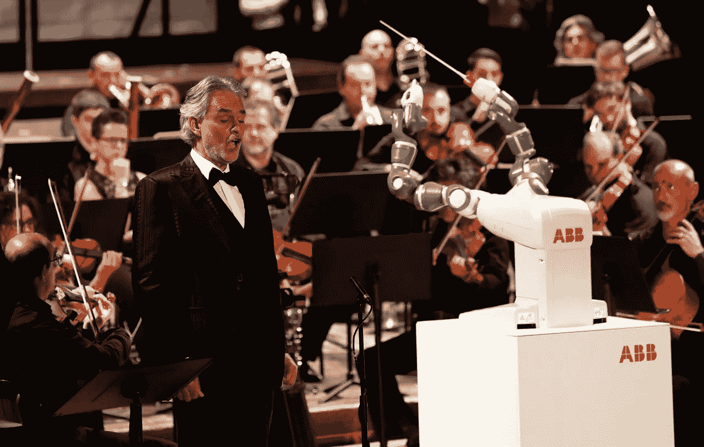
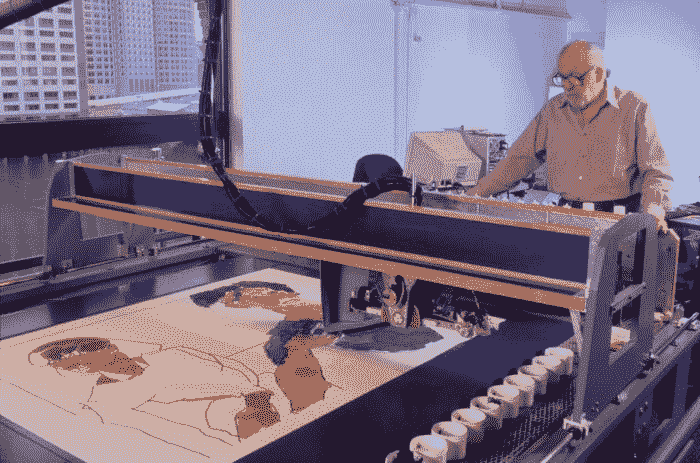
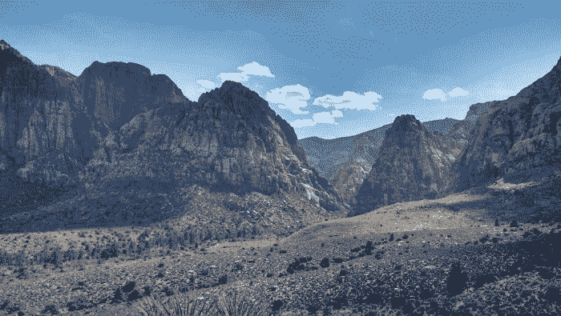
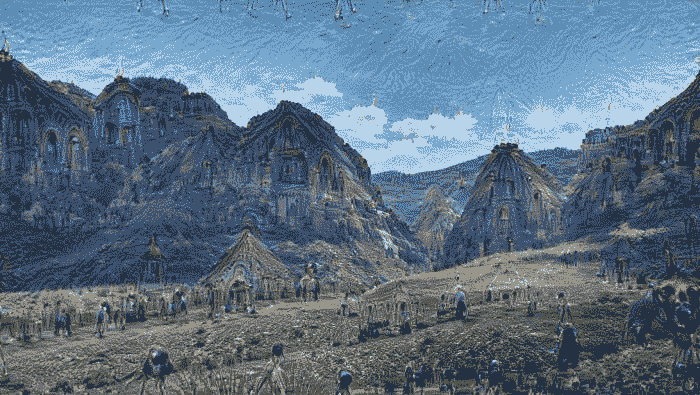

# 笛卡尔重温:机器人会思考吗？

> 原文：<https://medium.com/hackernoon/descartes-revisited-do-robots-think-15172c1a9794>

在过去的一周里，机器人首次亮相:ABB 的白纬玲机器人指挥了意大利比萨的卢卡爱乐乐团。这个双臂机器人甚至盖过了他的声乐合作者，意大利男高音安德烈·波切利。虽然许多人试图将这次表演宣传为开创了机械音乐家的新时代，但白纬玲的艺术生涯很短暂，因为它是意大利首届国际机器人节开幕式的一部分。

意大利指挥家安德烈·科隆比尼在谈到他的学生时说:“指挥家的手势细微差别在我以前无法想象的水平上得到了充分的再现。鉴于以前机器人的手势僵硬，这是一个不可思议的进步。我想象机器人可以作为一种辅助，或许在没有指挥的情况下，在导演介入进行调整，对音乐作品进行物质和艺术解释之前，执行第一次排练。”

*Harold Cohen with his robot AARON*

白纬玲不是第一个电脑艺术家。1973 年，教授兼艺术家哈罗德·科恩(Harold Cohen)创建了一个名为亚伦(AARON)的软件程序——一个机械画家。亚伦的作品已经在世界各地展出，包括在著名的威尼斯双年展。在科恩的带领下，伦敦帝国理工学院的西蒙·科尔顿博士创作了“绘画傻瓜”，其作品于 2013 年在巴黎著名的奥伯坎普美术馆展出。科尔顿想通过一个艺术化的[转折测试](http://robotrabbi.com/2017/08/23/fintech/)来测试自己是否能跨过情感的门槛。科尔顿解释说，“我意识到，绘画傻瓜是测试各种理论的一个非常好的机制，比如软件的创造性意味着什么。这个项目的目标是，有一天，软件本身作为一个有创造力的艺术家被认真对待。”

2015 年 6 月，谷歌大脑人工智能研究团队将艺术理论提升到了一个新的水平，为其软件注入了创造惊人的人类般想象力的能力。为了做到这一点，谷歌的程序员从有史以来最著名的大师之一莱昂纳多·达芬奇那里得到了启示。达芬奇建议有抱负的艺术家应该从观察墙上的污点或标记开始，创造视觉幻想。谷歌的神经网络做到了这一点，将图像的各层转化为具有新的风格化绘画特征的斑点和污点(见下面的例子)。

*1) Google uploaded a photograph of a standard Southwestern scene:*

*2) The computer then translated the layers as below:*

今年 3 月，谷歌大脑高级科学家道格拉斯·埃克在描述他的创作时说:“我不认为机器本身只是为了艺术而艺术，就像你可能认为的那样有趣。要问的问题是，机器能帮助我们创造一种新的艺术吗？”Eck 平台名为 [Magenta](https://magenta.tensorflow.org/) 的目标是让外行人(没有天赋)设计出新的音乐和艺术种类，类似于合成键盘、鼓和相机滤镜。埃克博士本人是一个公认的沮丧失败的音乐家，他希望 Magenta 将像电吉他一样彻底改变艺术。“有趣的是找到新的方法来打破它并扩展它，”埃克兴奋地说。

这些计算机程序的艺术发展和成长是显著的。科恩于去年去世，他在 2010 年关于亚伦的一次演讲中说，“无需我的进一步投入，它可以生成无限数量的图像，它比我自己好得多，它通常在我躺在床上时完成这一切。”他感到很自豪，后来纠正自己说:“当然，是我写的程序。说程序简单地遵循我给它的规则是不太正确的。程序*就是*规则。”

在思考创造性机器人的社会影响时，人们不禁想起哲学家勒内**德卡茨的名言:“我思故我在。”为了挑战机器人时代的想法，新井纪子教授测试了机器人的思维能力。2011 年，纪子在日本国立信息学研究所领导了一个研究团队，开发了一个足够智能的人工智能程序，可以通过东京大学严格的入学考试。**

“通过考试真的不是一个重要的研究问题，但设定一个具体的目标是有用的。我们可以将当前最先进的人工智能技术与 18 岁的学生进行比较，”Noriko 博士解释道。Noriko'steam 最初设定的目标是让 Todai 机器人(以该大学命名)在 2021 年被大学录取。在今年早些时候的一次 Ted 会议上，Noriko 透露了东大击败 80%参加考试的学生的消息，这一消息震惊了观众，考试由 7 个部分组成，包括数学，英语，科学，甚至还有一篇 600 字的作文。纪子没有庆祝，而是和人群分享了她的恐惧，“我很害怕。”

Todai 能够搜索和处理大量数据，但与人类不同的是，它不会阅读，即使它的神经网络中已经有 150 亿个句子。纪子提醒我们，“人类擅长模式识别、创造性项目和解决问题。我们可以阅读和理解。”然而，她深感担忧的是，现代教育系统更关注事实和数字，而不是创造性推理，特别是因为人类永远无法与人工智能的事实核查相竞争。Noriko 以入学考试为例，Todai 机器人没能抓住一个即使对小孩子来说也很明显的选择题。她在当地一所中学测试自己的论文，当三分之一的学生甚至不能“回答一个简单的阅读理解问题”时，她被弄糊涂了她总结说，为了让人类与机器人竞争，“我们必须考虑一种新型的教育。”

科恩还纠结于一个会思考的机器人的问题，以及他的计算机程序是否能像莫奈或毕加索那样对人类艺术家产生情感影响。用他的话说，要达到这种水平，机器必须“发展自我意识”。科恩声称，“如果没有，这意味着机器永远不会像人类一样有创造力。”科恩后来对他关于机器人创造力的言论进行了限定，并补充说，“这并不意味着机器在创造力方面没有任何作用。”

纪子说得更中肯:“我们人类将如何与人工智能共存，这是我们必须根据确凿的证据仔细考虑的事情。同时，我们不得不匆忙思考，因为时间已经不多了。”德意志银行(Deutsche Bank)首席执行官约翰克莱恩(John Cryan)上周在一次银行业会议上呼应了纪子的观点。Cryan 说:“在我们的银行里，我们有像机器人一样做机械事情的人，明天我们将有像人一样的机器人。我们必须找到新的用人方式，也许人们需要找到新的打发时间的方式。”

我们将于 9 月 19 日下午 6 点在 WeWork Grand Central***举行的 RobotLabNYC 活动中讨论这个话题以及更多内容。*** *论坛将探讨“投资无人系统”，来自 NASA、AUVSI 和天才 NY 加速器的专家—* [*今天预定，座位有限*](https://www.meetup.com/RobotLab/events/241332118/) *。*