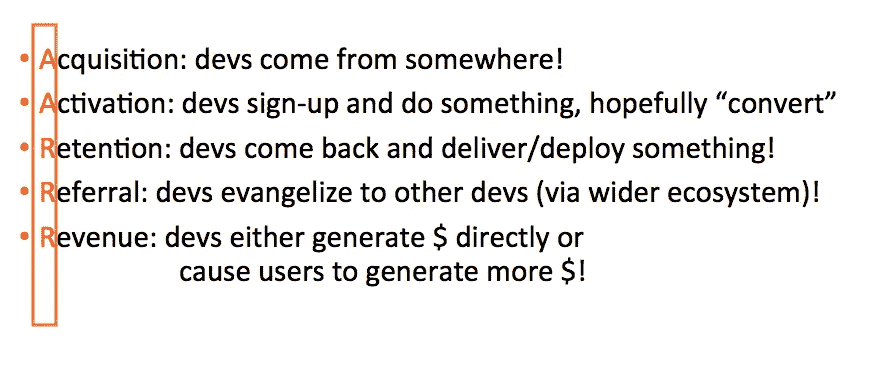
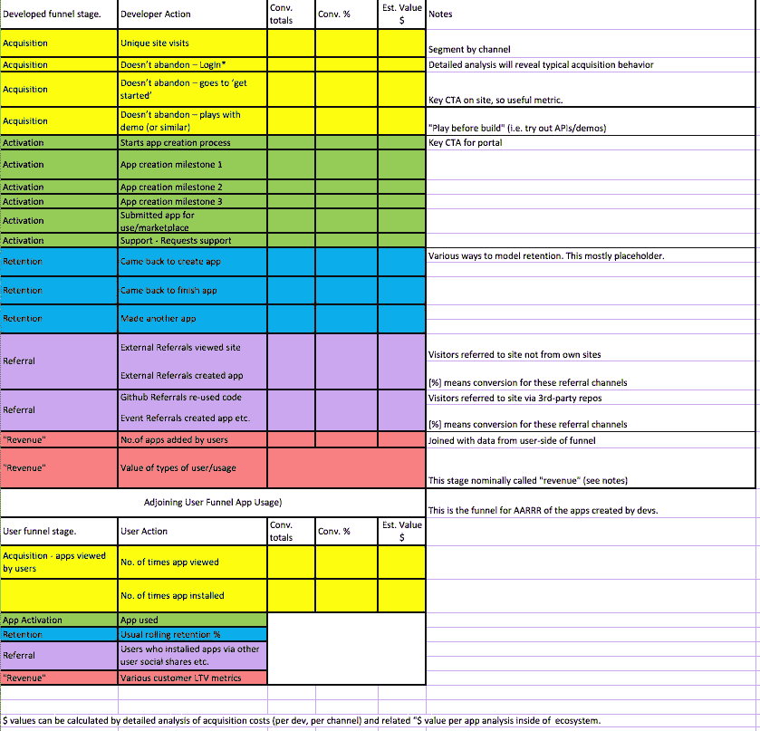
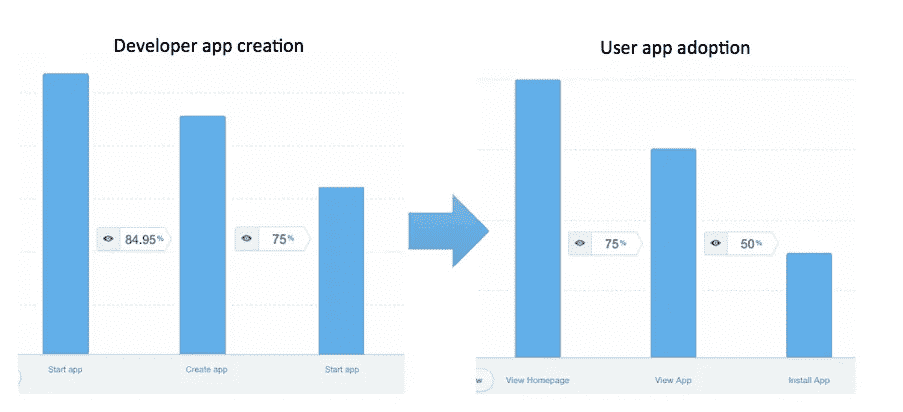

# 使用 Mixpanel 进行开发者分析

> 原文：<https://medium.com/hackernoon/developer-analytics-with-mixpanel-6f866ae1e4a5>

在我的上一篇文章中，我试图描述使用标准行为分析堆栈(如 Mixpanel)来测量 NLP 机器人的方法。应该注意的是，Mixpanel 并不是整个 bot 堆栈的全部和最终分析，但它可以通过直接利用 NLP 过程(即意图识别)来提供一种快速理解和可视化关键 bot 行为的方法。

我没有涉及更高级的主题，比如使用 [Mixpanel Notifications](https://mixpanel.com/help/reference/sending-a-notification) 特性(通过 webhooks)根据用户过去与机器人的交互向选定的用户组发送机器人消息。例如，在一个聊天平台上，它可以通过某种机器人推荐器来推广机器人(一个简单的[协作过滤器](https://en.wikipedia.org/wiki/Collaborative_filtering)就足够了)。

如果你想沿着这条路走下去，那么注意利用人物档案(因为这是 Mixpanel 用来识别活动接收者的)。

我也没有提到如何解释 bot 度量的关键问题。在像思科 Spark 这样的合作产品上，有[许多不同类型的机器人](https://depot.ciscospark.com)具有潜在的不同使用行为。例如，一些机器人可能很少使用，但仍然非常有用。标准的“使用概况”可能会产生误导，尤其是当被视为用户参与复杂的多任务活动的更广泛协作环境的一部分时。

挖掘这些类型的使用概况是详细分析变得有用的地方(远远超过我在第 1 部分中描述的内容),并且与本文的主题相关:开发者分析。

在这里，我想考虑的不是分析在机器人使用中的作用，而是机器人的制造——即开发者的“行为”。我将简单介绍一下为什么开发者分析很重要，然后简单介绍一下如何思考开发者漏斗，甚至是连续的漏斗分析。请注意，本文的其余部分适用于任何开发人员，而不仅仅是机器人。(此外，这主要是关于一般的开发人员分析，但在研究特定挑战的某些方法时，带有 Mixpanel 的味道。)

# API 经济

通过 API 向开发者开放数字服务或产品的战略必要性现在已经得到了很好的确立。有人称之为“API 经济”。

经济是考虑开发者服务的一种有用的方式。事实上，专家分析师安德烈亚斯·康斯坦蒂努用短语[开发者经济学](https://www.developereconomics.com)来指代整个开发者生态系统。如果你认为这个术语有些夸张，那么只需看一眼演讲中的[就能一瞥开发者经济到底有多真实(和复杂)。](http://www.mwc.gr/presentations-2015/InfoCom-Apps-Andreas-Constantinou.pdf)

从经济学的角度来看，位于两个或两个以上*互补*参与者群体交叉点的产品通常被称为*平台*。[经济互补](http://www.investopedia.com/terms/c/complement.asp)完全是一个正确的术语，因为它揭示了平台一侧的正供需特征如何导致另一侧的良性(正)供需。(比如说，这与非互补经济关系的自相残杀效应相反。)

简而言之，应用程序商店的应用程序越多，就越应该增加对核心产品的需求，例如安卓设备。(碰巧的是，Android 是一个 5 方平台:用户、广告商、原始设备制造商、运营商，当然还有开发者！)

当然，看应用程序(或集成)的数量是一种简单化的说法，因为数量很快就会成为一种虚荣的衡量标准。然而，根据长尾定律和产品空间的一种统计视图，开发者与平台交互以添加“功能”的次数越多，收益就越有可能随之而来。

# 开放式创新

创新动力方面的平台经济学在创新者中是一个众所周知的比喻，他们中的许多人提到了亨利·切斯伯勒的[开放式创新。](http://facultybio.haas.berkeley.edu/faculty-list/chesbrough-henry/)

这一创新方面是 API 繁荣的关键，因为许多玩家，无论大小，都已经意识到让他人创新往往比独自尝试更好。

开发者经济本身并不新鲜。几十年来，微软一直在讨好开发者。它不一定是大型游戏平台(如 Playstation)所展示的自助式平台。

但是**自助式**API 仍然是现代商业中快速增长的一部分，就像任何其他业务流程一样，应该受到与销售渠道同样严格的分析。然而，正如新一代开发者营销机构(例如[朗朗上口的](http://catchyagency.com))可能宣称的那样，现实是许多开发者平台大多遵循“如果你建立了它，他们就会来”的方法，往往非常注重最初的获取(例如通过开发者活动)，但忽视了基于标准漏斗指标的系统分析和营销。

# AARRR 指标

如果你曾经经营过一家初创企业或者管理过一个在线产品，那么你一定不会错过[戴夫·麦克卢尔的 AARRR metrics 推介。](https://www.slideshare.net/dmc500hats/startup-metrics-for-pirates-long-version)

我将坚持使用他的模板，并展示如何将它应用于平台的“南向”开发人员端，即“开发人员门户”。

让我来区分分析在此过程中的两种主要用途:

1.  “宏观”产品有效性——即业务指标，比如有多少开发人员在生产应用程序或使用 API。
2.  “微观”产品功效——即开发者平台的每个元素在完成其工作时的表现，包括直接效果(即开发者功效)和间接效果(即最终用户结果)。

第一部分是商业领袖经常首先去的地方——也就是问“我的平台上有多少开发人员？”

不幸的是，人们很容易陷入我所谓的“虚荣心衡量标准”，只关注数字，而不是他们讲述的故事。

这第二部分更能说明问题。同样，正如我在各种开发者营销机构的朋友告诉我的那样，开发者平台经理通常并不真正知道谁在他们的平台上做什么:谁来了，为什么来，他们呆了多长时间，是什么让他们离开(或留下)，是什么让他们留下来，他们构建的东西有多有效，谁使用它，等等？

所有这些问题——还有很多类似的问题——在分析中的某个地方都有答案(和/或通过普通的旧调查)。只有系统和严格的仪器和分析方法才能揭示任何答案:

The real “Developer Journey” is end to end

还有一个更深层次的问题，那就是如果我们给他们 X ，我们如何知道*开发人员可能在做什么——其中 X 是未知的。找出可能存在的 X 是一步，而找出它可能是什么又是另一步。总的来说，它们被称为*洞察力*，通常只有通过不懈的分析聚焦才能揭示。这更像是“未知的未知”的领域(是的——那确实是[一件事情](https://upside.tdwi.org/articles/2016/05/17/understand-knowns-and-unknowns-in-data.aspx))。*

回到 AARRR，让我们提醒自己[缩写的意思](https://www.slideshare.net/dmc500hats/startup-metrics-for-pirates-long-version/2-Customer_Lifecycle_5_Steps_to):

A —宣告无罪
A —激活
R —留存
R —转介
R —收益(嗯，我们会说到这个。)

# 显影剂漏斗的 AARRR

当然，在 AARRR 过程的每个阶段映射统计事件的过程(不一定是线性的)就是我们使用漏斗分析和 Mixpanel 的地方。

我们开始一步一步地深入研究 AARRR 的含义:

根据 McLure 的建议，下一步是建立一个尽可能多的行动(或事件)的综合表，以描述和量化 AARRR 漏斗中的每个步骤。下面是一个通用事件的示例，但是您应该创建一个特定于您的开发人员门户、入职流程和收购活动的事件。哪些活动属于漏斗的哪个阶段的分配有时可能是模糊的，但至少要从一些事情开始，并开始衡量和尝试推动增长和期望的行为。

我在收购分析中尝试的 Mixpanel 的一个新用途是将多个网站加入到一个 Mixpanel 项目中，以便从合作伙伴的黑客马拉松站点跟踪用户行为。这给了我们一个地方的原始数据，用于后续分析。

当然，在这种情况下，我们无法控制合作伙伴事件的`DistinctID`设置，但在某些情况下这可以通过编程解决。此外，我认为 Mixpanel 应该考虑如何更普遍地解决这个问题(例如，基本上通过某种跟踪器)，以便更多的客户可以创建多站点项目，从而对整个漏斗有更全面的了解。

碰巧的是，我在一个 Mixpanel 项目中跟踪的开发人员漏斗与另一个项目中的数据相关，因为我们在单独的 Mixpanel 项目中跟踪开发人员门户的数据和 bot 市场的数据。

更好的是，在平台的两端执行联合漏斗分析是理想的，如下所示:

然而，在一个地方进行这种联合分析并不容易。像 Mixpanel 这样的用户行为平台面临的挑战是，任何连接都是通过用户属性`DistinctID`的连续性来实现的。然而，在上面这样的背对背场景中，连续性更可能是一个应用 id，或者类似的东西。

换句话说，漏斗不是由用户加入的，而是由应用程序加入的。这是一种通过应用 id 的“外部连接”,以背靠背的方式查看两个漏斗，在 Mixpanel land 中类似于以下示例:

我说过我会提到 R-Revenue 的问题，所以现在开始。很多(大部分？)开发者平台和 API 程序的目的不是为开发者创造赚钱的市场。这里的收入问题是核心产品的收入。我真诚地怀疑大多数开发平台有任何想法，或模型，将开发者的行动转化为最终用户的美元，因为这种关系可能是复杂的。

然而，由于我来自一个金融建模背景，我认为有一些潜在的方法至少值得一试。

标准方法是尝试将平台上开发者应用的使用情况与 DAU 或毛类关键绩效指标联系起来，这在某种程度上形成了一种收入代理。然而，这种方法通常会将整个互动整合到一个事件中，即用户与应用的互动。这无法有效地分解为每个应用的价值评估。

一种方法是让销售人员制作一种与特定类型客户的终身价值和流失成本等相关的分层财务模型。这些模型可用于将某些客户和客户活动标记为比其他客户和客户活动具有相对更高(或更低)的价值。

似乎用“价值属性”来标记这些事件将是有用的，尽管这些属性是 R-Revenue 的粗略近似值和代理，但至少会使 AARRR 框架的 R-Revenue 链对所有分析用户可见，例如产品经理、利益相关者等。

否则，很容易陷入自我参照和虚荣指标的陷阱，这些指标让人感觉良好，但不一定对业务有多大意义。据我所知，这是许多开发者平台的常见陷阱。

# 结论/评论

我试图通过标准的 AARRR 度量框架给出一个非常简单的开发者之旅漏斗分析的基础概述。假设开发人员社区正在被构建以增加核心产品的价值(而不是仅仅勾选一个方框)，仅仅将开发人员的旅程视为一个可测量的正式实体就可以产生成果。

记住这一过程与核心产品的使用相关是至关重要的，这样可以尝试创建联合漏斗分析。然而，这并不容易。我就如何通过将不同的用户流(站点)加入到一个 Mixpanel 项目中来实现这一点提出了一些建议，尽管该工具并不完全是为这种方法设计的。这方面的一些实验已经证明是有趣的，但在为多边平台创建联合分析方面还有很长的路要走。