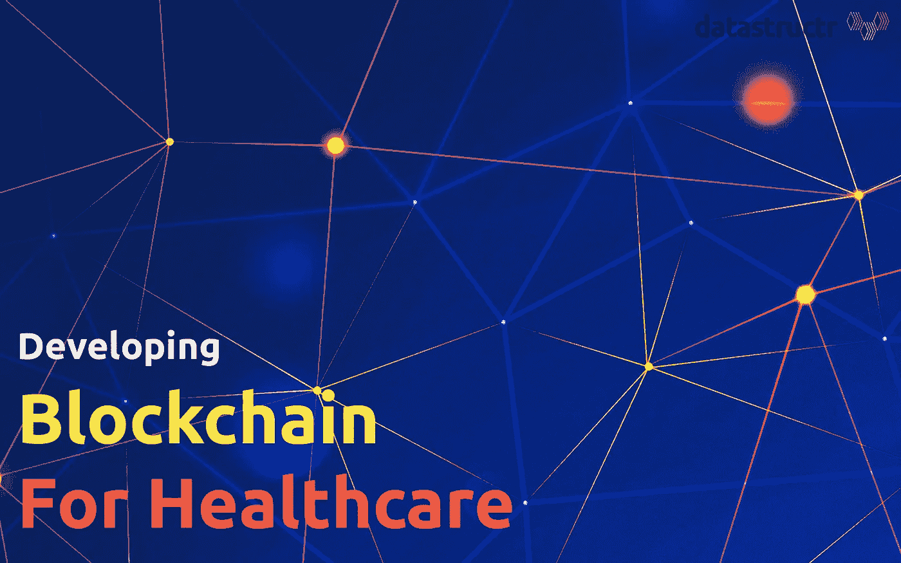
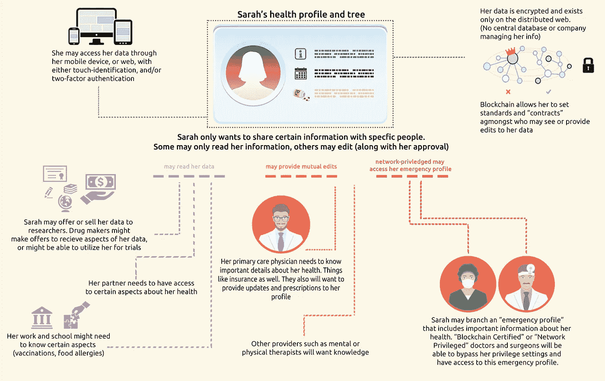
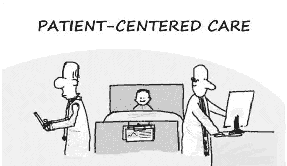

# 设计思路:医疗保健的区块链

> 原文：<https://medium.com/hackernoon/developing-blockchain-for-healthcare-primer-d23004de7aed>

*为医疗保健开发区块链，入门和介绍。这更像是一篇观点文章(缺乏正式引用)。*

## 初级读本，目录:

-简介
-为什么医疗保健行业需要像[区块链](https://hackernoon.com/tagged/blockchain)这样的东西？
-解决方案会是什么样的？
-技术上应该如何发展？
-我应该重点发展什么？

# **简介**

我将探索和开发“医疗保健区块链”这第一部分作为一个引子，介绍探索为什么行业需要医疗保健，以及如何发展的努力应该工作。

事实上，我大约 3 个月前才开始走上这条道路。我收到了一份参加[医疗创新大赛](https://medstro.com/groups/quadruple-impact-challenge/pages/home)的邀请，六名决赛选手最终在拉斯维加斯为一万美元的奖金开球。我进了那一轮，但我没赢。医疗保健从来不是我的激情，但我对竞争充满热情(可能是出于错误的原因，这里与上下文无关)。关键是，我没有准备好提出任何令人信服的想法，而像医疗保健这样一个极其复杂的行业会考虑这些想法。直到我飞往拉斯维加斯，在我彻底回顾为我的推销创造策略的时候，我才意识到我是多么毫无准备。我提交的演示文稿除了已经定义的流行词汇和一个幼稚的解决方案之外，没有提供任何新的东西。与加密货币环境不同，我不会用一个很酷的幻灯片或演示来大肆宣传。不过，我学到了很多，并认为一个可能的区块链医疗保健解决方案将有利于人民和行业。

对于那些感兴趣的人来说——这里是我的[条目](https://medstro.com/posts/8013)、[演示文稿](https://drive.google.com/file/d/18gNiDGi9z4jAYkCrg0rLEDe4eOXijgPO/view?usp=sharing)、[信息图](https://drive.google.com/file/d/0ByIZZYtS9lQmRjVpRGUtS05Tc2RTaThxTzlzYU9OVlZuTjU0/view?usp=sharing)，以及一个[数字演示](http://mdramos.github.io/demo-deck)，它不是移动响应的&在 Chrome 中运行得最好。

# **为什么医疗保健行业需要区块链这样的东西？**

医疗保健中的数据是 F-d。我先举一个显著的例子:一些重症患者随身携带厚厚的活页夹，里面装满了他们的诊断、药物、测试、研究、保险、基因……实际上，他们健康状况的每个方面，无论他们去哪里。他们花数小时研究、发电子邮件，并与任何有可能提供帮助的人建立关系网。他们这样做是因为行业没有提供一种方法来以全球统一的方式有效地存储、共享或分析他们的数据，这让他们失望。

你经常会听到的一个时髦词是“孤岛数据”患者的数据被手动载入并放入他们的提供商或医疗网络正在使用的任何一个[电子健康记录](https://en.wikipedia.org/wiki/Electronic_health_record)中。这些是典型的企业解决方案，包含了大部分收集的数据。组织内部会围绕其系统和收集的数据发展出许多复杂性:

1.  网络或组织越大，患者数据越有可能被不同的部门和地点分散
2.  数据格式具有挑战性(大量旧数据仍在纸面上，放射科等部门使用图像甚至声音，相同的数据可能存在于不同的系统中，甚至以不同的格式和数据类型存在)
3.  EHR 提供了一致性，尽管数据并不一致，而且可能非常复杂。提供商将选择方便的数据收集方法，这些方法并不总是转化为简单的系统处理

提供商可以处理这些问题，再加上许多其他问题，一切都很好。然而，他们最终会围绕他们的数据建造城堡，这就引出了我们的下一个术语:“互操作性”

数据很少能在不同的提供商、网络和电子病历之间轻松共享。美国有 1000+EHR；因此，EHR 是在没有标准商业模式的情况下建立的。它们并不是为了相互交谈/工作而构建的，不幸的是，这样做并不是一件快速或廉价的事情。该行业缺乏有效的标准化，导致了太多的数据格式/类型([这里有一篇文章](http://hitconsultant.net/2014/04/28/in-depth-a-guide-to-healthcare-data-formats/)，有一些见解，尽管它有点过时&，缺少一些新的格式)。将不同的数据格式与不同的系统集成不是一件容易的事情。问问任何医疗保健开发商；我敢肯定你会听到一些恐怖的故事，比如单列数据字段，比如*生日*，这对从事 ETL 过程的人来说简直是地狱。这里有一个很棒的 [HealthCatalyst](https://www.healthcatalyst.com/) 信息图，它可视化了一些医疗保健的数据问题:

没有有效的数据共享，患者就错过了重要的研究、试验和分析。虽然制药商向医院支付数十万美元，试图追踪临床研究的患者，但患者可能会不顾一切地随意搜索，却没有多大用处。为什么对病人来说这不应该是一个更自然的过程，为什么他们不需要付出太多努力就能在医学上和金钱上受益呢？患者无法控制他们的数字数据存储。患者门户管理患者的数字记账(经过或不经过他们的批准)。当你的信用数据被编译和分析成你的信用评分，并跟随你到任何地方时，你的健康数据是混乱的，管理不当。

[主患者索引](https://en.wikipedia.org/wiki/Enterprise_master_patient_index)和[健康信息交换](https://en.wikipedia.org/wiki/Health_information_exchange)是我见过的最能解决一些被阉割/孤立的数据问题的东西。然而，他们面临着许多相同的数据共享挑战，也不能幸免于我们最后一个重要的术语“安全性”四分之五的医生办公室已经遭受了网络攻击。更大规模、更集中的数据库可能会让我们容易遭受像上次 Equifax 黑客攻击那样的攻击。对于那些喜欢更多官方研究/声明的人，请查看 www.hipaajournal.com。该网站有许多关于网络安全在行业中有多严重的文章。

在谈论医疗保健和数据问题时，仍然存在两个问题:保险和监管。这并不是说他们不值得在这个博客中占有一席之地，只是上面概述的数据问题才是区块链真正可以开始解决的问题的实质。监管肯定是一个重要的部分，很明显，上述问题是每个人都想解决的，但政府的行动缓慢而零星。我认为上述问题的解决方案将在政府论坛上提出，并实际上推动立法向前发展。

# **解决方案会是什么样的？**

是的，一个“圣杯”(装满啤酒)——至少这是一些人对区块链医疗保健的称呼。理论上来说，他们没有疯。如果你需要一本关于区块链的入门书，这里有一些简单的入门资料:

 [## 区块链-维基百科

### 区块链，最初是区块链，是一个不断增长的记录列表，称为块，它们被链接和…

en.wikipedia.org](https://en.wikipedia.org/wiki/Blockchain)  [## 区块链演示

### 浏览器中的实时区块链演示。

anders.com](https://anders.com/blockchain/) 

我无法在这篇博客中有效地解释区块链，除非它走极端——所以，如果你真的对区块链医疗保健的发展感兴趣，那么你需要确保你理解它以及诸如[“智能合同”的概念](https://blockgeeks.com/guides/smart-contracts/)我们可以从这里继续说，这些技术为上述问题提供了一致的、不可变的、分散的和基于规则的解决方案。每一笔交易，或知识转移，都被记录在分布式账本上，必须由区块链自己进行计算&数学验证。将区块链与存储加密数据的方法结合起来，可能会产生真正有价值的东西。

那么它是如何为医疗保健服务的呢？

**©** Datastructr

如您所见，该系统中的用户可以完全控制他们的医疗保健档案。他们规定了谁可以阅读以及其他人可以对他们的数据进行什么访问。显然，初级保健医生想要知道尽可能多的信息(并且还想增加一个人的健康状况)，但是诸如雇主或家庭成员之类的个人可能只需要知道有限的信息。用户可以走进任何医生办公室、急诊室、理疗师等。并立即加载到本地系统中。用户可能会提供他们个人资料的一部分，供感兴趣的第三方查询，如研究人员或制药公司。在全球范围内，数据变得更加可靠和可用。第三方可以制定大数据分析，甚至向用户提供潜在的试用。这并不是说这些事情还没有发生，而是区块链提供了一个高效、廉价、简单得多的过程。

保险业也必须成为这个系统中的一员。目前，健康保险是臃肿的。许多人支付他们不需要的保险。区块链系统中的用户可以从智能合同应用程序中受益，该应用程序分析并使用模型来创建更便宜但更合适的覆盖计划。这种类型的应用程序可能会以一种意想不到的方式扰乱整个医疗保险行业，尽管我认为这是对用户最好的方式。

上面只是一个例子，说明它如何寻找一个特定的用户。它的“圣杯”方面是适用于每个人的同一张图片，适用于民主运营的单一生态系统中存在的所有医疗保健数据。新的应用程序、商业模型、保险、政策和大数据分析都可以在区块链蓬勃发展。这是一个每个参与者，尤其是病人都可以受益的系统。

# **应该如何发展？**

是否应该有新的加密货币/ [ICO](https://en.wikipedia.org/wiki/Initial_coin_offering) ？这应该是用企业[的技术](https://hackernoon.com/tagged/technology)做的吗？还是开源技术？或者所有这些东西的组合怎么样？

在我看来，新的加密货币/ICO 是解决上述问题的错误方法。一枚新硬币将需要包含广泛的智能合约和其他基于区块链的能力(分类帐、共识、会员、交易证明等)。).当有人开发出这样的东西时，他们就已经建立了比医疗保健解决方案更宏大、更通用的东西。他们会创造一个完整的平台和新的加密货币，类似于[以太坊](https://www.coinbase.com/what-is-ethereum?locale=en-US)(目前市值约 700 亿美元)。一枚具有这些功能的医疗保健专用硬币没有太大意义，如果不是将自己作为一个平台进行营销，也很难被认真对待——区块链可以在类似的意义上被认为是汽车发动机的原理，这种发动机足够通用，可用于各种汽车。汽车制造商不会彻底改变或重新开发汽车发动机，而是改变发动机周围的零件，使汽车独一无二。以医疗保健为中心的新硬币可以在现有平台上开发，有些已经在开发了。他们大力推销他们的 ico……但“[飞行汽车硬币](https://mcfly.aero/)也是如此。你可能需要质疑那些试图为利基数据交易开发一种货币的人的真实动机，以及他们能在多大程度上真正推动这个行业的发展。

这并不意味着区块链经济学不会在医疗解决方案中发挥作用。我认为，基于成熟智能合约的货币/平台，如以太坊，将在医疗保健区块链的金融交易中发挥重要作用，但不是基础结构。

我认为区块链基础设施的开发是一个非常大的问题，一个一次性的团队很难找到一个合适的解决方案。

任何开发区块链解决方案的人都应该明智地利用现有资源，而不是开发一种“独特”的方法。有能力的技术由企业等积极开发和开源。我最喜欢的是 [Linux 基金会的](https://www.hyperledger.org/members) [**Hyperledger**](https://www.ibm.com/blockchain/hyperledger.html) ，微软的 [**Coco**](https://azure.microsoft.com/en-us/blog/announcing-microsoft-s-coco-framework-for-enterprise-blockchain-networks/) ，还有[**GemO**](https://gem.co/gemos/)**S**。如果你花点时间研究这些技术，你会发现它们都提供了"[开放的](https://en.wikipedia.org/wiki/Collaborative_software_development_model)"解决方案。几年前，GemOS 开始作为一个医疗保健专用平台。他们已经经历了许多痛点，对区块链如何在医疗保健领域开展工作有足够的了解。他们的平台拥有 API，集成了 Hyperledger & Ethereum 等技术，并开发了 ETL 流程，开发人员可以利用这些流程进行初始数据收集(假设他们可以与 EHRs/医疗网络/现有业务建立合作关系)...这些努力的任何新进展基本上都是再造轮子。

一个大问题是静态数据。显然，大多数数据都需要加密，并以分散的方式存储。智能合约可能是这种方式的单一推动者。[来自以太坊博客](https://blog.ethereum.org/2016/01/15/privacy-on-the-blockchain/):

> 我们创建一个包含私钥的模糊智能契约，并接受用相应的公钥加密的指令。契约将帐户余额存储在加密的存储中，如果契约想要读取存储，它会在内部解密，如果契约想要写入存储，它会在写入之前加密所需的结果。如果有人想读取他们账户的余额，那么他们将请求编码为一个事务，并在他们自己的机器上模拟它；模糊智能合约代码将检查交易上的签名，以查看该用户是否有权读取余额，如果他们有权读取余额，它将返回解密的余额；否则代码将返回一个错误，用户无法提取信息。

或者可以利用专门为分散存储设计的技术。智能合约仍将作为加密密钥持有者发挥重要作用，但像 IPFS 这样的公司可以存放和共享加密数据。

这些开源项目和平台产品非常适合为以患者为中心的开发工作引导“后端”。

# **我专注于发展什么？**

企业甚至 B2B 解决方案开始进入市场，并成为 IBM、埃森哲、德勤、微软等大型企业以及 20 多家大型公司的焦点。尽管这个行业发展缓慢，而且对病人来说并不总是朝着正确的方向发展。对我来说，这意味着有巨大的价值潜力有待发掘。

由于大多数核心的区块链工作是提供给开发者的，那么这将留给我们创造一个解决方案，让患者自愿和积极地利用——在我看来，这是最重大的挑战。像“谁在为这一切买单？”“为什么企业(医疗网络，EHRs)想要采用或整合？”这无关紧要，因为患者会通过掌握数据的关键来控制使用和参与。

任何被大规模用户群采用的解决方案都可能在没有他们的参与的情况下破坏整个企业和医疗保健格局。要做到这一点，病人&他们的数据必须以非标准的方式争取过来。我意识到我最初创建数据交换平台的想法太天真了。这似乎也是其他人正在采取的方法(以及他们自己的 ICO…):

 [## 敏健康

### 编辑描述

www.minthealth.io](https://www.minthealth.io/)  [## 主页

### 我们都有一个医学身份。但是如果我们不能获得它，那么我们就不能学习、发展和过更健康的生活。至…

lacunadigital.com](https://lacunadigital.com/home) 

虽然这些应用程序看起来很合理，但现实是它们很可能无法让用户以有意义的方式参与进来。他们似乎缺乏对用户的真实体验和同理心。我相信数据交换可以在区块链蓬勃发展，但不是一个特别集中的用户在交易市场上出售他们生活的方面。究竟是谁享受了[付费调查](https://en.wikipedia.org/wiki/Paid_survey)网站呢？

我的重点是抽象出任何交易市场，并提供一种建立信任和参与的体验。以患者为中心&同理心将永远是最重要的驱动因素，但我认为，为了赢得大量用户，医疗保健中心也需要抽象化。像“患者”、“数据”、“医疗保健”这样的术语对我和我想开发的任何解决方案来说都是不切实际的，但它们肯定会发挥作用。

我的团队是 Datastructr，我们(和其他团队)一起研究这个想法。如果你也想合作的话，请联系我们。

Dallas and I at the competition

*感谢乔希·斯坦、达拉斯·尼克斯和***提供的剪辑**

*[*跟我来*](https://twitter.com/backnotprop)*