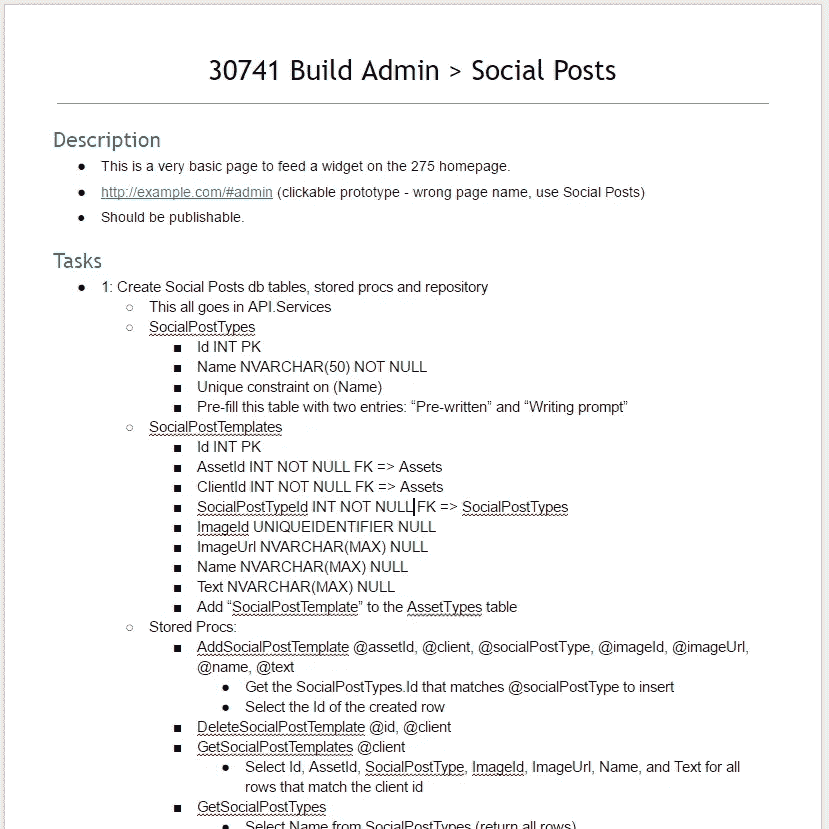

# 开发者驱动的开发

> 原文：<https://medium.com/hackernoon/development-driven-development-75c01b2afca1>

## 我们如何在 DirectScale，Inc .编写代码。

*注:我在 2017 年末离开了 DirectScale。然而，我袖手旁观我在这里描述的原则，我已经努力把它们带到我的新工作中。*

*如果你喜欢这篇文章，你会爱上* [【代码第一年】](https://leanpub.com/firstyearincode)，*这本实用指南和给新开发者的建议的书。如果你正在考虑从事软件行业，去 https://leanpub.com/firstyearincode*看看吧。

我工作的公司正在慢慢失去它的“创业”地位。我试着不要太怀旧。毕竟，这意味着我们做得很好；最近几个月，一系列令人印象深刻的奖励和合同意味着我们做得很好。有很多值得感激的事情。与此同时，很多事情都在发生变化。

随着这种转变的结束，我们不得不升级一些东西。我们聘请了一名首席技术官和一名企业架构师。像“PCI 符合性”、“负载测试”和“根本原因分析”这样的短语正在成为办公室的标准用语。我们对部署生产代码越来越谨慎。我们在成长。

但是很多事情都保持不变——我们仍然是那家举足轻重的公司。当我到达时，我了解到对抗技术债务是这里的重中之重；现在依然如此。我们对代码审查的反文化态度仍然很强烈。我们仍然戴着许多帽子。我们进展很快，所以我们只能保留有效的方法——一些实践被证明是有效的，而另一些则被抛弃。由于我们早期雇员的远见卓识，前者比后者多。在我任职期间，我们的开发工作流程一直都是一样的。效果真的很好。

不过，我会做得更好。我们不会因为事情行得通，就一直用同样的方式做事。实际上，如果你有无限的时间和资金以及一些勤奋的开发人员，任何事情都是可行的。*作品*是附带的。对我来说更重要的是，我们的过程让我的 A 型、强迫症、工程师人格的心感觉良好。我们不会浪费很多时间，我们的代码库不会随着时间的推移而变得更差，我不必构建我讨厌的功能，我们的工作流不会让我每天都感到沮丧。如果你是一名软件工程师，你必须理解这听起来有多好。

我决定了，我们的秘密配方是这样的:

我们做第二个。

一般人(*包括*的开发人员)倾向于把开发人员当成代码编写机器，戴着耳机，写出`switch`语句的天才。但是这种刻板印象没有充分发挥我们的潜力——否则，开发人员的价值将完全取决于她的技术知识和打字速度。一个最好的开发人员是一把软件的瑞士军刀——她的创造性、洞察力和理性的思维过程使她成为公司任何讨论中有价值的一部分。意识到这一点的公司拥有更快乐、更高效的开发人员——那些(信不信由你)不会花 100%的时间盯着代码的开发人员。DirectScale 擅长于此。

炒作够了:我们到底在做什么，为什么我确信它代表了一组常识性的最佳实践——不仅仅是对我们，而是对任何软件团队？这是一个值得多部分回答的问题。让我们开始吧。

## 我们(永远)不做的事

普通公司的普通“敏捷”工作流程是这样的:

1.  一个穿深灰色西装的人决定建立一个新的特征。
2.  他和其他两位高管聚在一起，愉快地决定该功能应该做什么，应该是什么样子。还没有人咨询过开发商(稍后会有更多)，所以整个想法是无可救药的天真。
3.  他们整理好对话，给代码动物园中级别最高的非开发人员发了一封电子邮件。他们忽略了一些重要的细节。
4.  非开发人员(项目经理？产品负责人？scrum 大师？插入最新趋势)写了一套业务需求，部分基于电子邮件，部分基于她对公司使命的理解，部分基于个人选择。在接下来的两天里，这些业务需求被神秘地转化为一组用户故事。
5.  一个开发人员被分配一个用户故事。如果他非常不幸，他必须估计他要花多长时间才能完成；这涉及到高等微积分和一种特殊形式的巫术。他立即开始用代码思考，在他停下来之前，他已经写了 55 行质朴、优雅的 C♯。大脑和键盘的连接就像尼亚加拉瀑布。这个特征突然变得生动起来。他提交一个拉取请求，并像法国厨师一样亲吻他的指尖。
6.  开发人员的团队领导审查了 pull 请求，并以 17 条解释性注释拒绝了它:这段代码不是高性能的，这个方法没有涵盖一种边缘情况，那个类读起来像一本恐怖小说，产生的特性看起来一点也不像原始规范。
7.  开发人员重写了他的代码两次，团队负责人来回重复了很多次。两天后，他们都对结果感到满意。
8.  代码被合并并在同一天部署到生产环境中。
9.  几天后，高管们阅读了一套全新的发布说明，对 sprint 期间发生的一切非常满意。其中一个人想知道为什么他要求的功能没有建立起来。他再次从步骤 2 开始。

这显然不好。这是《中国悄悄话》、《猜字谜》和《20 个问题》的产物，这些游戏可能很棒，但不是经营公司的好方法。尽管如此，硅的最好和最聪明的袖手旁观 it，它被敏捷教练兜售，它是年轻团队的默认方法。

我们可以做得更好，从第一步开始。

## 开发商的参与和认可

在 DirectScale，我们不会雇佣一群有想法的人坐在一起，想象一些很酷的东西让我们去做。我不想打击你，但是“有想法的人”不是一份真正的工作。抱歉。事实是，*每个人*都有想法。每个人都可以为你的产品如何改进，能解决什么问题提供好的建议。反过来，公司可以鼓励这些想法，也可以压制它们。大多数公司选择抑制，尽管是以微妙的方式——让开发人员和设计人员远离产品愿景讨论，通过中间人传递指令和请求，或者将开发人员的推回视为“懒惰”和“抱怨”

一个更好的方法是确保开发过程的每个阶段都有一个代表出席关于每个特性的会议，从开始到完成。与其等到下一次冲刺时才发现你的特性在技术上不可行，为什么不现在就发现呢？是的，这意味着你的开发者花了很多时间 AFK(远离键盘)。但是如果你邀请他们的反馈并听取他们的意见，这也意味着他们会接受——他们会致力于团队的共同愿景，并拥有该功能，这意味着他们会有更快更好的转变。对于更大的功能，你需要更多的支持，这意味着房间里有更多的开发人员。

正如我提到的，这也可以防止你浪费几天时间去构思一个开发人员不能(或者不应该)构建的特性。我们大多数人都知道，看似简单的功能有时会非常复杂、不可能或不合法。没有人喜欢在功能发布日期已经确定之后才发现这一点。

我最近参加的一次会议是在[的一个大型功能集设计工作室](https://www.targetprocess.com/blog/2011/05/ux-meets-agile-design-studio-methodology/)，这个功能集可能会成为 DirectScale 未来几年最大的收入来源。这是我们一年来讨论的最重要的垂直产品。猜猜谁参加了？

*   UX 设计师
*   三四个开发者
*   平面设计师
*   我们的项目经理

我们要构建的功能没有被高层详细描述，也没有一个 C-Something-O 或 VP 在场。是我们所有人。为什么不呢？我们有备而来；我们的 UX 设计师和项目经理都有行业经验，他们已经采访了几个可能使用该功能集的客户。执行团队表达了他们的期望(没有试图控制创作过程)。我们已经进行了几次讨论，在讨论中我们已经确定了要解决的问题的范围。毕竟，我们是要建造这个东西的人。

两个半小时后(会议比平时长，但值得)，我们拿出了一些草图，并对拼图的第一部分有了共同的理解，我们每个人都满意地认为我们的想法是结果的一部分。我们的产品就是这样诞生的。

## 开发设计(反向代码审查)

一旦我们的想法变成了原型，我们就准备编码。但是我们还没有打开我们的 IDE。

看，软件构建是一门失传的艺术。 *Code Complete* 的作者 Steve McConnell 花了几章慷慨激昂地谈论业务需求的创建和代码的编写之间的空间——在他看来，办公室里最聪明的架构师应该绘制将要编写的每个类、接口、交互和数据点的详细地图。从麦康奈尔的角度来看，只写一个用户故事或一个设计的代码就像建造一座没有蓝图的摩天大楼。

但不知何故，[的大多数公司已经忘记了](http://dilbert.com/strip/2007-11-26)如何计划。

在我们的敏捷流程示例中，问题出在步骤 4 和 5 之间。在用户故事被定义之后，但是在开发人员开始挠键盘之前——发生了什么？大多数情况下，什么都没有。

一个有经验的开发人员可能能够预见简单任务所需的所有工作。但是即使是我们中最优秀的人也会遇到不可预见的障碍。我们都有过这种糟糕的时刻，当我们正在编写最后一行代码时，我们意识到我们的逻辑中没有考虑到所有的情况。

然后，当发现团队中的一个新成员编写了一个完整的类来解决一个在代码中其他地方已经有了标准的、可重用的解决方案的问题时，会有一种沮丧的感觉。编码开始前五分钟的知识共享可以避免三个小时的重复劳动。

当代码没有作为代码被计划出来*时，我们所有善意的过程都不会成功:标准被忽略，可重用性消失，并且随着时间的推移，代码变得更加分散和充满 bug。短短几年内，您就在处理遗留代码(不寒而栗)。某些问题会在代码审查中出现，但是到那时已经浪费了太多的时间:几个小时的开发时间，几个解决问题的周期，以及开发人员的热情和奉献。*

所有这些问题都可以通过史蒂夫·麦康奈尔在 1993 年建议的事情来避免(或至少减轻):提前规划。

在 DirectScale，我们彻底改变了代码审查。我们不是在事后审查代码，而是提前确保它是正确的。我们提前计划。我们称之为开发设计，它看起来很像在任何人编写一行代码之前进行的协作代码审查。它是这样工作的:

1.  创建一个用户故事。
2.  一名开发人员被指派设计故事所需的工作。
3.  开发人员查看需求，在代码库中挖掘任何有用或相关的内容，研究可能需要的库和技术，并写出详细的分步描述，说明他将如何编写完成用户故事所需的代码。最终的文档(开发设计)包括所有的变量名、缓存技术、类、接口和将在代码中结束的交互。在棘手的情况下，开发人员甚至可能包括几行伪代码。
4.  该开发人员安排了一次与团队中其他开发人员的会议。他们一起审查开发设计，并根据需要进行修改，建议替代方法，共享知识，并做出架构决策。
5.  团队完成开发设计中指定的任务。如果有一个问题迫使他们偏离这个方向，他们会当场讨论并决定怎么做。
6.  大多数时候，不需要进行代码审查。代码被合并并按原样提交给 QA。

Example of part of a Dev Design. The full document is four pages long and includes five tasks. We use a lot of shorthand and assume prior knowledge of some tools and services — we explain these in the Dev Design review meeting if anyone is new to them.

通过这样做，我们避免了太多的来回奔波，这真的很了不起。在之前的一家公司，在一个特别挑剔的团队领导下，我平均每个拉请求要重写五次。现在我平均零分。提前计划可以确保事情在第一时间以正确的方式完成。

## 20%的时间(不是[谷歌那种](https://googleblog.blogspot.com/2006/05/googles-20-percent-time-in-action.html)

在 DirectScale，我们不允许技术债务堆积。随着技术债务的增长，它也在增长(就像常规债务一样)，当它达到临界规模时，它总是会破坏用户体验，惹恼客户。更糟糕的是，它会让程序员感到沮丧，并会对任何必须处理受影响代码的人造成严重的“T0”效应。

然而，解决技术债务是一项违背直觉的活动。首先，它看起来什么都不像。如果一个高级开发人员花一周的时间来偿还技术债务——重构代码、划分类、清理残局、处理边缘案例——他有什么要展示的呢？其他开发商会意识到这种差异，但是任何在他们的工作头衔中有“经理”这个词的人都不得不相信。没有什么新的可以显示给客户，没有紧急的错误已经得到解决，应用程序甚至可能不会明显更快。如果产品所有者在您的发行说明中发现了“解决技术债务”这一行，他们怎么知道您整个星期都没有在玩“纸上谈兵”呢？他们没有。

但是“债务”的类比适用于这种情况。假设您有 1.5 万美元的信用卡债务。如果您花掉接下来的三张工资来支付，您有什么要展示的？真的不多——没有新家具，没有豪华晚餐，没有炉子或汽车的修理。但是你现在的 T2 比以前富裕多了。你最好知道。

为了防止经理和开发人员过于沉迷于截止日期和特性而无法投资健康的代码，我们实施了一个严格的最低要求:我们至少有 20%的时间花在与技术债务作斗争上。这意味着每五个用户故事中就有一个。每周几次，我们都在标准化、重构、负载测试、研究、创建开发人员资源。我们在做我们的客户永远不会知道的事情。但是他们*所做的*知道的是，我们的软件比他们使用过的任何软件都更加尖端、可靠和令人愉快。他们不怕这么说。

尽管我们为解决技术债务所做的工作并不总是令人兴奋的(尤其是重构，它是开发人员所做的最具挑战性和最乏味的事情之一)，尽管它不能提供功能驱动任务所能提供的即时满足感，但它是值得的。在一两天内调整和改进纯代码的感觉就像是从感冒中恢复的感觉:之后的世界似乎变得更加明亮。回顾过去，你会发现你的代码在某种程度上是明智的和可维护的——它看起来就像教科书里的东西。在接下来的几个月里，你的工作会有回报。使用经过适当处理的代码是一种持续的解脱。

## 故事去专门化

初创公司因要求员工身兼数职而声名狼藉。一些公司把职位头衔当作事后的想法；在不同的时候，你可能会成为(就像我一样)后端开发人员、前端开发人员、质量保证工程师、技术写作人员、西班牙语翻译、可用性面试官和打印机支持技术人员。有些人不喜欢小公司的这个特点。我喜欢它。

在我们的团队中，我们鼓励去专门化，一直到个人用户故事。在一些公司，这被称为“蜂拥”我们的方法是这样的:当一个开发人员准备好另一个任务时，他会被分配到我们优先级板上最上面的任务，不管他是否参与了用户故事中的其他任务(也不管他是否知道如何去做)。我们的团队负责一个产品，而不是一门编程语言——如果你懂 T-SQL，C#的话。NET，JavaScript，Angular。当我们雇用你的时候，那太好了。如果没有，你将在完成需要它们的任务时学习。这让我们更像工匠，而不是流水线工人。我们的目标是确保我们每个人都充分了解源代码的每一部分，以便有效地使用它，尤其是在紧急情况下。

这也确保了我们的团队通过"[公交车测试](https://medium.nobl.io/the-bus-test-2338d474b193#.j5s16u2ii)":如果我们团队中的一个随机成员明天被公交车撞了，我们还能顺利继续吗？或者必须给某人分配一项艰巨的任务，弄清楚如何维护他们管辖范围内的代码？总线测试在 DirectScale 尤其明显，我周围都是才华横溢、能力出众的同事，他们对我几乎不熟悉的学科充满热情。但我想我们会通过的。即使我们最聪明、最勤奋的员工突然去世，工作也会继续进行。没有人会那么想我(我开玩笑，我开玩笑)。

## 棕色包和职业发展

DirectScale 鼓励不断学习和改进的文化。这不仅仅是赞助的 PluralSight 会员资格或公司图书馆。我们认识到，最好的老师是和我们一起工作的人，最好的教室是以个人互动和讨论为课程计划的教室。为此，我们每月花一到两次时间在小组环境中互相学习。我们称这个为[棕色包](http://www.investopedia.com/terms/b/brown-bag-meeting.asp)。

这通常需要公司里某个比我们其他人更了解某项技术或技能的人来做演示。我们有各种各样的话题，比如 CSS、团队合作、睡眠习惯和 SQL 调试。任何事情都是公平的。

像去专门化一样，这有助于我们通过总线测试。一个真正充满激情的人在一个小时的非正式会议中能够传达的信息量令人印象深刻。

这也提高了开发人员的幸福感。[开发者在学习和成长的时候最快乐](http://www.softwarebyrob.com/2006/10/31/nine-things-developers-want-more-than-money/)。我工作中最美好的日子——当我喜气洋洋地回家，对我的工作充满活力的日子——是我学习一个新的框架或概念并开始很好地利用它的日子。我们开发人员从学习新事物中获得巨大的兴奋。

## 为什么这么开心？

我花了很多时间来详述工作中让我开心的事情。虽然我试图通过指出我们工作场所的方法和哲学的所有其他好处来平衡这一点，但我有点担心有人会读到这一点并完全忽略了这一点。在某个地方的某个公司——一个我的许多开发人员朋友似乎都曾工作过的公司——有一群中层经理，他们被困在 1906 年，他们所能想到的就是“谁在乎你是否快乐？”对他们来说，开发者就像奶牛。你把他们锁在笼子里，尽可能多地榨取他们愿意产出的代码行，然后摆脱他们。如果一个人辞职，另一个人会接替他的位置，只要薪水足够诱人。

如果你不幸以这种态度管理某人，我请你解雇他们。

这里有一条新闻快讯:[快乐](http://www.itworld.com/article/2693429/big-data/study-proves-that-happy-programmers-are-better-programmers.html) [开发者](https://devzone.zend.com/5473/happy-developers-productive-developers/) [做](https://www.entrepreneur.com/article/249528) [不可思议](http://techbeacon.com/lessons-agile-happier-teams-are-more-productive-so-spread-cheer) [工作](http://www.sandeepmvp.com/developer-hapiness/)。事实上，这几乎是一个预料之中的结论——成功的公司问的问题不是“我们应该善待我们的开发人员吗？”而是“我们怎样才能让我们的开发者更快乐？”

另一方面，不开心的开发人员会暂时写出糟糕的代码，然后退出。如果你不把开发人员的幸福当作全公司的头等大事，你最终会被迫把[开发人员流失当作全公司的危机](http://www.developerdotstar.com/mag/articles/software_team_turnover.html)。

我意识到，作为一名开发人员，这样说对我自己最有利。你可以指责我是天后。也许你是对的。但如果我是天后，我就是从十个指尖都流出优秀软件的天后。现在对像我这样的女主角的需求是从 T1、T2、T3、T4、T5、T6 到 T7。在我的领域里，我远不是最好或最聪明的。

简而言之，试图像优化卷烟厂的装配线一样优化开发人员没有任何好处。你必须让他们按自己的方式做事。但是你会对结果满意的。快乐的开发者写出好的代码。而写出好代码的开发者是幸福的。

## 结论

我已经给了你在一家真正理解软件开发的公司工作的一瞥。我希望你能看到全景。总的来说，我做程序员的时间并不长，但它改变了我对这个行业的整个看法。

你可能知道，开发人员是[密集招聘技巧](/@isaaclyman/how-to-recruit-me-e82580ae91f1)的目标。我经常收到招聘人员的来信，几个月前，其中一人甚至约我共进午餐。我确保问他几个简单的问题:

*   开发人员在多大程度上参与了您的设计和发现过程？
*   你如何解决技术债务？
*   你们公司的代码审查进行得怎么样？
*   你认为你的代码库中有多少“坏代码”？

这让他很不舒服。但是(值得称赞的是)他对我很诚实:这些在他的公司并不是优先考虑的事情。我感谢他的午餐，并让他知道我对任何进一步的谈话都不感兴趣。

听着:如果你仍然认为桌上足球和可乐让开发者快乐，我在这里告诉你他们不快乐。当然，像那样的额外津贴是不错的。但是让我们开发人员真正高兴的是每天解决挑战，构建熟悉的、写得很好的、充满我们引以为豪的特性的代码。

如果你不能给我们提供这一点，你真的没什么可提供的。

> [黑客中午](http://bit.ly/Hackernoon)是黑客如何开始他们的下午。我们是 [@AMI](http://bit.ly/atAMIatAMI) 家庭的一员。我们现在[接受投稿](http://bit.ly/hackernoonsubmission)，并乐意[讨论广告&赞助](mailto:partners@amipublications.com)机会。
> 
> 如果你喜欢这个故事，我们推荐你阅读我们的[最新科技故事](http://bit.ly/hackernoonlatestt)和[趋势科技故事](https://hackernoon.com/trending)。直到下一次，不要把世界的现实想当然！

