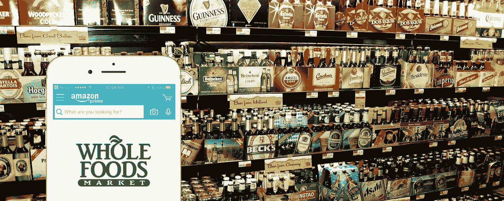
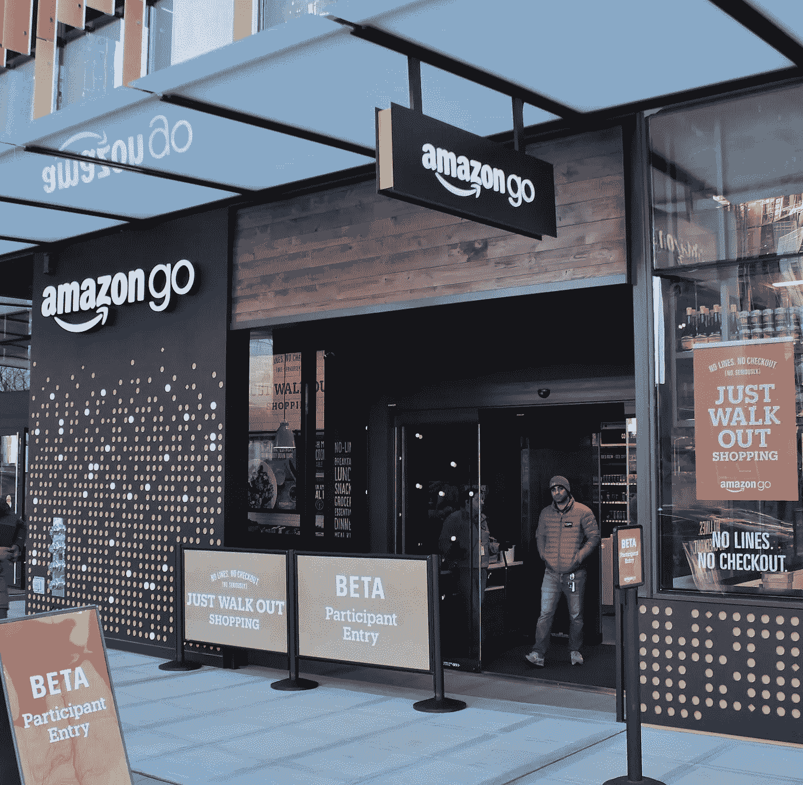

# 正如我们所知，亚马逊刚刚扼杀了酒类零售吗？

> 原文：<https://medium.com/hackernoon/did-amazon-just-kill-liquor-retail-as-we-know-it-b32e74bbd749>

上个月，亚马逊向统治世界又迈进了一大步。随着全食超市的收购，很明显亚马逊打算同时颠覆几个新行业——包括饮料酒行业。一夜之间，亚马逊在美国 41 个州获得了 330 多个新的酒类许可证。这无疑将改变消费者获取和接触饮料酒精的方式。

我最近在亚马逊西雅图总部见到了他们，我清楚地知道他们是一家移动优先的公司。起初，这让我犹豫了——我的意思是，亚马逊在网络上是如此巨大。向移动平台过渡的受众非常庞大。他们能做到这么快吗？简短的回答是:是的。事实证明，如今超过 72%的亚马逊顾客在手机上购物。

让我们考虑一下这个的影响。亚马逊占所有电子商务的 40%。因此，当亚马逊说他们专注于移动时，你可以肯定你的竞争不仅仅是在街上或网络上，而是在你客户的口袋里。

但是，让我们暂时回到现实生活中来。

亚马逊对全食超市的收购也积极推进了其向实体零售的发展。亚马逊准备重新定义实体购物，使其成为无缝的全渠道体验——他们已经开始在测试市场中使用 Amazon Go 商店，如西雅图。

消费者希望这样:77%的美国消费者已经在商店里用智能手机购物了。

让我为你描绘一幅图画

想象一下，你当地的全食超市的产品比现在便宜 40%,而且结账时不用排队。其实根本没有结账。你只需提着装满杂货的袋子出门，你的信用卡就会自动扣款。

当你进入商店时，你的手机会提醒你与之前购买相关的特价商品，然后你会被指引到他们在商店内的位置。农产品被称重、装袋并贴上标签，这些标签通过无线方式告诉商店该收你多少钱。货架上的每件产品都有一个数字价格标签，根据需求、市场状况、销售额、品牌报价等动态更新价格。当您离开商店时，您帐户中的优惠券、返利和附属积分将会记入您的帐户。

或者，你在家里做所有这些，所有的东西在几个小时内就会送到你手中。或者，你在网上订购，跑到商店，在免下车售货亭拿起你的预包装食品。不管怎样，你只是花了**50–75%的时间**以零头价格购买你每周的食品杂货。

便利和低价——通过效率、规模经济、超快速送货和个性化服务来实现:这是新的零售商范式，亚马逊正在带我们去那里，不管我们想不想去。

**现在让我们退一步，从更广阔的角度来看这个问题:**

我见证了我这个时代的许多重大社会“转折点”——技术和新思维导致人类与周围世界互动方式发生重大转变的时刻。想想个人电脑、互联网、网络、手机、iPhone &应用程序、亚马逊&电子商务& Prime、优步、特斯拉等等。随着每一次进步和范式转变，我们在时间和金钱上做得更多，而常规任务变得更容易。亚马逊上个月的所作所为将在便利性、消费以及我们如何与品牌互动方面对未来几代人产生类似的深远影响。

**那么，这对饮料酒精意味着什么呢？**

首先，让我重申一下，全美有 330 家全食超市出售葡萄酒。如果有一个人就在你身边(我说的“你”是指你，一家酒店的老板)，是时候开始努力思考如何留住你的客户了。几年来，亚马逊一直在通过 Amazon Fresh 和 Amazon Prime Now 完善本地配送的艺术。对全食超市的收购让他们在全国范围内拥有了配送中心，可以在食品杂货和酒类配送上展开激烈竞争。

他们的市场饱和度甚至让最大的当天杂货递送竞争对手相形见绌，如 Peapod 和 Instacart(全食超市(Whole Foods)拥有 10%的股份)，更不用说较小的酒类递送公司了。80%的亚马逊用户每月至少购买一次，他们的用户保持率几乎让所有人大吃一惊。

即使是你最忠实的顾客，也无法抵挡物美价廉的便利诱惑。

**你究竟如何与之抗衡？**

简短的回答就是:客户体验。89%的高管认为客户体验将是他们今年的主要竞争模式。随着新的竞争对手、新法规和新技术迅速改变酒类零售的游戏规则，让您的客户体验达到最佳状态比以往任何时候都更加重要。

消费者不仅希望他们的购物体验天衣无缝、令人愉快，他们还希望获得“惊喜”干净整洁的商店、友好博学的员工、有趣的选择和吸引人的交易都是必须的。要脱颖而出，你必须超越自我。

要做到这一点，你需要去你的客户所在的地方，这在很大程度上是在他们的手机上。美国人花在手机上的数字时间高达 90%，其中 87%的时间都在使用应用程序。

通过您自己的移动应用程序吸引受众，让您能够与店外的客户建立联系，并提供有价值的消费者洞察，帮助您在货架上摆放商品，并根据消费者的兴趣向他们提供优惠。

拥有移动应用程序还能让消费者在方便的时候快速、轻松地进行购买，并增加消费者的支出。我们已经看到基于 Drync 的应用程序使顶线销售额同比增长了 4%，这对大多数零售商来说是一个有意义的数字。([Read:67 Wine Case Study](/@drync/67-wine-case-study-14a55cfb8459))

这里有几个移动机会——而且有很多公司很乐意把你的商店作为一种资源，通过他们的应用程序来销售葡萄酒。你可能想这么做，但你也需要在手机上建立自己的品牌和自己的受众。

移动设备是您的客户所在的地方。如果你不在，他们会找别人。

**关于作者**
布拉德·罗森是 [Drync](http://www.drync.com) 的创始人兼首席执行官，这是一个风险投资支持的移动 SaaS 平台，专门为饮料酒零售商设计，通过他们自己的品牌移动应用程序来提高忠诚度。