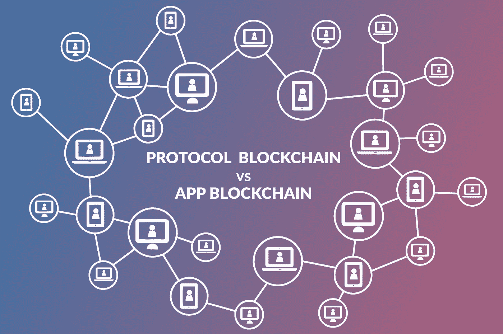

# 协议区块链和 App 区块链公司的区别

> 原文：<https://medium.com/hackernoon/differences-between-protocol-blockchain-and-app-blockchain-companies-802b699eccde>

许多对 ico 感兴趣的人混淆了协议和应用区块链公司之间的区别。他们问持有 ico 的公司一个问题，“你如何在你的生态系统中使用区块链？”期待区块链协议的回答。这是错误的预期。 [LiveEdu ICO](https://tokensale.liveedu.tv/) 也收到了投资者类似的问题。本文的目的是解释两者之间的主要区别。

区块链协议公司是从零开始构建自己的完整区块链的公司，不使用任何现有的区块链。他们的区块链是完全独立的，可以独立运行，不需要与其他区块链互动。区块链协议公司很少，他们的成功率很低，因为大多数没有达到大规模采用所需的最低用户群。

从第一天起，区块链就需要一个巨大的生态系统来生存。从投资回报率的角度来看，协议区块链公司产生的回报低于应用区块链公司。想象一下，互联网是一个协议区块链，所有运行在互联网上的公司，如谷歌、脸书、亚马逊、阿里巴巴和 Badoo 都是应用区块链公司。后者自己没有任何区块链；他们把整个业务建立在一个区块链称为“互联网”的协议上。区块链协议公司在技术上和科学上都很难建立，而且比区块链协议公司风险更大。App 区块链公司可以几乎免费地使用区块链协议公司构建的协议，并从中获益。

例子: [LiveEdu](https://tokensale.liveedu.tv/) 是一家 app 区块链公司，它将使用 ERC20 技术在以太坊区块链协议上运行。

另一个可以用来理解区块链协议和 app 之间差异的例子是一个县的铁路系统。想象一下，铁路是区块链的一个协议，所有在铁路上运行运输服务的火车服务公司是 app 区块链公司。

到目前为止，99%的 ico 可以归类为建立在以太坊网络之上的 app 区块链公司。他们使用 ERC20 区块链技术来标记其业务运营、奖励系统或支付交易的某些方面。App 区块链公司不建立任何协议，至少在开始时是这样。他们在现有的区块链上启动，并使用区块链作为一种更便宜、更快、更协作和透明地开发产品的方式。

你在哪个区块链协议上建立你的生态系统？既然我们已经解释了两者之间的区别，下次你接触 ICO 时，不要问他们如何使用区块链技术，而是先将他们归类为协议或应用区块链公司。如果他们是一家 app 区块链公司，应该问的问题是:

1.  您正在使用所选的区块链协议对内部和外部网络的哪些方面进行令牌化？
2.  你的令牌机制是如何工作的？
3.  你的令牌机制的弱点是什么？
4.  您正在构建的协议将来是否能够维持小额交易费用，以便用于小额支付交易？

这篇文章阐明了区块链协议公司和 app 区块链公司之间的区别了吗？下面评论。